# 排序

## 插入排序

### 直接插入排序

常规属性

- 时间复杂度： O(n^2)
- 空间复杂度： O(1)
- 稳定性： 是一种稳定排序，因为一样大的数前后顺序不会发生变化

key：

- 直接插入排序产生的有序子序列并不是全局有序的，比如说数组初始为{2,6,4,5,3,1}，排到倒数最后一步的时候，此时的未排完的序列为{2,3,4,5,6,1}，明显不是全局有序的
- 排2次直接插入排序，会产生3个数字有序

```java
public class Main {
    public static void main(String[] args) {
        int[] nums = {3, 1, 5, 6, 2};
        int len = nums.length;
        int j = 0;

        //从第二个元素开始，因为插排的第一个序列只有一个元素
        //自然是有序的
        for (int i = 1; i < len; i++) {
            //对于nums[i]来说，nums[0...i-1]都是有序的，如果nums[i]比nums[i-1]大，那么就没有必要进行这一趟插入排序
            if (nums[i] < nums[i - 1]) {
                //记录当前失序的值
                int t = nums[i];
                //从后往前把大于目标值的数都往后放
                for (j = i - 1; j >= 0 && nums[j] > t; j--) {
                    nums[j + 1] = nums[j];
                }
                //把t放到应该放到的位置
                nums[j + 1] = t;
            }
        }

        for (int num : nums) {
            System.out.println(num);
        }
    }
}
```


### 折半插入排序

常规属性：

- 时间复杂度： O(n^2)
- 空间复杂度： O(1)
- 稳定性： 稳定

key：

- 假设当前要插入的数字为nums[i]，那么就从[0...i-1]内通过二分去寻找nums[i]要插入的位置k，然后把[k...i-1]上的元素都往后移动一次，然后把nums[i]放到nums[k]上即可
- 元素比较次数： N*log N

```java
public class Main {
    public static void main(String[] args) {
        int[] nums = {3, 1, 5, 6, 2, 1, 1, 1, 1, 1, 1};
        int len = nums.length;
        int k = 0;

        for (int i = 1; i < len; i++) {
            //记录这个数字
            int t = nums[i];
            //从[0,i-1]去寻找nums[i]应该在的位置
            int l = 0, r = i - 1;
            //二分出来以后,l所在的位置就是nums[i]最后应该插入的位置
            while (l <= r) {
                int mid = (l + r) / 2;
                if (nums[mid] > t) {
                    r = mid - 1;
                } else {
                    l = mid + 1;
                }
            }
            
            //把[l,i-1]的所有的元素都向后移动一次
            for (int j = i - 1; j >= l; j--) {
                nums[j + 1] = nums[j];
            }

            //l是nums[i]应该在的位置
            nums[l] = t;
        }

        for (int num : nums) {
            System.out.println(num);
        }
    }
}
```


### 希尔排序

常规属性：

- 时间复杂度： O(n^2) ，最好可能是O(n^1.3)
- 空间复杂度： O(1)
- 稳定性： 不稳定，因为可能会把相同大小的元素值分到不同的组，分组进行直接插入排序可能导致原来相同元素的先后关系发生改变，所以不稳定

key：

- 希尔排序枚举组的长度，比如说此次一组有5个，那么此时为一组的元素有nums[0,5,10...]，对组内元素进行插入排序（这里和直接插入排序的原理一样）。这样就达到了一组内排序（类似于插入排序）。然后对于当前的组长d，枚举所有的组，对所有的组都进行这么一次组内排序。然后枚举所有的组长d就可以了，这里选择的是d逐渐减半。

```java
public class Main {
    public static void main(String[] args) {
        int[] nums = {3, 1, 5, 6, 2};
        int len = nums.length;
        int k = 0;

        //希尔排序  升序
        for (int d = len / 2; d > 0; d /= 2) {  //d增量，逐渐减半
            //和插入排序一样，插排是从第二个开始的，同理系尔的每一组都是从
            //第二个元素开始的，从每一组的第二个开始和每一组的地一个开始比的
            for(int i = d; i < len; i++){
                //如果有必要进行插入排序
                if(nums[i - d] > nums[i]){
                    //先记录最后的数
                    int t = nums[i];
                    int j = 0;
                    //不断的把与t同一组内的比t大的数都往后放
                    for(j = i - d; j >= 0 && nums[j] > t; j -= d){
                        nums[j + d] = nums[j];
                    }
                    
                    //最后把t放到正常的位置
                    nums[j + d] = t;
                }
            }
        }

        for (int num : nums) {
            System.out.println(num);
        }
    }
}
```


## 交换排序

### 冒泡排序

常规属性：

- 时间复杂度： O(n^2)
- 空间复杂度： O(1)
- 稳定性： 是一种稳定排序

key：

- 冒泡排序的子序列一定是有序的
- 走两次冒泡排序，两个数组有序，所以总共只需要跑n-1次就够了

```java
//这段代码的意思就是每一趟都把这一趟的最小的数放到最前面，比如第一趟把最小的放到索引为0的地方，第二趟放到索引为1的地方...
//i从0到len-2，表示每一趟把最小的数放到i上，j每次从最后一个元素出发，走到i后面，就是把这一趟的最小元素带过来
public class Main {
    public static void main(String[] args) {
        int[] nums = {3, 1, 5, 6, 2, 1, 1, 1, 1, 1, 1};
        int len = nums.length;
        int k = 0;

        //冒泡n-1次，每次把小的元素都往前面放
        //第i次循环，就归位了[0...i]的序列
        for (int i = 0; i < len - 1; i++) {
            boolean flag = false;
            //每次从最后一个元素出发，和前面元素相比较
            for (int j = len - 1; j > i; j--) {
                //如果比前面元素小，就交换位置
                if (nums[j - 1] > nums[j]) {
                    int t = nums[j - 1];
                    nums[j - 1] = nums[j];
                    nums[j] = t;
                    flag = true;
                }
                if (flag == false)
                    return;
            }
        }

        for (int num : nums) {
            System.out.println(num);
        }
    }
}
```


# 手写数据结构

## BST

### 关于compareTo的知识

`a.compareTo(b)`意思是 `a和b比较，如果a<b，则返回值是-1，a==b，返回值是0，a>b，返回值是1`.

比如 `Integer` 的 `compareTo` 方法

```java
	//a.compareTo(b)，这个参数b就是anotherInteger
	public int compareTo(Integer anotherInteger) {
        return compare(this.value, anotherInteger.value);
    }
    
	//the value 0 if x == y; a value less than 0 if x < y; and a value greater than 0 if x > y
    public static int compare(int x, int y) {
        return (x < y) ? -1 : ((x == y) ? 0 : 1);
    }
```


### 二叉树的内部节点

```java
	/**
     * 内部节点
     */
    private class Node {
        public E e;
        public Node left, right;

        public Node(E e) {
            this.e = e;
            this.left = null;
            this.right = null;
        }
    }
```


### 插入

```java
    /**
     * 向BST中插入一个节点
     *
     * @param e 要插入的元素
     */
    public void add(E e) {
        root = add(e, root);
    }

    /**
     * 优化后的BST的递归插入
     * @param e 要插入的元素e
     * @param cur   cur是当前的节点
     * @return  返回在以cur为根节点的BST插入e后的根节点
     */
    private Node add(E e, Node cur) {
        //递归终止条件
        if (cur == null) {
            size++;
            return new Node(e);
        }

        //e小于当前节点,就往左子树插入
        if (e.compareTo(cur.e) < 0) {
            cur.left = add(e, cur.left);
            //e大于当前节点,就往右子树插入
        } else if (e.compareTo(cur.e) > 0) {
            cur.right = add(e, cur.right);
        }

        return cur;
    }
```


### 查询

```java
    /**
     * 查询BST中是否存在元素e
     *
     * @param e 元素e
     * @return true表存在, false不存在
     */
    public boolean contains(E e) {
        return contains(e, root);
    }

    /**
     * 查询是否包含元素的真正递归的函数
     *
     * @param e   元素e
     * @param cur 当前的节点
     * @return true表存在, false不存在
     */
    private boolean contains(E e, Node cur) {
        //如果走到头都没有发现,那就自然就没有元素e了
        if (cur == null) {
            return false;
        }

        //因为是二分搜索树,所以只需要照一条路判断下去就行了
        if (e.equals(cur.e)) {
            return true;
        } else if (e.compareTo(cur.e) < 0) {
            //小的往左子树走
            return contains(e, cur.left);
        } else {
            //大的往右子树走
            return contains(e, cur.right);
        }
    }
```


### 前、中、后序遍历

```java
	/**
     * 二分搜索树的前序遍历
     */
    public void preOrder(){
        preOrder(root);
    }

	/**
     * 二分搜索树的前序遍历的递归调用
     * @param cur
     */
    private void preOrder(Node cur) {
        if (cur == null){
            return;
        }

        System.out.println(cur.e);
        preOrder(cur.left);
        preOrder(cur.right);
    }

    //剩下同理
```


### 层序遍历

```java
	/**
     * 层序遍历
     */
    public void levelOrder() {
        Queue<Node> q = new LinkedList<>();
        q.add(root);

        while (!q.isEmpty()) {
            Node cur = q.remove();
            System.out.println(cur.e);

            if (cur.left != null) {
                q.add(cur.left);
            }
            if (cur.right != null) {
                q.add(cur.right);
            }

        }
    }
```


### 找到BST最小值所在的节点

```java
    /**
     * 找到BST中的最小值
     * @return
     */
    public E minimum() {
        if (size == 0) {
            throw new IllegalArgumentException("BST是空树,没有最小节点");
        }

        return minimum(root).e;
    }

    /**
     * 找到元素最小元素所在的节点,其实也就是BST中最左面节点
     * @param cur   当前节点
     * @return  返回节点
     */
    private Node minimum(Node cur) {
        if (cur.left == null) {
            return cur;
        }
        return minimum(cur.left);
    }

//最大值同理
```


### 删除BST的最小值所在的节点

这里需要注意，删除BST的最小值，

1. 先找到最小值的所在的节点`min_cur`
2. `min_cur`的右孩子就是新的最小的节点

```java
	/**
     * 删除最小值所在的节点,并且返回最小值
     * @return  返回最小值
     */
    public E removeMin(){
        E res = minimum();
        removeMin(root);
        return res;
    }

    /**
     * 删除最小值所在的节点的递归调用
     * @param cur   当前节点
     * @return  返回删除完cur中的最小值所在节点的根节点
     */
    private Node removeMin(Node cur) {
        //此时找到了BST的最小节点min_cur
        if (cur.left == null){
            //最小节点min_cru的右子树就是新的最小节点
            Node rightNode = cur.right;
            cur.right = null;
            size--;
            return rightNode;
        }

        cur.left = removeMin(cur.left);
        return cur;
    }
```


### 删除BST的最大值所在的节点

和`删除BST最小值一样`，删除BST的最大值：

1. 先找到最大值所在的节点 `max_cur`
2. `max_cur`的做孩子就是新的最大的节点

```java
	/**
     * 删除最大值所在的节点,并且返回最大值
     * @return  返回最大值
     */
    public E removeMax(){
        E res = maximum();
        removeMax(root);
        return res;
    }

    /**
     * 删除最大值所在的节点的递归调用
     * @param cur   当前节点
     * @return  返回删除完cur中的最大值所在节点的根节点
     */
    private Node removeMax(Node cur) {
        //此时找到了BST的最大节点
        if (cur.right == null){
            //最大节点的左孩子就是新的最大节点
            Node leftNode = cur.left;
            cur.left = null;
            size--;
            return leftNode;
        }

        cur.right = removeMax(cur.right);
        return cur;
    }
```


### 删除BST的任意值所在的节点

要注意的是，`删除BST任意值所在的节点`：

1. 首先要找到要删除的值所在的节点 `cur`
2. 然后删除分为几个情况
   1. 如果这个 `cur` 的左子树为空，即 `cur` 只有右子树，这时只需返回 `cur的右子树` 即可
   2. 如果这个 `cur` 的右子树为空，即 `cur` 只有左子树，这时只需返回 `cur的左子树` 即可
   3. 如果这个 `cur` 的左右子树均不为空，这时要分为几步
      1. 先找到 `cur的右子树的最小节点successor` 
      2. 在 `cur的右子树里删除successor`
      3. 此时 `successor` 就是代替 `cur` 的节点，需要让 `cur的右子树` 变为 `successor的右子树`， `cur的左子树` 变为 `successor的左子树` 
3. 整个过程都是递归的情况，要注意 `递归的返回值`

```java
/**
     * 删除BST中的元素e所在的节点
     * @param e 指定的元素e
     */
    public void remove(E e) {
        root = remove(root, e);
    }

    /**
     * 递归删除以cur节点为根节点中的元素e所在的节点,并且返回删除后的根节点
     * @param cur   当前节点
     * @param e 删除的元素e
     * @return  在以cur为根节点中删除e后,返回cur的根节点
     */
    private Node remove(Node cur, E e) {
        //如果没有找到元素e,直接返回null
        if (cur == null) {
            return null;
        }

        //往左子树找
        if (e.compareTo(cur.e) < 0) {
            cur.left = remove(cur.left, e);
            return cur;
        //往右子树找
        } else if (e.compareTo(cur.e) > 0) {
            cur.right = remove(cur.right, e);
            return cur;
        //如果找到了元素e
        } else {
            //如果要删除的节点只有右子树的时候(同删除最小节点的时候)
            if (cur.left == null) {
                //拿到右子树的地址
                Node rightNode = cur.right;
                //断开原来的连接
                cur.right = null;
                size--;
                //直接返回右子树就行
                return rightNode;
            }
            //如果要删除的节点只有左子树的时候
            if (cur.right == null) {
                //拿到左子树的地址
                Node leftNode = cur.left;
                //断开原来的连接
                cur.left = null;
                size--;
                //返回左子树
                return leftNode;
            }

            //如果要删除的节点左右子树都有的时候
            //假设要删除的节点是e,然后拿到e的右子树的最小值,也就是successor,用successor来代替e
            Node successor = minimum(cur.right);
            //然后删除e的右子树里面的successor,也就是让successor和e的右子树脱离关系,并且让successor的右子树连接上原来e的右子树(此时
            // e的右子树已经删除了successor这个节点)
            successor.right = removeMin(cur.right);
            //让successor的左子树连接上e的左子树,此时successor已经代替了e
            successor.left = cur.left;

            //断开cur的连接
            cur.left = cur.right = null;
            //返回后继
            return successor;
        }
    }
```


### BST全部

```java
package l10删除二分搜索树的任意值;

import java.util.LinkedList;
import java.util.Queue;
import java.util.Stack;

/**
 * 二分搜索树的节点必须都是可比较性的
 *
 * @param <E>
 */
public class BST<E extends Comparable<E>> {

    /**
     * 内部节点
     */
    private class Node {
        public E e;
        public Node left, right;

        public Node(E e) {
            this.e = e;
            this.left = null;
            this.right = null;
        }
    }

    private Node root;
    private int size;

    /**
     * 初始化二分搜索树
     */
    public BST() {
        root = null;
        size = 0;
    }


    /**
     * 获得二叉树当前元素个数
     *
     * @return 元素个数
     */
    public int getSize() {
        return size;
    }


    /**
     * 判断二分搜索树是否为空
     *
     * @return true为空, false不为空
     */
    public boolean isEmpty() {
        return size == 0;
    }


    /**
     * 向BST中插入一个节点
     *
     * @param e 要插入的元素
     */
    public void add(E e) {
        root = add(e, root);
    }


    /**
     * 优化后的BST的递归插入
     *
     * @param e   要插入的元素e
     * @param cur cur是当前的节点
     * @return 返回在以cur为根节点的BST插入e后的根节点
     */
    private Node add(E e, Node cur) {
        //递归终止条件
        if (cur == null) {
            size++;
            return new Node(e);
        }

        //e小于当前节点,就往左子树插入
        if (e.compareTo(cur.e) < 0) {
            cur.left = add(e, cur.left);
            //e大于当前节点,就往右子树插入
        } else if (e.compareTo(cur.e) > 0) {
            cur.right = add(e, cur.right);
        }

        return cur;
    }


    /**
     * 查询BST中是否存在元素e
     *
     * @param e 元素e
     * @return true表存在, false不存在
     */
    public boolean contains(E e) {
        return contains(e, root);
    }

    /**
     * 查询是否包含元素的真正递归的函数
     *
     * @param e   元素e
     * @param cur 当前的节点
     * @return true表存在, false不存在
     */
    private boolean contains(E e, Node cur) {
        //如果走到头都没有发现,那就自然就没有元素e了
        if (cur == null) {
            return false;
        }

        //因为是二分搜索树,所以只需要照一条路判断下去就行了
        if (e.equals(cur.e)) {
            return true;
        } else if (e.compareTo(cur.e) < 0) {
            //小的往左子树走
            return contains(e, cur.left);
        } else {
            //大的往右子树走
            return contains(e, cur.right);
        }
    }

    /**
     * 二分搜索树的前序遍历
     */
    public void preOrder() {
        preOrder(root);
    }

    /**
     * 二分搜索树的前序遍历的递归调用
     *
     * @param cur 当前节点
     */
    private void preOrder(Node cur) {
        if (cur == null) {
            return;
        }

        System.out.println(cur.e);
        preOrder(cur.left);
        preOrder(cur.right);
    }

    public void preOrderNR() {
        Stack<Node> stack = new Stack<>();
        if (root != null) {
            stack.push(root);
        }

        while (!stack.isEmpty()) {
            Node temp = stack.pop();
            System.out.println(temp.e);

            //先进后出,先压栈右子树
            if (temp.right != null) {
                stack.push(temp.right);
            }
            if (temp.left != null) {
                stack.push(temp.left);
            }
        }
    }

    /**
     * 二分搜索树的中序遍历
     */
    public void inOrder() {
        inOrder(root);
    }

    /**
     * 二分搜索树的中序遍历的递归调用
     *
     * @param cur 当前节点
     */
    private void inOrder(Node cur) {
        if (cur == null) {
            return;
        }

        inOrder(cur.left);
        System.out.println(cur.e);
        inOrder(cur.right);
    }


    /**
     * 二分搜索树的后序遍历
     */
    public void afterOrder() {
        afterOrder(root);
    }

    /**
     * 二分搜索树的后序遍历的递归调用
     *
     * @param cur 当前节点
     */
    private void afterOrder(Node cur) {
        if (cur == null) {
            return;
        }

        afterOrder(cur.left);
        afterOrder(cur.right);
        System.out.println(cur.e);
    }

    /**
     * 层序遍历
     */
    public void levelOrder() {
        Queue<Node> q = new LinkedList<>();
        q.add(root);

        while (!q.isEmpty()) {
            Node cur = q.remove();
            System.out.println(cur.e);

            if (cur.left != null) {
                q.add(cur.left);
            }
            if (cur.right != null) {
                q.add(cur.right);
            }

        }
    }

    /**
     * 找到BST中的最小值
     *
     * @return
     */
    public E minimum() {
        if (size == 0) {
            throw new IllegalArgumentException("BST是空树,没有最小节点");
        }

        return minimum(root).e;
    }

    /**
     * 找到元素最小元素所在的节点,其实也就是BST中最左面节点
     *
     * @param cur 当前节点
     * @return 返回节点
     */
    private Node minimum(Node cur) {
        if (cur.left == null) {
            return cur;
        }
        return minimum(cur.left);
    }

    /**
     * 找到BST中的最大值
     *
     * @return 返回最大值
     */
    public E maximum() {
        if (size == 0) {
            throw new IllegalArgumentException("BST是空树,没有最小节点");
        }

        return maximum(root).e;
    }

    /**
     * 找到BST中的最大值所在的节点
     *
     * @param cur 当前节点
     * @return 返回最大值所在的节点
     */
    private Node maximum(Node cur) {
        if (cur.right == null) {
            return cur;
        }
        return maximum(cur.right);
    }


    /**
     * 删除最小值所在的节点,并且返回最小值
     *
     * @return 返回最小值
     */
    public E removeMin() {
        E res = minimum();
        removeMin(root);
        return res;
    }

    /**
     * 删除最小值所在的节点的递归调用
     *
     * @param cur 当前节点
     * @return 返回删除完cur中的最小值所在节点的根节点
     */
    private Node removeMin(Node cur) {
        //如果最小值所在的节点有右子树,那就返回右子树
        if (cur.left == null) {
            Node rightNode = cur.right;
            cur.right = null;
            size--;
            return rightNode;
        }

        cur.left = removeMin(cur.left);
        return cur;
    }

    /**
     * 删除最大值所在的节点,并且返回最大值
     *
     * @return 返回最大值
     */
    public E removeMax() {
        E res = maximum();
        removeMax(root);
        return res;
    }

    /**
     * 删除最大值所在的节点的递归调用
     *
     * @param cur 当前节点
     * @return 返回删除完cur中的最大值所在节点的根节点
     */
    private Node removeMax(Node cur) {
        if (cur.right == null) {
            Node leftNode = cur.left;
            cur.left = null;
            size--;
            return leftNode;
        }

        cur.right = removeMax(cur.right);
        return cur;
    }

    /**
     * 删除BST中的元素e所在的节点
     * @param e 指定的元素e
     */
    public void remove(E e) {
        root = remove(root, e);
    }

    /**
     * 递归删除以cur节点为根节点中的元素e所在的节点,并且返回删除后的根节点
     * @param cur   当前节点
     * @param e 删除的元素e
     * @return  在以cur为根节点中删除e后,返回cur的根节点
     */
    private Node remove(Node cur, E e) {
        //如果没有找到元素e,直接返回null
        if (cur == null) {
            return null;
        }

        //往左子树找
        if (e.compareTo(cur.e) < 0) {
            cur.left = remove(cur.left, e);
            return cur;
        //往右子树找
        } else if (e.compareTo(cur.e) > 0) {
            cur.right = remove(cur.right, e);
            return cur;
        //如果找到了元素e
        } else {
            //如果要删除的节点只有右子树的时候(同删除最小节点的时候)
            if (cur.left == null) {
                //拿到右子树的地址
                Node rightNode = cur.right;
                //断开原来的连接
                cur.right = null;
                size--;
                //直接返回右子树就行
                return rightNode;
            }
            //如果要删除的节点只有左子树的时候
            if (cur.right == null) {
                //拿到左子树的地址
                Node leftNode = cur.left;
                //断开原来的连接
                cur.left = null;
                size--;
                //返回左子树
                return leftNode;
            }

            //如果要删除的节点左右子树都有的时候
            //假设要删除的节点是e,然后拿到e的右子树的最小值,也就是successor,用successor来代替e
            Node successor = minimum(cur.right);
            //然后删除e的右子树里面的successor,也就是让successor和e的右子树脱离关系,并且让successor的右子树连接上原来e的右子树(此时
            // e的右子树已经删除了successor这个节点)
            successor.right = removeMin(cur.right);
            //让successor的左子树连接上e的左子树,此时successor已经代替了e
            successor.left = cur.left;

            //断开cur的连接
            cur.left = cur.right = null;
            //返回后继
            return successor;
        }
    }

    @Override
    public String toString() {
        StringBuilder res = new StringBuilder();
        generateBSTString(root, 0, res);
        return res.toString();
    }

    // 生成以node为根节点，深度为depth的描述二叉树的字符串
    private void generateBSTString(Node node, int depth, StringBuilder res) {

        if (node == null) {
            res.append(generateDepthString(depth) + "null\n");
            return;
        }

        res.append(generateDepthString(depth) + node.e + "\n");
        generateBSTString(node.left, depth + 1, res);
        generateBSTString(node.right, depth + 1, res);
    }

    private String generateDepthString(int depth) {
        StringBuilder res = new StringBuilder();
        for (int i = 0; i < depth; i++)
            res.append("--");
        return res.toString();
    }

}
```


## 堆

### 基本操作

这里写的堆是大顶堆

完全二叉树的索引是从0开始的，所以：

1. 左孩子就是 `k*2+1`
2. 右孩子就是 `k*2+2`
3. 父节点就是 `(k-1)/2`

```java
/**
 * 返回完全二叉树中索引为index的父节点的索引
 *
 * @param index 要查看父索引的索引
 * @return 返回父节点所在的索引
 */
private int parent(int index) {
    if (index == 0) {
        throw new IllegalArgumentException("根节点没有父节点");
    }
    return (index - 1) / 2;
}


/**
 * 返回完全二叉树中指定索引节点的左孩子所在的索引
 *
 * @param index 指定的索引
 * @return 返回指定的索引的左孩子
 */
private int leftChild(int index) {
    return index * 2 + 1;
}


/**
 * 返回完全二叉树中指定索引节点的右孩子所在的索引
 *
 * @param index 指定的索引
 * @return 返回指定的索引的右孩子
 */
private int rightChild(int index) {
    return index * 2 + 2;
}
```


### 添加

为了维持堆的性质，即 `父节点都比子节点大或者小，这样就能保证堆顶是整体最大或者最小` 堆的添加操作分为几个步骤：

1. 先直接把要添加的元素放到最后 `因为堆的本质是一个数组构成的完全二叉树`
2. 然后对于最后那个元素进行 `siftUp` 操作，即 `不断地将这个元素与其父节点比较，将大的元素与父节点的父节点继续比较，直到最大的元素上浮到堆顶(假如是大堆)`


```java
/**
 * 往堆中添加元素，包括给数组末尾添加元素和对末尾元素进行siftup操作
 *
 * @param e 要添加的元素
 */
public void add(E e) {
    data.addLast(e);
    //对末尾元素进行siftup操作
    siftUp(data.getSize() - 1);
}

/**
 * 上浮操作，其实也是维护堆的性质的一个操作，因为往数组末尾添加了元素，堆的性质可能会被
 * 破坏，所以对数组末尾元素进行siftup操作
 *
 * @param k k一开始是数组末尾
 */
private void siftUp(int k) {
    //循环比较k是否比父节点大，如果大就交换k和父节点的值
    //终止条件是当k是根节点的时候或者k比父节点小的时候
    while (k > 0 && data.get(parent(k)).compareTo(data.get(k)) < 0) {
        data.swap(k, parent(k));
        k = parent(k);
    }
}
```


### 删除

为了维持堆的性质，即 `父节点都比子节点大或者小，这样就能保证堆顶是整体最大或者最小` 堆的删除操作分为几个步骤：

1. 交换堆顶元素 `a` 和堆的最后一个元素 `b` ，然后删除 `a` ，此时 `a`在数组的末尾，很好删除
2. 这时因为 `b` 在堆顶，所以需要对 `b` 进行一个 `siftDown` 操作，即 `不断的将b与其较大的子节点进行比较，如果b小则交换位置，继续与其子的子比较`


```java
/**
 * 从堆中删除最大的元素
 *
 * @return 返回最大元素
 */
public E extractMax() {
    E res = findMax();

    //为了简化操作，这里采用把最后一个元素放到根节点这里,因为原来的根节点被删除了
    data.swap(0, data.getSize() - 1);
    //删除数组中最后一个元素
    data.removeLast();

    //因为最后一个元素到了根节点，堆的结构可能会被破坏，所以把这个点下浮下去
    siftDown(0);

    return res;
}

/**
 * 下浮操作,比如下浮索引为0这个元素,让0这个元素和他的左孩子右孩子的值大的那个交换，交换后继续交换
 * 知道这个节点比左孩子和右孩子节点的值都大(符合堆的性质)
 *
 * @param k 下浮操作开始的索引
 */
private void siftDown(int k) {
    //要确保k的左孩子和右孩子都没有越界,因为最下面一层是不用下浮的，所以直接判断他的下一层有没有越界就行
    while (leftChild(k) < data.getSize()) {
        //j是左孩子的索引
        int j = leftChild(k);
        //如果j的右孩子存在并且右孩子的值大于左孩子，就把j更新为右孩子的索引值
        if (j + 1 < data.getSize() &&
                data.get(j + 1).compareTo(data.get(j)) > 0) {
            j = rightChild(k);
        }

        //如果当前节点的值大于左右孩子的最大值，就退出循环
        if (data.get(k).compareTo(data.get(j)) >= 0) {
            break;
        }

        //正常的就是交换
        data.swap(k, j);
        k = j;
    }
}
```


### 堆全部

```java
package l4Heapify和replace;

public class MaxHeap<E extends Comparable<E>> {
    private Array<E> data;

    public MaxHeap(int capacity) {
        data = new Array<>(capacity);
    }

    public MaxHeap() {
        data = new Array<>();
    }

    /**
     * heapify操作
     *
     * @param arr 将arr数组变成堆
     */
    public MaxHeap(E[] arr) {
        data = new Array<>(arr);

        for (int i = parent(arr.length - 1); i >= 0; i--) {
            siftDown(i);
        }
    }

    public int getSize() {
        return data.getSize();
    }

    public boolean isEmpty() {
        return data.isEmpty();
    }


    /**
     * 返回完全二叉树中索引为index的父节点的索引
     *
     * @param index 要查看父索引的索引
     * @return 返回父节点所在的索引
     */
    private int parent(int index) {
        if (index == 0) {
            throw new IllegalArgumentException("根节点没有父节点");
        }
        return (index - 1) / 2;
    }


    /**
     * 返回完全二叉树中指定索引节点的左孩子所在的索引
     *
     * @param index 指定的索引
     * @return 返回指定的索引的左孩子
     */
    private int leftChild(int index) {
        return index * 2 + 1;
    }


    /**
     * 返回完全二叉树中指定索引节点的右孩子所在的索引
     *
     * @param index 指定的索引
     * @return 返回指定的索引的右孩子
     */
    private int rightChild(int index) {
        return index * 2 + 2;
    }


    /**
     * 往堆中添加元素，包括给数组末尾添加元素和对末尾元素进行siftup操作
     *
     * @param e 要添加的元素
     */
    public void add(E e) {
        data.addLast(e);
        //对末尾元素进行siftup操作
        siftUp(data.getSize() - 1);
    }


    /**
     * 上浮操作，其实也是维护堆的性质的一个操作，因为往数组末尾添加了元素，堆的性质可能会被
     * 破坏，所以对数组末尾元素进行siftup操作
     *
     * @param k k一开始是数组末尾
     */
    private void siftUp(int k) {
        //循环比较k是否比父节点大，如果大就交换k和父节点的值
        //终止条件是当k是根节点的时候或者k比父节点小的时候
        while (k > 0 && data.get(parent(k)).compareTo(data.get(k)) < 0) {
            data.swap(k, parent(k));
            k = parent(k);
        }
    }


    /**
     * 堆的性质，父节点大于子节点，所以数组中第一个元素就是最大的元素
     *
     * @return 返回堆节点的最大值
     */
    public E findMax() {
        if (data.getSize() == 0) {
            throw new IllegalArgumentException("堆为空，不能查看最大元素");
        }
        return data.get(0);
    }


    /**
     * 从堆中删除最大的元素
     *
     * @return 返回最大元素
     */
    public E extractMax() {
        E res = findMax();

        //为了简化操作，这里采用把最后一个元素放到根节点这里,因为原来的根节点被删除了
        data.swap(0, data.getSize() - 1);
        //删除数组中最后一个元素
        data.removeLast();

        //因为最后一个元素到了根节点，堆的结构可能会被破坏，所以把这个点下浮下去
        siftDown(0);

        return res;
    }

    /**
     * 下浮操作,比如下浮索引为0这个元素,让0这个元素和他的左孩子右孩子的值大的那个交换，交换后继续交换
     * 知道这个节点比左孩子和右孩子节点的值都大(符合堆的性质)
     *
     * @param k 下浮操作开始的索引
     */
    private void siftDown(int k) {
        //要确保k的左孩子和右孩子都没有越界,因为最下面一层是不用下浮的，所以直接判断他的下一层有没有越界就行
        while (leftChild(k) < data.getSize()) {
            //j是左孩子的索引
            int j = leftChild(k);
            //如果j的右孩子存在并且右孩子的值大于左孩子，就把j更新为右孩子的索引值
            if (j + 1 < data.getSize() && data.get(j + 1).compareTo(data.get(j)) > 0) {
                j = rightChild(k);
            }

            //如果当前节点的值大于左右孩子的最大值，就退出循环
            if (data.get(k).compareTo(data.get(j)) >= 0) {
                break;
            }

            //正常的就是交换
            data.swap(k, j);
            k = j;
        }
    }


    /**
     * 堆先出堆一下，然后插入e，堆的性质不变
     *
     * @param e 要插入的元素e
     * @return 返回插入元素e之前的堆顶元素
     */
    public E replace(E e) {
        E res = findMax();
        data.set(0, e);
        siftDown(0);
        return res;
    }

}
```


## 线段树

### 基础操作

```java
//存放data数组
private E[] data;
//线段树数组(这个数组里面放的是线段树里面的对应区间的经过merge操作的值)
private E[] tree;
//因为线段树总得有业务逻辑,所以采用接口的实现来实现指定的方法
private Merger<E> merger;

public SegmentTree(E[] arr, Merger<E> merger) {
    //用户在创建线段树的时候,对应的merger就已经创建好了，也就是线段树的业务逻辑已经想好了
    this.merger = merger;
    data = (E[]) new Object[arr.length];
    for (int i = 0; i < arr.length; i++) {
        data[i] = arr[i];
    }

    tree = (E[]) new Object[arr.length * 4];
    buildSegmentTree(0, 0, data.length - 1);
}
```


### 建树

线段树建树的过程还是很简单的，只需要明白 `tree数组` 的值放的是 `data数组` 的 `对应区间` 的值，并且是递归创建的就够了

```java
/**
 * 创建以treeIndex为根节点的数组区间为l~r的线段树
 *
 * @param treeIndex 线段树根节点
 * @param l         左区间
 * @param r         右区间
 */
private void buildSegmentTree(int treeIndex, int l, int r) {
    //递归终止条件,如果到了叶子节点直接赋值就行
    if (l == r) {
        tree[treeIndex] = data[l];
        return;
    }

    //这里需要拿到左区间对应的TreeIndex和右区间对应的TreeIndex
    int leftTreeIndex = leftChild(treeIndex);
    int rightTreeIndex = rightChild(treeIndex);
    //防溢出
    int mid = l + (r - l) / 2;

    //用leftTreeIndex和左区间构造左子树
    buildSegmentTree(leftTreeIndex, l, mid);
    //用rightTreeIndex和右区间构造右子树
    buildSegmentTree(rightTreeIndex, mid + 1, r);

    //具体业务逻辑
    tree[treeIndex] = merger.merger(tree[leftTreeIndex], tree[rightTreeIndex]);
}
```


### 区间查询

```java
/**
 * 返回l~r区间的merger操作的值
 *
 * @param queryL 左区间
 * @param queryR 右区间
 * @return 返回区间merger值
 */
public E query(int queryL, int queryR) {
    if (queryL < 0 || queryL >= data.length || queryR < 0 || queryR >= data.length || queryL > queryR) {
        throw new IllegalArgumentException("区间l或者区间r位置不正确");
    }

    return query(0, 0, data.length - 1, queryL, queryR);
}


/**
 * 在线段树索引为treeIndex的节点中l~r(其实是一个节点的对应区间)查询queryL到queryR的值
 *
 * @param treeIndex 指定的索引
 * @param l         节点对应的左区间
 * @param r         节点对应的右区间
 * @param queryL    要查询的左区间
 * @param queryR    要查询的右区间
 * @return 返回指定区间的merger值
 */
private E query(int treeIndex, int l, int r, int queryL, int queryR) {
    //递归终止条件,如果当前区间就是要查询的左右区间,直接返回tree[treeIndex]就行了，因为这里面存放了
    //这个区间的merger操作的结果
    if (l == queryL && r == queryR) {
        return tree[treeIndex];
    }

    int mid = l + (r - l) / 2;
    int leftTreeIndex = leftChild(treeIndex);
    int rightTreeIndex = rightChild(treeIndex);

    //如果要查询的区间在mid的右半边
    if (queryL >= mid + 1) {
        //那就去右区间去查
        return query(rightTreeIndex, mid + 1, r, queryL, queryR);
        //如果要查询的区间在mid的左半边
    } else if (queryR <= mid) {
        //就去左半边查找
        return query(leftTreeIndex, l, mid, queryL, queryR);
    }

    //否则就是mid把要查询的区间分成了两部分,那就是把要查询的区间分成两个部分,然后都去查询一下,递归查询
    E leftResult = query(leftTreeIndex, l, mid, queryL, mid);
    E rightResult = query(rightTreeIndex, mid + 1, r, mid + 1, queryR);
    return merger.merger(leftResult, rightResult);
}
```


### 单点更新

```java
public void set(int index, E e) {
    if (index < 0 || index >= data.length) {
        throw new IllegalArgumentException("索引位置不正确");
    }

    set(0, 0, data.length - 1, index, e);
}


/**
 * 单点更新
 *
 * @param treeIndex 从treeIndex开始
 * @param l         当前treeIndex对应的左区间
 * @param r         当前treeIndex对应的右区间
 * @param index     data中指定的索引
 * @param e         更新的新值e
 */
private void set(int treeIndex, int l, int r, int index, E e) {
    //递归终止条件,递归到指定节点
    if (l == r) {
        tree[treeIndex] = e;
        return;
    }

    //找mid
    int mid = l + (r - l) / 2;
    int leftTreeIndex = leftChild(treeIndex);
    int rightTreeIndex = rightChild(treeIndex);

    //如果要更新的索引在当前区间的右区间
    if (index >= mid + 1) {
        set(rightTreeIndex, mid + 1, r, index, e);
        //如果在左区间
    } else {
        set(leftTreeIndex, l, mid, index, e);
    }

    //如果子节点发生了改变,那么这个节点也要重新merger一下
    tree[treeIndex] = merger.merger(tree[leftTreeIndex], tree[rightTreeIndex]);
}
```


## 字典树

### 字典树的基本操作

```java
public class Trie {
    private class Node {
        public boolean isWord;
        //节点之间的链接靠的是节点内部的一个map，键是字符，值是节点
        public TreeMap<Character, Node> next;

        public Node(boolean flag) {
            this.isWord = flag;
            next = new TreeMap<>();
        }

        public Node() {
            this(false);
        }
    }

    //字典树的根节点
    private Node root;
    //存储了多少个单词
    private int size;

    public Trie() {
        root = new Node();
        size = 0;
    }

    public int getSize() {
        return size;
    }

}
```


### 字典树插入一个字符串

```java
/**
 * 在以根为root的字典树中插入一个字符串
 *
 * @param word word为要插入的字符串
 */
public void add(String word) {
    //从字典树根节点开始遍历
    Node cur = root;

    for (int i = 0; i < word.length(); i++) {
        char c = word.charAt(i);
        //查看当前节点下面是否有c字符
        if (!cur.next.containsKey(c)) {
            //如果没有就拼接上c
            cur.next.put(c, new Node());
        }
        //更新cur的位置
        cur = cur.next.get(c);
    }

    //走到字符串的最后一个节点，把最后一个节点的isWord设置为true
    //表示到这里是一个字符串
    if (!cur.isWord) {
        size++;
        cur.isWord = true;
    }
}
```


### 字典树查询一个字符串是否存在

```java
/**
 * 检查字典树中是否存在指定字符串
 *
 * @param str 要查询的字符串
 * @return 返回是否存在
 */
public boolean contains(String str) {
    //和插入的逻辑差不多，也是从根节点开始寻找
    Node cur = root;
    for (int i = 0; i < str.length(); i++) {
        char c = str.charAt(i);
        //如果当前节点下面没有找到c，说明就没有这个字符串
        if (!cur.next.containsKey(c))
            return false;

        cur = cur.next.get(c);
    }
    //找到字符串的最后一个节点，可能这个节点是另一个字符串的前缀，所以要看到这个节点是不是一个字符串
    return cur.isWord;
}
```


## AVL

### AVL的几个基本操作

#### AVL内部节点（这里采用键值对）

```java
private class Node{
    public K key;
    public V value;
    public Node left, right;
    //注意每个节点内部都会保存height这个属性，表示树的高度
    public int height;

    public Node(K key, V value){
        this.key = key;
        this.value = value;
        left = null;
        right = null;
        height = 1;
    }
}
```


#### 获得node节点的平衡因子

这里的实现是 `cur的左孩子高度减去cur的右孩子高度` 

我们可以看出 `平衡因子的值表示的就是cur的左子树高度和cur的右子树高度之差，若大于0，则左子树高，若小于0，则右子树高`

```java
// 获得节点node的平衡因子
private int getBalanceFactor(Node node){
    if(node == null)
        return 0;
    return getHeight(node.left) - getHeight(node.right);
}
```


### 旋转操作

旋转操作一共就两种，左旋转和右旋转

1. 这 `两个旋转的组合` 就是 `AVL里面的旋转`
2. 注意两个旋转操作传入的都是 `y`，然后改变的都是 `x与T3` 或者 `x与T2`

```java
// 对节点y进行向右旋转操作，返回旋转后新的根节点x
//        y                              x
//       / \                           /   \
//      x   T4     向右旋转 (y)        z     y
//     / \       - - - - - - - ->    / \   / \
//    z   T3                       T1  T2 T3 T4
//   / \
// T1   T2
//注意传入的还是根节点y
private Node rightRotate(Node y) {
    Node x = y.left;
    Node T3 = x.right;

    // 向右旋转过程
    x.right = y;
    y.left = T3;

    // 更新height
    y.height = Math.max(getHeight(y.left), getHeight(y.right)) + 1;
    x.height = Math.max(getHeight(x.left), getHeight(x.right)) + 1;

    //返回的是新的根节点
    return x;
}

// 对节点y进行向左旋转操作，返回旋转后新的根节点x
//    y                             x
//  /  \                          /   \
// T1   x      向左旋转 (y)       y     z
//     / \   - - - - - - - ->   / \   / \
//   T2  z                     T1 T2 T3 T4
//      / \
//     T3 T4
private Node leftRotate(Node y) {
    Node x = y.right;
    Node T2 = x.left;

    // 向左旋转过程
    x.left = y;
    y.right = T2;

    // 更新height
    y.height = Math.max(getHeight(y.left), getHeight(y.right)) + 1;
    x.height = Math.max(getHeight(x.left), getHeight(x.right)) + 1;

    return x;
}
```


### 失衡之后的处理

分为4种失衡情况

1. `cur` 发生 `LL` 失衡，传入 `cur` 进行 `右旋转`
2. `cur` 发生 `RR` 失衡，传入 `cur` 进行 `左旋转`
3. `cur` 发生 `LR` 失衡，先传入 `cur.left` 进行 `左旋转`，然后传入 `cur` 进行 `右旋转`
4. `cur` 发生 `RL` 失衡，先传入 `cur.right` 进行 `有旋转`，然后传入 `cur` 进行 `左旋转`

判断是否失衡是需要在递归经过的每一个节点都进行一次 `失衡判定`，如果失衡，则进行相应的 `失衡处理`

```java
	// 平衡维护
    //  1. balanceFactor是当前节点的平衡因子，如果当前节点平衡因子大于1，说明左子树的深度大于右子树的深度+1 (rl>rh+1)
    //如果小于1，说明右子树的深度大于左子树的深度+1 (rh>lh+1)
    //  2. getBalanceFactor就是求出指定节点的平衡因子，如果平衡因子大于0，说明左子树的深度大，如果小于0，就说明
    //右子树深度大
    //如果出现高度不平衡，并且cur的左子树的左子树多与cur的左子树的右子树 LL 情况
    if (balanceFactor > 1 && getBalanceFactor(node.left) >= 0)
        return rightRotate(node);

    //如果cur出现高度不平衡，并且cur的右子树多于cur的右子树的左子树 RR 情况
    if (balanceFactor < -1 && getBalanceFactor(node.right) <= 0)
        return leftRotate(node);

    //cur高度不平衡，并且cur的左子树的左子树少于cur的左子树的右子树 LR  情况
    if (balanceFactor > 1 && getBalanceFactor(node.left) < 0) {
        node.left = leftRotate(node.left);
        return rightRotate(node);
    }

    //cur高度不平衡，并且cur的右子树的左子树多余cur的右子树的右子树 RL  情况
    if (balanceFactor < -1 && getBalanceFactor(node.right) > 0) {
        node.right = rightRotate(node.right);
        return leftRotate(node);
    }
```

我们看到上述代码和失衡情况的处理步骤是一模一样的

并且有几个注意的点

1. `balanceFactor` 是针对于当前节点的

2. `balanceFactor大于1` 或 `balanceFactor小于1` 就表示失衡

3. `balanceFactor大于0表示` 左子树深度高

4. `balanceFactor>1 ` 并且 `getBalanceFactor(node.left)>=0` 表示的是，此节点 `node` 发生了失衡，`当前节点的左子树比右子树深，即node.left.height > node.right.height`，并且`当前节点 node 的左子树里面的左子树比当前节点 node 的左子树里面的右子树深，即node.left.left.height > node.left.right.height`，这明显就是一个 `LL` 的情况。剩余同理


### AVL的插入操作

本质上来说，AVL的插入和BST的插入几乎一样，只不过AVL多了个 `失衡判定` 和 `失衡处理`

```java
// 向AVL中添加新的元素(key, value)
public void add(K key, V value){
    root = add(root, key, value);
}

// 向以node为根的BST中插入元素(key, value)，递归算法
// 返回插入新节点后BST的根
private Node add(Node node, K key, V value){

    if(node == null){
        size ++;
        return new Node(key, value);
    }

    if(key.compareTo(node.key) < 0)
        node.left = add(node.left, key, value);
    else if(key.compareTo(node.key) > 0)
        node.right = add(node.right, key, value);
    else // key.compareTo(node.key) == 0
        node.value = value;

    // 更新height
    node.height = 1 + Math.max(getHeight(node.left), getHeight(node.right));

    // 计算平衡因子
    int balanceFactor = getBalanceFactor(node);

    // 平衡维护
    if (balanceFactor > 1 && getBalanceFactor(node.left) >= 0)
        return rightRotate(node);

    if (balanceFactor < -1 && getBalanceFactor(node.right) <= 0)
        return leftRotate(node);

    if (balanceFactor > 1 && getBalanceFactor(node.left) < 0) {
        node.left = leftRotate(node.left);
        return rightRotate(node);
    }

    if (balanceFactor < -1 && getBalanceFactor(node.right) > 0) {
        node.right = rightRotate(node.right);
        return leftRotate(node);
    }

    return node;
}
```


### AVL的删除操作

同BST的删除，只不过AVL多了个 `失衡判定` 和 `失衡处理`

不过有个地方可以注意一下，BST删除操作中涉及到返回值的问题，即 `返回哪个节点` ，那么AVL对于失衡的判断其实要发生在 `返回的节点上`

```java
// 从二分搜索树中删除键为key的节点
public V remove(K key){

    Node node = getNode(root, key);
    if(node != null){
        root = remove(root, key);
        return node.value;
    }
    return null;
}

private Node remove(Node node, K key){

    if( node == null )
        return null;

    Node retNode;
    if( key.compareTo(node.key) < 0 ){
        node.left = remove(node.left , key);
        // return node;
        retNode = node;
    }
    else if(key.compareTo(node.key) > 0 ){
        node.right = remove(node.right, key);
        // return node;
        retNode = node;
    }
    else{   // key.compareTo(node.key) == 0

        // 待删除节点左子树为空的情况
        if(node.left == null){
            Node rightNode = node.right;
            node.right = null;
            size --;
            // return rightNode;
            retNode = rightNode;
        }

        // 待删除节点右子树为空的情况
        else if(node.right == null){
            Node leftNode = node.left;
            node.left = null;
            size --;
            // return leftNode;
            retNode = leftNode;
        }

        // 待删除节点左右子树均不为空的情况
        else{
            // 找到比待删除节点大的最小节点, 即待删除节点右子树的最小节点
            // 用这个节点顶替待删除节点的位置
            Node successor = minimum(node.right);
            //successor.right = removeMin(node.right);
            successor.right = remove(node.right, successor.key);
            successor.left = node.left;

            node.left = node.right = null;

            // return successor;
            retNode = successor;
        }
    }

    //在删除操作完成之后，失衡的判断发生在返回的节点上
    if(retNode == null)
        return null;

    // 更新height
    retNode.height = 1 + Math.max(getHeight(retNode.left), getHeight(retNode.right));

    // 计算平衡因子，并且计算的平衡因子还是返回的节点的平衡因子
    int balanceFactor = getBalanceFactor(retNode);

    // 平衡维护
    // LL
    if (balanceFactor > 1 && getBalanceFactor(retNode.left) >= 0)
        return rightRotate(retNode);

    // RR
    if (balanceFactor < -1 && getBalanceFactor(retNode.right) <= 0)
        return leftRotate(retNode);

    // LR
    if (balanceFactor > 1 && getBalanceFactor(retNode.left) < 0) {
        retNode.left = leftRotate(retNode.left);
        return rightRotate(retNode);
    }

    // RL
    if (balanceFactor < -1 && getBalanceFactor(retNode.right) > 0) {
        retNode.right = rightRotate(retNode.right);
        return leftRotate(retNode);
    }

    return retNode;
}
```


## 红黑树

### 2-3树

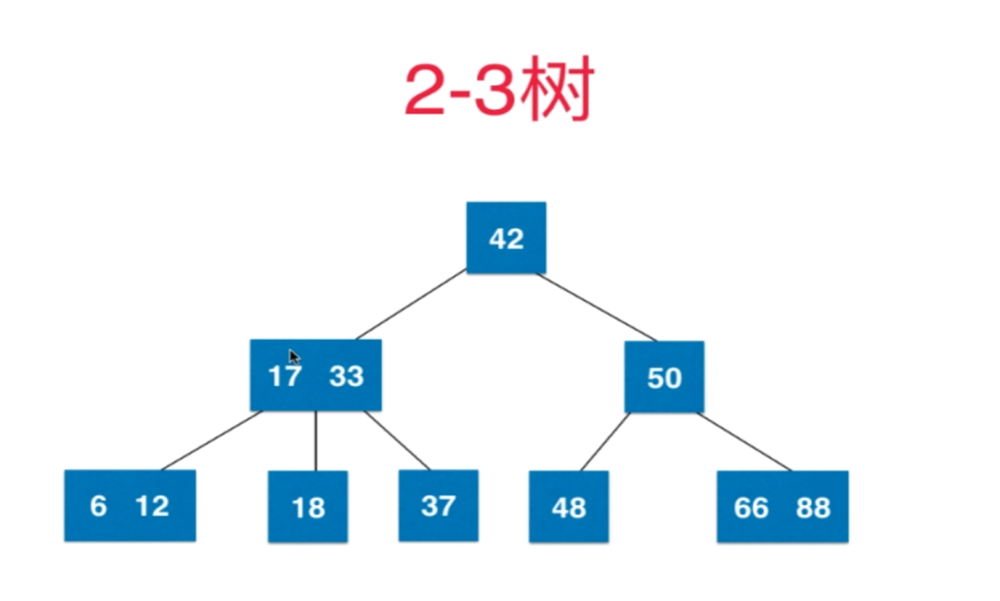

​	每一个节点存放的是一个元素或者两个元素，即每个节点有两个子树或者三个子树（所以才叫2-3树），而且2-3树也保持了BST的性质。

​	2-3树是绝对平衡的树。（绝对平衡，每一层节点都是满的，比AVL还要平衡，AVL是左右子树高度之差不超过1，而绝对平衡的树是每一个叶子结点到根节点经过的节点数目都一样，即左右子树高度绝对相同）


2-3树的绝对平衡性

​	2-3树的插入不会插入到空节点内，（如BST的插入是会生成一个叶子结点然后插入到树里面）

​	2-3树的插入无非就是两种插入，分为2节点插入和3节点插入

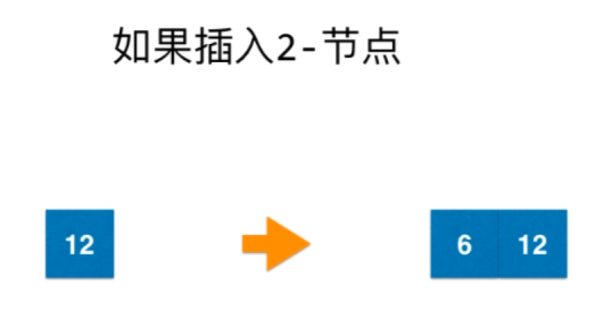

​	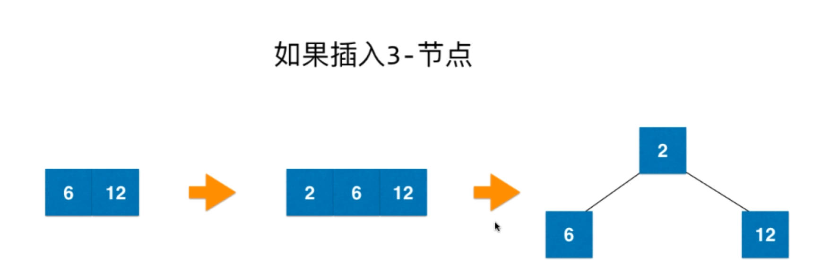

​	如果插入3-节点，并且父节点是2-节点

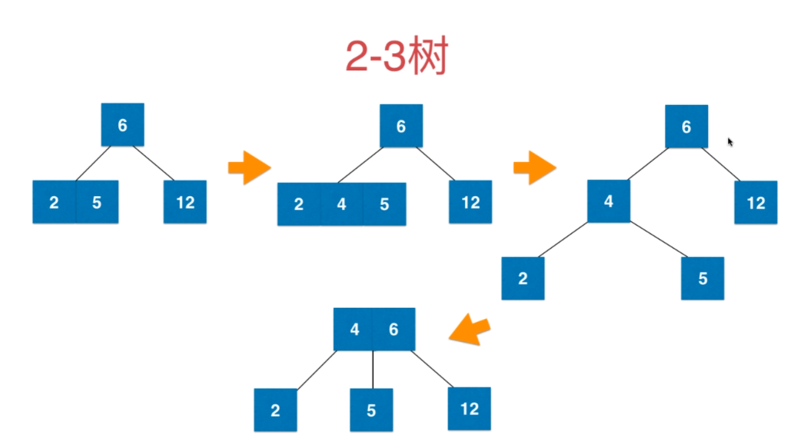

如果插入3-节点，并且父节点是3-节点

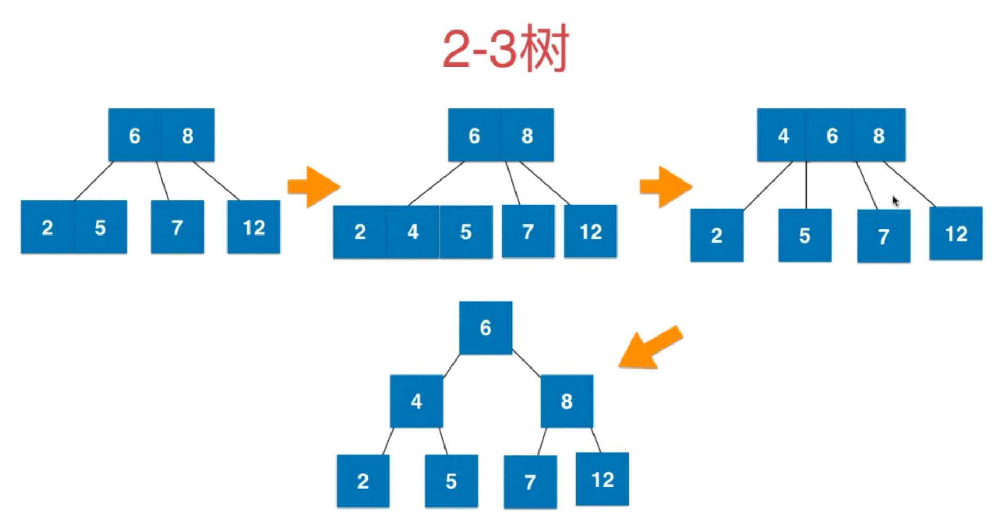


### 红黑树与2-3树的等价性

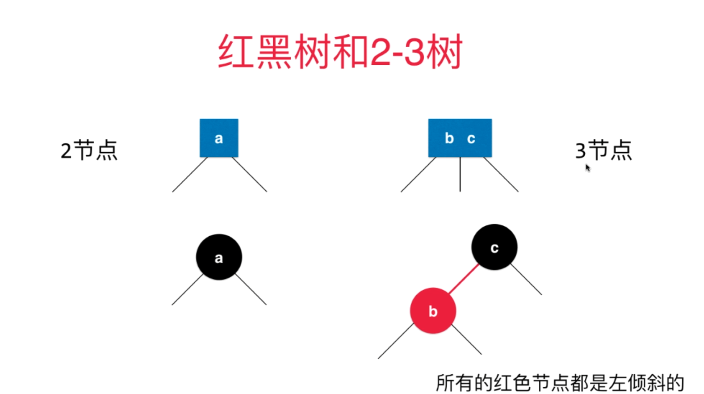

​	红黑树中的黑节点就是普通的节点（类似于2-3树种的2节点）。为了表示2-3树中的3节点，需要一个红色的节点b和一个黑色的节点c，红色的节点本质上来说是标记，这个标记表示这个红色节点的父节点和这个红色节点是2-3树中的3节点关系。也就是说红色节点b和黑色节点c并不是看上去的父子关系，而是2-3树中的3节点关系。

​	可以发现红色节点都是在左子树的，因为定义是这样的，为了表示3节点关系，采用b作为红色节点放到黑色节点c的左子树。


如下图就是2-3树与红黑树的对照关系

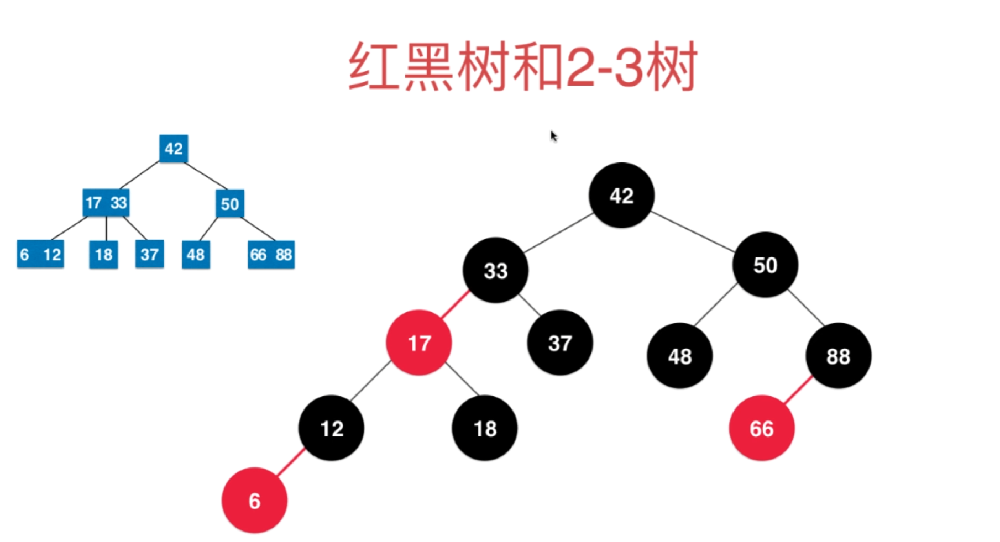

​	其中2-3树中的（17,33）这个3节点在红黑树中的样子就是17作为红节点，33作为黑节点，2-3树种的（6,12）这个3节点在红黑树中的样子就是6作为红节点，12作为黑节点。

​	我们可以发现，2-3树中有几个3节点，对应的在红黑树中就有几个红节点。（因为红节点是用来标记2-3树中3节点的标志）

​	任意一棵2-3树我们都可以用对应的法则将其变化为红黑树


### RBT的一些基本操作

#### 左旋与右旋

```java
//左旋
//    h                      x
//  /   \     左旋转         /  \
// T1   x   --------->    h   T3
//     / \              /   \
//    T2 T3            T1   T2
public Node rotateLeft(Node h) {
    Node x = h.right;
    h.right = x.left;
    x.left = h;

    //x与h互换颜色
    //本来h是黑色，x是红色，旋转之后是h是红色，x是黑色
    //其实还是一个宗旨，上黑下红
    x.color = h.color;
    h.color = Node.RED;


    return x;
}
```


```java
//右旋
//      h                    x
//    /   \     右旋转       /  \
//   x    T2   ------->   y     h
//  / \                       /  \
// y  T1                     T1  T2
public Node rotateRight(Node h) {
    Node x = h.left;
    h.left = x.right;
    x.right = h;

    //x与h互换颜色
    //本来h是黑色，x是红色，旋转之后是h是红色，x是黑色
    //其实还是一个宗旨，上黑下红
    x.color = h.color;
    h.color = Node.RED;


    return x;
}
```


#### 染色与变色

`染色` 用于插入的最后情况，通过插入的调整最后调整至4节点进行的2-3树的分裂在RBT的表现就是 `染色` ，自己变红，左孩子右孩子变黑

```java
//转换颜色，对应了23树中的节点分裂
//向上分裂，node变为红，node的两个孩子都变成黑
public void upSplit(Node node) {
    if (Objects.isNull(node)) {
        return;
    }
    node.left.color = Node.BLACK;
    node.right.color = Node.BLACK;
    node.color = Node.RED;
}
```


用于合并节点node为黑，node的两个孩子变为红，这是为了合成一个3键节点

这个方法用于删除节点之中，是为了凑出来3节点

RBT的删除中，3节点的删除是很方便的，所以我们要保证删除的时候尽可能是3节点，所以翻转颜色可以很好的凑出来一个3节点，当然这还要 `move_to_red_left` 和 `move_to_red_right`这两个方法来配合

```java
//反转颜色
//用于合并节点node为黑，node的两个孩子变为红，这是为了合成一个3键节点
public void flipColors(Node h) {
    h.color = !h.color;
    h.left.color = !h.left.color;
    h.right.color = !h.right.color;
}
```


#### 找到最小节点与最大节点

这个没啥好说的，就是二叉树里面的找到最小或者最大

```java
protected Node min(Node node) {
    if (Objects.isNull(node.left)) {
        return node;
    }
    return min(node.left);
}

protected Node max(Node node) {
    if (Objects.isNull(node.right)) {
        return node;
    }
    return max(node.right);
}
```


### RBT的插入的逻辑

#### 单键插入

1. 如果插入的键小于当前节点的键值，那么直接新增一个红色左节点

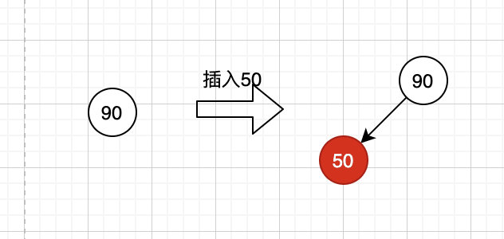


2. 如果插入的键大于当前节点的键值，那么插入一个红色的右节点，由于只允许左边出现红色节点，所以我们需要进行左旋一次

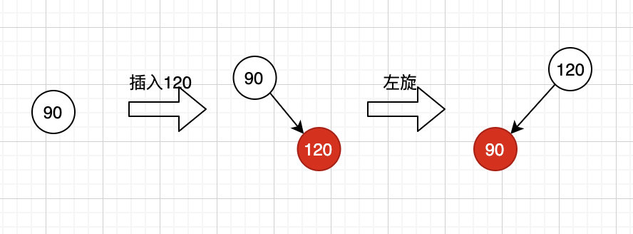


#### 双键插入

1. 向双键节点中插入新的键有三种情况，我们先来看最简单的情况，插入的键值最大，插入之后只需要变化颜色即可，变化过程如下图

   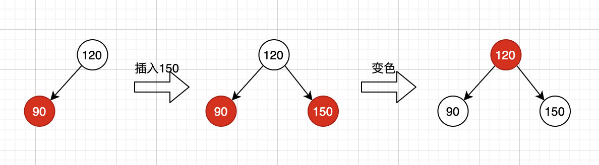

2. 第二种情况是插入的键值最小，插入之后造成了两个红色节点相连，所以需要进行右旋，然后在变色

   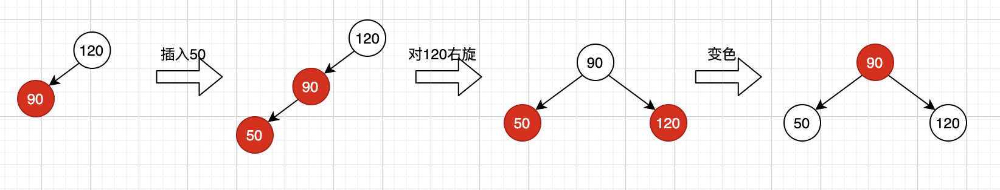


3. 第三种情况插入的键值在原来两键之间，需要先进行左旋，再右旋，最后在变色

   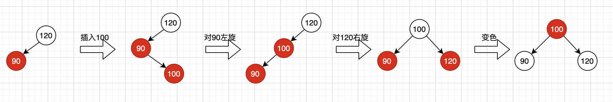


根据以上各种情况的分析，我们可以总结出统一的变化规律：

- 若右子节点是红色，左子节点是黑树，那么就进行左旋（第一种情况，左旋可达第二种情况）
- 若左子节点是红色且他的左子节点也是红色，那么就进行右旋（第二种情况，右旋可达第三种情况）
- 若左右子节点都是红色，那么就进行颜色转换（第三种情况，变色可达最后情况）


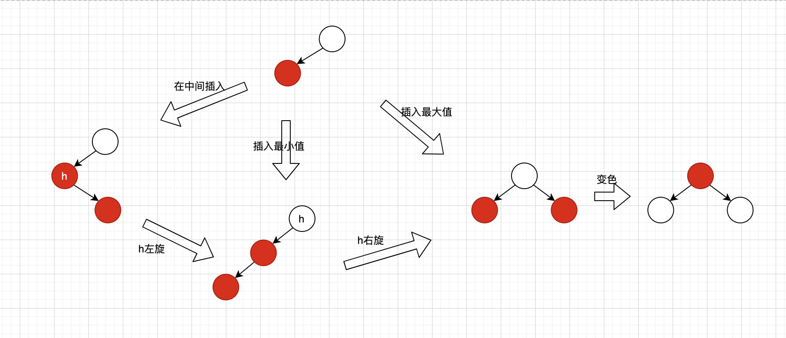

至于说为什么要这么做，这里给出自己的理解，也就是说，牢记下面的话以后的面试可以直接回答插入的逻辑为什么是这样：

<font color="red"> 我们假设是用2-3树做基础和递归作为实现方法，插入节点成功后，在递归回溯的时候需要判断一下节点是否需要调整一下，正常情况下，假如我们插入的是2节点，那么不会影响红黑树的层数，所以不需要调整，但是如果插入的是3节点，那么就有必要进行调整，因为插入后形成4节点，在2-3树中需要将这个4节点拆分成3个2节点，这个操作在红黑树中分为三种情况，分别是上面列举的三种，这三种是按顺序来判断的，不管那种情况最后都要转换成自己为红，左右孩子为黑，遵循这三个情况走下来，并且做相应的调整，就可以使得插入3节点产生的失衡被调整为不失衡。</font>  然后适当展开就可以


```java
//RBT的核心方法之一
public void put(K key, V value) {
    //判断传入的key是否为空，不过没什么用
    if (Objects.isNull(key)) {
        throw new IllegalArgumentException("the key can't null");
    }

    //给root为根的RBT插入键值对
    root = put(root, key, value);

    //最后要确保根节点颜色为黑色
    root.color = Node.BLACK;
    //维护RBT里面的节点个数
    this.size++;
}

//真实的put方法
private Node put(Node node, K key, V value) {
    //递归到的终点，如果递归到空节点就表示插入
    if (Objects.isNull(node)) {
        return new Node(key, value, Node.RED);
    }

    //注意compare是key和节点里面的key比较
    int compare = key.compareTo(node.key);
    //如果compart>0就说明key大于node里面的key
    if (compare > 0) {
        //此时往右面插入
        node.right = put(node.right, key, value);
    } else if (compare < 0) {
        //同理往左面插入
        node.left = put(node.left, key, value);
    } else {
        //如果找到相同的节点就是更新key对应的value了
        node.value = value;
    }

    // 这是插入后回溯时要进行的平衡操作
    // 若右子节点是红色，左子节点是黑树，那么就进行左旋
    // 若左子节点是红色且他的左子节点也是红色，那么就进行右旋
    // 若左右子节点都是红色，那么就进行颜色转换
    // 遵循这三个情况走下来，并且做相应的调整，就可以使得插入3节点产生的失衡被调整为不失衡
    
    //第一种情况
    if (isRed(node.right) && !isRed(node.left)) {
        node = rotateLeft(node);
    }
    //第二种情况
    if (isRed(node.left) && isRed(node.left.left)) {
        node = rotateRight(node);
    }
    //第三种情况
    if (isRed(node.left) && isRed(node.right)) {
        upSplit(node);
    }
	

    return node;
}
```


### RBT的删除的逻辑

#### moveToRedLeft和moveToRedRight

**moveToRedLeft和moveToRedRight本质上来说是借孩子的操作**

RBT的删除要保证每次向下走的是3节点，那如果左面没有3节点怎么办呢？这时候就需要 `moveToRedLeft` 这个方法，给左面创造出一个3节点。

那么如果保证当前递归节点是一个双键节点呢？这里就会有3中情况:

1. 当前节点的左子节点是一个双键节点，直接删除

   

   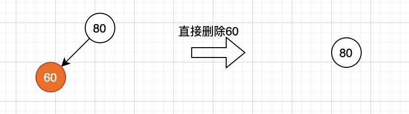

2. 当前节点的左子节点是一个单键节点，但他的兄弟是一个双键节点，那么通过旋转移动一个节点到左子节点形成双键节点之后，再执行删除操作

   

   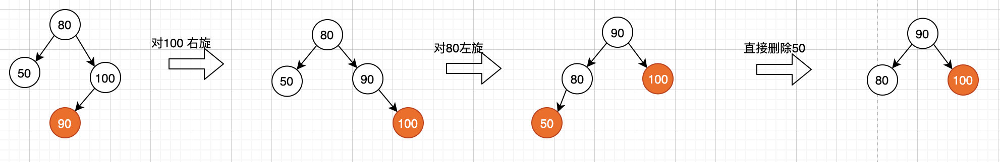

3. 当前节点的左子节点和右子节点都是单键节点，那么通过变色与父节点共同形成三键节点之后，再执行删除

   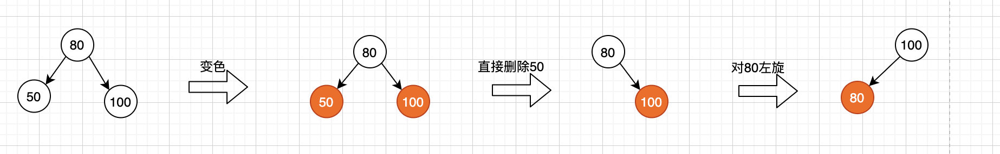


以上是红黑树删除最小值会遇到的所有情况，针对最后两种情况，为了代码的实现简单，我们考虑把这两种情况进行合并；

先把初始化根节点为红色，再进行变色，然后判断是否node.right.left是红色，如果是就进行旋转操作

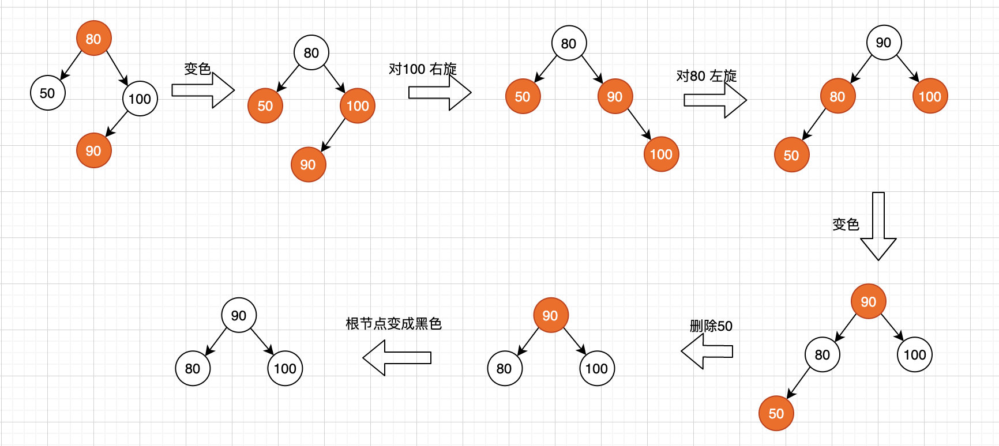


`moveToRedLeft` 总结的逻辑：

1. 先 `变色` ， 注意这个变色操作就导致，`h` 和 `h.left` 和 `h.right` 结合在一起（此时就已经有4节点了）
2. 如果 `h.right` 是双键
   1. 右旋 `h.right`
   2. 左旋 `h`
   3. 再 `变色` 一次，执行到这里，`h.left` 就成了双键，`h.right` 就成了单键

经过这个逻辑走下来，h的左面就可以往下递归了，因为经过 `moveToRedLeft` 处理的结果，不管怎么样都可以继续向 `h的左孩子` 递归删除

```java
//经过moveToRedLeft就可以在node的左面创造出3节点
private Node moveToRedLeft(Node h) {
    // 父节点直接先结合
    flipColors(h);
    // 如果右孩子是双键
    if (isRed(h.right.left)) {
        //h的右孩子右旋
        h.right = rotateRight(h.right);
        //对h左旋
        h = rotateLeft(h);
        //最后再变色
        flipColors(h);
    }
    return h;
}
```


`moveToRedRight` 这个方法也是同理，删除的时候往右走发现没有3节点，这时候就需要 `moveToRedRight` 给右面创造出来3节点

逻辑捅删除最小节点

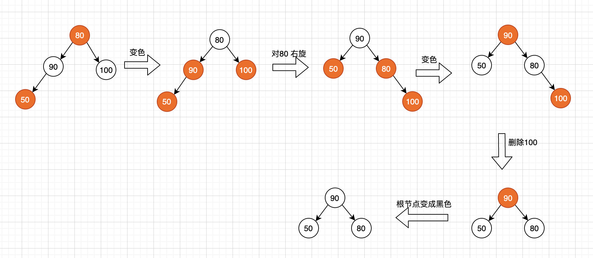


`moveToRedRight` 的逻辑总结：

1. 先 `变色` ，注意这个变色操作就导致，`h` 和 `h.left` 和 `h.right` 结合在一起（此时就已经是4节点了）
2. 如果 `h.left` 是双键
   1. 右旋 `h` 
   2. 再进行一次 `变色`，执行到这里，`h.right` 就成了双键， `h.left` 就成了单键

经过这个逻辑，h的右面就可以继续向下递归了，因为经过 `moveToRedRight` 处理的结果，不管怎么样都可以继续向 `h的右孩子` 递归删除

```java
//同moveToRedLeft，因为你要往右走，如果发现左孩子是双键，自然要把左孩子的拿过来
private Node moveToRedRight(Node node) {
    flipColors(node);
    if (isRed(node.left.left)) {
        //不同于moveToRedLeft，这里只需要转一次
        node = rotateRight(node);
        flipColors(node);
    }
    return node;
}
```


这两个方法的使用之前需要先判断，如果左面或右面确实没有3节点，此时才需要调用 `moveToRedLeft` 或者 `moveToRedRight`

```java
    //如果左孩子是黑色并且左孩子是单键，此时需要从右面借孩子
    if (!isRed(h.left) && !isRed(h.left.left)) {
        h = moveToRedLeft(h);
    }

	//如果右孩子是黑色，并且右孩子是单键，此时需要从左面借孩子
    if (!isRed(node.right) && !isRed(node.right.left)) {
        node = moveToRedRight(node);
    }
```


#### 删除最小节点

二叉树删除最小值就是一直沿着树的左子树中查找，直到遇到一个节点的左子树为null，那么就删除该节点

红黑树的删除最小值类似，但是我们需要保证待删除的节点是一个双键的节点，所以在在递归到每个节点是都需要保住当前节点是双键节点，那么在最后找到的最小值就一定会在一个双键节点中（因为递归时已经保住的父节点是双键节点）。


删除最小节点的逻辑：

1. 如果 `h.left==null`，则说明找到了最小值，直接删除即可
2. 如果 `h.left` 黑色，并且 `h.left` 是单键，此时需要 `move_To_Red_Left` 在 `h` 的左面产生3节点
3. 朝左删除
4. 需要 `balance` 一下删除带来的失衡


```java
public void deleteMin() {
    if (isEmpty()) {
        throw new NoSuchElementException("BST underflow");
    }

    //特殊情况，如果从根节点该开始就是3个2节点，就需要把根染红
    if (!isRed(root.left) && !isRed(root.right)) {
        root.color = Node.RED;
    }

    //经过上面的逻辑判断到这里具体来执行
    root = deleteMin(root);
    
    //根变黑
    if (!isEmpty()) {
        root.color = Node.BLACK;
    }
}


private Node deleteMin(Node h) {
    //如果找到了最小值直接删除就好
    if (h.left == null) {
        return null;
    }

    //如果左孩子是黑色，并且左孩子是单键，这时候给左面创造出来红
    if (!isRed(h.left) && !isRed(h.left.left)) {
        h = moveToRedLeft(h);
    }

    //朝左删除
    h.left = deleteMin(h.left);
    
    //删除操作回溯的时候需要调整一下，因为之前可能产生了4节点，所以要平衡
    return balance(h);
}

//删除之后的修复，同插入的修复很像，只不过最后是变色，不是染色
private Node balance(Node h) {
    if (isRed(h.right) && !isRed(h.left)) {
        h = rotateLeft(h);
    }
    if (isRed(h.left) && isRed(h.left.left)) {
        h = rotateRight(h);
    }
    if (isRed(h.left) && isRed(h.right)) {
        flipColors(h);
    }


    return h;
}

```


在删除掉最小值之后，我们需要重新修复红黑树，因为之前我们的操作可能会导致 `3键节点` 的存在，删除之后我们需要 `重新分解3建节点` ；上面代码中的balance就是重新修复红黑树。


#### 删除最大节点


删除最大值需要从左节点中借一个节点，代码实现如下：

```java
@Override
public void deleteMax() {
    if (isEmpty()) {
        throw new NoSuchElementException("BST underflow");
    }

    if (!isRed(root.left) && !isRed(root.right)) {
        root.color = Node.RED;
    }

    root = deleteMax(root);
    if (!isEmpty()) {
        root.color = Node.BLACK;
    }

}

private Node deleteMax(Node node) {
    //也就是多一步，因为我们规定红节点一开始都在左面挂，这时候往右走的话如果左孩子有红
    //那就把左孩子的红拿过来
    if (isRed(node.left)) { //此处与删除最小值不同，如果左边是红色，那么先借一个节点到右边来
        node = rotateRight(node);
    }
    
    //找到了最大节点
    if (Objects.isNull(node.right)) {
        return null;
    }
    
    //如果右孩子是黑并且右孩子是单键，此时就需要从左面借来孩子
    if (!isRed(node.right) && !isRed(node.right.left)) {
        node = moveToRedRight(node);
    }
    
    //朝右面删除
    node.right = deleteMax(node.right);
    
    //最后删除需要做个平衡
    return balance(node);
}

//同moveToRedLeft，因为你要往右走，如果发现左孩子是双键，自然要把左孩子的拿过来
private Node moveToRedRight(Node node) {
    flipColors(node);
    if (isRed(node.left.left)) {
        //不同于moveToRedLeft，这里只需要转一次
        node = rotateRight(node);
        flipColors(node);
    }
    return node;
}
```


#### 删除任意节点

在了解删除最小节点 `deleteMin()` 和删除最大节点 `deleteMax()` 之后，对于任意节点的删除就很简单了，因为红黑树的删除我们可以遵循二叉树的删除逻辑

1. 若是叶子节点，直接删除
2. 如果有一个孩子，直接让孩子接替位置
3. 如果有两个孩子，找到这个节点 `h` 的后继 `successor`，然后把 `successor` 的数据放到 `h` 里面，然后转而删除 `successor`

只不过要处理一下失衡罢了。


```java
//核心之二，删除操作
public void delete(K key) {
    if (isEmpty()) {
        throw new NoSuchElementException("BST underflow");
    }

    //删除之前先判断一下这个元素是否存在于红黑树中
    if (get(key) == null) {
        System.out.println("没有找到");
        throw new NoSuchElementException("没有这个元素");
    }

    //特殊情况，如果从根节点开始就需要凑的话需要先把根节点变红
    if (!isRed(root.left) && !isRed(root.right)) {
        root.color = Node.RED;
    }

    //删除以root为根的key节点
    root = delete(root, key);

    //维护RBT内的节点个数
    this.size--;
    //最后要把根节点变成黑
    if (!isEmpty()) {
        root.color = Node.BLACK;
    }
}

//真正的删除操作
private Node delete(Node node, K key) {
    int compare = key.compareTo(node.key);
    //k比node的节点小，朝左删除
    if (compare < 0) {
        //如果左孩子是黑，并且左孩子是单键，此时需要从右面借孩子(调用moveToRedLeft)
        if (!isRed(node.left) && !isRed(node.left.left)) {
            node = moveToRedLeft(node);
        }
        
        //朝左删除
        node.left = delete(node.left, key);
    } else if (compare > 0) {
        //朝右删除的特有的一步，如果左孩子是红，直接把红放到右面
        if (isRed(node.left)) {
            node = rotateRight(node);
        }
        
        //如果右孩子是黑，并且右孩子是单键，此时需要从左面借孩子(调用moveToRedRight)
        if (!isRed(node.right) && !isRed(node.right.left)) {
            node = moveToRedRight(node);
        }
        node.right = delete(node.right, key);
    } else {
        //如果找到了，并且这个节点就是一个叶子节点，直接删除就好
        if (Objects.isNull(node.left) && Objects.isNull(node.right)) {
            return null;
        }

        //左子树不为空
        if (Objects.nonNull(node.left)) {
            //找到左子树的最大值节点，即node的pre_successor
            Node max = max(node.left);
            //把successor的值放到node里面
            node.key = max.key;
            node.value = max.value;
            //转为删除pre_successor
            node.left = deleteMax(node.left);
        } else {
            //同理，找到右子树的最小值节点，即node的successor
            Node min = min(node.right);
            node.key = min.key;
            node.value = min.value;
            //转为删除node的successor
            node.right = deleteMin(node.right);
        }
    }
    
    //删除最后需要平衡(注意变色和染色的问题)
    return balance(node);
}
```

