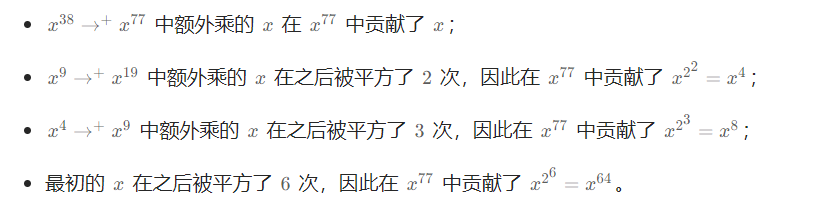
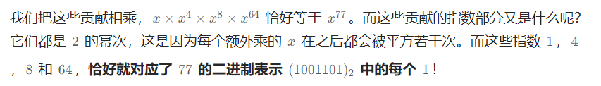

# [560. 和为 K 的子数组](https://leetcode.cn/problems/subarray-sum-equals-k/)

## 题意

给你一个整数数组 `nums` 和一个整数 `k` ，请你统计并返回 *该数组中和为 `k` 的子数组的个数* 。注意子数组是连续的。

```
输入：nums = [1,1,1], k = 2
输出：2
```

```
输入：nums = [1,2,3], k = 3
输出：2
```


## 二重循环

```java
class Solution {
    int ans = 0;

    public int subarraySum(int[] nums, int target) {
        int len = nums.length;

      	// i遍历每一个终点
        for (int i = 0; i < len; i++) {
            int sum = 0;
          	// j从i的位置倒着寻找连续和
            for (int j = i; j >= 0; j--) {
                sum += nums[j];

                if (sum == target) {
                    ans++;
                }
            }
        }

        return ans;
    }
}
```

用 `i` 去遍历每一个结尾， `j` 从 `i` 的位置开始倒着往前记录sum

注意：这里是倒着记录 `sum` 的，这样的好处就可以发现当 `nums[i]` 就是 `target` 的情况

比如现在 `nums` 是 `1,2,3` ， `k`  是 `3`

假如我们从前往后记录总和，   `1,2,3` 分别对应的是 `1,3,6` ，其中那个 `3` 表示 `nums[0]+nums[1]=3` ，这个虽然等于 `k` 了，但是却不是我们以 `nums[2]` 为末尾的时候想要的结果， `nums[0]+nums[1]=3` 应该是以 `nums[1]` 为结尾的时候的结果，以 `nums[2]` 为末尾时想要的结果应该是 `nums[2]=3` ，即 `nums[2...2]这个区间内`

但是假如我们从后往前记录总和， `1,2,3`  分别对应的是 `3,5,6` ，这时候的 `3` 对应的其实就是 `nums[2...2]` 的和，而且 `nums[0...2]` 的总和 `6` 也得到了了体现，这是我们采用从后往前记录的原因


## 哈希表+前缀和

我们可以基于方法一利用数据结构进行进一步的优化，我们知道方法一的瓶颈在于对每个 i，我们需要枚举所有的 j 来判断是否符合条件，这一步是否可以优化呢？答案是可以的。

我们定义 `pre[i]`  为  `[0...i]`  里所有数的和，则  `pre[i]`  可以由 `pre[i-1]`  递推而来，即：

 `pre[i] = pre[i-1] + nums[i]`

那么 `[j...i]` 这个子数组和为  `k`  这个条件我们可以转化为 

 `pre[i] - pre[j-1] = k` ， 

即对于每一个 `pre[i]` ，只需要找到存不存在一个 `pre[j-1]` ，满足 `pre[i] - pre[j-1] = k`  即可

对于遍历到的每一个 `nums[i]` ，我们都可以计算出来 `pre[i]` ，这个很简单，我们只需要找找是不是存在 `pre[j-1] = pre[i] - k` ，那么怎么找 `pre[j-1]` 呢？我们通过哈希表去找，把之前遍历过的所有 `pre[i]` 都放到哈希表里，每次只需要找找哈希表里面有没有 `pre[i] - k`  就可以了

哈希表里存储的是 `<前缀和，出现次数>` ，只要出现对应的前缀和，用 `ans` 加上对应出现次数就好了

```java
import java.util.HashMap;

class Solution {
    public int subarraySum(int[] nums, int k) {
        int ans = 0;
        HashMap<Integer, Integer> map = new HashMap<>();
        int pre = 0;

        // 初始前缀和，放一个（0,1）进去
        map.put(pre, 1);

        for (int i = 0; i < nums.length; i++) {
            // 更新前缀和
            pre += nums[i];

            if (map.containsKey(pre - k)) {
              	// 注意这里ans加的是key对应的value，即出现的次数
                ans += map.get(pre - k);
            }

            map.put(pre, map.getOrDefault(pre, 0) + 1);
        }

        return ans;
    }
}
```


# [338. 比特位计数](https://leetcode.cn/problems/counting-bits/)

## 题意

给你一个整数 `n` ，对于 `0 <= i <= n` 中的每个 `i` ，计算其二进制表示中 **`1` 的个数** ，返回一个长度为 `n + 1` 的数组 `ans` 作为答案。

```
输入：n = 2
输出：[0,1,1]
解释：
0 --> 0
1 --> 1
2 --> 10
```


## 暴力

直接计算所有数字的二进制里面 `1` 的个数

```java
class Solution {
    public int[] countBits(int n) {
        int[] ans = new int[n + 1];

      	// 遍历[0...i]所有数，分别求各有多少个1
        for (int i = 0; i < n + 1; i++) {
            ans[i] = count_bit(i);
        }

        return ans;
    }

  	// 记录n的二进制有几个1
    private int count_bit(int n) {
        int count = 0;
        while (n > 0) {
          	// 看末尾是否为1
            if ((n & 1) == 1) {
                count++;
            }
          
          	// 右移一位，就是除以2
            n = n >> 1;
        }
        
        return count;
    }
}
```


## 找规律

对于所有的数字，只有两类：

1.  奇数：二进制表示中，奇数一定比前面那个偶数多一个 1，因为多的就是最低位的 1。

    ```
    举例： 
             0 = 0       1 = 1
             2 = 10      3 = 112.
    ```

2.  偶数：二进制表示中，偶数中 1 的个数一定和除以 2 之后的那个数一样多。因为最低位是 0，除以 2 就是右移一位，也就是把那个 0 抹掉而已，所以 1 的个数是不变的。

    ```
     举例：
              2 = 10       4 = 100       8 = 1000
              3 = 11       6 = 110       12 = 1100
    ```


```java
class Solution {
    public int[] countBits(int n) {
        int[] ans = new int[n + 1];
        ans[0] = 0;

        for (int i = 1; i <= n; i++) {
            // 奇数
            if ((i & 1) == 1) {
              	// 奇数就是前面偶数里面1的个数+1
                ans[i] = ans[i - 1] + 1;
            } else {
              	// 偶数就是偶数的一半的个数
                ans[i] = ans[i >> 1];
            }
        }
        
        return ans;
    }
}
```


# 50. pow（x, n）

## 题意

实现x的n次方


## 递归方式，自顶向下的递归

计算 `pow(x,n)可以先计算pow(x,n/2)`

```
// 假如n是奇数
pow(x, n) = pow(x, n) * pow(x, n) * x
// 如果n是偶数
pow(x, n) = pow(x, n) * pow(x, n)
```

这样看，递归关系就出来的很明显了

```java
class Solution {
    public double myPow(double x, int n) {
        long N = n;
        if (N == 0) return 1;
        // 注意如果指数是负数，只需要最后取个倒数就好了
        return N > 0 ? dfs(x, N) : 1.0 / dfs(x, -N);
    }

    private double dfs(double x, long n) {
        if (n == 0) return 1;
        if (n == 1) return x;

        // 先计算x的n/2次方
        double y = dfs(x, n / 2);
        // 再根据n的奇偶性去向下递归就好了
        if (n % 2 == 1) {
            return y * y * x;
        } else {
            return y * y;
        }
    }
}
```

虽然这样可以解决问题，但毕竟是递归，还是有爆栈的风险，所以用迭代也可以，就是二进制的方法


## 迭代

说起来是迭代，但是看下来感觉更像是巧合？

比如 
$$
x->x^{2}->x^{4}->x^{9}->x^{19}->x^{38}->x^{77}
$$





其实也好理解


