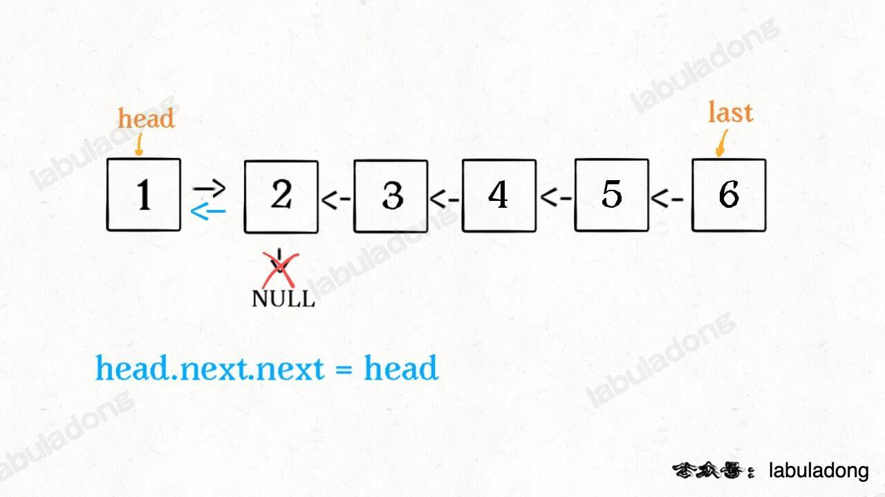
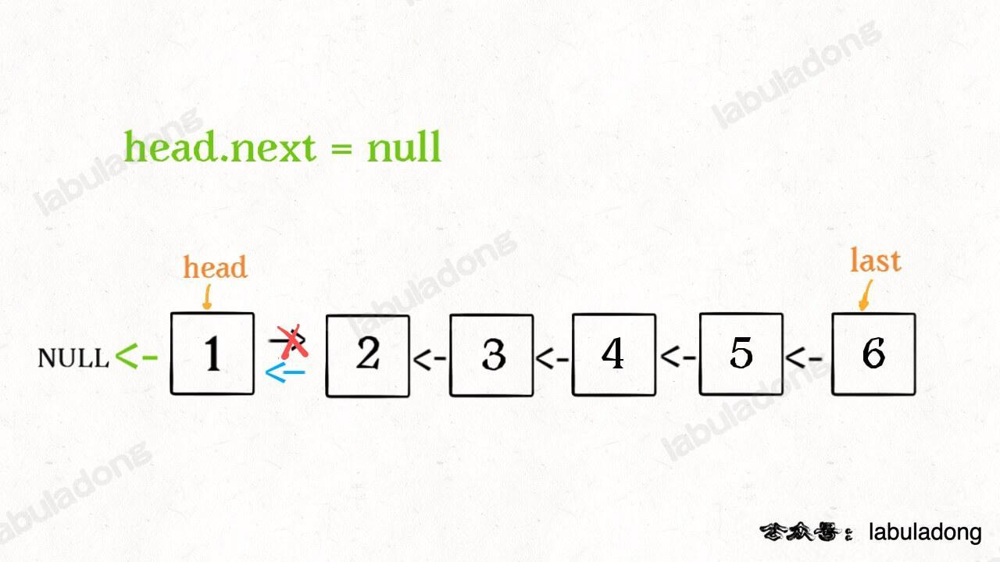

# 160. 相交链表

## 题意

给你两个单链表的头节点 `headA` 和 `headB` ，请你找出并返回两个单链表相交的起始节点。如果两个链表不存在相交节点，返回 `null` 。

图示两个链表在节点 `c1` 开始相交**：**


```
输入：intersectVal = 8, listA = [4,1,8,4,5], listB = [5,6,1,8,4,5], skipA = 2, skipB = 3
输出：Intersected at '8'
解释：相交节点的值为 8 （注意，如果两个链表相交则不能为 0）。
从各自的表头开始算起，链表 A 为 [4,1,8,4,5]，链表 B 为 [5,6,1,8,4,5]。
在 A 中，相交节点前有 2 个节点；在 B 中，相交节点前有 3 个节点。
— 请注意相交节点的值不为 1，因为在链表 A 和链表 B 之中值为 1 的节点 (A 中第二个节点和 B 中第三个节点) 是不同的节点。换句话说，它们在内存中指向两个不同的位置，而链表 A 和链表 B 中值为 8 的节点 (A 中第三个节点，B 中第四个节点) 在内存中指向相同的位置。
```


```java
输入：intersectVal = 2, listA = [1,9,1,2,4], listB = [3,2,4], skipA = 3, skipB = 1
输出：Intersected at '2'
解释：相交节点的值为 2 （注意，如果两个链表相交则不能为 0）。
从各自的表头开始算起，链表 A 为 [1,9,1,2,4]，链表 B 为 [3,2,4]。
在 A 中，相交节点前有 3 个节点；在 B 中，相交节点前有 1 个节点。
```


## 哈希表

用哈希表set存下链表A的全部节点，然后遍历链表B，对于链表B的每一个节点都进行在set里面进行一个查询，第一个被查到的就是公共节点

**别忘了哈希正常时间复杂度就是O(1)，极端下是O(N)，当超过阈值的时候会转换成红黑树，变成O(log N)，因为HashSet本质就是调用了HashMap**

```java
import java.util.HashSet;

public class Solution {
    public ListNode getIntersectionNode(ListNode headA, ListNode headB) {
        ListNode p = headA;
        HashSet<ListNode> set = new HashSet<>();

        // 把headA这个链表的节点全部放到set里
        while (p != null) {
            set.add(p);
            p = p.next;
        }

        p = headB;
        while (p != null) {
            if (set.contains(p)) {
                return p;
            }
            p = p.next;
        }
        
        return null;
    }
}
```


# 剑指 Offer 47. 礼物的最大价值

## 题意

在一个 m*n 的棋盘的每一格都放有一个礼物，每个礼物都有一定的价值（价值大于 0）。你可以从棋盘的左上角开始拿格子里的礼物，并每次向右或者向下移动一格、直到到达棋盘的右下角。给定一个棋盘及其上面的礼物的价值，请计算你最多能拿到多少价值的礼物？

```java
输入: 
[
  [1,3,1],
  [1,5,1],
  [4,2,1]
]
输出: 12
解释: 路径 1→3→5→2→1 可以拿到最多价值的礼物
```


## dfs（超时）

因为对于每一个位置，都只能向右或者向下，不存在回溯的问题，所以只需要对于每一个位置，都进行向右和向下递归就行，递归到终点统计路上的值就行

```java
class Solution {
    private int ans = 0;
    // m是行，n是列
    private int m = 0;
    private int n = 0;

    public int maxValue(int[][] grid) {
        // m和n赋初始值
        m = grid.length;
        if (m == 0) {
            return ans;
        }
        n = grid[0].length;、
            
        dfs(grid, 0, 0, 0);
        
        return ans;
    }

    private void dfs(int[][] grid, int temp, int i, int j) {
        // 判断索引是否越界
        if (i >= m || j >= n) {
            return;
        }

        // 如果抵达终点
        if (i == m - 1 && j == n - 1) {
            ans = Math.max(ans, temp + grid[i][j]);
            return;
        }

        // 更新路径上的值
        temp += grid[i][j];
        
        // 分别向右和向下递归
        dfs(grid, temp, i + 1, j);
        dfs(grid, temp, i, j + 1);
    }
}
```


## dp

同样的，因为只能向右或者向下走，所以走到任意一个位置（i，j），只能有两个方向来，要么从（i-1，j）这个位置来，要么从（i，j-1）这个位置来，那么要获得最大值，只需要看看从（i-1，j）这个方向来的值大还是从（i，j-1）这个方向来得值大，显然转移方程是

```java
dp[i][j] = Math.max(dp[i-1][j], dp[i][j-1]) + grid[i][j];
```

而且因为只能往下或者往右走，那么第一列的所有位置 `[0...m-1][0]`，都只能是从上往下的走，那么第一行的 `[0][0...n-1]`所有位置也同理只能从左往右的走，只有 `[1...m-1][1...n-1]` 这个范围的位置才考虑从上来还是从下来

```java
class Solution {
    private int m = 0;
    private int n = 0;

    public int maxValue(int[][] grid) {
        m = grid.length;
        if (m == 0) {
            return 0;
        }
        n = grid[0].length;
        
        int[][] dp = new int[m][n];
        dp[0][0] = grid[0][0];
        // 给第一列的所有位置赋值
        for (int i = 1; i < m; i++) dp[i][0] = dp[i - 1][0] + grid[i][0];
        // 给第一行的所有位置赋值
        for (int j = 1; j < n; j++) dp[0][j] = dp[0][j - 1] + grid[0][j];


        // dp
        for (int i = 1; i < m; i++) {
            for (int j = 1; j < n; j++) {
                dp[i][j] = Math.max(dp[i - 1][j], dp[i][j - 1]) + grid[i][j];
            }
        }

        return dp[m - 1][n - 1];
    }

}
```

  


# 92. 反转链表的left到right

## 题意

给你单链表的头指针 `head` 和两个整数 `left` 和 `right` ，其中 `left <= right` 。请你反转从位置 `left` 到位置 `right` 的链表节点，返回 **反转后的链表** 。


```
输入：head = [1,2,3,4,5], left = 2, right = 4
输出：[1,4,3,2,5]
```


```
输入：head = [5], left = 1, right = 1
输出：[5]
```


## 递归

其实明白了 `206反转链表` 和 `206.1反转链表的前N个节点` ，（最主要还是明白反转链表的递归逻辑）之后这个问题可以套用API去解决

这道题能看出来索引是从1开始记的，所以当left为1的时候，那么这道题就转换成了 `反转链表的前right个节点` 

递归函数

```java
ListNode reverseBetween(ListNode head, int left, int right);
```

- 反转以head为头结点的链表的left到right区间，并且返回新的链表的头结点

我们要明白，要反转的是[left...right]这个区间的节点，所以我们可以先想办法找到第left个节点，然后问题就又转换成了 `反转链表的前right个节点` ，而且这个找的过程也必须要用递归去找，再配合设计的递归函数

```java

class Solution {
	// 反转前N个节点用到的successor指针
    ListNode successor = null;

    // 反转链表的[left...right]区间的节点，并且返回头结点
    public ListNode reverseBetween(ListNode head, int left, int right) {
        // 如果区间从索引1开始，问题就转换成了反转链表的前right个节点
        if (left == 1) {
            return reverseN(head, right);
        }

        // 因为返回的是反转区间节点之后的新链表的头结点，所以直接用head.next去接受就好了
        // 为什么新递归传入的是head.next，left-1，right-1呢？
        // 因为从head开始数是left和right，如果是以head.next开始数就是left-1和right-1，同理head.next.next对应的就是left-2和right-2
        // 你可以发现这些对应在原链表里面其实是相同的[left...right]，只是起点和偏移量不同罢了，但是表示的区间都相同
        head.next = reverseBetween(head.next, left - 1, right - 1);
        return head;
    }

    // 反转链表的前N个节点，这里不赘述了，206.1里面有
    private ListNode reverseN(ListNode head, int n) {
        if (n == 1) {
            successor = head.next;
            return head;
        }

        ListNode last = reverseN(head.next, n - 1);
        head.next.next = head;
        head.next = successor;

        return last;
    }
}
```


# 206. 反转链表

## 题意

给你单链表的头节点 `head` ，请你反转链表，并返回反转后的链表。


```
输入：head = [1,2,3,4,5]
输出：[5,4,3,2,1]
```


```
输入：head = [1,2]
输出：[2,1]
```


## 迭代

取一个pre和一个cur，cur表示当前节点，pre表示在**原链表中**的当前节点的上一个节点，对于每一个节点cur，都先保存cur的下一个节点 `temp = cur.next` ，然后让  `cur.next = pre`  ，即让cur指向上一个节点pre，然后让cur和pre分别向前移动一个

```java
class Solution {
    public ListNode reverseList(ListNode head) {
        ListNode pre = null;
        // cur从头开始
        ListNode cur = head;

        while (cur != null) {
            // 先保存cur的下一个
            ListNode temp = cur.next;
            // 让cur的下一个指向原链表中的上一个节点，达到反转的效果
            cur.next = pre;
            
            // 让pre和cur各自后移一步
            pre = cur;
            cur = temp;
        }
        
        return pre;
    }
}
```


## 递归

递归的做法一定要明确递归函数的作用，而且不要尝试用脑子去想递归的压栈

这里的递归函数的意义是

```java
public ListNode reverseList(ListNode head)
```

- 传入的是链表的头结点head
- 返回的是将以 head为头结点的链表 已经 反转的新链表


所以对于每一个cur，先调用 `dfs(cur.head)` ，现在你手里的就是cur和 将以cur.head为头的反转的链表的头结点last（实际上就是以head为头的末尾结点）


但是别忘了head此时还指向着原链表的第二个，所以让第二个指向第一个就好



因为此时cur成为了最后一个节点，所以让cur指向null就可以了



```java
class Solution {
    public ListNode reverseList(ListNode head) {
        return dfs(head);
    }

    // 返回将以cur为头节点的链表反转后的新链表的头结点
    private ListNode dfs(ListNode cur) {
        if (cur == null || cur.next == null) {
            return cur;
        }

        // 拿到将cur的下一个的反转后的链表这个新链表的头结点
        ListNode last = dfs(cur.next);
        // 别忘了虽然一cur.next为头的节点反转了，但是cur和cur.next的位置并没有改变
        // 所以让cur.next指向cur，达到反转的效果
        cur.next.next = cur;
        // 此时cur为末尾，所以让cur指向null
        cur.next = null;

        return last;
    }
}
```


# 206. 1反转链表的前N个节点

在206的基础上做了变化，不是像206那样反转链表的全部，而是反转前N个节点


需要注意当没有dummyHead节点的时候，链表的索引大部分时候都是从1开始的，这也就说明从head节点到第N个节点只需要走N-1步就可以了

此时的递归函数

```java
ListNode reverseN(ListNode head, int N)
```

- 将以head为头结点的链表的前N个元素反转，并且返回新的头结点

可以发现逻辑和反转链表的逻辑很像，只不过当走到第N个节点的时候需要保留第N+1个节点的后继successor，然后让原链表的头结点head的下一个指向successor，对于前N个节点，我们采用反转链表同样的逻辑去反转。**注意，前N个节点的反转逻辑和全部的反转逻辑基本相同**


```java
ListNode successor = null; // 后驱节点

// 反转以 head 为起点的 n 个节点，返回新的头结点
ListNode reverseN(ListNode head, int n) {
    if (n == 1) {
        // 记录第 n + 1 个节点
        successor = head.next;
        return head;
    }
    // 以 head.next 为起点，需要反转前 n - 1 个节点
    ListNode last = reverseN(head.next, n - 1);

    head.next.next = head;
    // 让反转之后的 head 节点和后面的节点连起来
    head.next = successor;
    return last;
}
```


# [560. 和为 K 的子数组](https://leetcode.cn/problems/subarray-sum-equals-k/)

## 题意

给你一个整数数组 `nums` 和一个整数 `k` ，请你统计并返回 *该数组中和为 `k` 的子数组的个数* 。注意子数组是连续的。

```
输入：nums = [1,1,1], k = 2
输出：2
```

```
输入：nums = [1,2,3], k = 3
输出：2
```


## 二重循环

```java

class Solution {
    public int subarraySum(int[] nums, int k) {
        int ans = 0;
        int len = nums.length;
        
		// 遍历每一个起点
        for (int i = 0; i < len; i++) {
            int sum = 0;
            
            // 从起点开始往后加
            for (int j = i; j < len; j++) {
                sum += nums[j];
                // 如果发现当前连续和已经是k了，那就记录加一
                if (sum == k){
                    ans++;
                }
            }
        }
        return ans;
    }
}
```

很简单，这样不用三重循环。


## 哈希表+前缀和

我们可以基于方法一利用数据结构进行进一步的优化，我们知道方法一的瓶颈在于对每个 i，我们需要枚举所有的 j 来判断是否符合条件，这一步是否可以优化呢？答案是可以的。

我们定义 `pre[i]`  为  `[0...i]`  里所有数的和，则  `pre[i]`  可以由 `pre[i-1]`  递推而来，即：

 `pre[i] = pre[i-1] + nums[i]`

那么 `[j...i]` 这个子数组和为  `k`  这个条件我们可以转化为 

 `pre[i] - pre[j-1] = k` ， 

即对于每一个 `pre[i]` ，只需要找到存不存在一个 `pre[j-1]` ，满足 `pre[i] - pre[j-1] = k`  即可

对于遍历到的每一个 `nums[i]` ，我们都可以计算出来 `pre[i]` ，这个很简单，我们只需要找找是不是存在 `pre[j-1] = pre[i] - k` ，那么怎么找 `pre[j-1]` 呢？我们通过哈希表去找，把之前遍历过的所有 `pre[i]` 都放到哈希表里，每次只需要找找哈希表里面有没有 `pre[i] - k`  就可以了

哈希表里存储的是 `<前缀和，出现次数>` ，只要出现对应的前缀和，用 `ans` 加上对应出现次数就好了

```java
import java.util.HashMap;

class Solution {
    public int subarraySum(int[] nums, int k) {
        int ans = 0;
        HashMap<Integer, Integer> map = new HashMap<>();
        int pre = 0;

        // 初始前缀和，放一个（0,1）进去
        map.put(pre, 1);

        for (int i = 0; i < nums.length; i++) {
            // 更新前缀和
            pre += nums[i];

            if (map.containsKey(pre - k)) {
              	// 注意这里ans加的是key对应的value，即出现的次数
                ans += map.get(pre - k);
            }

            map.put(pre, map.getOrDefault(pre, 0) + 1);
        }

        return ans;
    }
}
```


# [338. 比特位计数](https://leetcode.cn/problems/counting-bits/)

## 题意

给你一个整数 `n` ，对于 `0 <= i <= n` 中的每个 `i` ，计算其二进制表示中 **`1` 的个数** ，返回一个长度为 `n + 1` 的数组 `ans` 作为答案。

```
输入：n = 2
输出：[0,1,1]
解释：
0 --> 0
1 --> 1
2 --> 10
```


## 暴力

直接计算所有数字的二进制里面 `1` 的个数

```java
class Solution {
    public int[] countBits(int n) {
        int[] ans = new int[n + 1];

      	// 遍历[0...i]所有数，分别求各有多少个1
        for (int i = 0; i < n + 1; i++) {
            ans[i] = count_bit(i);
        }

        return ans;
    }

  	// 记录n的二进制有几个1
    private int count_bit(int n) {
        int count = 0;
        while (n > 0) {
          	// 看末尾是否为1
            if ((n & 1) == 1) {
                count++;
            }
          
          	// 右移一位，就是除以2
            n = n >> 1;
        }
        
        return count;
    }
}
```


## 找规律

对于所有的数字，只有两类：

1.  奇数：二进制表示中，奇数一定比前面那个偶数多一个 1，因为多的就是最低位的 1。

    ```
    举例： 
             0 = 0       1 = 1
             2 = 10      3 = 112.
    ```

2.  偶数：二进制表示中，偶数中 1 的个数一定和除以 2 之后的那个数一样多。因为最低位是 0，除以 2 就是右移一位，也就是把那个 0 抹掉而已，所以 1 的个数是不变的。

    ```
     举例：
              2 = 10       4 = 100       8 = 1000
              3 = 11       6 = 110       12 = 1100
    ```


```java
class Solution {
    public int[] countBits(int n) {
        int[] ans = new int[n + 1];
        ans[0] = 0;

        for (int i = 1; i <= n; i++) {
            // 奇数
            if ((i & 1) == 1) {
              	// 奇数就是前面偶数里面1的个数+1
                ans[i] = ans[i - 1] + 1;
            } else {
              	// 偶数就是偶数的一半的个数
                ans[i] = ans[i >> 1];
            }
        }
        
        return ans;
    }
}
```


# 50. pow（x, n）

## 题意

实现x的n次方


## 递归方式，自顶向下的递归

计算 `pow(x,n)可以先计算pow(x,n/2)`

```
// 假如n是奇数
pow(x, n) = pow(x, n) * pow(x, n) * x
// 如果n是偶数
pow(x, n) = pow(x, n) * pow(x, n)
```

这样看，递归关系就出来的很明显了

```java
class Solution {
    public double myPow(double x, int n) {
        long N = n;
        if (N == 0) return 1;
        // 注意如果指数是负数，只需要最后取个倒数就好了
        return N > 0 ? dfs(x, N) : 1.0 / dfs(x, -N);
    }

    private double dfs(double x, long n) {
        if (n == 0) return 1;
        if (n == 1) return x;

        // 先计算x的n/2次方
        double y = dfs(x, n / 2);
        // 再根据n的奇偶性去向下递归就好了
        if (n % 2 == 1) {
            return y * y * x;
        } else {
            return y * y;
        }
    }
}
```

虽然这样可以解决问题，但毕竟是递归，还是有爆栈的风险，所以用迭代也可以，就是二进制的方法


## 迭代（快速幂）

说起来是迭代，但是看下来感觉更像是巧合？

比如 
$$
x->x^{2}->x^{4}->x^{9}->x^{19}->x^{38}->x^{77}
$$


其实也好理解

比如x的77次为例子，

- x的38次平方到了x的76次，再乘一个x到77次
- x的9次平方到了x的18次，再乘一个x到19次，那么乘的这个x，到最后的77次这个过程中，先平放一次到x^38，再平方一次到x^76，（注意不用管其他的x，单纯的只看到从x^18到x^19的x的变化），这个x最后会变成x^4
- x^4到x^9乘的那个x，在整个过程中最后会变成x^8
- 最开始的那个x最后会变成x^64

也就是说，x^77 本质上是由最开始的那个x不断的去平方，再乘上中间每个单独乘的x到最后的变化（比如x^ 9到x^ 19的乘的那个x最后会变成x^ 4），就是最后的结果：x^64 * x^4 * x^8 * x^1 = x^77,
而正好77的二进制是1001101，正好是第0位，第2位，第3位，第6位都是1，对应的二进制位数的值是1,4,8,64 ，再加上前面发现的规律 x^64 * x^4 * x^8 * x^1 = x^77。

于是思路就出来了，拿到n这个数的二进制，然后去循环，每次都让 `x*=x` ，碰到为1的位，就让结果乘起来

```java
class Solution {
    public double myPow(double x, int n) {
        long N = n;
        if (n == 0) return 1;
        return N > 0 ? getValue(x, N) : 1 / getValue(x, -N);
    }

    // 迭代的方式
    private double getValue(double x, long n) {
        double ans = 1;
        // 注意看总结，要明白每一个1位上乘的是x的几次方，从左往右应该是x,x^2,x^4,x^8，，，所以下面是temp自乘
        double temp = x;
        while (n > 0) {
            if (n % 2 == 1) {
                ans *= temp;
            }

            // 每次都让temp的指数翻倍（也就是让自己变为自己的平方倍）
            temp *= temp;
            n /= 2;
        }
        return ans;
    }
}
```


