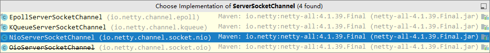
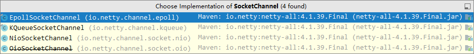
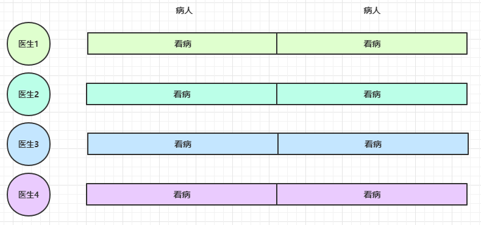

# 二. Netty 入门


## 1. 概述

### 1.1 Netty 是什么？

```
Netty is an asynchronous event-driven network application framework
for rapid development of maintainable high performance protocol servers & clients.
```

Netty 是一个异步的、基于事件驱动的网络应用框架，用于快速开发可维护、高性能的网络服务器和客户端

> 基于事件驱动的好理解
>
> 这里的异步不要和之前学习的异步IO混淆，netty并没有采用异步IO，这里的异步指的是netty采用的是多线程，一个线程发出请求之后就去干其他事情了，请求的结果由另一个线程送过来，即方法调用和方法结果获取的分离，所以从这里看是异步的，而不说是netty采用的是异步IO的模型，netty本身的IO模型还是多路复用的。
>
> 
> 尽管netty的异步看起来很像异步IO模型，但是netty的IO模型是多路复用的，而且做到了多线程达到方法调用和方法结果获取的分离（多线程实现），所以才说netty是异步的，基于事件驱动的。


### 1.2 Netty 的作者


他还是另一个著名网络应用框架 Mina 的重要贡献者


### 1.3 Netty 的地位

Netty 在 Java 网络应用框架中的地位就好比：Spring 框架在 JavaEE 开发中的地位

以下的框架都使用了 Netty，因为它们有网络通信需求！

* Cassandra - nosql 数据库
* Spark - 大数据分布式计算框架
* Hadoop - 大数据分布式存储框架
* RocketMQ - ali 开源的消息队列
* ElasticSearch - 搜索引擎
* gRPC - rpc 框架
* Dubbo - rpc 框架
* Spring 5.x - flux api 完全抛弃了 tomcat ，使用 netty 作为服务器端
* Zookeeper - 分布式协调框架


### 1.4 Netty 的优势

* Netty vs NIO，工作量大，bug 多
  * 需要自己构建协议（netty已经帮你实现好了一些协议，比如你想写一个http服务器，netty已经写好了http协议）
  * 解决 TCP 传输问题，如粘包、半包
  * epoll 空轮询导致 CPU 100%（linux下的NIO的epoll这个内核方法有bug，至今未解决 ）
  * 对 API 进行增强，使之更易用，如 FastThreadLocal => ThreadLocal，ByteBuf => ByteBuffer
* Netty vs 其它网络应用框架
  * Mina 由 apache 维护，将来 3.x 版本可能会有较大重构，破坏 API 向下兼容性，Netty 的开发迭代更迅速，API 更简洁、文档更优秀
  * 久经考验，16年，Netty 版本
    * 2.x 2004
    * 3.x 2008
    * 4.x 2013
    * 5.x 已废弃（没有明显的性能提升，维护成本高）


## 2. Hello World

### 2.1 目标

开发一个简单的服务器端和客户端

* 客户端向服务器端发送 hello, world
* 服务器仅接收，不返回


加入依赖

```xml
<dependency>
    <groupId>io.netty</groupId>
    <artifactId>netty-all</artifactId>
    <version>4.1.39.Final</version>
</dependency>
```


### 2.2 服务器端

```java
//启动器，负责组装netty组件，启动服务器
new ServerBootstrap()
    // 对比之前的WorkEventLoop，WorkEventLoop里面有一个selector和一个线程，所以EventLoop就是一个selector和一个线程的组合
    // 这里就是添加一组Nio的EventLoop
    .group(new NioEventLoopGroup()) // 1
    // 选择服务器的ServerSocketChannel的实现，也可以选择bio的实现
    .channel(NioServerSocketChannel.class) // 2
    // 这里传入一个ChannelInitializer，这是一个handler初始化器
    // 这里之所以是childHandler我想可能是把ssc做主handler，sc做子handler了
    .childHandler(new ChannelInitializer<NioSocketChannel>() { // 3
        // 在链接建立后initChannel这个方法被调用，用来添加处理器，即各种各样的handler
        protected void initChannel(NioSocketChannel ch) {
            // 添加具体的handler，这个handler用来解码
            ch.pipeline().addLast(new StringDecoder()); // 5
            // 添加具体的handler，这个handler用来处理read事件
            // 因为收发数据都会经过handler，所以到时候数据来这里之后，会先经过上面的解码handler
            //这里的handler是一个入站数据的处理器
            ch.pipeline().addLast(new SimpleChannelInboundHandler<String>() { // 6
                @Override
                protected void channelRead0(ChannelHandlerContext ctx, String msg) {
                    System.out.println(msg);
                }
            });
        }
    })
    .bind(8080); // 4
```

代码解读

* 1 处，创建 NioEventLoopGroup，可以简单理解为 `线程池 + Selector` 后面会详细展开

* 2 处，选择服务 Scoket 实现类，其中 NioServerSocketChannel 表示基于 NIO 的服务器端实现，其它实现还有

  

* 3 处，为啥方法叫 childHandler，是接下来添加的处理器都是给 SocketChannel 用的，而不是给 ServerSocketChannel。ChannelInitializer 处理器（仅执行一次），它的作用是待客户端 SocketChannel 建立连接后，执行 initChannel 以便添加更多的处理器

* 4 处，ServerSocketChannel 绑定的监听端口

* 5 处，SocketChannel 的处理器，解码 ByteBuf => String

* 6 处，SocketChannel 的业务处理器，使用上一个处理器的处理结果


### 2.3 客户端

```java
//客户端的启动器
new Bootstrap()
    //同服务器，客户端用的也是NIO的EventLoop
    .group(new NioEventLoopGroup()) // 1
    //服务器用的是NIO的ssc，客户端用的是NIO的sc，这很正常
    .channel(NioSocketChannel.class) // 2
    //添加处理器，ChannelInitializer是一个handler初始化器
    .handler(new ChannelInitializer<NioSocketChannel>() { // 3
        @Override
        //在链接建立后initChannel这个方法被调用，用来添加处理器，即各种各样的handler
        protected void initChannel(Channel ch) {
            //添加具体的handler，这个handler用来编码
            ch.pipeline().addLast(new StringEncoder()); // 8
        }
    })
    .connect("127.0.0.1", 8080) // 4
    .sync() // 5
    .channel() // 6
    //收发数据都会经过所有的handler，这里发过去会经过编码的那个handler
    .writeAndFlush(new Date() + ": hello world!"); // 7
```

代码解读

* 1 处，创建 NioEventLoopGroup，同 Server

* 2 处，选择客户 Socket 实现类，NioSocketChannel 表示基于 NIO 的客户端实现，其它实现还有

  

* 3 处，添加 SocketChannel 的处理器，ChannelInitializer 处理器（仅执行一次），它的作用是待客户端 SocketChannel 建立连接后，执行 initChannel 以便添加更多的处理器
* 4 处，指定要连接的服务器和端口
* 5 处，Netty 中很多方法都是异步的，如 connect，这时需要使用 sync 方法等待 connect 建立连接完毕
* 6 处，获取 channel 对象，它即为通道抽象，可以进行数据读写操作
* 7 处，写入消息并清空缓冲区
* 8 处，消息会经过通道 handler 处理，这里是将 String => ByteBuf 发出
* 数据经过网络传输，到达服务器端，服务器端 5 和 6 处的 handler 先后被触发，走完一个流程


### 2.4 流程梳理


#### 💡 提示

> 一开始需要树立正确的观念
>
> * 把 channel 理解为数据的通道
> * 把 msg 理解为流动的数据，最开始输入是 ByteBuf，但经过 pipeline 的加工，会变成其它类型对象，最后输出又变成 ByteBuf
> * 把 handler 理解为数据的处理工序，就是你数据要怎么处理，你要怎么处理数据，你就把对应的代码写到各个handler里面就行了
>   * 工序有多道，合在一起就是 pipeline，pipeline 负责发布事件（读、读取完成...）传播给每个 handler， handler 对自己感兴趣的事件进行处理（重写了相应事件处理方法）
>   * handler 分 Inbound 和 Outbound 两类，入站和出站的处理器，比如上面的服务器的代码里就写了一个 `SimpleChannelInboundHandler` 这么一个入站数据处理器，并且处理的是读事件
> * 把 eventLoop 理解为处理数据的工人，这个其实就是真正干事的线程
>   * 工人可以管理多个 channel 的 io 操作，并且一旦工人负责了某个 channel，就要负责到底（绑定）
>   * 工人既可以执行 io 操作，也可以进行任务处理，每位工人有任务队列，队列里可以堆放多个 channel 的待处理任务，任务分为普通任务、定时任务，大概就是说netty的eventLoop能干的活很多吧
>   * 工人按照 pipeline 顺序，依次按照 handler 的规划（代码）处理数据，可以为每道工序指定不同的工人


## 3. 组件

### 3.1 EventLoop

我们叫他： **事件循环对象**

EventLoop 本质是一个单线程执行器（同时维护了一个 Selector），里面有 run 方法处理 Channel 上源源不断的 io 事件。

> 即就像我们之前写的Boss线程和Work线程一样，Boss线程处理accpet事件，Work线程处理read请求，虽然处理的事件不同，但是他们都各是一种线程，并且里面都维护了一个selector，基本上和这里的EventLoop，也就是事件循环对象


它的继承关系比较复杂

* 一条线是继承自 j.u.c.ScheduledExecutorService 因此包含了线程池中所有的方法 （可以看出来EventLoop和多线程有关）
* 另一条线是继承自 netty 自己的 OrderedEventExecutor，
  * 提供了 boolean inEventLoop(Thread thread) 方法判断一个线程是否属于此 EventLoop
  * 提供了 parent 方法来看看自己属于哪个 EventLoopGroup

> 这里继承是通过接口去继承的，接口可以多继承


我们叫他 ：**事件循环组**

EventLoopGroup 是一组 EventLoop，Channel 一般会调用 EventLoopGroup 的 register 方法来绑定其中一个 EventLoop，后续这个 Channel 上的 io 事件都由此 EventLoop 来处理（保证了 io 事件处理时的线程安全）

* 继承自 netty 自己的 EventExecutorGroup
  * 实现了 Iterable 接口提供遍历 EventLoop 的能力
  * 另有 next 方法获取集合中下一个 EventLoop


以一个简单的实现为例：

```java
// 内部创建了两个 EventLoop, 每个 EventLoop 维护一个线程
// DefaultEventLoopGroup只能处理普通任务、定时任务，但是NioEventLoopGroup可以处理io任务、普通任务、定时任务

// 这里初始化了一个事件循环组，并且组里面有2个事件循环对象，即两个干活的工人
DefaultEventLoopGroup group = new DefaultEventLoopGroup(2);
System.out.println(group.next());
System.out.println(group.next());
System.out.println(group.next());
```

输出

```
io.netty.channel.DefaultEventLoop@60f82f98
io.netty.channel.DefaultEventLoop@35f983a6
io.netty.channel.DefaultEventLoop@60f82f98
```

也可以使用 for 循环

```java
DefaultEventLoopGroup group = new DefaultEventLoopGroup(2);
for (EventExecutor eventLoop : group) {
    System.out.println(eventLoop);
}
```

输出

```
io.netty.channel.DefaultEventLoop@60f82f98
io.netty.channel.DefaultEventLoop@35f983a6
```


#### 💡 优雅关闭

优雅关闭 `shutdownGracefully` 方法。该方法会首先切换 `EventLoopGroup` 到关闭状态从而拒绝新的任务的加入，然后在任务队列的任务都处理完成后，停止线程的运行。从而确保整体应用是在正常有序的状态下退出的


#### 演示 NioEventLoop 处理 io 事件

服务器端两个 nio worker 工人

```java
new ServerBootstrap()
    // 添加两个事件循环组，一个是父事件循环组，一个是子事件循环组，这里我推测父的处理ssc，子的处理sc
    .group(new NioEventLoopGroup(1), new NioEventLoopGroup(2))
    .channel(NioServerSocketChannel.class)
    // 添加处理sc的handler，利用channel初始化器添加handler
    .childHandler(new ChannelInitializer<NioSocketChannel>() {
        @Override
        // channel初始化的时候调用这个方法
        protected void initChannel(NioSocketChannel ch) {
            // 添加一个入站的处理器
            ch.pipeline().addLast(new ChannelInboundHandlerAdapter() {
                @Override
                // 这里处理channel的读事件 
                public void channelRead(ChannelHandlerContext ctx, Object msg) {
                    ByteBuf byteBuf = msg instanceof ByteBuf ? ((ByteBuf) msg) : null;
                    if (byteBuf != null) {
                        byte[] buf = new byte[16];
                        ByteBuf len = byteBuf.readBytes(buf, 0, byteBuf.readableBytes());
                        log.debug(new String(buf));
                    }
                }
            });
        }
    }).bind(8080).sync();
```

客户端，启动三次，分别修改发送字符串为 zhangsan（第一次），lisi（第二次），wangwu（第三次）

```java
public static void main(String[] args) throws InterruptedException {
    Channel channel = new Bootstrap()
            .group(new NioEventLoopGroup(1))
            .handler(new ChannelInitializer<NioSocketChannel>() {
                @Override
                protected void initChannel(NioSocketChannel ch) throws Exception {
                    System.out.println("init...");
                    // 看上去添加的是一个日志处理器
                    ch.pipeline().addLast(new LoggingHandler(LogLevel.DEBUG));
                }
            })
            .channel(NioSocketChannel.class).connect("localhost", 8080)
            .sync()
            .channel();
	
    // 拿到channel对象之后进行读写就方便了
    channel.writeAndFlush(ByteBufAllocator.DEFAULT.buffer().writeBytes("wangwu".getBytes()));
    Thread.sleep(2000);
    channel.writeAndFlush(ByteBufAllocator.DEFAULT.buffer().writeBytes("wangwu".getBytes()));
```

最后输出

```java
// 可以发现对于同一个channel都是服务器端的同一个事件循环对象处理的
// 处理张三的线程是3-1
22:03:34 [DEBUG] [nioEventLoopGroup-3-1] c.i.o.EventLoopTest - zhangsan       
22:03:36 [DEBUG] [nioEventLoopGroup-3-1] c.i.o.EventLoopTest - zhangsan       
// 处理李四的线程是3-2
22:05:36 [DEBUG] [nioEventLoopGroup-3-2] c.i.o.EventLoopTest - lisi           
22:05:38 [DEBUG] [nioEventLoopGroup-3-2] c.i.o.EventLoopTest - lisi           
// 处理王五的线程还是3-1，因为你服务端的事件循环组里面只有两个事件循环对象，所以又回来了，别忘了一个
// 线程可以处理多个channel，因为线程里面有一个selector，和以前一样，一个selector处理多个sc
22:06:09 [DEBUG] [nioEventLoopGroup-3-1] c.i.o.EventLoopTest - wangwu        
22:06:11 [DEBUG] [nioEventLoopGroup-3-1] c.i.o.EventLoopTest - wangwu         
```

可以看到两个工人轮流处理 channel，但工人与 channel 之间进行了绑定


来说一下这个图的过程，当客户端的链接建立成功之后，服务端会有一个EventLoop对象来服务这个channel，这个EventLoop相当于一个工人，也就是干活的人，他来负责干活。那么干什么活呢？就是我们服务端写的handler，EventLoop会把你写的handler代码都执行一遍。

至于服务器如何分配EventLoop给某个channel，这个得去考虑服务器的分配策略。


> 之前学习NIO的时候，selector的创建，channel对于selector的注册以及感兴趣的事件等等这些操作都是自己写的，现在有了EventLoop之后貌似这些都不用做了，EventLoop自动会对channel绑定，确保这个EventLoop会处理完这个channel，EventLoop如何找到channel以及如何绑定的都是netty完成的，我们要写的其实就是各种处理器，然后channel在处理的时候会经过所有的处理器，当然你在handler是可以选择这个handler是由那个EventLoop处理的


再增加两个非 nio 工人

```java
// 责任继续分化，再创建一个新组
DefaultEventLoopGroup normalWorkers = new DefaultEventLoopGroup(2);

new ServerBootstrap()
    // 和上面一样有两组，一个父组处理ssc，一个子组处理sc
    .group(new NioEventLoopGroup(1), new NioEventLoopGroup(2))
    // 这里添加的ssc，所以父组处理这个ssc
    .channel(NioServerSocketChannel.class)
    // 添加子处理器，子处理器处理的肯定是sc
    .childHandler(new ChannelInitializer<NioSocketChannel>() {
        @Override
        // sc初始化的时候要调用的东西
        protected void initChannel(NioSocketChannel ch)  {
            // 也是添加日志handler
            ch.pipeline().addLast(new LoggingHandler(LogLevel.DEBUG));
            
            // 注意这个handler的指定的EventLoop是上面新声明的新组(目的是模拟责任继续细化)
            // 也就是说，这个handler要干的事情只能由normalWorkers这里面的EventLoop来干
            ch.pipeline().addLast(normalWorkers,"myhandler",
              new ChannelInboundHandlerAdapter() {
                @Override
                public void channelRead(ChannelHandlerContext ctx, Object msg) {
                    ByteBuf byteBuf = msg instanceof ByteBuf ? ((ByteBuf) msg) : null;
                    if (byteBuf != null) {
                        byte[] buf = new byte[16];
                        ByteBuf len = byteBuf.readBytes(buf, 0, byteBuf.readableBytes());
                        log.debug(new String(buf));
                    }
                }
            });
        }
    }).bind(8080).sync();
```

客户端代码不变，启动三次，分别修改发送字符串为 zhangsan（第一次），lisi（第二次），wangwu（第三次）

输出

```java
// 服务器日志的打印，不重要
22:19:48 [DEBUG] [nioEventLoopGroup-4-1] i.n.h.l.LoggingHandler - [id: 0x251562d5, L:/127.0.0.1:8080 - R:/127.0.0.1:52588] REGISTERED
22:19:48 [DEBUG] [nioEventLoopGroup-4-1] i.n.h.l.LoggingHandler - [id: 0x251562d5, L:/127.0.0.1:8080 - R:/127.0.0.1:52588] ACTIVE

// 客户端的日志handler的打印---客户端第一次输入zhangsan
22:19:48 [DEBUG] [nioEventLoopGroup-4-1] i.n.h.l.LoggingHandler - [id: 0x251562d5, L:/127.0.0.1:8080 - R:/127.0.0.1:52588] READ: 8B
         +-------------------------------------------------+
         |  0  1  2  3  4  5  6  7  8  9  a  b  c  d  e  f |
+--------+-------------------------------------------------+----------------+
|00000000| 7a 68 61 6e 67 73 61 6e                         |zhangsan        |
+--------+-------------------------------------------------+----------------+
// 服务端的日志handler的打印---客户端第一次输入zhangsan
22:19:48 [DEBUG] [nioEventLoopGroup-4-1] i.n.h.l.LoggingHandler - [id: 0x251562d5, L:/127.0.0.1:8080 - R:/127.0.0.1:52588] READ COMPLETE
// 服务端的handler的normalWorkers负责的handler的打印---客户端第一次输入zhangsan
22:19:48 [DEBUG] [defaultEventLoopGroup-2-1] c.i.o.EventLoopTest - zhangsan        
// 客户端的日志handler的打印---客户端第二次输入zhangsan
22:19:50 [DEBUG] [nioEventLoopGroup-4-1] i.n.h.l.LoggingHandler - [id: 0x251562d5, L:/127.0.0.1:8080 - R:/127.0.0.1:52588] READ: 8B
         +-------------------------------------------------+
         |  0  1  2  3  4  5  6  7  8  9  a  b  c  d  e  f |
+--------+-------------------------------------------------+----------------+
|00000000| 7a 68 61 6e 67 73 61 6e                         |zhangsan        |
+--------+-------------------------------------------------+----------------+
// 服务端的日志handler的打印---客户端第二次输入zhangsan
22:19:50 [DEBUG] [nioEventLoopGroup-4-1] i.n.h.l.LoggingHandler - [id: 0x251562d5, L:/127.0.0.1:8080 - R:/127.0.0.1:52588] READ COMPLETE
// 服务端的handler的normalWorkers负责的handler的打印---客户端第二次输入zhangsan
22:19:50 [DEBUG] [defaultEventLoopGroup-2-1] c.i.o.EventLoopTest - zhangsan     

// 经过分析发现呢，同一个channel，不管是第几次处理channel的信息，与这个channel绑定的所有的EventLoop是不会改变了再，比如这个处理这个channel的日志handler的线程是nioEventLoopGroup-4-1，处理客户端传来的信息的打印操作的handler由defaultEventLoopGroup-2-1这个线程负责，然后不管channel第几次发出消息，对应的线程不会发生改变


// 李四王五同理了就，不解释了就
22:20:24 [DEBUG] [nioEventLoopGroup-4-2] i.n.h.l.LoggingHandler - [id: 0x94b2a840, L:/127.0.0.1:8080 - R:/127.0.0.1:52612] REGISTERED
22:20:24 [DEBUG] [nioEventLoopGroup-4-2] i.n.h.l.LoggingHandler - [id: 0x94b2a840, L:/127.0.0.1:8080 - R:/127.0.0.1:52612] ACTIVE
22:20:25 [DEBUG] [nioEventLoopGroup-4-2] i.n.h.l.LoggingHandler - [id: 0x94b2a840, L:/127.0.0.1:8080 - R:/127.0.0.1:52612] READ: 4B
         +-------------------------------------------------+
         |  0  1  2  3  4  5  6  7  8  9  a  b  c  d  e  f |
+--------+-------------------------------------------------+----------------+
|00000000| 6c 69 73 69                                     |lisi            |
+--------+-------------------------------------------------+----------------+
22:20:25 [DEBUG] [nioEventLoopGroup-4-2] i.n.h.l.LoggingHandler - [id: 0x94b2a840, L:/127.0.0.1:8080 - R:/127.0.0.1:52612] READ COMPLETE
22:20:25 [DEBUG] [defaultEventLoopGroup-2-2] c.i.o.EventLoopTest - lisi            
22:20:27 [DEBUG] [nioEventLoopGroup-4-2] i.n.h.l.LoggingHandler - [id: 0x94b2a840, L:/127.0.0.1:8080 - R:/127.0.0.1:52612] READ: 4B
         +-------------------------------------------------+
         |  0  1  2  3  4  5  6  7  8  9  a  b  c  d  e  f |
+--------+-------------------------------------------------+----------------+
|00000000| 6c 69 73 69                                     |lisi            |
+--------+-------------------------------------------------+----------------+
22:20:27 [DEBUG] [nioEventLoopGroup-4-2] i.n.h.l.LoggingHandler - [id: 0x94b2a840, L:/127.0.0.1:8080 - R:/127.0.0.1:52612] READ COMPLETE
22:20:27 [DEBUG] [defaultEventLoopGroup-2-2] c.i.o.EventLoopTest - lisi            
22:20:38 [DEBUG] [nioEventLoopGroup-4-1] i.n.h.l.LoggingHandler - [id: 0x79a26af9, L:/127.0.0.1:8080 - R:/127.0.0.1:52625] REGISTERED
22:20:38 [DEBUG] [nioEventLoopGroup-4-1] i.n.h.l.LoggingHandler - [id: 0x79a26af9, L:/127.0.0.1:8080 - R:/127.0.0.1:52625] ACTIVE
22:20:38 [DEBUG] [nioEventLoopGroup-4-1] i.n.h.l.LoggingHandler - [id: 0x79a26af9, L:/127.0.0.1:8080 - R:/127.0.0.1:52625] READ: 6B
         +-------------------------------------------------+
         |  0  1  2  3  4  5  6  7  8  9  a  b  c  d  e  f |
+--------+-------------------------------------------------+----------------+
|00000000| 77 61 6e 67 77 75                               |wangwu          |
+--------+-------------------------------------------------+----------------+
22:20:38 [DEBUG] [nioEventLoopGroup-4-1] i.n.h.l.LoggingHandler - [id: 0x79a26af9, L:/127.0.0.1:8080 - R:/127.0.0.1:52625] READ COMPLETE
22:20:38 [DEBUG] [defaultEventLoopGroup-2-1] c.i.o.EventLoopTest - wangwu          
22:20:40 [DEBUG] [nioEventLoopGroup-4-1] i.n.h.l.LoggingHandler - [id: 0x79a26af9, L:/127.0.0.1:8080 - R:/127.0.0.1:52625] READ: 6B
         +-------------------------------------------------+
         |  0  1  2  3  4  5  6  7  8  9  a  b  c  d  e  f |
+--------+-------------------------------------------------+----------------+
|00000000| 77 61 6e 67 77 75                               |wangwu          |
+--------+-------------------------------------------------+----------------+
22:20:40 [DEBUG] [nioEventLoopGroup-4-1] i.n.h.l.LoggingHandler - [id: 0x79a26af9, L:/127.0.0.1:8080 - R:/127.0.0.1:52625] READ COMPLETE
22:20:40 [DEBUG] [defaultEventLoopGroup-2-1] c.i.o.EventLoopTest - wangwu          
```

可以看到，nio 工人和 非 nio 工人也分别绑定了 channel（LoggingHandler 由 nio 工人执行，而我们自己的 handler 由非 nio 工人执行）


每个channel都是要执行所有handler的代码的，如果handler没有指定特殊的EventLoop，那么就会在最开始分配一个EventLoop来处理这个channel，而且channel之后不会再更改EventLoop了


#### 💡 handler 执行中如何换人？

关键代码 `io.netty.channel.AbstractChannelHandlerContext#invokeChannelRead()`

这里涉及到了多线程的知识，目前看不懂很正常

```java
static void invokeChannelRead(final AbstractChannelHandlerContext next, Object msg) {
    final Object m = next.pipeline.touch(ObjectUtil.checkNotNull(msg, "msg"), next);
    // 下一个 handler 的事件循环是否与当前的事件循环是同一个线程
    // 返回下一个handler的eventLoop（EventExecutor是EventLoop的父类），next是下一个handler
    EventExecutor executor = next.executor();
    
    // 当前handler的线程是否和eventLoop是同一个线程
    if (executor.inEventLoop()) {
        // 那就由当前线程来执行下一个handler的内容
        next.invokeChannelRead(m);
    } 
    // 不是，将要执行的代码作为任务提交给下一个事件循环处理（换人），如果两个handler绑定的是同一个线程，那么不用切换，否则把要调用的代码封装成一个	任务对象，由下一个handler的线程来调用
    else {
        //否则由下一个handler的线程来执行handler的内容
        executor.execute(new Runnable() {
            @Override
            public void run() {
                next.invokeChannelRead(m);
            }
        });
    }
}
```

* 如果两个 handler 绑定的是同一个线程，那么就直接调用
* 否则，把要调用的代码封装为一个任务对象，由下一个 handler 的线程来调用


#### 演示 NioEventLoop 处理普通任务

NioEventLoop 除了可以处理 io 事件，同样可以向它提交普通任务

```java
NioEventLoopGroup nioWorkers = new NioEventLoopGroup(2);

log.debug("server start...");
Thread.sleep(2000);
nioWorkers.execute(()->{
    log.debug("normal task...");
});
```

输出

```
22:30:36 [DEBUG] [main] c.i.o.EventLoopTest2 - server start...
22:30:38 [DEBUG] [nioEventLoopGroup-2-1] c.i.o.EventLoopTest2 - normal task...
```

> 可以用来执行耗时较长的任务


#### 演示 NioEventLoop 处理定时任务

```java
NioEventLoopGroup nioWorkers = new NioEventLoopGroup(2);

log.debug("server start...");
Thread.sleep(2000);
nioWorkers.scheduleAtFixedRate(() -> {
    log.debug("running...");
}, 0, 1, TimeUnit.SECONDS);
```

输出

```
22:35:15 [DEBUG] [main] c.i.o.EventLoopTest2 - server start...
22:35:17 [DEBUG] [nioEventLoopGroup-2-1] c.i.o.EventLoopTest2 - running...
22:35:18 [DEBUG] [nioEventLoopGroup-2-1] c.i.o.EventLoopTest2 - running...
22:35:19 [DEBUG] [nioEventLoopGroup-2-1] c.i.o.EventLoopTest2 - running...
22:35:20 [DEBUG] [nioEventLoopGroup-2-1] c.i.o.EventLoopTest2 - running...
...
```

> 可以用来执行定时任务


### 3.2 Channel

channel 的主要作用

* close() 可以用来关闭 channel
* closeFuture() 用来处理 channel 的关闭
  * sync 方法作用是同步等待 channel 关闭
  * 而 addListener 方法是异步等待 channel 关闭
* pipeline() 方法添加处理器
* write() 方法将数据写入 `缓冲区` ，等待调用了 `Flash()` 方法或者缓冲区到达一定容量的时候再 `刷出` 
* writeAndFlush() 方法将数据写入并刷出


#### ChannelFuture

**一句话总结Future对象，往线程池里面提交任务得到的返回结果就是future，这个future包括了任务的执行结果和执行其他信息**

这时刚才的客户端代码

```java
new Bootstrap()
    .group(new NioEventLoopGroup())
    .channel(NioSocketChannel.class)
    .handler(new ChannelInitializer<Channel>() {
        @Override
        protected void initChannel(Channel ch) {
            ch.pipeline().addLast(new StringEncoder());
        }
    })
    .connect("127.0.0.1", 8080)
    .sync()
    .channel()
    .writeAndFlush(new Date() + ": hello world!");
```

现在把它拆开来看

```java
// 注意：凡是后面带有Future的类，一般都是和异步非阻塞的方法配合使用的，比如这里就和connect这个方法配合使用的
// 从这里可以发现通过调用connect()得到了channelFuture对象
ChannelFuture channelFuture = new Bootstrap()
    .group(new NioEventLoopGroup())
    .channel(NioSocketChannel.class)
    .handler(new ChannelInitializer<Channel>() {
        @Override
        protected void initChannel(Channel ch) {
            ch.pipeline().addLast(new StringEncoder());
        }
    })
    .connect("127.0.0.1", 8080); // 1

channelFuture.sync().channel().writeAndFlush(new Date() + ": hello world!");
```

* 1 处返回的是 ChannelFuture 对象，它的作用是利用 channel() 方法来获取 Channel 对象

**注意** **connect 方法是异步的（因为异步所以肯定非阻塞），意味着不等连接建立（链接建立是需要时间的），方法执行就返回了。因此 channelFuture 对象中不能【立刻】获得到正确的 Channel 对象（正确的Channel对象是连接信息的）**

实验如下：

```java
ChannelFuture channelFuture = new Bootstrap()
    .group(new NioEventLoopGroup())
    .channel(NioSocketChannel.class)
    .handler(new ChannelInitializer<Channel>() {
        @Override
        protected void initChannel(Channel ch) {
            ch.pipeline().addLast(new StringEncoder());
        }
    })
    .connect("127.0.0.1", 8080);

System.out.println(channelFuture.channel()); // 1
channelFuture.sync(); // 2
System.out.println(channelFuture.channel()); // 3
```

* 执行到 1 时，连接未建立，打印 `[id: 0x2e1884dd]`，当然假如连接建立很快的话可能执行到这里的时候，也有可能建立好了，但是这种情况不太可能发生，所以这里直接认定执行到1的时候连接是没有建立的，所以需要sync的等待
* 执行到 2 时，sync 方法是同步等待连接建立完成，之所以说同步，是因为主线程执行到 `sync()` 方法之后就等待 `nio` 线程建立连接了，在建立好连接之前，主线程都是阻塞的，等连接建立好了之后，才能继续往下走，即才能执行3
* 执行到 3 时，连接肯定建立了，打印 `[id: 0x2e1884dd, L:/127.0.0.1:57191 - R:/127.0.0.1:8080]`，明显连接就建立好了


除了用 sync 方法可以让异步操作同步以外，还可以使用回调的方式：

```java
ChannelFuture channelFuture = new Bootstrap()
    .group(new NioEventLoopGroup())
    .channel(NioSocketChannel.class)
    .handler(new ChannelInitializer<Channel>() {
        @Override
        protected void initChannel(Channel ch) {
            ch.pipeline().addLast(new StringEncoder());
        }
    })
    .connect("127.0.0.1", 8080);

System.out.println(channelFuture.channel()); // 1
// 给得到的channelFuture对象添加一个监听器，而且这里是异步的操作,主线程添加完监听器之后就继续执行下面的代码了，这里不会阻塞，然后执行这里的代码还是nio线程去执行的，即nio建立好连接之后会回调这个operationComplete()方法
channelFuture.addListener(new ChannelFutureListener() {
  	public void operationComplete(ChannelFuture future) throws Exception{
      	// 这个方法里面的channelfuture对象就是你上面的调用异步方法的channelFuture对象
    		System.out.println(future.channel()); // 2
    }
});
```

* 执行到 1 时，连接未建立，打印 `[id: 0x749124ba]`
* ChannelFutureListener 会在连接建立时被调用（其中 operationComplete 方法），因此执行到 2 时，连接肯定建立了，打印 `[id: 0x749124ba, L:/127.0.0.1:57351 - R:/127.0.0.1:8080]`


总结：

-    `sync` 是同步的，主线程调用了 `sync` 之后会阻塞到nio建立好连接
-    `addListener` 的异步的，主线程调用了 `addListener` 之后，nio线程建立好连接之后会回调你重写的 `operationComplete`  方法
-   很明显， `sync` 的写法简单很多，目前来说，这两个哪个写法都行，只不过一个是主线程执行连接建立好之后的代码，一个是由其他线程执行连接建立好之后的代码


#### CloseFuture

```java
@Slf4j
public class CloseFutureClient {
    public static void main(String[] args) throws InterruptedException {
        NioEventLoopGroup group new NioEventLoopGroup();
        ChannelFuture channelFuture = new Bootstrap()
                .group(group)
                .channel(NioSocketChannel.class)
                .handler(new ChannelInitializer<NioSocketChannel>() {
                    @Override // 在连接建立后被调用
                    protected void initChannel(NioSocketChannel ch) throws Exception {
                        // 这个handler是netty提供给你用来看channel的情况的，channel的每一个过程都会被打印出来
                        ch.pipeline().addLast(new LoggingHandler(LogLevel.DEBUG));
                        ch.pipeline().addLast(new StringEncoder());
                    }
                })
            		// 别忘了这里的connect仍是异步的操作，真正的链接必须等nio链接好了之后channel才真正的有内容
                .connect(new InetSocketAddress("localhost", 8080));
        Channel channel = channelFuture.sync().channel();
        log.debug("{}", channel);
        new Thread(()->{
            Scanner scanner = new Scanner(System.in);
            while (true) {
                String line = scanner.nextLine();
                if ("q".equals(line)) {
                    // 因为close()方法也是异步的，所以你直接把善后操作写在close()方法后面肯定是不对的，
                  	// 因为你不能保证close()方法之后立即执行					善后操作
                    channel.close(); // close 异步操作 1s 之后
										//log.debug("处理关闭之后的操作"); 
                  	// 所以不能在这里善后
                    break;
                }
                channel.writeAndFlush(line);
            }
        }, "input").start();

        // 获取 CloseFuture 对象， 两种方法：1) 同步处理关闭， 2) 异步处理关闭
        // 可以发现这里的操作和connect的channelFuture是有异曲同工之妙的
        ChannelFuture closeFuture = channel.closeFuture();
      	/*
        log.debug("waiting close...");
        closeFuture.sync();
        log.debug("处理关闭之后的操作");
        */
        closeFuture.addListener(new ChannelFutureListener() {
            @Override
            public void operationComplete(ChannelFuture future) throws Exception {
                log.debug("处理关闭之后的操作");
                group.shutdownGracefully();
            }
        });
        
    }
}
```


可以发现netty里面的异步方法还是很多的，光这里我们就学习了异步的 `connect` 和 `close` ，为了能保证在执行完这些方法之后执行某些代码，我们采用的是 `ChannelFuture` 对象来配合这两个异步方法来解决的。而且对于 `ChannelFuture` 对象我们也可以采用同步的 `sync` 和异步的 `addListener` 来配合使用。


#### 💡 异步提升的是什么

* 有些同学看到这里会有疑问：为什么不在一个线程中去执行建立连接、去执行关闭 channel，那样不是也可以吗？非要用这么复杂的异步方式：比如一个线程发起建立连接，另一个线程去真正建立连接

* 还有同学会笼统地回答，因为 netty 异步方式用了多线程、多线程就效率高。其实这些认识都比较片面，多线程和异步所提升的效率并不是所认为的


思考下面的场景，4 个医生给人看病，每个病人花费 20 分钟，而且医生看病的过程中是以病人为单位的，一个病人看完了，才能看下一个病人。假设病人源源不断地来，可以计算一下 4 个医生一天工作 8 小时，处理的病人总数是：`4 * 8 * 3 = 96`




经研究发现，看病可以细分为四个步骤，经拆分后每个步骤需要 5 分钟，如下


因此可以做如下优化，只有一开始，医生 2、3、4 分别要等待 5、10、15 分钟才能执行工作，但只要后续病人源源不断地来，他们就能够满负荷工作，医生1每小时挂 `60/5` 个号，医生每小时看12个病人，医生3缴费12个，医生4取药12个。

总的处理数没有变，都是

 `4*8*(60/20) = 8*(60/5) ` 都是一共处理96个病人

但是从病人的角度来看，本来要按照医生每20分钟看一个的频率等，现在医生1一直在挂号，没多久就到自己了，自己挂完号之后直接看病了

比如说从第9个病人来看，如果按照同步的方式，每个医生分配2个病人，每个病人看20分钟，那么第9个病人要等每个医生把各自的2个病人看完了，才能到自己，但是如果按照异步来说，自己虽然也要等40分钟才能到自己挂号，但是这9个人的看病的流程是一起的，相当于同一段时间内，这9个人中没有一个人被落下，相当于这9个任务在同一段事件内都在被处理，不存在到时候被饿死的情况。异步的方式相当于提高了吞吐量。


**提高的是单位时间内处理请求的个数** ，所以吞吐量提高了，尽可能的让每个线程都感觉自己在活动的，不至于让cpu不理你。


要点

* 单线程没法异步提高效率，必须配合多线程、多核 cpu 才能发挥异步的优势
* 异步并没有缩短响应时间，反而有所增加，只是提高了吞吐量
* 合理进行任务拆分，也是利用异步的关键


### 3.3 Future & Promise

在异步处理时，经常用到这两个接口

首先要说明 netty 中的 Future 与 jdk 中的 Future 同名，但是是两个接口，netty 的 Future 继承自 jdk 的 Future，而 Promise 又对 netty Future 进行了扩展，即父到子的关系是这样的： `jdk的Future<--- netty的Future<---netty的Promise` 


下面举例的Future的同步等待和异步等待可以完全对照于上面学习的 `ChannelFuture` 的 `sync` 同步方式和 `addListener` 异步方式。

* jdk Future 只能同步等待任务结束（或成功、或失败）才能得到结果，类比之前的 `sync` 
* netty Future 可以同步等待任务结束得到结果( `sync` )，也可以异步方式得到结果( `addListener` )，但都是要等任务结束
* netty Promise 不仅有 netty Future 的功能，而且脱离了任务独立存在，只作为两个线程间传递结果的容器

| 功能/名称    | jdk Future                     | netty Future                                                 | Promise      |
| ------------ | ------------------------------ | ------------------------------------------------------------ | ------------ |
| cancel       | 取消任务                       | -                                                            | -            |
| isCanceled   | 任务是否取消                   | -                                                            | -            |
| isDone       | 任务是否完成，不能区分成功失败 | -                                                            | -            |
| get          | 获取任务结果，阻塞等待         | -                                                            | -            |
| getNow       | -                              | 获取任务结果，非阻塞，还未产生结果时返回 null                | -            |
| await        | -                              | 等待任务结束，如果任务失败，不会抛异常，而是通过 isSuccess 判断 | -            |
| sync         | -                              | 等待任务结束，如果任务失败，抛出异常(get是获得结果，sync是等待任务结束) | -            |
| isSuccess    | -                              | 判断任务是否成功                                             | -            |
| cause        | -                              | 获取失败信息，非阻塞，如果没有失败，返回null                 | -            |
| addLinstener | -                              | 添加回调，异步接收结果                                       | -            |
| setSuccess   | -                              | -                                                            | 设置成功结果 |
| setFailure   | -                              | -                                                            | 设置失败结果 |

Jdk Future的 `get` 和netty Future的 `sync` 很像，都是同步等待任务，只不过前者是等待任务结果，后者只等待任务结束，不等待人物结果


其实对于Future的学习没必要想的太复杂，因为线程大部分都是异步调用的，你为了要获取线程调用的结果你肯定要一个对象去接受结果，但是你又需要知道这个任务执行的其他状态，所以封装一下，就有了Future。

假如Future是一个书包，你（主线程）想让你的同学（子线程）回他家给你拿好吃的，你在那等（主线程阻塞），你同学回家拿好吃的（子线程干活），把好吃的放进了书包（Future里面有了内容）。

Future我感觉是一个顾名思义的类，表达了未来的感觉，因为你主线程肯定发出调用请求之后（一般由其他线程来执行）一般不会是立刻获得结果，所以需要Future来 `sync` 同步等待一下其他线程执行结果或者闹个 `addListener` 彻底当个甩手掌柜，让别的线程执行完之后再执行执行完之后应该执行的代码。


#### 例0

jdk的Future

```java
@Slf4j
public class TestJdkFuture {
    public static void main(String[] args) throws ExecutionException, InterruptedException {
        // 1. 线程池
        ExecutorService service = Executors.newFixedThreadPool(2);
        // 2. 提交任务，获得了future对象
        Future<Integer> future = service.submit(new Callable<Integer>() {
            @Override
            public Integer call() throws Exception {
                log.debug("执行计算");
                Thread.sleep(1000);
                return 50;
            }
        });
        // 3. 主线程通过 future 来获取结果
        log.debug("等待结果");
        // 因为主线程调用get方法时候会一直阻塞到任务的结束，所以这里可以获取到的就是任务执行的结果
        log.debug("结果是 {}", future.get());
    }
}
```


#### 例0.5

Netty里面的Future的测试，这个例子我们在之前已经学习过了，主要就是学习Future对象的同步和异步方法。

不过值得注意的是，我们在jdk里面的Future对象里面创建的是线程池，而这里我们创建的是EventLoopGroup，我们真正要明白的是，虽然EventLoop里面只有一个线程，但是我们同样可以提交任务给他（例0是给线程池提交的对象，我们这个例子是给EventLoop提交任务）

而且Future对象是被动获得的（因为必须提交任务才能获得 `future` 对象），我们是通过 `提交任务` 获得的 `Future` 对象， `Promise` 是可以主动获取的

```java
@Slf4j
public class TestNettyFuture {
    public static void main(String[] args) throws ExecutionException, InterruptedException {
        NioEventLoopGroup group = new NioEventLoopGroup();
        EventLoop eventLoop = group.next();
      	// 所有的future对象都是被动获取的，都是通过提交任务得到的
        Future<Integer> future = eventLoop.submit(new Callable<Integer>() {
            @Override
            public Integer call() throws Exception {
                log.debug("执行计算");
                Thread.sleep(1000);
                return 70;
            }
        });
//        log.debug("等待结果");
//        log.debug("结果是 {}", future.get());
        future.addListener(new GenericFutureListener<Future<? super Integer>>(){
            @Override
            public void operationComplete(Future<? super Integer> future) throws Exception {
                log.debug("接收结果:{}", future.getNow());
            }
        });
    }
}
```


#### 例1

同步处理任务成功

```java
DefaultEventLoop eventExecutors = new DefaultEventLoop();
// 通过时间循环对象主动创建一个promise对象
DefaultPromise<Integer> promise = new DefaultPromise<>(eventExecutors);

eventExecutors.execute(()->{
    try {
        Thread.sleep(1000);
    } catch (InterruptedException e) {
        e.printStackTrace();
    }
    log.debug("set success, {}",10);
  	// 通过promise设置成功时候的结果
    promise.setSuccess(10);
});

log.debug("start...");
log.debug("{}",promise.getNow()); // 还没有结果
log.debug("{}",promise.get());
```

输出

```
11:51:53 [DEBUG] [main] c.i.o.DefaultPromiseTest2 - start...
11:51:53 [DEBUG] [main] c.i.o.DefaultPromiseTest2 - null
11:51:54 [DEBUG] [defaultEventLoop-1-1] c.i.o.DefaultPromiseTest2 - set success, 10
11:51:54 [DEBUG] [main] c.i.o.DefaultPromiseTest2 - 10
```


#### 例2

异步处理任务成功

```java
DefaultEventLoop eventExecutors = new DefaultEventLoop();
DefaultPromise<Integer> promise = new DefaultPromise<>(eventExecutors);

// 设置回调，异步接收结果
promise.addListener(future -> {
    // 这里的 future 就是上面的 promise
    log.debug("{}",future.getNow());
});

// 等待 1000 后设置成功结果
eventExecutors.execute(()->{
    try {
        Thread.sleep(1000);
    } catch (InterruptedException e) {
        e.printStackTrace();
    }
    log.debug("set success, {}",10);
    promise.setSuccess(10);
});

log.debug("start...");
```

输出

```
11:49:30 [DEBUG] [main] c.i.o.DefaultPromiseTest2 - start...
11:49:31 [DEBUG] [defaultEventLoop-1-1] c.i.o.DefaultPromiseTest2 - set success, 10
11:49:31 [DEBUG] [defaultEventLoop-1-1] c.i.o.DefaultPromiseTest2 - 10
```


#### 例3

同步处理任务失败 - sync & get

```java
DefaultEventLoop eventExecutors = new DefaultEventLoop();
        DefaultPromise<Integer> promise = new DefaultPromise<>(eventExecutors);

        eventExecutors.execute(() -> {
            try {
                Thread.sleep(1000);
            } catch (InterruptedException e) {
                e.printStackTrace();
            }
            RuntimeException e = new RuntimeException("error...");
            log.debug("set failure, {}", e.toString());
            promise.setFailure(e);
        });

        log.debug("start...");
        log.debug("{}", promise.getNow());
        promise.get(); // sync() 也会出现异常，只是 get 会再用 ExecutionException 包一层异常
```

输出

```
12:11:07 [DEBUG] [main] c.i.o.DefaultPromiseTest2 - start...
12:11:07 [DEBUG] [main] c.i.o.DefaultPromiseTest2 - null
12:11:08 [DEBUG] [defaultEventLoop-1-1] c.i.o.DefaultPromiseTest2 - set failure, java.lang.RuntimeException: error...
Exception in thread "main" java.util.concurrent.ExecutionException: java.lang.RuntimeException: error...
	at io.netty.util.concurrent.AbstractFuture.get(AbstractFuture.java:41)
	at com.itcast.oio.DefaultPromiseTest2.main(DefaultPromiseTest2.java:34)
Caused by: java.lang.RuntimeException: error...
	at com.itcast.oio.DefaultPromiseTest2.lambda$main$0(DefaultPromiseTest2.java:27)
	at io.netty.channel.DefaultEventLoop.run(DefaultEventLoop.java:54)
	at io.netty.util.concurrent.SingleThreadEventExecutor$5.run(SingleThreadEventExecutor.java:918)
	at io.netty.util.internal.ThreadExecutorMap$2.run(ThreadExecutorMap.java:74)
	at io.netty.util.concurrent.FastThreadLocalRunnable.run(FastThreadLocalRunnable.java:30)
	at java.lang.Thread.run(Thread.java:745)
```


#### 例4

同步处理任务失败 - await

```java
DefaultEventLoop eventExecutors = new DefaultEventLoop();
DefaultPromise<Integer> promise = new DefaultPromise<>(eventExecutors);

eventExecutors.execute(() -> {
    try {
        Thread.sleep(1000);
    } catch (InterruptedException e) {
        e.printStackTrace();
    }
    RuntimeException e = new RuntimeException("error...");
    log.debug("set failure, {}", e.toString());
    promise.setFailure(e);
});

log.debug("start...");
log.debug("{}", promise.getNow());
promise.await(); // 与 sync 和 get 区别在于，不会抛异常
log.debug("result {}", (promise.isSuccess() ? promise.getNow() : promise.cause()).toString());
```

输出

```
12:18:53 [DEBUG] [main] c.i.o.DefaultPromiseTest2 - start...
12:18:53 [DEBUG] [main] c.i.o.DefaultPromiseTest2 - null
12:18:54 [DEBUG] [defaultEventLoop-1-1] c.i.o.DefaultPromiseTest2 - set failure, java.lang.RuntimeException: error...
12:18:54 [DEBUG] [main] c.i.o.DefaultPromiseTest2 - result java.lang.RuntimeException: error...
```


#### 例5

异步处理任务失败

```java
DefaultEventLoop eventExecutors = new DefaultEventLoop();
DefaultPromise<Integer> promise = new DefaultPromise<>(eventExecutors);

promise.addListener(future -> {
    log.debug("result {}", (promise.isSuccess() ? promise.getNow() : promise.cause()).toString());
});

eventExecutors.execute(() -> {
    try {
        Thread.sleep(1000);
    } catch (InterruptedException e) {
        e.printStackTrace();
    }
    RuntimeException e = new RuntimeException("error...");
    log.debug("set failure, {}", e.toString());
    promise.setFailure(e);
});

log.debug("start...");
```

输出

```
12:04:57 [DEBUG] [main] c.i.o.DefaultPromiseTest2 - start...
12:04:58 [DEBUG] [defaultEventLoop-1-1] c.i.o.DefaultPromiseTest2 - set failure, java.lang.RuntimeException: error...
12:04:58 [DEBUG] [defaultEventLoop-1-1] c.i.o.DefaultPromiseTest2 - result java.lang.RuntimeException: error...
```


#### 例6

await 死锁检查

```java
DefaultEventLoop eventExecutors = new DefaultEventLoop();
DefaultPromise<Integer> promise = new DefaultPromise<>(eventExecutors);

eventExecutors.submit(()->{
    System.out.println("1");
    try {
        promise.await();
        // 注意不能仅捕获 InterruptedException 异常
        // 否则 死锁检查抛出的 BlockingOperationException 会继续向上传播
        // 而提交的任务会被包装为 PromiseTask，它的 run 方法中会 catch 所有异常然后设置为 Promise 的失败结果而不会抛出
    } catch (Exception e) { 
        e.printStackTrace();
    }
    System.out.println("2");
});
eventExecutors.submit(()->{
    System.out.println("3");
    try {
        promise.await();
    } catch (Exception e) {
        e.printStackTrace();
    }
    System.out.println("4");
});
```

输出

```
1
2
3
4
io.netty.util.concurrent.BlockingOperationException: DefaultPromise@47499c2a(incomplete)
	at io.netty.util.concurrent.DefaultPromise.checkDeadLock(DefaultPromise.java:384)
	at io.netty.util.concurrent.DefaultPromise.await(DefaultPromise.java:212)
	at com.itcast.oio.DefaultPromiseTest.lambda$main$0(DefaultPromiseTest.java:27)
	at io.netty.util.concurrent.PromiseTask$RunnableAdapter.call(PromiseTask.java:38)
	at io.netty.util.concurrent.PromiseTask.run(PromiseTask.java:73)
	at io.netty.channel.DefaultEventLoop.run(DefaultEventLoop.java:54)
	at io.netty.util.concurrent.SingleThreadEventExecutor$5.run(SingleThreadEventExecutor.java:918)
	at io.netty.util.internal.ThreadExecutorMap$2.run(ThreadExecutorMap.java:74)
	at io.netty.util.concurrent.FastThreadLocalRunnable.run(FastThreadLocalRunnable.java:30)
	at java.lang.Thread.run(Thread.java:745)
io.netty.util.concurrent.BlockingOperationException: DefaultPromise@47499c2a(incomplete)
	at io.netty.util.concurrent.DefaultPromise.checkDeadLock(DefaultPromise.java:384)
	at io.netty.util.concurrent.DefaultPromise.await(DefaultPromise.java:212)
	at com.itcast.oio.DefaultPromiseTest.lambda$main$1(DefaultPromiseTest.java:36)
	at io.netty.util.concurrent.PromiseTask$RunnableAdapter.call(PromiseTask.java:38)
	at io.netty.util.concurrent.PromiseTask.run(PromiseTask.java:73)
	at io.netty.channel.DefaultEventLoop.run(DefaultEventLoop.java:54)
	at io.netty.util.concurrent.SingleThreadEventExecutor$5.run(SingleThreadEventExecutor.java:918)
	at io.netty.util.internal.ThreadExecutorMap$2.run(ThreadExecutorMap.java:74)
	at io.netty.util.concurrent.FastThreadLocalRunnable.run(FastThreadLocalRunnable.java:30)
	at java.lang.Thread.run(Thread.java:745)

```


### 3.4 Handler & Pipeline

编写自己的业务都是在 `Handler` 里面，而且会经常使用netty提供给你的基础的 `Hanler` 

ChannelHandler 用来处理 Channel 上的各种事件，分为入站、出站两种（即所有的 `Handler` 就分为这两种，一种是处理入站的，一种是处理出站的）。**所有 ChannelHandler 被连成一串，就是 Pipeline**，所以说Pipeline这个概念很简单。

* 入站处理器通常是 **ChannelInboundHandlerAdapter** 的子类，主要用来读取客户端数据，写回结果
* 出站处理器通常是 **ChannelOutboundHandlerAdapter** 的子类，主要对写回结果进行加工

打个比喻，每个 Channel 是一个产品的加工车间，Pipeline 是车间中的流水线，ChannelHandler 就是流水线上的各道工序，而后面要讲的 ByteBuf 是原材料，经过很多工序的加工：先经过一道道入站工序，再经过一道道出站工序最终变成产品


先搞清楚顺序，服务端

```java
new ServerBootstrap()
    .group(new NioEventLoopGroup())
    .channel(NioServerSocketChannel.class)
    .childHandler(new ChannelInitializer<NioSocketChannel>() {
        protected void initChannel(NioSocketChannel ch) {
            ch.pipeline().addLast(new ChannelInboundHandlerAdapter(){
                @Override
                public void channelRead(ChannelHandlerContext ctx, Object msg) {
                    System.out.println(1);
                  	// 为什么要加这句话？
                  	// 因为这个入站处理器需要一个接一个的执行，而且你当前这个入站处理器又是自己写的
                  	// 所以为了保证入站处理器会被一个接一个执行，所以需要你调用这个方法让下一个入站处理器被调用
                 		// 而且传递的msg是Object类型，所以你可以传递任何Object类型，所以看上去真的达到了一个流水线的感觉
                    ctx.fireChannelRead(msg); // 1
                }
            });
            ch.pipeline().addLast(new ChannelInboundHandlerAdapter(){
                @Override
                public void channelRead(ChannelHandlerContext ctx, Object msg) {
                    System.out.println(2);
                    ctx.fireChannelRead(msg); // 2
                }
            });
            ch.pipeline().addLast(new ChannelInboundHandlerAdapter(){
                @Override
                public void channelRead(ChannelHandlerContext ctx, Object msg) {
                    System.out.println(3);
                    ctx.channel().write(msg); // 3
                }
            });
            ch.pipeline().addLast(new ChannelOutboundHandlerAdapter(){
                @Override
                public void write(ChannelHandlerContext ctx, Object msg, 
                                  ChannelPromise promise) {
                    System.out.println(4);
                    ctx.write(msg, promise); // 4
                }
            });
            ch.pipeline().addLast(new ChannelOutboundHandlerAdapter(){
                @Override
                public void write(ChannelHandlerContext ctx, Object msg, 
                                  ChannelPromise promise) {
                    System.out.println(5);
                    ctx.write(msg, promise); // 5
                }
            });
            ch.pipeline().addLast(new ChannelOutboundHandlerAdapter(){
                @Override
                public void write(ChannelHandlerContext ctx, Object msg, 
                                  ChannelPromise promise) {
                    System.out.println(6);
                    ctx.write(msg, promise); // 6
                }
            });
        }
    })
    .bind(8080);
```

客户端

```java
new Bootstrap()
    .group(new NioEventLoopGroup())
    .channel(NioSocketChannel.class)
    .handler(new ChannelInitializer<Channel>() {
        @Override
        protected void initChannel(Channel ch) {
            ch.pipeline().addLast(new StringEncoder());
        }
    })
    .connect("127.0.0.1", 8080)
    .addListener((ChannelFutureListener) future -> {
        future.channel().writeAndFlush("hello,world");
    });
```

服务器端打印：

```
1
2
3
6
5
4
```

可以看到，ChannelInboundHandlerAdapter 是按照 addLast 的顺序执行的，而 ChannelOutboundHandlerAdapter 是按照 addLast 的逆序执行的。

ChannelPipeline 的实现是一个 ChannelHandlerContext（包装了 ChannelHandler） 组成的双向链表


* 入站处理器中，ctx.fireChannelRead(msg) 是 **调用下一个入站处理器**，自己写的入站处理器应该要记得调用这个方法保证入站处理器都会被调用
  * 如果注释掉 1 处代码，则仅会打印 1（不调用的话，第二个入站处理器不会发生作用）
  * 如果注释掉 2 处代码，则仅会打印 1 2
* 3 处的 ctx.channel().write(msg) 会 **从尾部开始触发** 后续出站处理器的执行（通过channel上下文对象 `ChannelHandlerContext` 获得一个channel对象，然后调用write方法）
  * 如果注释掉 3 处代码，则仅会打印 1 2 3
* 类似的，出站处理器中，ctx.write(msg, promise) 的调用也会 **触发上一个出站处理器**，注意如果不调用write方法，就不会调用出站处理器，因为出站处理器就是有数据写出去的之后才会生效
  * 如果注释掉 6 处代码，则仅会打印 1 2 3 6
* ctx.channel().write(msg) vs ctx.write(msg)
  * 都是触发出站处理器的执行
  * ctx.channel().write(msg) 从尾部开始查找出站处理器，通过channel上下文对象获得channel对象然后调用write方法
  * ctx.write(msg) 是从当前节点找上一个出站处理器，直接通过channel上下文对象调用write方法
  * 3 处的 ctx.channel().write(msg) 如果改为 ctx.write(msg) 仅会打印 1 2 3，因为节点3 之前没有其它出站处理器了
  * 6 处的 ctx.write(msg, promise) 如果改为 ctx.channel().write(msg) 会打印 1 2 3 6 6 6... 因为 ctx.channel().write() 是从尾部开始查找，结果又是节点6 自己


图1 - 服务端 pipeline 触发的原始流程，图中数字代表了处理步骤的先后次序


总之，handler调用链是一个双向链表，入站的处理器需要调用ctx.fireChannelRead来让下一个handler来干事，如果想让出站处理器工作，要么直接用channel上下文对象调用write方法，要么通过channel上下文对象获得channel对象，然后用channel对象调用write方法，（两者倒着找出站处理器起点不同罢了），不调用write方法出站处理器不会工作。

入站处理器工作的顺序是正的，出站处理器工作的顺序是逆的。


目前还不知道channel上下文对象干嘛用的。


### 3.5 ByteBuf

是对字节数据的封装，是netty对NIO中的 `bytebuffer` 的增强

#### 1）创建

```java
ByteBuf buffer = ByteBufAllocator.DEFAULT.buffer(10);
log(buffer);
```

上面代码创建了一个默认的 ByteBuf（池化基于直接内存的 ByteBuf），初始容量是 10

输出

```
read index:0 write index:0 capacity:10
```

其中 log 方法参考如下

```java
// 这个log方法就是单纯的输出一下bytebuf里面的内容
private static void log(ByteBuf buffer) {
    int length = buffer.readableBytes();
    int rows = length / 16 + (length % 15 == 0 ? 0 : 1) + 4;
    StringBuilder buf = new StringBuilder(rows * 80 * 2)
        .append("read index:").append(buffer.readerIndex())
        .append(" write index:").append(buffer.writerIndex())
        .append(" capacity:").append(buffer.capacity())
        .append(NEWLINE);
    appendPrettyHexDump(buf, buffer);
    System.out.println(buf.toString());
}
```


#### 2）直接内存 vs 堆内存

前者减少一次数据复制，但是分配效率不高，后者方便分配但是受到GC影响，而且相比于前者多一次数据复制。

前者对应零拷贝第二种情况，后者对应零拷贝第一种情况。


可以使用下面的代码来创建池化基于堆的 ByteBuf

```java
ByteBuf buffer = ByteBufAllocator.DEFAULT.heapBuffer(10);
```

也可以使用下面的代码来创建池化基于直接内存的 ByteBuf

```java
ByteBuf buffer = ByteBufAllocator.DEFAULT.directBuffer(10);
```

* 直接内存创建和销毁的代价昂贵，但读写性能高（少一次内存复制），适合配合池化功能一起用
* 直接内存对 GC 压力小，因为这部分内存不受 JVM 垃圾回收的管理，但也要注意及时主动释放


#### 3）池化 vs 非池化

这个池就是可以对比成之前的线程池或者数据库连接池，当时学习数据库连接池也是为了不去不断的新创建数据库连接，所以采用数据库连接池，这里也同理。


池化的最大意义在于可以重用 ByteBuf，优点有

* 没有池化，则每次都得创建新的 ByteBuf 实例，这个操作对直接内存代价昂贵，就算是堆内存，也会增加 GC 压力，也就是说不断的创建新的对象，不管是直接内存里面的ByteBuf还是堆的ByteBuf都是很浪费资源的
* 有了池化，则可以重用池中 ByteBuf 实例，并且采用了与 jemalloc 类似的内存分配算法提升分配效率
* 高并发时，池化功能更节约内存，减少内存溢出的可能

池化功能是否开启，可以通过下面的系统环境变量来设置

```java
-Dio.netty.allocator.type={unpooled|pooled}
```

* 4.1 以后，非 Android 平台默认启用池化实现，Android 平台启用非池化实现
* 4.1 之前，池化功能还不成熟，默认是非池化实现


#### 4）组成

ByteBuf 由四部分组成


最开始读写指针都在 0 位置

有一个特殊的地方： `capacity` 和 `max capacity` ， `capacity` 就是我们常规理解的容量， `max capacity` 的作用就是衡量这个 `capacity` ，如果 `capacity` 不够用了就扩容，至于最大能扩多大，就是 `max capacity` 的值


#### 5）写入

方法列表，省略一些不重要的方法

| 方法签名                                                     | 含义                   | 备注                                        |
| ------------------------------------------------------------ | ---------------------- | ------------------------------------------- |
| writeBoolean(boolean value)                                  | 写入 boolean 值        | 用一字节 01\|00 代表 true\|false            |
| writeByte(int value)                                         | 写入 byte 值           |                                             |
| writeShort(int value)                                        | 写入 short 值          |                                             |
| writeInt(int value)                                          | 写入 int 值            | Big Endian，即 0x250，写入后 00 00 02 50    |
| writeIntLE(int value)                                        | 写入 int 值            | Little Endian，即 0x250，写入后 50 02 00 00 |
| writeLong(long value)                                        | 写入 long 值           |                                             |
| writeChar(int value)                                         | 写入 char 值           |                                             |
| writeFloat(float value)                                      | 写入 float 值          |                                             |
| writeDouble(double value)                                    | 写入 double 值         |                                             |
| writeBytes(ByteBuf src)                                      | 写入 netty 的 ByteBuf  |                                             |
| writeBytes(byte[] src)                                       | 写入 byte[]            |                                             |
| writeBytes(ByteBuffer src)                                   | 写入 nio 的 ByteBuffer |                                             |
| int writeCharSequence(CharSequence sequence, Charset charset) | 写入字符串             |                                             |

> 注意
>
> * 这些方法的未指明返回值的，其返回值都是 ByteBuf，意味着可以链式调用
> * 网络传输，默认习惯是 Big Endian

> 这里注意一下大端写 `Big Endian` 和小端写 `Little Endian` ，大端写是先写低位字节，所以写入0x250的写入的结果就是 00 00 02 50 （把内容从低位放到高位，50放倒一，02放倒二，然后逐渐往上），小段写是先写高位字节，所以0x250的写入结果就是 50 02 00 00（把50放第一，02放第二，然后逐渐往下）


先写入 4 个字节

```java
buffer.writeBytes(new byte[]{1, 2, 3, 4});
log(buffer);
```

结果是

```
read index:0 write index:4 capacity:10
         +-------------------------------------------------+
         |  0  1  2  3  4  5  6  7  8  9  a  b  c  d  e  f |
+--------+-------------------------------------------------+----------------+
|00000000| 01 02 03 04                                     |....            |
+--------+-------------------------------------------------+----------------+
```

再写入一个 int 整数，也是 4 个字节

```java
buffer.writeInt(5);
log(buffer);
```

结果是

```java
read index:0 write index:8 capacity:10
         +-------------------------------------------------+
         |  0  1  2  3  4  5  6  7  8  9  a  b  c  d  e  f |
+--------+-------------------------------------------------+----------------+
|00000000| 01 02 03 04 00 00 00 05                         |........        |
+--------+-------------------------------------------------+----------------+

// 这里明显看到5这个数占了4个字节，并且是大端写（默认就是大端写），05在4个字节的最后
```


还有一类方法是 set 开头的一系列方法，也可以写入数据，但不会改变写指针位置


#### 6）扩容

再写入一个 int 整数时，容量不够了（初始容量是 10），这时会引发扩容

```java
buffer.writeInt(6);
log(buffer);
```

扩容规则是

* 如何写入后数据大小未超过 512，则选择下一个 16 的整数倍，例如写入后大小为 12 ，则扩容后 capacity 是 16
* 如果写入后数据大小超过 512，则选择下一个 2^n，例如写入后大小为 513，则扩容后 capacity 是 2^10=1024（2^9=512 已经不够了）
* 扩容不能超过 max capacity 会报错

结果是

```java
read index:0 write index:12 capacity:16
         +-------------------------------------------------+
         |  0  1  2  3  4  5  6  7  8  9  a  b  c  d  e  f |
+--------+-------------------------------------------------+----------------+
|00000000| 01 02 03 04 00 00 00 05 00 00 00 06             |............    |
+--------+-------------------------------------------------+----------------+

// 这里又写了6进去，也是4个字节，算上之前写了个5之后是8个字节，这里算上6一共是12个字节，06同样也是大端写
```


#### 7）读取

例如读了 4 次，每次一个字节

```java
System.out.println(buffer.readByte());
System.out.println(buffer.readByte());
System.out.println(buffer.readByte());
System.out.println(buffer.readByte());
log(buffer);
```

读过的内容，就属于废弃部分了，再读只能读那些尚未读取的部分

```java
1
2
3
4
read index:4 write index:12 capacity:16 	// 注意读指针的位置
         +-------------------------------------------------+
         |  0  1  2  3  4  5  6  7  8  9  a  b  c  d  e  f |
+--------+-------------------------------------------------+----------------+
|00000000|  01 02 03 04 00 00 05 00 00 00 06                         |........        |
+--------+-------------------------------------------------+----------------+
```

如果需要重复读取 int 整数 5，怎么办？

可以在 read 前先做个标记 mark

```java
buffer.markReaderIndex();
System.out.println(buffer.readInt());
log(buffer);
```

结果

```java
5
read index:8 write index:12 capacity:16
         +-------------------------------------------------+
         |  0  1  2  3  4  5  6  7  8  9  a  b  c  d  e  f |
+--------+-------------------------------------------------+----------------+
|00000000|  01 02 03 04 00 00 05 00 00 00 06                              |....            |
+--------+-------------------------------------------------+----------------+
```

这时要重复读取的话，重置到标记位置 reset

```java
buffer.resetReaderIndex();
log(buffer);
```

这时

```java
read index:4 write index:12 capacity:16
         +-------------------------------------------------+
         |  0  1  2  3  4  5  6  7  8  9  a  b  c  d  e  f |
+--------+-------------------------------------------------+----------------+
|00000000|  01 02 03 04 00 00 05 00 00 00 06                      |........        |
+--------+-------------------------------------------------+----------------+
```

还有种办法是采用 get 开头的一系列方法，这些方法不会改变 read index


#### 8）retain & release

由于 Netty 中有堆外内存的 ByteBuf 实现，堆外内存最好是手动来释放，而不是等 GC 垃圾回收。

* UnpooledHeapByteBuf 使用的是 JVM 内存，只需等 GC 回收内存即可，非池化的嘛，肯定由JVM回收了
* UnpooledDirectByteBuf 使用的就是直接内存了，需要特殊的方法来回收内存，直接内存的回收肯定要特殊一点了，目前还不知道怎么回收
* PooledByteBuf 和它的子类使用了池化机制，需要更复杂的规则来回收内存，池化的嘛，肯定由池化的规则来负责回收了


> 回收内存的源码实现，请关注下面方法的不同实现
>
> `protected abstract void deallocate()`


上面说的是回收的方法，下面说什么时候回收

Netty 这里采用了引用计数法来控制回收内存，每个 ByteBuf 都实现了 ReferenceCounted 接口

* 每个 ByteBuf 对象的初始计数为 1
* 调用 release 方法计数减 1，如果计数为 0，ByteBuf 内存被回收
* 调用 retain 方法计数加 1，表示调用者没用完之前，其它 handler 即使调用了 release 也不会造成回收，因为自己调用的时候已经加了1了，此时就算别人在调用release，计数也不会变成0
* 当计数为 0 时，底层内存会被回收，这时即使 ByteBuf 对象还在，其各个方法均无法正常使用


谁来负责 release 呢？

不是我们想象的（一般情况下）

```java
ByteBuf buf = ...
try {
    ...
} finally {
    buf.release();
}
```

请思考，因为 pipeline 的存在，一般需要将 ByteBuf 传递给下一个 ChannelHandler，如果在 finally 中 release 了，就失去了传递性（当然，如果在这个 ChannelHandler 内这个 ByteBuf 已完成了它的使命，那么便无须再传递）

基本规则是，**谁是最后使用者，谁负责 release**，详细分析如下

* 起点，对于 NIO 实现来讲，在 io.netty.channel.nio.AbstractNioByteChannel.NioByteUnsafe#read 方法中首次创建 ByteBuf 放入 pipeline（line 163 pipeline.fireChannelRead(byteBuf)）
* 入站 ByteBuf 处理原则
  * 对原始 ByteBuf 不做处理，调用 ctx.fireChannelRead(msg) 向后传递，这时无须 release
  * 将原始 ByteBuf 转换为其它类型的 Java 对象，这时 ByteBuf 就没用了，必须 release
  * 如果不调用 ctx.fireChannelRead(msg) 向后传递，那么也必须 release
  * 注意各种异常，如果 ByteBuf 没有成功传递到下一个 ChannelHandler，必须 release
  * 假设消息一直向后传，那么 TailContext 会负责释放未处理消息（原始的 ByteBuf）
* 出站 ByteBuf 处理原则
  * 出站消息最终都会转为 ByteBuf 输出，一直向前传，由 HeadContext flush 后 release
* 异常处理原则
  * 有时候不清楚 ByteBuf 被引用了多少次，但又必须彻底释放，可以循环调用 release 直到返回 true


TailContext 释放未处理消息逻辑

```java
// io.netty.channel.DefaultChannelPipeline#onUnhandledInboundMessage(java.lang.Object)
protected void onUnhandledInboundMessage(Object msg) {
    try {
        logger.debug(
            "Discarded inbound message {} that reached at the tail of the pipeline. " +
            "Please check your pipeline configuration.", msg);
    } finally {
        ReferenceCountUtil.release(msg);
    }
}
```

具体代码

```java
// io.netty.util.ReferenceCountUtil#release(java.lang.Object)
public static boolean release(Object msg) {
    if (msg instanceof ReferenceCounted) {
        return ((ReferenceCounted) msg).release();
    }
    return false;
}
```


#### 9）slice

【零拷贝】的体现之一，对原始 ByteBuf 进行切片成多个 ByteBuf，切片后的 ByteBuf 并没有发生内存复制，还是使用原始 ByteBuf 的内存，切片后的 ByteBuf 维护独立的 read，write 指针


例，原始 ByteBuf 进行一些初始操作

```java
ByteBuf origin = ByteBufAllocator.DEFAULT.buffer(10);
origin.writeBytes(new byte[]{1, 2, 3, 4});
origin.readByte();
System.out.println(ByteBufUtil.prettyHexDump(origin));
```

输出

```
         +-------------------------------------------------+
         |  0  1  2  3  4  5  6  7  8  9  a  b  c  d  e  f |
+--------+-------------------------------------------------+----------------+
|00000000| 02 03 04                                        |...             |
+--------+-------------------------------------------------+----------------+
```

这时调用 slice 进行切片，无参 slice 是从原始 ByteBuf 的 read index 到 write index 之间的内容进行切片，切片后的 max capacity 被固定为这个区间的大小，因此不能追加 write

```java
ByteBuf slice = origin.slice();
System.out.println(ByteBufUtil.prettyHexDump(slice));
// slice.writeByte(5); 如果执行，会报 IndexOutOfBoundsException 异常
```

输出

```
         +-------------------------------------------------+
         |  0  1  2  3  4  5  6  7  8  9  a  b  c  d  e  f |
+--------+-------------------------------------------------+----------------+
|00000000| 02 03 04                                        |...             |
+--------+-------------------------------------------------+----------------+
```

如果原始 ByteBuf 再次读操作（又读了一个字节）

```java
origin.readByte();
System.out.println(ByteBufUtil.prettyHexDump(origin));
```

输出

```
         +-------------------------------------------------+
         |  0  1  2  3  4  5  6  7  8  9  a  b  c  d  e  f |
+--------+-------------------------------------------------+----------------+
|00000000| 03 04                                           |..              |
+--------+-------------------------------------------------+----------------+
```

这时的 slice 不受影响，因为它有独立的读写指针

```java
System.out.println(ByteBufUtil.prettyHexDump(slice));
```

输出

```
         +-------------------------------------------------+
         |  0  1  2  3  4  5  6  7  8  9  a  b  c  d  e  f |
+--------+-------------------------------------------------+----------------+
|00000000| 02 03 04                                        |...             |
+--------+-------------------------------------------------+----------------+
```

如果 slice 的内容发生了更改

```java
slice.setByte(2, 5);
System.out.println(ByteBufUtil.prettyHexDump(slice));
```

输出

```
         +-------------------------------------------------+
         |  0  1  2  3  4  5  6  7  8  9  a  b  c  d  e  f |
+--------+-------------------------------------------------+----------------+
|00000000| 02 03 05                                        |...             |
+--------+-------------------------------------------------+----------------+
```

这时，原始 ByteBuf 也会受影响，因为底层都是同一块内存

```
System.out.println(ByteBufUtil.prettyHexDump(origin));
```

输出

```
         +-------------------------------------------------+
         |  0  1  2  3  4  5  6  7  8  9  a  b  c  d  e  f |
+--------+-------------------------------------------------+----------------+
|00000000| 03 05                                           |..              |
+--------+-------------------------------------------------+----------------+
```


#### 10）duplicate

【零拷贝】的体现之一，就好比截取了原始 ByteBuf 所有内容，并且没有 max capacity 的限制，也是与原始 ByteBuf 使用同一块底层内存，只是读写指针是独立的


#### 11）copy

会将底层内存数据进行深拷贝，因此无论读写，都与原始 ByteBuf 无关


#### 12）CompositeByteBuf

【零拷贝】的体现之一，可以将多个 ByteBuf 合并为一个逻辑上的 ByteBuf，避免拷贝

有两个 ByteBuf 如下

```java
ByteBuf buf1 = ByteBufAllocator.DEFAULT.buffer(5);
buf1.writeBytes(new byte[]{1, 2, 3, 4, 5});
ByteBuf buf2 = ByteBufAllocator.DEFAULT.buffer(5);
buf2.writeBytes(new byte[]{6, 7, 8, 9, 10});
System.out.println(ByteBufUtil.prettyHexDump(buf1));
System.out.println(ByteBufUtil.prettyHexDump(buf2));
```

输出

```
         +-------------------------------------------------+
         |  0  1  2  3  4  5  6  7  8  9  a  b  c  d  e  f |
+--------+-------------------------------------------------+----------------+
|00000000| 01 02 03 04 05                                  |.....           |
+--------+-------------------------------------------------+----------------+
         +-------------------------------------------------+
         |  0  1  2  3  4  5  6  7  8  9  a  b  c  d  e  f |
+--------+-------------------------------------------------+----------------+
|00000000| 06 07 08 09 0a                                  |.....           |
+--------+-------------------------------------------------+----------------+
```

现在需要一个新的 ByteBuf，内容来自于刚才的 buf1 和 buf2，如何实现？

方法1：

```java
ByteBuf buf3 = ByteBufAllocator.DEFAULT
    .buffer(buf1.readableBytes()+buf2.readableBytes());
buf3.writeBytes(buf1);
buf3.writeBytes(buf2);
System.out.println(ByteBufUtil.prettyHexDump(buf3));
```

结果

```
         +-------------------------------------------------+
         |  0  1  2  3  4  5  6  7  8  9  a  b  c  d  e  f |
+--------+-------------------------------------------------+----------------+
|00000000| 01 02 03 04 05 06 07 08 09 0a                   |..........      |
+--------+-------------------------------------------------+----------------+
```

这种方法好不好？回答是不太好，因为进行了数据的内存复制操作


方法2：

```java
CompositeByteBuf buf3 = ByteBufAllocator.DEFAULT.compositeBuffer();
// true 表示增加新的 ByteBuf 自动递增 write index, 否则 write index 会始终为 0
buf3.addComponents(true, buf1, buf2);
```

结果是一样的

```
         +-------------------------------------------------+
         |  0  1  2  3  4  5  6  7  8  9  a  b  c  d  e  f |
+--------+-------------------------------------------------+----------------+
|00000000| 01 02 03 04 05 06 07 08 09 0a                   |..........      |
+--------+-------------------------------------------------+----------------+
```

CompositeByteBuf 是一个组合的 ByteBuf，它内部维护了一个 Component 数组，每个 Component 管理一个 ByteBuf，记录了这个 ByteBuf 相对于整体偏移量等信息，代表着整体中某一段的数据。

* 优点，对外是一个虚拟视图，组合这些 ByteBuf 不会产生内存复制
* 缺点，复杂了很多，多次操作会带来性能的损耗


#### 13）Unpooled

Unpooled 是一个工具类，类如其名，提供了非池化的 ByteBuf 创建、组合、复制等操作

这里仅介绍其跟【零拷贝】相关的 wrappedBuffer 方法，可以用来包装 ByteBuf

```java
ByteBuf buf1 = ByteBufAllocator.DEFAULT.buffer(5);
buf1.writeBytes(new byte[]{1, 2, 3, 4, 5});
ByteBuf buf2 = ByteBufAllocator.DEFAULT.buffer(5);
buf2.writeBytes(new byte[]{6, 7, 8, 9, 10});

// 当包装 ByteBuf 个数超过一个时, 底层使用了 CompositeByteBuf
ByteBuf buf3 = Unpooled.wrappedBuffer(buf1, buf2);
System.out.println(ByteBufUtil.prettyHexDump(buf3));
```

输出

```
         +-------------------------------------------------+
         |  0  1  2  3  4  5  6  7  8  9  a  b  c  d  e  f |
+--------+-------------------------------------------------+----------------+
|00000000| 01 02 03 04 05 06 07 08 09 0a                   |..........      |
+--------+-------------------------------------------------+----------------+
```

也可以用来包装普通字节数组，底层也不会有拷贝操作

```java
ByteBuf buf4 = Unpooled.wrappedBuffer(new byte[]{1, 2, 3}, new byte[]{4, 5, 6});
System.out.println(buf4.getClass());
System.out.println(ByteBufUtil.prettyHexDump(buf4));
```

输出

```
class io.netty.buffer.CompositeByteBuf
         +-------------------------------------------------+
         |  0  1  2  3  4  5  6  7  8  9  a  b  c  d  e  f |
+--------+-------------------------------------------------+----------------+
|00000000| 01 02 03 04 05 06                               |......          |
+--------+-------------------------------------------------+----------------+
```


#### 💡 ByteBuf 优势（比NIO强的地方）

* 池化 - 可以重用池中 ByteBuf 实例，更节约内存，减少内存溢出的可能
* 读写指针分离，不需要像 ByteBuffer 一样切换读写模式
* 可以自动扩容
* 支持链式调用，使用更流畅
* 很多地方体现零拷贝，例如 slice、duplicate、CompositeByteBuf


##  4. 双向通信

### 4.1 练习

实现一个 echo server，客户端传过来什么，服务端就传过去什么

编写 server

```java
new ServerBootstrap()
    .group(new NioEventLoopGroup())
    .channel(NioServerSocketChannel.class)
    .childHandler(new ChannelInitializer<NioSocketChannel>() {
        @Override
        protected void initChannel(NioSocketChannel ch) {
            // 服务端添加一个入站处理器
            ch.pipeline().addLast(new ChannelInboundHandlerAdapter(){
                @Override
                // 处理读事件
                public void channelRead(ChannelHandlerContext ctx, Object msg) {
                    // 传过来的消息转化为bytebuf
                    ByteBuf buffer = (ByteBuf) msg;
                    // 打印
                    System.out.println(buffer.toString(Charset.defaultCharset()));

                    // 建议使用 ctx.alloc() 创建 ByteBuf
                    ByteBuf response = ctx.alloc().buffer();
                    // 把传过来的写入到响应的
                    response.writeBytes(buffer);
                    // 写入
                    ctx.writeAndFlush(response);

                    // 思考：需要释放 buffer 吗
                    // 思考：需要释放 response 吗
                }
            });
        }
    }).bind(8080);
```

编写 client

```java
NioEventLoopGroup group = new NioEventLoopGroup();
Channel channel = new Bootstrap()
    .group(group)
    .channel(NioSocketChannel.class)
    .handler(new ChannelInitializer<NioSocketChannel>() {
        @Override
        protected void initChannel(NioSocketChannel ch) throws Exception {
            ch.pipeline().addLast(new StringEncoder());
            // 给客户端添加一个入站处理器
            ch.pipeline().addLast(new ChannelInboundHandlerAdapter() {
                @Override
                // 同样处理读事件
                public void channelRead(ChannelHandlerContext ctx, Object msg) {
                    // 对于服务端传过来的消息进行打印
                    ByteBuf buffer = (ByteBuf) msg;
                    System.out.println(buffer.toString(Charset.defaultCharset()));

                    // 思考：需要释放 buffer 吗
                }
            });
        }
    }).connect("127.0.0.1", 8080).sync().channel();

// 添加一个异步任务去关闭事件循环组对象
channel.closeFuture().addListener(future -> {
    group.shutdownGracefully();
});

new Thread(() -> {
    Scanner scanner = new Scanner(System.in);
    while (true) {
        String line = scanner.nextLine();
        // 如果控制台输入q就结束
        if ("q".equals(line)) {
            channel.close();
            break;
        }
        // 不是q就发送给服务器
        channel.writeAndFlush(line);
    }
}).start();
```


### 💡 读和写的误解


我最初在认识上有这样的误区，认为只有在 netty，nio 这样的多路复用 IO 模型时，读写才不会相互阻塞，才可以实现高效的双向通信，但实际上，Java Socket 是全双工的：在任意时刻，线路上存在`A 到 B` 和 `B 到 A` 的双向信号传输。即使是阻塞 IO，读和写是可以同时进行的，只要分别采用读线程和写线程即可，读不会阻塞写、写也不会阻塞读


例如

```java
public class TestServer {
    public static void main(String[] args) throws IOException {
        ServerSocket ss = new ServerSocket(8888);
        Socket s = ss.accept();

        new Thread(() -> {
            try {
                BufferedReader reader = new BufferedReader(new InputStreamReader(s.getInputStream()));
                while (true) {
                    System.out.println(reader.readLine());
                }
            } catch (IOException e) {
                e.printStackTrace();
            }
        }).start();

        new Thread(() -> {
            try {
                BufferedWriter writer = new BufferedWriter(new OutputStreamWriter(s.getOutputStream()));
                // 例如在这个位置加入 thread 级别断点，可以发现即使不写入数据，也不妨碍前面线程读取客户端数据
                for (int i = 0; i < 100; i++) {
                    writer.write(String.valueOf(i));
                    writer.newLine();
                    writer.flush();
                }
            } catch (IOException e) {
                e.printStackTrace();
            }
        }).start();
    }
}
```

客户端

```java
public class TestClient {
    public static void main(String[] args) throws IOException {
        Socket s = new Socket("localhost", 8888);

        new Thread(() -> {
            try {
                BufferedReader reader = new BufferedReader(new InputStreamReader(s.getInputStream()));
                while (true) {
                    System.out.println(reader.readLine());
                }
            } catch (IOException e) {
                e.printStackTrace();
            }
        }).start();

        new Thread(() -> {
            try {
                BufferedWriter writer = new BufferedWriter(new OutputStreamWriter(s.getOutputStream()));
                for (int i = 0; i < 100; i++) {
                    writer.write(String.valueOf(i));
                    writer.newLine();
                    writer.flush();
                }
            } catch (IOException e) {
                e.printStackTrace();
            }
        }).start();
    }
}
```


