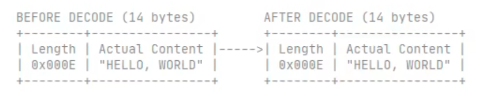
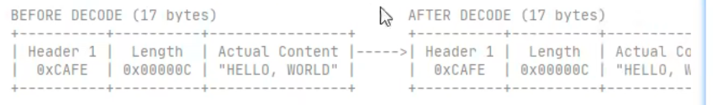
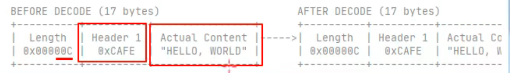
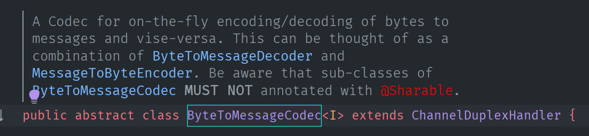
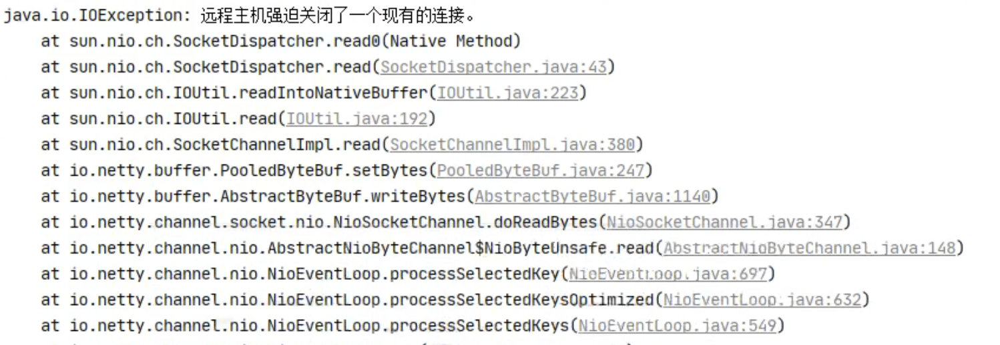

三. Netty 进阶

## 1. 粘包与半包

### 1.1 粘包现象

服务端代码

服务端代码没什么特别的，需要注意的地方就是第13行，我们添加了一个日志打印的处理器，剩下的不必要关心（因为本来服务器需要注意的就是自己的业务逻辑）    

```java
public class HelloWorldServer {
    static final Logger log = LoggerFactory.getLogger(HelloWorldServer.class);
    void start() {
        NioEventLoopGroup boss = new NioEventLoopGroup(1);
        NioEventLoopGroup worker = new NioEventLoopGroup();
        try {
            ServerBootstrap serverBootstrap = new ServerBootstrap();
            serverBootstrap.channel(NioServerSocketChannel.class);
            serverBootstrap.group(boss, worker);
            serverBootstrap.childHandler(new ChannelInitializer<SocketChannel>() {
                @Override
                protected void initChannel(SocketChannel ch) throws Exception {
                    ch.pipeline().addLast(new LoggingHandler(LogLevel.DEBUG));
                    ch.pipeline().addLast(new ChannelInboundHandlerAdapter() {
                        @Override
                        public void channelActive(ChannelHandlerContext ctx) throws Exception {
                            log.debug("connected {}", ctx.channel());
                            super.channelActive(ctx);
                        }

                        @Override
                        public void channelInactive(ChannelHandlerContext ctx) throws Exception {
                            log.debug("disconnect {}", ctx.channel());
                            super.channelInactive(ctx);
                        }
                    });
                }
            });
            ChannelFuture channelFuture = serverBootstrap.bind(8080);
            log.debug("{} binding...", channelFuture.channel());
            channelFuture.sync();
            log.debug("{} bound...", channelFuture.channel());
            channelFuture.channel().closeFuture().sync();
        } catch (InterruptedException e) {
            log.error("server error", e);
        } finally {
            boss.shutdownGracefully();
            worker.shutdownGracefully();
            log.debug("stoped");
        }
    }

    public static void main(String[] args) {
        new HelloWorldServer().start();
    }
}
```

客户端代码希望发送 10 个消息，每个消息是 16 字节

```java
public class HelloWorldClient {
    static final Logger log = LoggerFactory.getLogger(HelloWorldClient.class);
    public static void main(String[] args) {
        NioEventLoopGroup worker = new NioEventLoopGroup();
        try {
            Bootstrap bootstrap = new Bootstrap();
            bootstrap.channel(NioSocketChannel.class);
            bootstrap.group(worker);
            bootstrap.handler(new ChannelInitializer<SocketChannel>() {
                @Override
                protected void initChannel(SocketChannel ch) throws Exception {
                    log.debug("connetted...");
                    ch.pipeline().addLast(new ChannelInboundHandlerAdapter() {
                        @Override
                      	// 当连接建立的时候执行这个方法
                        public void channelActive(ChannelHandlerContext ctx) throws Exception {
                            log.debug("sending...");
                            Random r = new Random();
                            char c = 'a';
                          	// 客户端直接发送10次大小为16个字节的数据
                            for (int i = 0; i < 10; i++) {
                                ByteBuf buffer = ctx.alloc().buffer();
                                buffer.writeBytes(new byte[]{0, 1, 2, 3, 4, 5, 6, 7, 8, 9, 10, 11, 12, 13, 14, 15});
                                ctx.writeAndFlush(buffer);
                            }
                        }
                    });
                }
            });
          	// 因为connect是异步方法，所以等待同步
            ChannelFuture channelFuture = bootstrap.connect("127.0.0.1", 8080).sync();
          	// 同样关闭也用异步方法，通过同步的方法
            channelFuture.channel().closeFuture().sync();

        } catch (InterruptedException e) {
            log.error("client error", e);
        } finally {
            worker.shutdownGracefully();
        }
    }
}
```

服务器端的某次输出，可以看到一次就接收了 160 个字节，而非分 10 次接收，这里就是粘包的现象

```
08:24:46 [DEBUG] [main] c.i.n.HelloWorldServer - [id: 0x81e0fda5] binding...
08:24:46 [DEBUG] [main] c.i.n.HelloWorldServer - [id: 0x81e0fda5, L:/0:0:0:0:0:0:0:0:8080] bound...
08:24:55 [DEBUG] [nioEventLoopGroup-3-1] i.n.h.l.LoggingHandler - [id: 0x94132411, L:/127.0.0.1:8080 - R:/127.0.0.1:58177] REGISTERED
08:24:55 [DEBUG] [nioEventLoopGroup-3-1] i.n.h.l.LoggingHandler - [id: 0x94132411, L:/127.0.0.1:8080 - R:/127.0.0.1:58177] ACTIVE
08:24:55 [DEBUG] [nioEventLoopGroup-3-1] c.i.n.HelloWorldServer - connected [id: 0x94132411, L:/127.0.0.1:8080 - R:/127.0.0.1:58177]
08:24:55 [DEBUG] [nioEventLoopGroup-3-1] i.n.h.l.LoggingHandler - [id: 0x94132411, L:/127.0.0.1:8080 - R:/127.0.0.1:58177] READ: 160B
         +-------------------------------------------------+
         |  0  1  2  3  4  5  6  7  8  9  a  b  c  d  e  f |
+--------+-------------------------------------------------+----------------+
|00000000| 00 01 02 03 04 05 06 07 08 09 0a 0b 0c 0d 0e 0f |................|
|00000010| 00 01 02 03 04 05 06 07 08 09 0a 0b 0c 0d 0e 0f |................|
|00000020| 00 01 02 03 04 05 06 07 08 09 0a 0b 0c 0d 0e 0f |................|
|00000030| 00 01 02 03 04 05 06 07 08 09 0a 0b 0c 0d 0e 0f |................|
|00000040| 00 01 02 03 04 05 06 07 08 09 0a 0b 0c 0d 0e 0f |................|
|00000050| 00 01 02 03 04 05 06 07 08 09 0a 0b 0c 0d 0e 0f |................|
|00000060| 00 01 02 03 04 05 06 07 08 09 0a 0b 0c 0d 0e 0f |................|
|00000070| 00 01 02 03 04 05 06 07 08 09 0a 0b 0c 0d 0e 0f |................|
|00000080| 00 01 02 03 04 05 06 07 08 09 0a 0b 0c 0d 0e 0f |................|
|00000090| 00 01 02 03 04 05 06 07 08 09 0a 0b 0c 0d 0e 0f |................|
+--------+-------------------------------------------------+----------------+
08:24:55 [DEBUG] [nioEventLoopGroup-3-1] i.n.h.l.LoggingHandler - [id: 0x94132411, L:/127.0.0.1:8080 - R:/127.0.0.1:58177] READ COMPLETE
```


### 1.2 半包现象

客户端代码希望发送 1 个消息，这个消息是 160 字节，代码改为

```java
ByteBuf buffer = ctx.alloc().buffer();

// 一共添加160个字节的数据到buffer里面
for (int i = 0; i < 10; i++) {
    buffer.writeBytes(new byte[]{0, 1, 2, 3, 4, 5, 6, 7, 8, 9, 10, 11, 12, 13, 14, 15});
}

// 一次性都写进去
ctx.writeAndFlush(buffer);
```

为现象明显，服务端修改一下接收缓冲区，其它代码不变，服务端接收缓冲区小了，就可以看到半包现象了

```java
serverBootstrap.option(ChannelOption.SO_RCVBUF, 10);
```

服务器端的某次输出，可以看到接收的消息被分为两节，第一次 20 字节，第二次 140 字节，明显出现了半包现象

```
08:43:49 [DEBUG] [main] c.i.n.HelloWorldServer - [id: 0x4d6c6a84] binding...
08:43:49 [DEBUG] [main] c.i.n.HelloWorldServer - [id: 0x4d6c6a84, L:/0:0:0:0:0:0:0:0:8080] bound...
08:44:23 [DEBUG] [nioEventLoopGroup-3-1] i.n.h.l.LoggingHandler - [id: 0x1719abf7, L:/127.0.0.1:8080 - R:/127.0.0.1:59221] REGISTERED
08:44:23 [DEBUG] [nioEventLoopGroup-3-1] i.n.h.l.LoggingHandler - [id: 0x1719abf7, L:/127.0.0.1:8080 - R:/127.0.0.1:59221] ACTIVE
08:44:23 [DEBUG] [nioEventLoopGroup-3-1] c.i.n.HelloWorldServer - connected [id: 0x1719abf7, L:/127.0.0.1:8080 - R:/127.0.0.1:59221]
08:44:24 [DEBUG] [nioEventLoopGroup-3-1] i.n.h.l.LoggingHandler - [id: 0x1719abf7, L:/127.0.0.1:8080 - R:/127.0.0.1:59221] READ: 20B
         +-------------------------------------------------+
         |  0  1  2  3  4  5  6  7  8  9  a  b  c  d  e  f |
+--------+-------------------------------------------------+----------------+
|00000000| 00 01 02 03 04 05 06 07 08 09 0a 0b 0c 0d 0e 0f |................|
|00000010| 00 01 02 03                                     |....            |
+--------+-------------------------------------------------+----------------+
08:44:24 [DEBUG] [nioEventLoopGroup-3-1] i.n.h.l.LoggingHandler - [id: 0x1719abf7, L:/127.0.0.1:8080 - R:/127.0.0.1:59221] READ COMPLETE
08:44:24 [DEBUG] [nioEventLoopGroup-3-1] i.n.h.l.LoggingHandler - [id: 0x1719abf7, L:/127.0.0.1:8080 - R:/127.0.0.1:59221] READ: 140B
         +-------------------------------------------------+
         |  0  1  2  3  4  5  6  7  8  9  a  b  c  d  e  f |
+--------+-------------------------------------------------+----------------+
|00000000| 04 05 06 07 08 09 0a 0b 0c 0d 0e 0f 00 01 02 03 |................|
|00000010| 04 05 06 07 08 09 0a 0b 0c 0d 0e 0f 00 01 02 03 |................|
|00000020| 04 05 06 07 08 09 0a 0b 0c 0d 0e 0f 00 01 02 03 |................|
|00000030| 04 05 06 07 08 09 0a 0b 0c 0d 0e 0f 00 01 02 03 |................|
|00000040| 04 05 06 07 08 09 0a 0b 0c 0d 0e 0f 00 01 02 03 |................|
|00000050| 04 05 06 07 08 09 0a 0b 0c 0d 0e 0f 00 01 02 03 |................|
|00000060| 04 05 06 07 08 09 0a 0b 0c 0d 0e 0f 00 01 02 03 |................|
|00000070| 04 05 06 07 08 09 0a 0b 0c 0d 0e 0f 00 01 02 03 |................|
|00000080| 04 05 06 07 08 09 0a 0b 0c 0d 0e 0f             |............    |
+--------+-------------------------------------------------+----------------+
08:44:24 [DEBUG] [nioEventLoopGroup-3-1] i.n.h.l.LoggingHandler - [id: 0x1719abf7, L:/127.0.0.1:8080 - R:/127.0.0.1:59221] READ COMPLETE
```

> **注意**
>
> serverBootstrap.option(ChannelOption.SO_RCVBUF, 10) 影响的底层接收缓冲区（即滑动窗口）大小，仅决定了 netty 读取的最小单位，netty 实际每次读取的一般是它的整数倍


>   其实我们应该知道，就算我们不用nio或者netty，只要我们使用tcp，就会出现粘包半包问题，哪怕是用最原始的socket，也会出现粘包半包问题，使用udp不会出现问题


### 1.3 现象分析

粘包（一次性接收到了多条数据）

* 现象，发送 abc def，接收 abcdef
* 原因
  * 应用层：接收方 ByteBuf 设置太大（Netty 默认 1024），（太大导致一个ByteBuf里面放了很多条消息）
  * 滑动窗口：假设发送方 256 bytes 表示一个完整报文，但由于接收方处理不及时且窗口大小足够大，这 256 bytes 字节就会缓冲在接收方的滑动窗口中，当滑动窗口中缓冲了多个报文就会粘包
  * Nagle 算法：会造成粘包

半包（有时候接收到了消息的一部分）

* 现象，发送 abcdef，接收 abc def
* 原因
  * 应用层：接收方 ByteBuf 小于实际发送数据量（一个ByteBuf里面当前容量放不下一个消息，自然就是半包）
  * 滑动窗口：假设接收方的窗口只剩了 128 bytes，发送方的报文大小是 256 bytes，这时放不下了，只能先发送前 128 bytes，等待 ack 后才能发送剩余部分，这就造成了半包
  * MSS 限制：当发送的数据超过 MSS 限制后，会将数据切分发送，就会造成半包


所以原因可能出现在应用层和传输层，应用层就是netty的ByteBuf大小不合适，传输层就是滑动窗口的大小不合适


**本质是因为 TCP 是流式协议，消息无边界**

注意TCP消息无边界


> 滑动窗口
>
> * TCP 以一个段（segment）为单位，每发送一个段就需要进行一次确认应答（ack）处理，但如果这么做，缺点是包的往返时间越长性能就越差
>
>   
>
> 
>
> * 很明显，上面的方法使得发送请求变成了串行执行的，这显然效率很低，所以为了解决此问题，引入了窗口概念，窗口大小即决定了无需等待应答而可以继续发送的数据最大值，窗口范围内部的请求可以不用等待之前的请求是否收到请求而直接发送请求，如果有响应回来，窗口就会移动，这样就会继续发送新的请求。
>
>   * 举例：现在窗口大小只支持4个字节的数据发送，并且每次发送一个字节，那么第2个字节发送的时候不会因为第1个字节没有收到响应而不发送，也就是说这4个字节的数据的发送不会互相干扰，此时如果有第5个字节也想发送，这时候肯定发送不了，因为窗口只有4个那么大，此时如果第1个字节的响应回来了，这时候窗口就可以移动了，此时第5个字节就在窗口里面了，第5个字节也可以发了，其他的同理
>
>   
>
> * 窗口实际就起到一个缓冲区的作用，同时也能起到流量控制的作用
>
>   * 图中深色的部分即要发送的数据，高亮的部分即窗口
>   * 窗口内的数据才允许被发送，当应答未到达前，窗口必须停止滑动
>   * 如果 1001~2000 这个段的数据 ack 回来了，窗口就可以向前滑动
>   * 接收方也会维护一个窗口，只有落在窗口内的数据才能允许接收
>


#### 💡 滑动窗口和粘包半包有关系吗

我们在上面了解到，接收方也是会维护一个窗口的。

先说粘包：假如说这个窗口很大，大到甚至几条消息都在一个窗口里，那么服务端正常接受的话，自然会收到粘包的消息

再说半包：假如说这个窗口接收到一条消息的一半，这时候服务端缓冲区的内容被读了，自然读到的是半包的消息。


>  MSS 限制
>
>  * 链路层对一次能够发送的最大数据有限制，这个限制称之为 MTU（maximum transmission unit），不同的链路设备的 MTU 值也有所不同，例如
>
>   * 以太网的 MTU 是 1500
>   * FDDI（光纤分布式数据接口）的 MTU 是 4352
>   * 本地回环地址的 MTU 是 65535 - 本地测试不走网卡
>
>  * MSS 是最大段长度（maximum segment size），它是 MTU 刨去 tcp 头和 ip 头后剩余能够作为数据传输的字节数
>
>   * ipv4 tcp 头占用 20 bytes，ip 头占用 20 bytes，因此以太网 MSS 的值为 1500 - 40 = 1460
>   * TCP 在传递大量数据时，会按照 MSS 大小将数据进行分割发送
>   * MSS 的值在三次握手时通知对方自己 MSS 的值，然后在两者之间选择一个小值作为 MSS
>
>   


> Nagle 算法
>
> * 即使发送一个字节，也需要加入 tcp 头和 ip 头，也就是总字节数会使用 41 bytes，非常不经济。因此为了提高网络利用率，tcp 希望尽可能发送足够大的数据，这就是 Nagle 算法产生的缘由
> * 该算法是指发送端即使还有应该发送的数据，但如果这部分数据很少的话，则进行延迟发送
>   * 如果 SO_SNDBUF 的数据达到 MSS，则需要发送
>   * 如果 SO_SNDBUF 中含有 FIN（表示需要连接关闭）这时将剩余数据发送，再关闭
>   * 如果 TCP_NODELAY = true，则需要发送
>   * 已发送的数据都收到 ack 时，则需要发送
>   * 上述条件不满足，但发生超时（一般为 200ms）则需要发送
>   * 除上述情况，延迟发送


### 1.4 解决方案

1. 短链接，发一个包建立一次连接，这样连接建立到连接断开之间就是消息的边界，缺点效率太低
2. 每一条消息采用固定长度，缺点浪费空间
3. 每一条消息采用分隔符，例如 \n，缺点需要转义
4. 每一条消息分为 head 和 body，head 中包含 body 的长度


#### 方法1，短链接

以解决粘包为例，客户端每次发完消息之后就关闭连接

```java
public class HelloWorldClient {
    static final Logger log = LoggerFactory.getLogger(HelloWorldClient.class);

    public static void main(String[] args) {
        // 分 10 次发送
        for (int i = 0; i < 10; i++) {
            send();
        }
    }

    private static void send() {
        NioEventLoopGroup worker = new NioEventLoopGroup();
        try {
            Bootstrap bootstrap = new Bootstrap();
            bootstrap.channel(NioSocketChannel.class);
            bootstrap.group(worker);
            bootstrap.handler(new ChannelInitializer<SocketChannel>() {
                @Override
                protected void initChannel(SocketChannel ch) throws Exception {
                    log.debug("conneted...");
                    ch.pipeline().addLast(new LoggingHandler(LogLevel.DEBUG));
                    ch.pipeline().addLast(new ChannelInboundHandlerAdapter() {
                        @Override
                        public void channelActive(ChannelHandlerContext ctx) throws Exception {
                            log.debug("sending...");
                            ByteBuf buffer = ctx.alloc().buffer();
                            buffer.writeBytes(new byte[]{0, 1, 2, 3, 4, 5, 6, 7, 8, 9, 10, 11, 12, 13, 14, 15});
                            ctx.writeAndFlush(buffer);
                            // 发完即关
                            ctx.close();
                        }
                    });
                }
            });
            ChannelFuture channelFuture = bootstrap.connect("localhost", 8080).sync();
            channelFuture.channel().closeFuture().sync();

        } catch (InterruptedException e) {
            log.error("client error", e);
        } finally {
            worker.shutdownGracefully();
        }
    }
}
```

输出，略

> 半包用这种办法还是不好解决，因为接收方的缓冲区大小是有限的，短连接配合足够大的缓冲区可以解决粘包问题，因为有客户端连接作为消息边界。


#### 方法2，固定长度

让所有数据包长度固定（假设长度为 8 字节），服务器端加入

```java
ch.pipeline().addLast(new FixedLengthFrameDecoder(8));
```

客户端测试代码，注意, 采用这种方法后，客户端什么时候 flush 都可以

```java
public class HelloWorldClient {
    static final Logger log = LoggerFactory.getLogger(HelloWorldClient.class);

    public static void main(String[] args) {
        NioEventLoopGroup worker = new NioEventLoopGroup();
        try {
            Bootstrap bootstrap = new Bootstrap();
            bootstrap.channel(NioSocketChannel.class);
            bootstrap.group(worker);
            bootstrap.handler(new ChannelInitializer<SocketChannel>() {
                @Override
                protected void initChannel(SocketChannel ch) throws Exception {
                    log.debug("connetted...");
                    ch.pipeline().addLast(new LoggingHandler(LogLevel.DEBUG));
                    ch.pipeline().addLast(new ChannelInboundHandlerAdapter() {
                        @Override
                        public void channelActive(ChannelHandlerContext ctx) throws Exception {
                            log.debug("sending...");
                            // 发送内容随机的数据包
                            Random r = new Random();
                            char c = 'a';
                            ByteBuf buffer = ctx.alloc().buffer();
                            for (int i = 0; i < 10; i++) {
                                byte[] bytes = new byte[8];
                                for (int j = 0; j < r.nextInt(8); j++) {
                                    bytes[j] = (byte) c;
                                }
                                c++;
                              	// 把所有要发送的数据都放到buffer里面
                              	// 这时可能客户端可能已经有了粘包问题，但是服务端是
																// 定长解析，所以客户端的粘包不影响服务端定长的接收
                                buffer.writeBytes(bytes);
                            }
                            ctx.writeAndFlush(buffer);
                        }
                    });
                }
            });
            ChannelFuture channelFuture = bootstrap.connect("192.168.0.103", 9090).sync();
            channelFuture.channel().closeFuture().sync();

        } catch (InterruptedException e) {
            log.error("client error", e);
        } finally {
            worker.shutdownGracefully();
        }
    }
}
```

服务端代码

```java
public class Server2 {
    void start() {
        NioEventLoopGroup boss = new NioEventLoopGroup();
        NioEventLoopGroup worker = new NioEventLoopGroup();
        try {
            ServerBootstrap serverBootstrap = new ServerBootstrap();
            serverBootstrap.channel(NioServerSocketChannel.class);
            // 调整系统的接收缓冲区（滑动窗口）
//            serverBootstrap.option(ChannelOption.SO_RCVBUF, 10);
            // 调整 netty 的接收缓冲区（byteBuf）
            serverBootstrap.childOption(ChannelOption.RCVBUF_ALLOCATOR, new AdaptiveRecvByteBufAllocator(16, 16, 16));
            serverBootstrap.group(boss, worker);
            serverBootstrap.childHandler(new ChannelInitializer<SocketChannel>() {
                @Override
                protected void initChannel(SocketChannel ch) throws Exception {
                    // 这里添加了定长解码器，与客户端约定好长度为10，所以服务端会10个10个的接收消息，确保不会半包粘包
                    ch.pipeline().addLast(new FixedLengthFrameDecoder(10));
                    ch.pipeline().addLast(new LoggingHandler(LogLevel.DEBUG));
                }
            });
            ChannelFuture channelFuture = serverBootstrap.bind(8080).sync();
            channelFuture.channel().closeFuture().sync();
        } catch (InterruptedException e) {
            log.error("server error", e);
        } finally {
            boss.shutdownGracefully();
            worker.shutdownGracefully();
        }
    }

    public static void main(String[] args) {
        new Server2().start();
    }
}
```


客户端输出

```
12:07:00 [DEBUG] [nioEventLoopGroup-2-1] c.i.n.HelloWorldClient - connetted...
12:07:00 [DEBUG] [nioEventLoopGroup-2-1] i.n.h.l.LoggingHandler - [id: 0x3c2ef3c2] REGISTERED
12:07:00 [DEBUG] [nioEventLoopGroup-2-1] i.n.h.l.LoggingHandler - [id: 0x3c2ef3c2] CONNECT: /192.168.0.103:9090
12:07:00 [DEBUG] [nioEventLoopGroup-2-1] i.n.h.l.LoggingHandler - [id: 0x3c2ef3c2, L:/192.168.0.103:53155 - R:/192.168.0.103:9090] ACTIVE
12:07:00 [DEBUG] [nioEventLoopGroup-2-1] c.i.n.HelloWorldClient - sending...
12:07:00 [DEBUG] [nioEventLoopGroup-2-1] i.n.h.l.LoggingHandler - [id: 0x3c2ef3c2, L:/192.168.0.103:53155 - R:/192.168.0.103:9090] WRITE: 80B
         +-------------------------------------------------+
         |  0  1  2  3  4  5  6  7  8  9  a  b  c  d  e  f |
+--------+-------------------------------------------------+----------------+
|00000000| 61 61 61 61 00 00 00 00 62 00 00 00 00 00 00 00 |aaaa....b.......|
|00000010| 63 63 00 00 00 00 00 00 64 00 00 00 00 00 00 00 |cc......d.......|
|00000020| 00 00 00 00 00 00 00 00 66 66 66 66 00 00 00 00 |........ffff....|
|00000030| 67 67 67 00 00 00 00 00 68 00 00 00 00 00 00 00 |ggg.....h.......|
|00000040| 69 69 69 69 69 00 00 00 6a 6a 6a 6a 00 00 00 00 |iiiii...jjjj....|
+--------+-------------------------------------------------+----------------+
12:07:00 [DEBUG] [nioEventLoopGroup-2-1] i.n.h.l.LoggingHandler - [id: 0x3c2ef3c2, L:/192.168.0.103:53155 - R:/192.168.0.103:9090] FLUSH
```

服务端输出

```
12:06:51 [DEBUG] [main] c.i.n.HelloWorldServer - [id: 0xe3d9713f] binding...
12:06:51 [DEBUG] [main] c.i.n.HelloWorldServer - [id: 0xe3d9713f, L:/192.168.0.103:9090] bound...
12:07:00 [DEBUG] [nioEventLoopGroup-3-1] i.n.h.l.LoggingHandler - [id: 0xd739f137, L:/192.168.0.103:9090 - R:/192.168.0.103:53155] REGISTERED
12:07:00 [DEBUG] [nioEventLoopGroup-3-1] i.n.h.l.LoggingHandler - [id: 0xd739f137, L:/192.168.0.103:9090 - R:/192.168.0.103:53155] ACTIVE
12:07:00 [DEBUG] [nioEventLoopGroup-3-1] c.i.n.HelloWorldServer - connected [id: 0xd739f137, L:/192.168.0.103:9090 - R:/192.168.0.103:53155]
12:07:00 [DEBUG] [nioEventLoopGroup-3-1] i.n.h.l.LoggingHandler - [id: 0xd739f137, L:/192.168.0.103:9090 - R:/192.168.0.103:53155] READ: 8B
         +-------------------------------------------------+
         |  0  1  2  3  4  5  6  7  8  9  a  b  c  d  e  f |
+--------+-------------------------------------------------+----------------+
|00000000| 61 61 61 61 00 00 00 00                         |aaaa....        |
+--------+-------------------------------------------------+----------------+
12:07:00 [DEBUG] [nioEventLoopGroup-3-1] i.n.h.l.LoggingHandler - [id: 0xd739f137, L:/192.168.0.103:9090 - R:/192.168.0.103:53155] READ: 8B
         +-------------------------------------------------+
         |  0  1  2  3  4  5  6  7  8  9  a  b  c  d  e  f |
+--------+-------------------------------------------------+----------------+
|00000000| 62 00 00 00 00 00 00 00                         |b.......        |
+--------+-------------------------------------------------+----------------+
12:07:00 [DEBUG] [nioEventLoopGroup-3-1] i.n.h.l.LoggingHandler - [id: 0xd739f137, L:/192.168.0.103:9090 - R:/192.168.0.103:53155] READ: 8B
         +-------------------------------------------------+
         |  0  1  2  3  4  5  6  7  8  9  a  b  c  d  e  f |
+--------+-------------------------------------------------+----------------+
|00000000| 63 63 00 00 00 00 00 00                         |cc......        |
+--------+-------------------------------------------------+----------------+
12:07:00 [DEBUG] [nioEventLoopGroup-3-1] i.n.h.l.LoggingHandler - [id: 0xd739f137, L:/192.168.0.103:9090 - R:/192.168.0.103:53155] READ: 8B
         +-------------------------------------------------+
         |  0  1  2  3  4  5  6  7  8  9  a  b  c  d  e  f |
+--------+-------------------------------------------------+----------------+
|00000000| 64 00 00 00 00 00 00 00                         |d.......        |
+--------+-------------------------------------------------+----------------+
12:07:00 [DEBUG] [nioEventLoopGroup-3-1] i.n.h.l.LoggingHandler - [id: 0xd739f137, L:/192.168.0.103:9090 - R:/192.168.0.103:53155] READ: 8B
         +-------------------------------------------------+
         |  0  1  2  3  4  5  6  7  8  9  a  b  c  d  e  f |
+--------+-------------------------------------------------+----------------+
|00000000| 00 00 00 00 00 00 00 00                         |........        |
+--------+-------------------------------------------------+----------------+
12:07:00 [DEBUG] [nioEventLoopGroup-3-1] i.n.h.l.LoggingHandler - [id: 0xd739f137, L:/192.168.0.103:9090 - R:/192.168.0.103:53155] READ: 8B
         +-------------------------------------------------+
         |  0  1  2  3  4  5  6  7  8  9  a  b  c  d  e  f |
+--------+-------------------------------------------------+----------------+
|00000000| 66 66 66 66 00 00 00 00                         |ffff....        |
+--------+-------------------------------------------------+----------------+
12:07:00 [DEBUG] [nioEventLoopGroup-3-1] i.n.h.l.LoggingHandler - [id: 0xd739f137, L:/192.168.0.103:9090 - R:/192.168.0.103:53155] READ: 8B
         +-------------------------------------------------+
         |  0  1  2  3  4  5  6  7  8  9  a  b  c  d  e  f |
+--------+-------------------------------------------------+----------------+
|00000000| 67 67 67 00 00 00 00 00                         |ggg.....        |
+--------+-------------------------------------------------+----------------+
12:07:00 [DEBUG] [nioEventLoopGroup-3-1] i.n.h.l.LoggingHandler - [id: 0xd739f137, L:/192.168.0.103:9090 - R:/192.168.0.103:53155] READ: 8B
         +-------------------------------------------------+
         |  0  1  2  3  4  5  6  7  8  9  a  b  c  d  e  f |
+--------+-------------------------------------------------+----------------+
|00000000| 68 00 00 00 00 00 00 00                         |h.......        |
+--------+-------------------------------------------------+----------------+
12:07:00 [DEBUG] [nioEventLoopGroup-3-1] i.n.h.l.LoggingHandler - [id: 0xd739f137, L:/192.168.0.103:9090 - R:/192.168.0.103:53155] READ: 8B
         +-------------------------------------------------+
         |  0  1  2  3  4  5  6  7  8  9  a  b  c  d  e  f |
+--------+-------------------------------------------------+----------------+
|00000000| 69 69 69 69 69 00 00 00                         |iiiii...        |
+--------+-------------------------------------------------+----------------+
12:07:00 [DEBUG] [nioEventLoopGroup-3-1] i.n.h.l.LoggingHandler - [id: 0xd739f137, L:/192.168.0.103:9090 - R:/192.168.0.103:53155] READ: 8B
         +-------------------------------------------------+
         |  0  1  2  3  4  5  6  7  8  9  a  b  c  d  e  f |
+--------+-------------------------------------------------+----------------+
|00000000| 6a 6a 6a 6a 00 00 00 00                         |jjjj....        |
+--------+-------------------------------------------------+----------------+
12:07:00 [DEBUG] [nioEventLoopGroup-3-1] i.n.h.l.LoggingHandler - [id: 0xd739f137, L:/192.168.0.103:9090 - R:/192.168.0.103:53155] READ COMPLETE
```

虽然完全解决了粘包半包的问题，但是浪费了很多空间，而且定长的处理是通过服务器的 `FixedLengthFrameDecoder` 这个定长解码处理器来解决的，自己写任何代码


缺点是，数据包的大小不好把握

* 长度定的太大，浪费
* 长度定的太小，对某些数据包又显得不够


#### 方法3，固定分隔符

服务端加入，默认以 \n 或 \r\n 作为分隔符，如果超出指定长度仍未出现分隔符，则抛出异常

```java
ch.pipeline().addLast(new LineBasedFrameDecoder(1024));
```

客户端在每条消息之后，加入 \n 分隔符

```java
public class Client3 {
    static final Logger log = LoggerFactory.getLogger(Client1.class);

    public static void main(String[] args) {
        send();
        System.out.println("finish");
    }

    public static StringBuilder makeString(char c, int len) {
        StringBuilder sb = new StringBuilder(len + 2);
        for (int i = 0; i < len; i++) {
            sb.append(c);
        }
        // 往要发送的消息末尾添加一个换行符
        sb.append("\n");
        return sb;
    }

    private static void send() {
        NioEventLoopGroup worker = new NioEventLoopGroup();
        try {
            Bootstrap bootstrap = new Bootstrap();
            bootstrap.channel(NioSocketChannel.class);
            bootstrap.group(worker);
            bootstrap.handler(new ChannelInitializer<SocketChannel>() {
                @Override
                protected void initChannel(SocketChannel ch) {
                    ch.pipeline().addLast(new LoggingHandler(LogLevel.DEBUG));
                    ch.pipeline().addLast(new ChannelInboundHandlerAdapter() {
                        // 会在连接 channel 建立成功后，会触发 active 事件
                        @Override
                        public void channelActive(ChannelHandlerContext ctx) {
                            ByteBuf buf = ctx.alloc().buffer();
                            char c = '0';
                            Random r = new Random();
                            for (int i = 0; i < 10; i++) {
                                StringBuilder sb = makeString(c, r.nextInt(256) + 1);
                                c++;
                                buf.writeBytes(sb.toString().getBytes());
                            }
                            ctx.writeAndFlush(buf);
                        }
                    });
                }
            });
            ChannelFuture channelFuture = bootstrap.connect("127.0.0.1", 8080).sync();
            channelFuture.channel().closeFuture().sync();
        } catch (InterruptedException e) {
            log.error("client error", e);
        } finally {
            worker.shutdownGracefully();
        }
    }
}
```

客户端输出

```
14:08:18 [DEBUG] [nioEventLoopGroup-2-1] c.i.n.HelloWorldClient - connetted...
14:08:18 [DEBUG] [nioEventLoopGroup-2-1] i.n.h.l.LoggingHandler - [id: 0x1282d755] REGISTERED
14:08:18 [DEBUG] [nioEventLoopGroup-2-1] i.n.h.l.LoggingHandler - [id: 0x1282d755] CONNECT: /192.168.0.103:9090
14:08:18 [DEBUG] [nioEventLoopGroup-2-1] i.n.h.l.LoggingHandler - [id: 0x1282d755, L:/192.168.0.103:63641 - R:/192.168.0.103:9090] ACTIVE
14:08:18 [DEBUG] [nioEventLoopGroup-2-1] c.i.n.HelloWorldClient - sending...
14:08:18 [DEBUG] [nioEventLoopGroup-2-1] i.n.h.l.LoggingHandler - [id: 0x1282d755, L:/192.168.0.103:63641 - R:/192.168.0.103:9090] WRITE: 60B
         +-------------------------------------------------+
         |  0  1  2  3  4  5  6  7  8  9  a  b  c  d  e  f |
+--------+-------------------------------------------------+----------------+
|00000000| 61 0a 62 62 62 0a 63 63 63 0a 64 64 0a 65 65 65 |a.bbb.ccc.dd.eee|
|00000010| 65 65 65 65 65 65 65 0a 66 66 0a 67 67 67 67 67 |eeeeeee.ff.ggggg|
|00000020| 67 67 0a 68 68 68 68 0a 69 69 69 69 69 69 69 0a |gg.hhhh.iiiiiii.|
|00000030| 6a 6a 6a 6a 6a 6a 6a 6a 6a 6a 6a 0a             |jjjjjjjjjjj.    |
+--------+-------------------------------------------------+----------------+
14:08:18 [DEBUG] [nioEventLoopGroup-2-1] i.n.h.l.LoggingHandler - [id: 0x1282d755, L:/192.168.0.103:63641 - R:/192.168.0.103:9090] FLUSH
```


服务端输出

```
14:08:18 [DEBUG] [nioEventLoopGroup-3-5] c.i.n.HelloWorldServer - connected [id: 0xa4b3be43, L:/192.168.0.103:9090 - R:/192.168.0.103:63641]
14:08:18 [DEBUG] [nioEventLoopGroup-3-5] i.n.h.l.LoggingHandler - [id: 0xa4b3be43, L:/192.168.0.103:9090 - R:/192.168.0.103:63641] READ: 1B
         +-------------------------------------------------+
         |  0  1  2  3  4  5  6  7  8  9  a  b  c  d  e  f |
+--------+-------------------------------------------------+----------------+
|00000000| 61                                              |a               |
+--------+-------------------------------------------------+----------------+
14:08:18 [DEBUG] [nioEventLoopGroup-3-5] i.n.h.l.LoggingHandler - [id: 0xa4b3be43, L:/192.168.0.103:9090 - R:/192.168.0.103:63641] READ: 3B
         +-------------------------------------------------+
         |  0  1  2  3  4  5  6  7  8  9  a  b  c  d  e  f |
+--------+-------------------------------------------------+----------------+
|00000000| 62 62 62                                        |bbb             |
+--------+-------------------------------------------------+----------------+
14:08:18 [DEBUG] [nioEventLoopGroup-3-5] i.n.h.l.LoggingHandler - [id: 0xa4b3be43, L:/192.168.0.103:9090 - R:/192.168.0.103:63641] READ: 3B
         +-------------------------------------------------+
         |  0  1  2  3  4  5  6  7  8  9  a  b  c  d  e  f |
+--------+-------------------------------------------------+----------------+
|00000000| 63 63 63                                        |ccc             |
+--------+-------------------------------------------------+----------------+
14:08:18 [DEBUG] [nioEventLoopGroup-3-5] i.n.h.l.LoggingHandler - [id: 0xa4b3be43, L:/192.168.0.103:9090 - R:/192.168.0.103:63641] READ: 2B
         +-------------------------------------------------+
         |  0  1  2  3  4  5  6  7  8  9  a  b  c  d  e  f |
+--------+-------------------------------------------------+----------------+
|00000000| 64 64                                           |dd              |
+--------+-------------------------------------------------+----------------+
14:08:18 [DEBUG] [nioEventLoopGroup-3-5] i.n.h.l.LoggingHandler - [id: 0xa4b3be43, L:/192.168.0.103:9090 - R:/192.168.0.103:63641] READ: 10B
         +-------------------------------------------------+
         |  0  1  2  3  4  5  6  7  8  9  a  b  c  d  e  f |
+--------+-------------------------------------------------+----------------+
|00000000| 65 65 65 65 65 65 65 65 65 65                   |eeeeeeeeee      |
+--------+-------------------------------------------------+----------------+
14:08:18 [DEBUG] [nioEventLoopGroup-3-5] i.n.h.l.LoggingHandler - [id: 0xa4b3be43, L:/192.168.0.103:9090 - R:/192.168.0.103:63641] READ: 2B
         +-------------------------------------------------+
         |  0  1  2  3  4  5  6  7  8  9  a  b  c  d  e  f |
+--------+-------------------------------------------------+----------------+
|00000000| 66 66                                           |ff              |
+--------+-------------------------------------------------+----------------+
14:08:18 [DEBUG] [nioEventLoopGroup-3-5] i.n.h.l.LoggingHandler - [id: 0xa4b3be43, L:/192.168.0.103:9090 - R:/192.168.0.103:63641] READ: 7B
         +-------------------------------------------------+
         |  0  1  2  3  4  5  6  7  8  9  a  b  c  d  e  f |
+--------+-------------------------------------------------+----------------+
|00000000| 67 67 67 67 67 67 67                            |ggggggg         |
+--------+-------------------------------------------------+----------------+
14:08:18 [DEBUG] [nioEventLoopGroup-3-5] i.n.h.l.LoggingHandler - [id: 0xa4b3be43, L:/192.168.0.103:9090 - R:/192.168.0.103:63641] READ: 4B
         +-------------------------------------------------+
         |  0  1  2  3  4  5  6  7  8  9  a  b  c  d  e  f |
+--------+-------------------------------------------------+----------------+
|00000000| 68 68 68 68                                     |hhhh            |
+--------+-------------------------------------------------+----------------+
14:08:18 [DEBUG] [nioEventLoopGroup-3-5] i.n.h.l.LoggingHandler - [id: 0xa4b3be43, L:/192.168.0.103:9090 - R:/192.168.0.103:63641] READ: 7B
         +-------------------------------------------------+
         |  0  1  2  3  4  5  6  7  8  9  a  b  c  d  e  f |
+--------+-------------------------------------------------+----------------+
|00000000| 69 69 69 69 69 69 69                            |iiiiiii         |
+--------+-------------------------------------------------+----------------+
14:08:18 [DEBUG] [nioEventLoopGroup-3-5] i.n.h.l.LoggingHandler - [id: 0xa4b3be43, L:/192.168.0.103:9090 - R:/192.168.0.103:63641] READ: 11B
         +-------------------------------------------------+
         |  0  1  2  3  4  5  6  7  8  9  a  b  c  d  e  f |
+--------+-------------------------------------------------+----------------+
|00000000| 6a 6a 6a 6a 6a 6a 6a 6a 6a 6a 6a                |jjjjjjjjjjj     |
+--------+-------------------------------------------------+----------------+
14:08:18 [DEBUG] [nioEventLoopGroup-3-5] i.n.h.l.LoggingHandler - [id: 0xa4b3be43, L:/192.168.0.103:9090 - R:/192.168.0.103:63641] READ COMPLETE
```

缺点，处理字符数据比较合适，但如果内容本身包含了分隔符（字节数据常常会有此情况），那么就会解析错误


#### 方法4，预设长度

这里需要提前知道一个东西，一个字节是8个二进制位，表示0~255，一共表示256个数，同样的一个字节也可以表示成2个16进制位，同样表示0~255，也表示256个数。

**又因为网络传输用的最多的是16进制，所以经常用两个16进制位表示一个字节。**


在发送消息前，先约定用定长字节表示接下来数据的长度

即先发消息长度，然后是具体消息

```java
// 最大长度，长度偏移，长度占用字节，长度调整，剥离字节数
ch.pipeline().addLast(new LengthFieldBasedFrameDecoder(1024, 0, 1, 0, 1));

// 最大长度就是一条消息的最大长度
// 长度偏移就是读长度的时候要偏移的量，如果你消息长度写在最开始，那么长度偏移量就是0
// 长度占用字节就是你这个长度用了几个字节表示
// 长度调整就是，如果长度后面不是具体消息，那应该跳过几个字节
// 剥离字节数就是从头剥离几个字节，即从头开始舍弃几个字节，用来舍弃长度等等其他消息
```


比如说这样



- 长度偏移就是0
- 长度占用字节就是2，因为用了两个十六进制位去
- 长度调整是0，因为长度后面就是具体消息内容
- 玻璃字节数这里设置的为0，因为解析完的内容并没有从开头剥离字节，剥离字节数当然也可以设置为2，因为长度字节占了2，舍弃掉2个字节就直接是具体消息内容

你也许有个问题，那具体消息的长度在哪里看呢？别忘了我们设置了 `长度偏移量` 和 `长度占用字节` ，有了这两个我们就可以读到具体消息长度 `0x000C` ，即为12，这个12也就是具体的消息内容长度。


再比如这样



- 长度偏移就是2，因为 `0xCAFE` 占了两个字节，所以长度偏移量就是2
- 长度长用字节是3，因为是6位16进制数，所以是3个字节
- 长度调整是0，因为长度后面就是具体消息
- 剥离字节数这里设置的为0，因为解析完的内容并没有从开头剥离字节，当然剥离字节数这里也可以设置为5，因为剥离5个字节后才是具体的消息内容，2+3=5


再比如这样



- 长度偏移就是0
- 长度长用字节是3
- 长度调整是2，因为长度内容后两个字节才是具体的消息内容
- 剥离字节数这里设置的为0，因为解析完的内容并没有从开头剥离字节，当然剥离字节数这里也可以设置为5，因为剥离5个字节后才是具体的消息内容，2+3=5


客户端代码

```java
public class TestLengthFieldDecoder {
    public static void main(String[] args) {
        EmbeddedChannel channel = new EmbeddedChannel(
            	// 只要设置好对应的参数，就可以完美的完成解析
                new LengthFieldBasedFrameDecoder(
                        1024, 0, 4, 1,4),
                new LoggingHandler(LogLevel.DEBUG)
        );

        //  4 个字节的内容长度， 实际内容
        ByteBuf buffer = ByteBufAllocator.DEFAULT.buffer();
        send(buffer, "Hello, world");
        send(buffer, "Hi!");
        channel.writeInbound(buffer);
    }

    private static void send(ByteBuf buffer, String content) {
        byte[] bytes = content.getBytes(); // 实际内容
        int length = bytes.length; // 实际内容长度
        buffer.writeInt(length);
        buffer.writeByte(1);
        buffer.writeBytes(bytes);
    }
}
```


客户端输出

```
14:37:10 [DEBUG] [nioEventLoopGroup-2-1] c.i.n.HelloWorldClient - connetted...
14:37:10 [DEBUG] [nioEventLoopGroup-2-1] i.n.h.l.LoggingHandler - [id: 0xf0f347b8] REGISTERED
14:37:10 [DEBUG] [nioEventLoopGroup-2-1] i.n.h.l.LoggingHandler - [id: 0xf0f347b8] CONNECT: /192.168.0.103:9090
14:37:10 [DEBUG] [nioEventLoopGroup-2-1] i.n.h.l.LoggingHandler - [id: 0xf0f347b8, L:/192.168.0.103:49979 - R:/192.168.0.103:9090] ACTIVE
14:37:10 [DEBUG] [nioEventLoopGroup-2-1] c.i.n.HelloWorldClient - sending...
14:37:10 [DEBUG] [nioEventLoopGroup-2-1] i.n.h.l.LoggingHandler - [id: 0xf0f347b8, L:/192.168.0.103:49979 - R:/192.168.0.103:9090] WRITE: 97B
         +-------------------------------------------------+
         |  0  1  2  3  4  5  6  7  8  9  a  b  c  d  e  f |
+--------+-------------------------------------------------+----------------+
|00000000| 09 61 61 61 61 61 61 61 61 61 09 62 62 62 62 62 |.aaaaaaaaa.bbbbb|
|00000010| 62 62 62 62 06 63 63 63 63 63 63 08 64 64 64 64 |bbbb.cccccc.dddd|
|00000020| 64 64 64 64 0f 65 65 65 65 65 65 65 65 65 65 65 |dddd.eeeeeeeeeee|
|00000030| 65 65 65 65 0d 66 66 66 66 66 66 66 66 66 66 66 |eeee.fffffffffff|
|00000040| 66 66 02 67 67 02 68 68 0e 69 69 69 69 69 69 69 |ff.gg.hh.iiiiiii|
|00000050| 69 69 69 69 69 69 69 09 6a 6a 6a 6a 6a 6a 6a 6a |iiiiiii.jjjjjjjj|
|00000060| 6a                                              |j               |
+--------+-------------------------------------------------+----------------+
14:37:10 [DEBUG] [nioEventLoopGroup-2-1] i.n.h.l.LoggingHandler - [id: 0xf0f347b8, L:/192.168.0.103:49979 - R:/192.168.0.103:9090] FLUSH
```


服务端输出

```
14:36:50 [DEBUG] [main] c.i.n.HelloWorldServer - [id: 0xdff439d3] binding...
14:36:51 [DEBUG] [main] c.i.n.HelloWorldServer - [id: 0xdff439d3, L:/192.168.0.103:9090] bound...
14:37:10 [DEBUG] [nioEventLoopGroup-3-1] i.n.h.l.LoggingHandler - [id: 0x744f2b47, L:/192.168.0.103:9090 - R:/192.168.0.103:49979] REGISTERED
14:37:10 [DEBUG] [nioEventLoopGroup-3-1] i.n.h.l.LoggingHandler - [id: 0x744f2b47, L:/192.168.0.103:9090 - R:/192.168.0.103:49979] ACTIVE
14:37:10 [DEBUG] [nioEventLoopGroup-3-1] c.i.n.HelloWorldServer - connected [id: 0x744f2b47, L:/192.168.0.103:9090 - R:/192.168.0.103:49979]
14:37:10 [DEBUG] [nioEventLoopGroup-3-1] i.n.h.l.LoggingHandler - [id: 0x744f2b47, L:/192.168.0.103:9090 - R:/192.168.0.103:49979] READ: 9B
         +-------------------------------------------------+
         |  0  1  2  3  4  5  6  7  8  9  a  b  c  d  e  f |
+--------+-------------------------------------------------+----------------+
|00000000| 61 61 61 61 61 61 61 61 61                      |aaaaaaaaa       |
+--------+-------------------------------------------------+----------------+
14:37:10 [DEBUG] [nioEventLoopGroup-3-1] i.n.h.l.LoggingHandler - [id: 0x744f2b47, L:/192.168.0.103:9090 - R:/192.168.0.103:49979] READ: 9B
         +-------------------------------------------------+
         |  0  1  2  3  4  5  6  7  8  9  a  b  c  d  e  f |
+--------+-------------------------------------------------+----------------+
|00000000| 62 62 62 62 62 62 62 62 62                      |bbbbbbbbb       |
+--------+-------------------------------------------------+----------------+
14:37:10 [DEBUG] [nioEventLoopGroup-3-1] i.n.h.l.LoggingHandler - [id: 0x744f2b47, L:/192.168.0.103:9090 - R:/192.168.0.103:49979] READ: 6B
         +-------------------------------------------------+
         |  0  1  2  3  4  5  6  7  8  9  a  b  c  d  e  f |
+--------+-------------------------------------------------+----------------+
|00000000| 63 63 63 63 63 63                               |cccccc          |
+--------+-------------------------------------------------+----------------+
14:37:10 [DEBUG] [nioEventLoopGroup-3-1] i.n.h.l.LoggingHandler - [id: 0x744f2b47, L:/192.168.0.103:9090 - R:/192.168.0.103:49979] READ: 8B
         +-------------------------------------------------+
         |  0  1  2  3  4  5  6  7  8  9  a  b  c  d  e  f |
+--------+-------------------------------------------------+----------------+
|00000000| 64 64 64 64 64 64 64 64                         |dddddddd        |
+--------+-------------------------------------------------+----------------+
14:37:10 [DEBUG] [nioEventLoopGroup-3-1] i.n.h.l.LoggingHandler - [id: 0x744f2b47, L:/192.168.0.103:9090 - R:/192.168.0.103:49979] READ: 15B
         +-------------------------------------------------+
         |  0  1  2  3  4  5  6  7  8  9  a  b  c  d  e  f |
+--------+-------------------------------------------------+----------------+
|00000000| 65 65 65 65 65 65 65 65 65 65 65 65 65 65 65    |eeeeeeeeeeeeeee |
+--------+-------------------------------------------------+----------------+
14:37:10 [DEBUG] [nioEventLoopGroup-3-1] i.n.h.l.LoggingHandler - [id: 0x744f2b47, L:/192.168.0.103:9090 - R:/192.168.0.103:49979] READ: 13B
         +-------------------------------------------------+
         |  0  1  2  3  4  5  6  7  8  9  a  b  c  d  e  f |
+--------+-------------------------------------------------+----------------+
|00000000| 66 66 66 66 66 66 66 66 66 66 66 66 66          |fffffffffffff   |
+--------+-------------------------------------------------+----------------+
14:37:10 [DEBUG] [nioEventLoopGroup-3-1] i.n.h.l.LoggingHandler - [id: 0x744f2b47, L:/192.168.0.103:9090 - R:/192.168.0.103:49979] READ: 2B
         +-------------------------------------------------+
         |  0  1  2  3  4  5  6  7  8  9  a  b  c  d  e  f |
+--------+-------------------------------------------------+----------------+
|00000000| 67 67                                           |gg              |
+--------+-------------------------------------------------+----------------+
14:37:10 [DEBUG] [nioEventLoopGroup-3-1] i.n.h.l.LoggingHandler - [id: 0x744f2b47, L:/192.168.0.103:9090 - R:/192.168.0.103:49979] READ: 2B
         +-------------------------------------------------+
         |  0  1  2  3  4  5  6  7  8  9  a  b  c  d  e  f |
+--------+-------------------------------------------------+----------------+
|00000000| 68 68                                           |hh              |
+--------+-------------------------------------------------+----------------+
14:37:10 [DEBUG] [nioEventLoopGroup-3-1] i.n.h.l.LoggingHandler - [id: 0x744f2b47, L:/192.168.0.103:9090 - R:/192.168.0.103:49979] READ: 14B
         +-------------------------------------------------+
         |  0  1  2  3  4  5  6  7  8  9  a  b  c  d  e  f |
+--------+-------------------------------------------------+----------------+
|00000000| 69 69 69 69 69 69 69 69 69 69 69 69 69 69       |iiiiiiiiiiiiii  |
+--------+-------------------------------------------------+----------------+
14:37:10 [DEBUG] [nioEventLoopGroup-3-1] i.n.h.l.LoggingHandler - [id: 0x744f2b47, L:/192.168.0.103:9090 - R:/192.168.0.103:49979] READ: 9B
         +-------------------------------------------------+
         |  0  1  2  3  4  5  6  7  8  9  a  b  c  d  e  f |
+--------+-------------------------------------------------+----------------+
|00000000| 6a 6a 6a 6a 6a 6a 6a 6a 6a                      |jjjjjjjjj       |
+--------+-------------------------------------------------+----------------+
14:37:10 [DEBUG] [nioEventLoopGroup-3-1] i.n.h.l.LoggingHandler - [id: 0x744f2b47, L:/192.168.0.103:9090 - R:/192.168.0.103:49979] READ COMPLETE

```


不过这种方法很需要根据具体情况，参数的具体设置需要根据你的协议来走，比如你可以自定义长度应该多大，长度偏移量是多少，是否需要长度调整，以及是否需要剥离开头字节，这些都可以根据你自定义协议来填写具体的参数。这里只是给你一个大佬写好的handler能这么处理。嗯，很牛。

这就是LTC解码器，注意LTC解码器读到的正文的长度不够之前读到的消息的长度的时候会进行读，知道读够了


## 2. 协议设计与解析

### 2.1 为什么需要协议？

TCP/IP 中消息传输基于流的方式，没有边界。

协议的目的就是划定消息的边界，制定通信双方要共同遵守的通信规则

例如：在网络上传输

```
下雨天留客天留我不留
```

是中文一句著名的无标点符号句子，在没有标点符号情况下，这句话有数种拆解方式，而意思却是完全不同，所以常被用作讲述标点符号的重要性

一种解读

```
下雨天留客，天留，我不留
```

另一种解读

```
下雨天，留客天，留我不？留
```


如何设计协议呢？其实就是给网络传输的信息加上“标点符号”。但通过分隔符来断句不是很好，因为分隔符本身如果用于传输，那么必须加以区分。因此，下面一种协议较为常用

``` 
定长字节表示内容长度 + 实际内容
```

例如，假设一个中文字符长度为 3，按照上述协议的规则，发送信息方式如下，就不会被接收方弄错意思了

```
0f下雨天留客06天留09我不留
```


> 小故事
>
> 很久很久以前，一位私塾先生到一家任教。双方签订了一纸协议：“无鸡鸭亦可无鱼肉亦可白菜豆腐不可少不得束修金”。此后，私塾先生虽然认真教课，但主人家则总是给私塾先生以白菜豆腐为菜，丝毫未见鸡鸭鱼肉的款待。私塾先生先是很不解，可是后来也就想通了：主人把鸡鸭鱼肉的钱都会换为束修金的，也罢。至此双方相安无事。
>
> 年关将至，一个学年段亦告结束。私塾先生临行时，也不见主人家为他交付束修金，遂与主家理论。然主家亦振振有词：“有协议为证——无鸡鸭亦可，无鱼肉亦可，白菜豆腐不可少，不得束修金。这白纸黑字明摆着的，你有什么要说的呢？”
>
> 私塾先生据理力争：“协议是这样的——无鸡，鸭亦可；无鱼，肉亦可；白菜豆腐不可，少不得束修金。”
>
> 双方唇枪舌战，你来我往，真个是不亦乐乎！
>
> 这里的束修金，也作“束脩”，应当是泛指教师应当得到的报酬


### 2.2 redis 协议举例

比如说你现在要给redis服务器添加这么一个命令， `set name zhangsan` ，按照redis交互协议的格式应该发的是

```java
*3	// 表示有3个字符串
$3	// 命令长度为3
set
$4	// 键长度为4
name
$8	// 值长度为8
zhangsan
```

也就是说你客户端照这个格式发，redis服务器就可以正确接收到你发的命令，这就是redis协议的举例


```java
NioEventLoopGroup worker = new NioEventLoopGroup();
// 这个数组就是存放换行符的两个东东，13是回车，10是换行符，你往
// buf里面写入就这个字节数组就达到换行的效果
byte[] LINE = {13, 10};
try {
    Bootstrap bootstrap = new Bootstrap();
    bootstrap.channel(NioSocketChannel.class);
    bootstrap.group(worker);
    bootstrap.handler(new ChannelInitializer<SocketChannel>() {
        @Override
        protected void initChannel(SocketChannel ch) {
            ch.pipeline().addLast(new LoggingHandler());
            ch.pipeline().addLast(new ChannelInboundHandlerAdapter() {
                // 会在连接 channel 建立成功后，会触发 active 事件
                @Override
                public void channelActive(ChannelHandlerContext ctx) {
                    set(ctx);
                    get(ctx);
                }
                private void get(ChannelHandlerContext ctx) {
                    ByteBuf buf = ctx.alloc().buffer();
                    // 按照redis格式来写入字节流
                    buf.writeBytes("*2".getBytes());
                    // 每次写完都换行
                    buf.writeBytes(LINE);
                    buf.writeBytes("$3".getBytes());
                    buf.writeBytes(LINE);
                    buf.writeBytes("get".getBytes());
                    buf.writeBytes(LINE);
                    buf.writeBytes("$3".getBytes());
                    buf.writeBytes(LINE);
                    buf.writeBytes("aaa".getBytes());
                    buf.writeBytes(LINE);
                    ctx.writeAndFlush(buf);
                }
                private void set(ChannelHandlerContext ctx) {
                    ByteBuf buf = ctx.alloc().buffer();
                    buf.writeBytes("*3".getBytes());
                    buf.writeBytes(LINE);
                    buf.writeBytes("$3".getBytes());
                    buf.writeBytes(LINE);
                    buf.writeBytes("set".getBytes());
                    buf.writeBytes(LINE);
                    buf.writeBytes("$3".getBytes());
                    buf.writeBytes(LINE);
                    buf.writeBytes("aaa".getBytes());
                    buf.writeBytes(LINE);
                    buf.writeBytes("$3".getBytes());
                    buf.writeBytes(LINE);
                    buf.writeBytes("bbb".getBytes());
                    buf.writeBytes(LINE);
                    ctx.writeAndFlush(buf);
                }

                @Override
                public void channelRead(ChannelHandlerContext ctx, Object msg) throws Exception {
                    ByteBuf buf = (ByteBuf) msg;
                    System.out.println(buf.toString(Charset.defaultCharset()));
                }
            });
        }
    });
    // 监听redis的端口号
    ChannelFuture channelFuture = bootstrap.connect("localhost", 6379).sync();
    channelFuture.channel().closeFuture().sync();
} catch (InterruptedException e) {
    log.error("client error", e);
} finally {
    worker.shutdownGracefully();
}
```

可以发现，有了协议，我们对于要发送的消息就可以随便写了，只要符合格式规范


Redis协议可以看的出来消息发的不太紧凑，因为它需要不断的接受换行，这就导致消息里面有好多换行符，这算是一个缺点 


### 2.3 http 协议举例

这个只是一个演示，具体的有不懂的类等用netty处理http请求时候可以再看看

```java
NioEventLoopGroup boss = new NioEventLoopGroup();
NioEventLoopGroup worker = new NioEventLoopGroup();
try {
    ServerBootstrap serverBootstrap = new ServerBootstrap();
    serverBootstrap.channel(NioServerSocketChannel.class);
    serverBootstrap.group(boss, worker);
    serverBootstrap.childHandler(new ChannelInitializer<SocketChannel>() {
        @Override
        protected void initChannel(SocketChannel ch) throws Exception {
            ch.pipeline().addLast(new LoggingHandler(LogLevel.DEBUG));
            // 专门处理Http请求的入站和出站处理器
            ch.pipeline().addLast(new HttpServerCodec());
            // SimpleChannelInboundHandler这个入站处理器，专门处理后面泛型消息的入站处理器
            ch.pipeline().addLast(new SimpleChannelInboundHandler<HttpRequest>() {
                @Override
                protected void channelRead0(ChannelHandlerContext ctx, HttpRequest msg) throws Exception {
                    // 获取请求
                    log.debug(msg.uri());

                    // 返回响应，这里这么写的目的是模拟一个响应
                    DefaultFullHttpResponse response =
                        	// 因为是自己模拟的响应，所以设置一些正常参数，协议版本号，状态码
                            new DefaultFullHttpResponse(msg.protocolVersion(), HttpResponseStatus.OK);

                    byte[] bytes = "<h1>Hello, world!</h1>".getBytes();
					
                    // 给响应头里面设置相应内容长度
                    response.headers().setInt(CONTENT_LENGTH, bytes.length);
                    // 添加响应内容
                    response.content().writeBytes(bytes);

                    // 写回响应
                    ctx.writeAndFlush(response);
                }
            });
            /*ch.pipeline().addLast(new ChannelInboundHandlerAdapter() {
                @Override
                public void channelRead(ChannelHandlerContext ctx, Object msg) throws Exception {
                    log.debug("{}", msg.getClass());

					// HttpServerCodec这个Handler会把Http请求解析成HttpRequest与
					// HttpContent两个内容，我们可以用SimpleChannelInboundHandler这个处理器来
					// 处理特定的类
                    if (msg instanceof HttpRequest) { // 请求行，请求头

                    } else if (msg instanceof HttpContent) { //请求体

                    }
                }
            });*/
        }
    });
    ChannelFuture channelFuture = serverBootstrap.bind(8080).sync();
    channelFuture.channel().closeFuture().sync();
} catch (InterruptedException e) {
    log.error("server error", e);
} finally {
    boss.shutdownGracefully();
    worker.shutdownGracefully();
}
```


### 2.4 自定义协议要素

* 魔数，用来在第一时间判定是否是无效数据包
* 版本号，可以支持协议的升级
* 序列化算法，消息正文到底采用哪种序列化反序列化方式，可以由此扩展，例如：json、protobuf、hessian、jdk
* 指令类型，是登录、注册、单聊、群聊... 跟业务相关
* 请求序号，为了双工通信，提供异步能力
* 正文长度
* 消息正文


有必要注意的一个地方：这些要素里面，**不考虑消息正文，其他的所有要素的大小其实是固定大小的，而且这些要素的总和也是固定大小的，都是提前设计好的**，一般都要为2的整数倍，所以长度如果不够，都需要填充一下，填充到2的整数倍


#### 编解码器

根据上面的要素，设计一个登录请求消息和登录响应消息，并使用 Netty 完成收发

注意Codec表示这个类既可以编码也可以解码，即编码用在出站处理器，解码用于入站处理器

```java
@Slf4j
// Message就是到时候发送和接受的消息的类，
// MessageCodec表示处理Message类的编码与解码
// MessageCodec继承了ByteToMessageCodec这个类就可以作为出站入站的handler了
public class MessageCodec extends ByteToMessageCodec<Message> {

    // 出站的时候进行编码
    @Override
    protected void encode(ChannelHandlerContext ctx, Message msg, ByteBuf out) throws Exception {
        // 1. 4 字节的魔数
        out.writeBytes(new byte[]{1, 2, 3, 4});
        // 2. 1 字节的版本,
        out.writeByte(1);
        // 3. 1 字节的序列化方式 jdk 0 , json 1
        out.writeByte(0);
        // 4. 1 字节的指令类型
        out.writeByte(msg.getMessageType());
        // 5. 4 个字节
        out.writeInt(msg.getSequenceId());
        // 无意义，对齐填充，填充到2的整数倍
        out.writeByte(0xff);
        // 6. 获取内容的字节数组
        ByteArrayOutputStream bos = new ByteArrayOutputStream();
        ObjectOutputStream oos = new ObjectOutputStream(bos);
        oos.writeObject(msg);
        byte[] bytes = bos.toByteArray();
        // 7. 长度
        out.writeInt(bytes.length);
        // 8. 写入内容
        out.writeBytes(bytes);
    }

    // 入站的时候进行解码
    @Override
    protected void decode(ChannelHandlerContext ctx, ByteBuf in, List<Object> out) throws Exception {
        // 读魔数，读取1个int，即读取4个字节
        int magicNum = in.readInt();
        // 读协议版本号，读1个字节
        byte version = in.readByte();
        // 读序列化方式
        byte serializerType = in.readByte();
        // 读消息类型
        byte messageType = in.readByte();
        // 读消息序号
        int sequenceId = in.readInt();
        // 读编码时为了补齐2的整数倍的那个无意义的填充字节
        in.readByte();
        // 读消息长度
        int length = in.readInt();
        byte[] bytes = new byte[length];
        in.readBytes(bytes, 0, length);
        ObjectInputStream ois = new ObjectInputStream(new ByteArrayInputStream(bytes));
        // 把内容反序列化
        Message message = (Message) ois.readObject();
        log.debug("{}, {}, {}, {}, {}, {}", magicNum, version, serializerType, messageType, sequenceId, length);
        log.debug("{}", message);
        // 把对象放到list里面，其他的handler就可以用了
        out.add(message);
    }
}
```

测试

```java
EmbeddedChannel channel = new EmbeddedChannel(
    new LoggingHandler(),
    // 注意要配合ltc使用，不然如果发生半包黏包情况反序列化就会出问题
    new LengthFieldBasedFrameDecoder(
        1024, 12, 4, 0, 0),
    new MessageCodec()
);
// encode
LoginRequestMessage message = new LoginRequestMessage("zhangsan", "123", "张三");
//        channel.writeOutbound(message);
// decode
ByteBuf buf = ByteBufAllocator.DEFAULT.buffer();
new MessageCodec().encode(null, message, buf);

ByteBuf s1 = buf.slice(0, 100);
ByteBuf s2 = buf.slice(100, buf.readableBytes() - 100);
s1.retain(); // 引用计数 2
channel.writeInbound(s1); // release 1
channel.writeInbound(s2);
```


解读


消息正文长度是db，也就是223，数一下消息正文正好是223个字节


#### 💡 什么时候可以加 @Sharable

@Sharable就是表示当前这个handler是否可以共享，如果可以共享，这个handler类就会有这个注解，反之没有


* 当 handler 不保存状态时，就可以安全地在多线程下被共享，

  * 比如日志handler就是不保存状态，仅仅只是一个功能性的，不会保存状态，但是之前学习的ltc这个handler是保存状态的，因为ltc负责半包黏包，它里面会读消息，合并消息，以至于经过ltc这个handler得到的都是完整的消息，但是我们之前学习过，真正干活的都是EventLoop，handler只是他们要干的事，那么假如现在有两个channel，c1与c2，并且假如所有的channel都共用一个ltc处理器，当ltc处理c1的消息的时候，此时的ltc存储的是c1的消息状态，如果c1的消息还没处理完就立马要处理c2的消息的话，此时ltc的状态信息对于c2来说肯定是不正确的，所以为了不发生线程安全的问题，要给每个channel都建立一个ltc，这样每个channel都有一个独立的ltc记录解析的信息的状态，不会发生线程安全问题。
  * 所以ltc处理器是没有@Sharable这个注解的，因为ltc会保存状态，自然不是可共享的handler

* 但要注意对于编解码器类，不能继承 ByteToMessageCodec 或 CombinedChannelDuplexHandler 父类，他们的构造方法对 @Sharable 有限制

  

* 如果能确保编解码器不会保存状态，可以继承 MessageToMessageCodec 父类，简单来说继承了MessageToMessageCodec 这个类就可以当做一个编解码器，并且也是可以共享的处理器

```java
@Slf4j
@ChannelHandler.Sharable
/**
 * 必须和 LengthFieldBasedFrameDecoder 一起使用，确保接到的 ByteBuf 消息是完整的
 */
public class MessageCodecSharable extends MessageToMessageCodec<ByteBuf, Message> {
    @Override
    protected void encode(ChannelHandlerContext ctx, Message msg, List<Object> outList) throws Exception {
        ByteBuf out = ctx.alloc().buffer();
        // 1. 4 字节的魔数
        out.writeBytes(new byte[]{1, 2, 3, 4});
        // 2. 1 字节的版本,
        out.writeByte(1);
        // 3. 1 字节的序列化方式 jdk 0 , json 1
        out.writeByte(0);
        // 4. 1 字节的指令类型
        out.writeByte(msg.getMessageType());
        // 5. 4 个字节
        out.writeInt(msg.getSequenceId());
        // 无意义，对齐填充
        out.writeByte(0xff);
        // 6. 获取内容的字节数组
        ByteArrayOutputStream bos = new ByteArrayOutputStream();
        ObjectOutputStream oos = new ObjectOutputStream(bos);
        oos.writeObject(msg);
        byte[] bytes = bos.toByteArray();
        // 7. 长度
        out.writeInt(bytes.length);
        // 8. 写入内容
        out.writeBytes(bytes);
        outList.add(out);
    }

    @Override
    protected void decode(ChannelHandlerContext ctx, ByteBuf in, List<Object> out) throws Exception {
        int magicNum = in.readInt();
        byte version = in.readByte();
        byte serializerType = in.readByte();
        byte messageType = in.readByte();
        int sequenceId = in.readInt();
        in.readByte();
        int length = in.readInt();
        byte[] bytes = new byte[length];
        in.readBytes(bytes, 0, length);
        ObjectInputStream ois = new ObjectInputStream(new ByteArrayInputStream(bytes));
        Message message = (Message) ois.readObject();
        log.debug("{}, {}, {}, {}, {}, {}", magicNum, version, serializerType, messageType, sequenceId, length);
        log.debug("{}", message);
        out.add(message);
    }
}
```


添加处理器的代码

```java
// 提前声明一个日志处理器
LoggingHandler LOGGING_HANDLER = new LoggingHandler(LogLevel.DEBUG);	
// 因为自己升级过后的编解码器不会存储状态，所以可以让所有channel共享
MessageCodecSharable MESSAGE_CODEC = new MessageCodecSharable();

bootstrap.handler(new ChannelInitializer<SocketChannel>() {
    @Override
    protected void initChannel(SocketChannel ch) throws Exception {
        // 给每个channel都添加一个独立的ltc处理器
        ch.pipeline().addLast(new LengthFieldBasedFrameDecoder(1024, 12, 4, 0, 0));
        // 所有channel共享的日志处理器
        ch.pipeline().addLast(LOGGING_HANDLER);
        // 所有channel共享的编解码处理器
        ch.pipeline().addLast(MESSAGE_CODEC);
    }
});
```


#### 💡 为什么要添加@Sharable

就拿日志处理器，假如百万个连接，即百万个channel，假如每个channel都各自分配一个日志处理器岂不是有点浪费内存？假如百万个channel都用同一个日志处理器，岂不是剩下好多内存？


## 3. 聊天室案例

### 3.1 聊天室业务介绍

```java
/**
 * 用户管理接口
 */
public interface UserService {

    /**
     * 登录
     * @param username 用户名
     * @param password 密码
     * @return 登录成功返回 true, 否则返回 false
     */
    boolean login(String username, String password);
}
```


```java
/**
 * 会话管理接口
 */
public interface Session {

    /**
     * 绑定会话
     * @param channel 哪个 channel 要绑定会话
     * @param username 会话绑定用户
     */
    void bind(Channel channel, String username);

    /**
     * 解绑会话
     * @param channel 哪个 channel 要解绑会话
     */
    void unbind(Channel channel);

    /**
     * 获取属性
     * @param channel 哪个 channel
     * @param name 属性名
     * @return 属性值
     */
    Object getAttribute(Channel channel, String name);

    /**
     * 设置属性
     * @param channel 哪个 channel
     * @param name 属性名
     * @param value 属性值
     */
    void setAttribute(Channel channel, String name, Object value);

    /**
     * 根据用户名获取 channel
     * @param username 用户名
     * @return channel
     */
    Channel getChannel(String username);
}
```


```java
/**
 * 聊天组会话管理接口
 */
public interface GroupSession {

    /**
     * 创建一个聊天组, 如果不存在才能创建成功, 否则返回 null
     * @param name 组名
     * @param members 成员
     * @return 成功时返回组对象, 失败返回 null
     */
    Group createGroup(String name, Set<String> members);

    /**
     * 加入聊天组
     * @param name 组名
     * @param member 成员名
     * @return 如果组不存在返回 null, 否则返回组对象
     */
    Group joinMember(String name, String member);

    /**
     * 移除组成员
     * @param name 组名
     * @param member 成员名
     * @return 如果组不存在返回 null, 否则返回组对象
     */
    Group removeMember(String name, String member);

    /**
     * 移除聊天组
     * @param name 组名
     * @return 如果组不存在返回 null, 否则返回组对象
     */
    Group removeGroup(String name);

    /**
     * 获取组成员
     * @param name 组名
     * @return 成员集合, 没有成员会返回 empty set
     */
    Set<String> getMembers(String name);

    /**
     * 获取组成员的 channel 集合, 只有在线的 channel 才会返回
     * @param name 组名
     * @return 成员 channel 集合
     */
    List<Channel> getMembersChannel(String name);
}
```


### 3.2 聊天室业务-登录

```java
@Slf4j
public class ChatServer {
    public static void main(String[] args) {
        NioEventLoopGroup boss = new NioEventLoopGroup();
        NioEventLoopGroup worker = new NioEventLoopGroup();
        LoggingHandler LOGGING_HANDLER = new LoggingHandler(LogLevel.DEBUG);
        MessageCodecSharable MESSAGE_CODEC = new MessageCodecSharable();
        try {
            ServerBootstrap serverBootstrap = new ServerBootstrap();
            serverBootstrap.channel(NioServerSocketChannel.class);
            serverBootstrap.group(boss, worker);
            serverBootstrap.childHandler(new ChannelInitializer<SocketChannel>() {
                @Override
                protected void initChannel(SocketChannel ch) throws Exception {
                    // 把ltc处理器封装成了ProcotolFrameDecoder这个类
                    // ltc处理半包黏包，处理过后的数据还需经过MESSAGE_CODEC才是具体内存数据
                    ch.pipeline().addLast(new ProcotolFrameDecoder());
                    // 日志处理器
                    ch.pipeline().addLast(LOGGING_HANDLER);
                    // 添加解码器，经过这个解码器得到的就是具体的内存数据了
                    ch.pipeline().addLast(MESSAGE_CODEC);
                    // 注意这里添加的是SimpleChannelInboundHandler这个入站处理器
                    // 这个入站处理器只会处理LoginRequestMessage这种消息
                    ch.pipeline().addLast(new SimpleChannelInboundHandler<LoginRequestMessage>() {
                        @Override
                        protected void channelRead0(ChannelHandlerContext ctx, LoginRequestMessage msg) throws Exception {
                            String username = msg.getUsername();
                            String password = msg.getPassword();
                            boolean login = UserServiceFactory.getUserService().login(username, password);
                            LoginResponseMessage message;
                            if(login) {
                                message = new LoginResponseMessage(true, "登录成功");
                            } else {
                                message = new LoginResponseMessage(false, "用户名或密码不正确");
                            }
                            ctx.writeAndFlush(message);
                        }
                    });
                }
            });
            Channel channel = serverBootstrap.bind(8080).sync().channel();
            channel.closeFuture().sync();
        } catch (InterruptedException e) {
            log.error("server error", e);
        } finally {
            boss.shutdownGracefully();
            worker.shutdownGracefully();
        }
    }
}
```


```java
@Slf4j
public class ChatClient {
    public static void main(String[] args) {
        NioEventLoopGroup group = new NioEventLoopGroup();
        LoggingHandler LOGGING_HANDLER = new LoggingHandler(LogLevel.DEBUG);
        MessageCodecSharable MESSAGE_CODEC = new MessageCodecSharable();
      	// 用倒计时锁来完成nio线程和菜单的线程的通信
      	// 客户端的channelRead方法是由nio线程来干的，用户的输入即菜单线程是新开的线程
      	// 菜单线程需要知道是否登录成功，这就设计到了两个线程的通信，所以这里采用
      	// 倒计时锁来解决通信，即菜单线程等待登录响应状态的时候就阻塞，nio线程得到响应状态的时候就解除菜单线程的阻塞
      	// 减到0就不阻塞了
        CountDownLatch WAIT_FOR_LOGIN = new CountDownLatch(1);
      	// true表示登录成功，false表示登录失败
        AtomicBoolean LOGIN = new AtomicBoolean(false);
        try {
            Bootstrap bootstrap = new Bootstrap();
            bootstrap.channel(NioSocketChannel.class);
            bootstrap.group(group);
            bootstrap.handler(new ChannelInitializer<SocketChannel>() {
                @Override
                protected void initChannel(SocketChannel ch) throws Exception {
                    // 注意Decoder仅仅是一个入站处理器（其实就是ltc），因为只有解码功能
                    // 注意ltc会保存channel里面的状态，所以要每个channel都有一个ltc
                    ch.pipeline().addLast(new ProcotolFrameDecoder());
//                    ch.pipeline().addLast(LOGGING_HANDLER);
                    
                    // 出入站编码器，按照协议编码和解码
                    ch.pipeline().addLast(MESSAGE_CODEC);
                   
                    ch.pipeline().addLast("client handler", new ChannelInboundHandlerAdapter() {
                        // 接收响应消息
                        @Override
                        public void channelRead(ChannelHandlerContext ctx, Object msg) throws Exception {
                            log.debug("msg: {}", msg);
                          	// 如果服务端返回的响应是登录响应的话
                            if ((msg instanceof LoginResponseMessage)) {
                                LoginResponseMessage response = (LoginResponseMessage) msg;
                                if (response.isSuccess()) {
                                    // 如果登录成功
                                    LOGIN.set(true);
                                }
                                // 不管登陆成功或者登录失败，都要唤醒 system in 线程
                              	// 本来是1，减到0就不阻塞了
                                WAIT_FOR_LOGIN.countDown();
                            }
                        }

                        // 在连接建立后触发 active 事件
                        @Override
                        public void channelActive(ChannelHandlerContext ctx) throws Exception {
                            // 负责接收用户在控制台的输入，负责向服务器发送各种消息
                            new Thread(() -> {
                                Scanner scanner = new Scanner(System.in);
                                System.out.println("请输入用户名:");
                                String username = scanner.nextLine();
                                System.out.println("请输入密码:");
                                String password = scanner.nextLine();
                                // 构造消息对象
                                LoginRequestMessage message = new LoginRequestMessage(username, password);
                                // 发送消息
                                // 别忘了发送消息之后会去从当前handler往前遍历前面的出站处理器
                                // 发送的消息会传输到MessageCodec这个出入站处理器经过协议编码
                                ctx.writeAndFlush(message);
                                System.out.println("等待后续操作...");
                                try {
                                  	// 因为需要等待服务端返回登录响应，所以处理用户输入的线程，也就是
                                  	// 菜单线程需要等待服务端返回登录响应
                                    WAIT_FOR_LOGIN.await();
                                } catch (InterruptedException e) {
                                    e.printStackTrace();
                                }
                                // 如果登录失败，就关闭channel
                                if (!LOGIN.get()) {
                                    ctx.channel().close();
                                    return;
                                }
                                while (true) {
                                    System.out.println("==================================");
                                    System.out.println("send [username] [content]");
                                    System.out.println("gsend [group name] [content]");
                                    System.out.println("gcreate [group name] [m1,m2,m3...]");
                                    System.out.println("gmembers [group name]");
                                    System.out.println("gjoin [group name]");
                                    System.out.println("gquit [group name]");
                                    System.out.println("quit");
                                    System.out.println("==================================");
                                    String command = scanner.nextLine();
                                    String[] s = command.split(" ");
                                    switch (s[0]){
                                        case "send":
                                            ctx.writeAndFlush(new ChatRequestMessage(username, s[1], s[2]));
                                            break;
                                        case "gsend":
                                            ctx.writeAndFlush(new GroupChatRequestMessage(username, s[1], s[2]));
                                            break;
                                        case "gcreate":
                                            Set<String> set = new HashSet<>(Arrays.asList(s[2].split(",")));
                                            set.add(username); // 加入自己
                                            ctx.writeAndFlush(new GroupCreateRequestMessage(s[1], set));
                                            break;
                                        case "gmembers":
                                            ctx.writeAndFlush(new GroupMembersRequestMessage(s[1]));
                                            break;
                                        case "gjoin":
                                            ctx.writeAndFlush(new GroupJoinRequestMessage(username, s[1]));
                                            break;
                                        case "gquit":
                                            ctx.writeAndFlush(new GroupQuitRequestMessage(username, s[1]));
                                            break;
                                        case "quit":
                                            ctx.channel().close();
                                            return;
                                    }
                                }
                            }, "system in").start();
                        }
                    });
                }
            });
            Channel channel = bootstrap.connect("localhost", 8080).sync().channel();
            channel.closeFuture().sync();
        } catch (Exception e) {
            log.error("client error", e);
        } finally {
            group.shutdownGracefully();
        }
    }
}
```


### 3.3 聊天室业务-单聊

服务器端将 handler 独立出来，把所有的服务端的 handler 独立出来，服务端添加 handler 的时候就会很优雅了，而且你也可以给 handler 标注是否是 @Sharable 的

登录 handler

```java
@ChannelHandler.Sharable
public class LoginRequestMessageHandler extends SimpleChannelInboundHandler<LoginRequestMessage> {
    @Override
    // 即服务端触发 LoginRequestMessage 这种消息的读事件的时候会调用这个方法
    protected void channelRead0(ChannelHandlerContext ctx, LoginRequestMessage msg) throws Exception {
        String username = msg.getUsername();
        String password = msg.getPassword();
        boolean login = UserServiceFactory.getUserService().login(username, password);
        LoginResponseMessage message;
        if(login) {
            // 登陆成功后绑定名称与channel
            SessionFactory.getSession().bind(ctx.channel(), username);
            message = new LoginResponseMessage(true, "登录成功");
        } else {
            message = new LoginResponseMessage(false, "用户名或密码不正确");
        }
        
        // 并且返回一个 lgionResponseMessage 即登陆响应对象给客户端
        ctx.writeAndFlush(message);
    }
}
```

单聊 handler

```java
@ChannelHandler.Sharable
public class ChatRequestMessageHandler extends SimpleChannelInboundHandler<ChatRequestMessage> {
    @Override
  	// 服务端接收到读事件
    protected void channelRead0(ChannelHandlerContext ctx, ChatRequestMessage msg) throws Exception {
      	// to 是接受消息人的名字
        String to = msg.getTo();
      	// 通过session工厂拿到to对应的那个channel
        Channel channel = SessionFactory.getSession().getChannel(to);
        // 在线
        if(channel != null) {
          	// 如果在线就拿到to的那个channel，通过服务器通过那个channel给to写信息
            channel.writeAndFlush(new ChatResponseMessage(msg.getFrom(), msg.getContent()));
        }
        // 不在线
        else {
            ctx.writeAndFlush(new ChatResponseMessage(false, "对方用户不存在或者不在线"));
        }
    }
}
```


### 3.4 聊天室业务-群聊

创建群聊

```java
@ChannelHandler.Sharable
public class GroupCreateRequestMessageHandler extends SimpleChannelInboundHandler<GroupCreateRequestMessage> {
    @Override
    protected void channelRead0(ChannelHandlerContext ctx, GroupCreateRequestMessage msg) throws Exception {
        String groupName = msg.getGroupName();
        Set<String> members = msg.getMembers();
        // 群管理器
        GroupSession groupSession = GroupSessionFactory.getGroupSession();
        Group group = groupSession.createGroup(groupName, members);
      	// 业务逻辑是：假如group为null，表示创建在服务端group创建成功
        if (group == null) {
            // 发生成功消息
            ctx.writeAndFlush(new GroupCreateResponseMessage(true, groupName + "创建成功"));
            // 发送拉群消息，给这个群的成员的所有的channel，然后通过channel发送即可
            List<Channel> channels = groupSession.getMembersChannel(groupName);
            for (Channel channel : channels) {
                channel.writeAndFlush(new GroupCreateResponseMessage(true, "您已被拉入" + groupName));
            }
        } else {
            ctx.writeAndFlush(new GroupCreateResponseMessage(false, groupName + "已经存在"));
        }
    }
}
```

群聊

```java
@ChannelHandler.Sharable
public class GroupChatRequestMessageHandler extends SimpleChannelInboundHandler<GroupChatRequestMessage> {
    @Override
    protected void channelRead0(ChannelHandlerContext ctx, GroupChatRequestMessage msg) throws Exception {
      // 群聊直接拿到要发送的消息的群的所有成员的channel，然后用这些channel发送消息就可以了  
      List<Channel> channels = GroupSessionFactory.getGroupSession()
                .getMembersChannel(msg.getGroupName());

        for (Channel channel : channels) {
            channel.writeAndFlush(new GroupChatResponseMessage(msg.getFrom(), msg.getContent()));
        }
    }
}
```

加入群聊

```java
@ChannelHandler.Sharable
public class GroupJoinRequestMessageHandler extends SimpleChannelInboundHandler<GroupJoinRequestMessage> {
    @Override
    protected void channelRead0(ChannelHandlerContext ctx, GroupJoinRequestMessage msg) throws Exception {
        // 加入群聊主要用到的是GroupSessionFactory那个类，把用户加到group就行了
      	Group group = GroupSessionFactory.getGroupSession().joinMember(msg.getGroupName(), msg.getUsername());
        if (group != null) {
          	// 加入之后通知一下就可以
            ctx.writeAndFlush(new GroupJoinResponseMessage(true, msg.getGroupName() + "群加入成功"));
        } else {
            ctx.writeAndFlush(new GroupJoinResponseMessage(true, msg.getGroupName() + "群不存在"));
        }
    }
}
```

退出群聊

```java
@ChannelHandler.Sharable
public class GroupQuitRequestMessageHandler extends SimpleChannelInboundHandler<GroupQuitRequestMessage> {
    @Override
    protected void channelRead0(ChannelHandlerContext ctx, GroupQuitRequestMessage msg) throws Exception {
        Group group = GroupSessionFactory.getGroupSession().removeMember(msg.getGroupName(), msg.getUsername());
        if (group != null) {
            ctx.writeAndFlush(new GroupJoinResponseMessage(true, "已退出群" + msg.getGroupName()));
        } else {
            ctx.writeAndFlush(new GroupJoinResponseMessage(true, msg.getGroupName() + "群不存在"));
        }
    }
}
```

查看成员

```java
@ChannelHandler.Sharable
public class GroupMembersRequestMessageHandler extends SimpleChannelInboundHandler<GroupMembersRequestMessage> {
    @Override
    protected void channelRead0(ChannelHandlerContext ctx, GroupMembersRequestMessage msg) throws Exception {
        Set<String> members = GroupSessionFactory.getGroupSession()
                .getMembers(msg.getGroupName());
        ctx.writeAndFlush(new GroupMembersResponseMessage(members));
    }
}
```


### 3.5 聊天室业务-退出

#### 💡客户端的断开的两种情况

客户端的断开无非两种：

1.  正常断开，即客户端主动选择关闭连接，关闭channel，这会触发服务器的channel的inactive事件，对比nio中就是服务端收到一个-1返回值

2.  点击关闭连接按钮，服务端会收到一个异常，对比nio中也是服务端收到一个异常，远程主机强迫关闭现有的连接

    


所以说服务端只需要用一个专门的handler来处理正常关闭的inactive事件和客户端强迫关闭的异常事件就可以了

```java
@Slf4j
@ChannelHandler.Sharable
public class QuitHandler extends ChannelInboundHandlerAdapter {

    // 当连接断开时触发 inactive 事件
    @Override
    public void channelInactive(ChannelHandlerContext ctx) throws Exception {
        SessionFactory.getSession().unbind(ctx.channel());
        log.debug("{} 已经断开", ctx.channel());
    }

	// 当出现异常时触发
    @Override
    public void exceptionCaught(ChannelHandlerContext ctx, Throwable cause) throws Exception {
        SessionFactory.getSession().unbind(ctx.channel());
        log.debug("{} 已经异常断开 异常是{}", ctx.channel(), cause.getMessage());
    }
}
```


### 3.6 聊天室业务-空闲检测


#### 连接假死

原因

* 网络设备出现故障，例如网卡，机房等，底层的 TCP 连接已经断开了，但应用程序没有感知到，仍然占用着资源。
* 公网网络不稳定，出现丢包。如果连续出现丢包，这时现象就是客户端数据发不出去，服务端也一直收不到数据，就这么一直耗着
* 应用程序线程阻塞，无法进行数据读写

问题

* 假死的连接占用的资源不能自动释放
* 向假死的连接发送数据，得到的反馈是发送超时

服务器端解决

* 怎么判断客户端连接是否假死呢？如果能收到客户端数据，说明没有假死。因此策略就可以定为，每隔一段时间就检查这段时间内是否接收到客户端数据，没有就可以判定为连接假死
* 即服务端对于这个channel去进行读检测，比如服务端在5秒内没有收到这个channel发送的消息，即服务端的读检测超过了5秒，就说明这个channel已经“死了”，就可以从服务端关闭这个channel了
    * 那么需要什么类来实现上述功能呢？需要两个handler，一个是 `IdleStateHandler` ，另一个是自己写的双向的handler， `IdleStateHandler` 这个handler干的事情是对当前端进行一个读检测或者是写检测，比如下面的代码就是服务端进行一个5秒的读检测，如果服务端5秒读检测这个channel没有发生读事件，那么服务端就会触发一个空闲事件，这个空闲事件可以被自己写的双向handler的 `userEventTriggered` 这个方法检测到，然后再判断是哪种事件，做对应的处理就好了，即第9行的代码
    * 为什么自己写的是双向的handler去检测读写空闲事件呢？首先我们要明白， `IdleStateHandler` 这个handler只是检测读写空闲事件，如果真的发生，这时是需要我们写的双向handler去检测是什么事件的，至于双向，就拿服务端举例子，服务端既可以检测读事件，（这时需要的就是入站处理器），也可以检测写事件，（这时需要的就是出站处理器），所以综合来看就是双向的handler。
    * ps：客户端也可以进行读写空闲检测
    * **服务端的读空闲检测的处理结果就是关闭channel，客户端的写空闲检测处理结果就是发一个心跳包**
    *  `IdleStateHandler` 这个handler产生的读写空闲事件就可以当成真的读写事件（意思是地位相当于正常的read事件），然后被 `userEventTriggered()` 这个方法接受到


```java
// 用来判断是不是 读空闲时间过长，或 写空闲时间过长
// 5s 内如果没有收到 channel 的数据，会触发一个 IdleState#READER_IDLE 事件
ch.pipeline().addLast(new IdleStateHandler(5, 0, 0));
// ChannelDuplexHandler 可以同时作为入站和出站处理器
ch.pipeline().addLast(new ChannelDuplexHandler() {
    // 用来触发特殊事件
    @Override
    public void userEventTriggered(ChannelHandlerContext ctx, Object evt) throws Exception{
        IdleStateEvent event = (IdleStateEvent) evt;
        // 触发了读空闲事件
        if (event.state() == IdleState.READER_IDLE) {
            log.debug("已经 5s 没有读到数据了");
            ctx.channel().close();
        }
    }
});
```


客户端定时心跳

* 客户端可以定时向服务器端发送数据，只要这个时间间隔小于服务器定义的空闲检测的时间间隔，那么就能防止前面提到的误判，客户端可以定义如下心跳处理器

```java
// 用来判断是不是 读空闲时间过长，或 写空闲时间过长
// 3s 内如果没有向服务器写数据，会触发一个 IdleState#WRITER_IDLE 事件
ch.pipeline().addLast(new IdleStateHandler(0, 3, 0));
// ChannelDuplexHandler 可以同时作为入站和出站处理器
ch.pipeline().addLast(new ChannelDuplexHandler() {
    // 用来触发特殊事件
    @Override
    public void userEventTriggered(ChannelHandlerContext ctx, Object evt) throws Exception{
        IdleStateEvent event = (IdleStateEvent) evt;
        // 触发了写空闲事件，客户端的写空闲的处理就是发一个心跳包
        if (event.state() == IdleState.WRITER_IDLE) {
            // log.debug("3s 没有写数据了，发送一个心跳包");
            ctx.writeAndFlush(new PingMessage());
        }
    }
});
```


