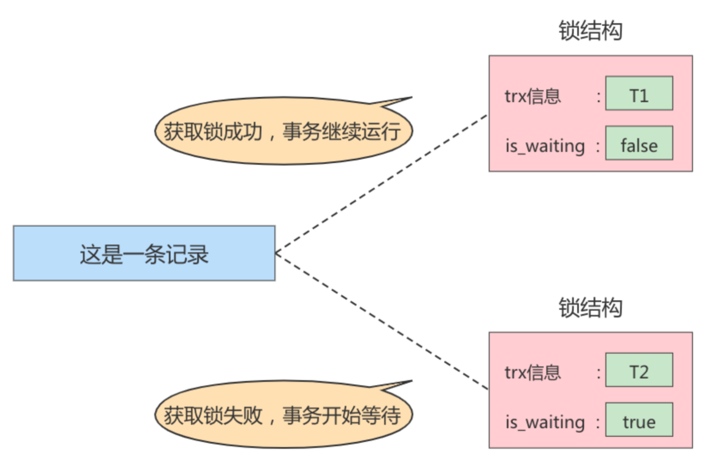
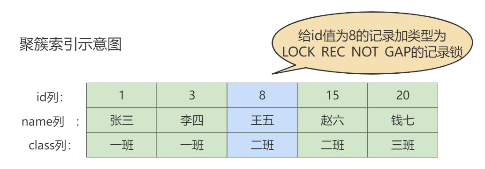
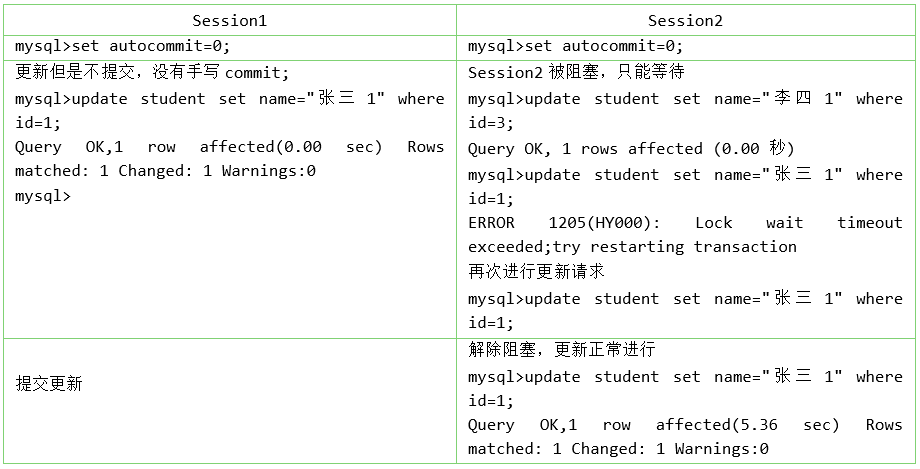
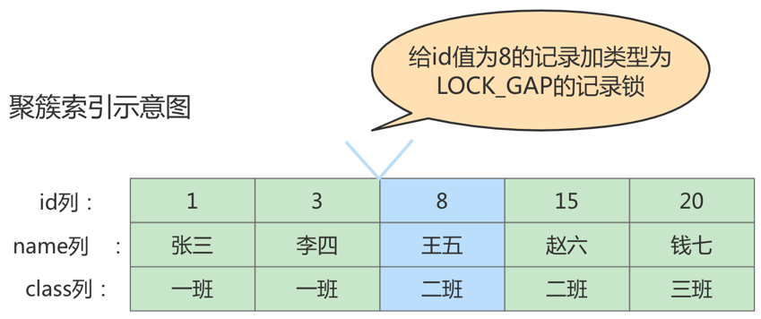
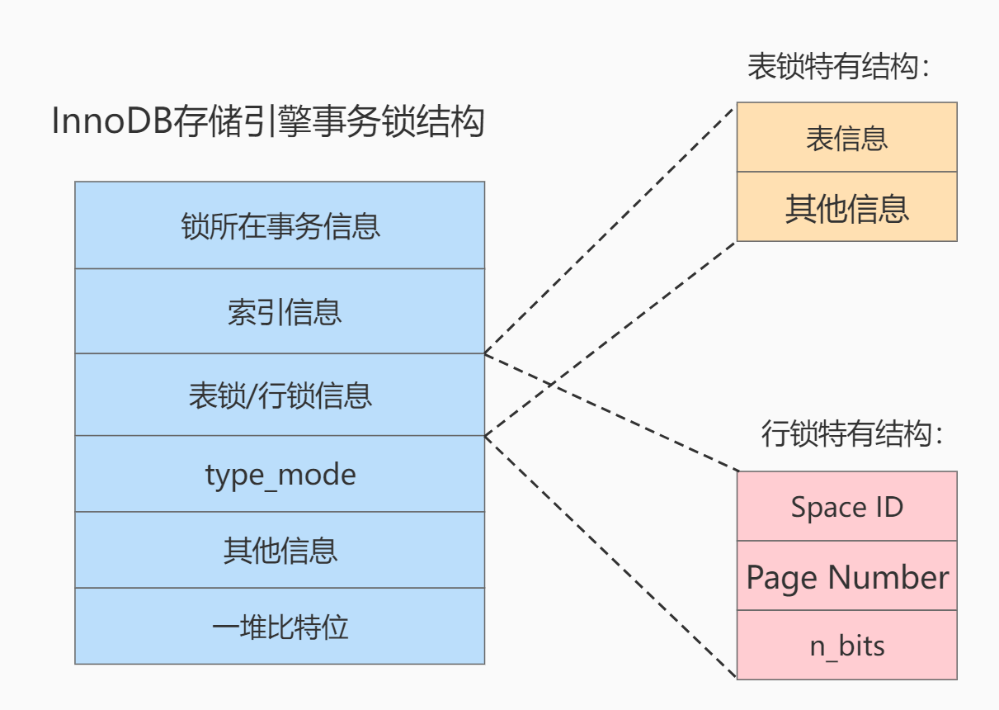
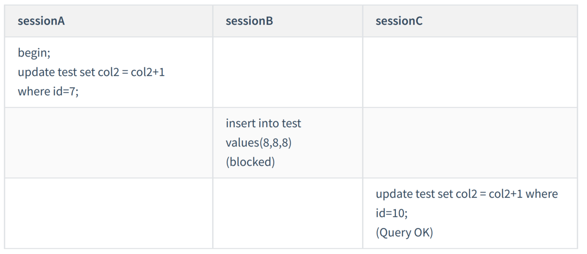

# 第 15 章_锁


事务的`隔离性`由这章讲述的`锁`来实现。

## 1. 概述

`锁`是计算机协调多个进程或线程`并发访问某一资源`的机制。在程序开发中会存在多线程同步的问题，当多个线程并发访问某个数据的时候，尤其是针对一些敏感的数据（比如订单、金额等），我们就需要保证这个数据在任何时刻`最多只有一个线程`在访问，保证数据的`完整性`和`一致性`。在开发过程中加锁是为了保证数据的一致性，这个思想在数据库领域中同样很重要。

在数据库中，除传统的计算资源（如CPU、RAM、I/O等）的争用以外，数据也是一种供许多用户共享的资源。为保证数据的一致性，需要对`并发操作进行控制`，因此产生了`锁`。同时`锁机制`也为实现MySQL的各个隔离级别提供了保证。`锁冲突`也是影响数据库`并发访问性能`的一个重要因素。所以锁对数据库而言显得尤其重要，也更加复杂。

## 2. MySQL并发事务访问相同记录

并发事务访问相同记录的情况大致可以划分为 3 种：

### 2. 1 读-读情况

`读-读`情况，即并发事务相继`读取相同的记录`。读取操作本身不会对记录有任何影响，并不会引起什么问题，所以允许这种情况的发生。

### 2. 2 写-写情况

`写-写`情况，即并发事务相继对相同的记录做出改动。

在这种情况下会发生`脏写`的问题，任何一种隔离级别都不允许这种问题的发生。所以在多个未提交事务相继对一条记录做改动时，需要让它们`排队执行`，这个排队的过程其实是通过锁来实现的。这个所谓的锁其实是一个`内存中的结构`，在事务执行前本来是没有锁的，也就是说一开始是没有`锁结构`和记录进行关联的，如图所示：


当一个事务想对这条记录做改动时，首先会看看内存中有没有与这条记录关联的`锁结构`，当没有的时候就会在内存中生成一个`锁结构`与之关联。比如，事务`T1`要对这条记录做改动，就需要生成一个`锁结构`与之关联：


在锁结构里有很多信息，为了简化理解，只把两个比较重要的属性拿了出来:

- `trx信息`:代表这个锁结构是哪个事务生成的。

- `is_waiting` :代表当前事务是否在等待。

当事务`T1`改动了这条记录后，就生成了一个`锁结构`与该记录关联，因为之前没有别的事务为这条记录加锁，所以`is_waiting`属性就是`false`，我们把这个场景就称之为`获取锁成功`，或者`加锁成功`，然后就可以继续执行操作了。


在事务`T1`提交之前，另一个事务`T2`也想对该记录做改动，那么先看看有没有锁结构与这条记录关联，发现有一个锁结构与之关联后，然后也生成了一个锁结构与这条记录关联，不过锁结构的`is_waiting`属性值为`true` ,表示当前事务需要等待，我们把这个场景就称之为`获取锁失`败，或者`加锁失败`，图示:



在事务T1提交之后，就会把该事务生成的`锁结构释放`掉，然后看看还有没有别的事务在等待获取锁，发现了事务T2还在等待获取锁，所以把事务T2对应的锁结构的`is_waiting`属性设置为`false`，然后把该事务对应的线程唤醒，让它继续执行，此时事务T2就算获取到锁了。效果图就是这样:


小结几种说法：


- 不加锁

  意思就是不需要在内存中生成对应的`锁结构`，可以直接执行操作。

- 获取锁成功，或者加锁成功

  意思就是在内存中生成了对应的`锁结构`，而且锁结构的`is_waiting`属性为`false`，也就是事务
  可以继续执行操作。

- 获取锁失败，或者加锁失败，或者没有获取到锁

  意思就是在内存中生成了对应的锁结构，不过锁结构的`is_waiting`属性为`true`，也就是事务
  需要等待，不可以继续执行操作。

### 2. 3 读-写或写-读情况

`读-写`或`写-读`，即一个事务进行读取操作，另一个进行改动操作。这种情况下可能发生`脏读`、`不可重复读`、`幻读`的问题。

各个数据库厂商对`SQL标准的`支持都可能不一样。比如MySQL在`REPEATABLE READ`隔离级别上就已经解决了幻读问题。

### 2. 4 并发问题的解决方案 

怎么解决`脏读`、`不可重复读`、`幻读`这些问题呢？其实有两种可选的解决方案：

- 方案一：读操作利用多版本并发控制（MVCC，下章讲解），写操作进行加锁。

所谓的`MVCC`，就是生成一个`ReadView`，通过ReadView找到符合条件的记录版本（历史版本由`undo日志`构建)。查询语句只能`读`到在生成ReadView之前`已提交事务所做的更改`，在生成ReadView之前未提交的事务或者之后才开启的事务所做的更改是看不到的。而`写操作`肯定针对的是`最新版本的记`录，读记录的历史版本和改动记录的最新版本本身并不冲突，也就是采用MVCC时，`读-写`操作并不冲突。

> 普通的SELECT语句在READ COMMITTED和REPEATABLE READ隔离级别下会使用到MVCC读取记录。
>
> - 在`READ COMMITTED`隔离级别下，一个事务在执行过程中每次执行SELECT操作时都会生成一个ReadView，ReadView的存在本身就保证了`事务不可以读取到未提交的事务所做的更改`，也就是避免了脏读现象；
>
> - 在`REPEATABLE READ`隔离级别下，一个事务在执行过程中只有第一次执行SELECT操作才会生成一个ReadView，之后的SELECT操作都`复用`这个ReadView，这样也就避免了不可重复读和幻读的问题。
>
>   tips: 这里幻读没解决吧!!!!!


- 方案二：读、写操作都采用`加锁`的方式。

  如果我们的一些业务场景不允许读取记录的旧版本，而是每次都必须去`读取记录的最新版本`。比如，在银行存款的事务中，你需要先把账户的余额读出来，然后将其加上本次存款的数额最后再写到数据库中。在将账户余额读取出来后，就不想让别的事务再访问该余额，直到本次存款事务执行完成，其他事务才可以访问账户的余额。这样在读取记录的时候就需要对其进行`加锁`操作，这样也就意味着`读`操作和`写`操作也像`写-写`操作那样`排队`执行。

  

  `脏读`的产生是因为当前事务读取了另一个未提交事务写的一条记录，如果另一个事务在写记录的时候就给这条记录加锁，那么当前事务就无法继续读取该记录了，所以也就不会有脏读问题的产生了。

  `不可重复读`的产生是因为当前事务先读取一条记录，另外一个事务对该记录做了改动之后并提交之后，当前事务再次读取时会获得不同的值，如果在当前事务读取记录时就给该记录加锁那么另一个事务就无法修改该记录，自然也不会发生不可重复读了。

  `幻读`问题的产生是因为当前事务读取了一个范围的记录，然后另外的事务向该范围内插入了新记录，当前事务再次读取该范围的记录时发现了新插入的新记录。采用加锁的方式解决幻读问题就有一些麻烦，因为当前事务在第一次读取记录时幻影记录并不存在，所以读取的时候加锁就有点尴尬（因为你并不知道给谁加锁)。

  

- 小结对比发现：

  - 采用`MVCC`方式的话，`读-写`操作彼此并不冲突，`性能更高`。
  - 采用`加锁`方式的话，`读-写`操作彼此需要`排队执行`，影响性能。

  一般情况下我们当然愿意采用`MVCC`来解决`读-写`操作并发执行的问题，但是业务在某些特殊情况下，要求必须采用`加锁`的方式执行。下面就讲解下MySQL中不同类别的锁。


## 3. 锁的不同角度分类

锁的分类图，如下：


### 3. 1 从数据操作的类型划分：读锁、写锁

对于数据库中并发事务的`读-读`情况并不会引起什么问题。对于`写-写`、`读-写`或`写-读`这些情况可能会引起一些问题，需要使用`MVCC`或者`加锁`的方式来解决它们。在使用`加锁`的方式解决问题时，由于既要允许`读-读`情况不受影响，又要使`写-写`、`读-写`或写-读情况中的操作相互阻塞，所以MySQL实现一个由两种类型的锁组成的锁系统来解决。这两种类型的锁通常被称为**共享锁(Shared Lock，SLock)**和**排他锁(Exclusive Lock，XLock),**也叫读锁(readlock)和写锁(write lock)。

- `读锁`：也称为`共享锁`、英文用`S`表示。针对同一份数据，多个事务的读操作可以同时进行而不会互相影响，相互不阻塞的。

- `写锁`：也称为`排他锁`、英文用`X`表示。当前写操作没有完成前，它会阻断其他写锁和读锁。这样就能确保在给定的时间里，只有一个事务能执行写入，并防止其他用户读取正在写入的同一资源。

**需要注意的是对于 InnoDB 引擎来说，读锁和写锁可以加在表上，也可以加在行上。**

**举例(行级读写锁)∶**如果一个事务T1已经获得了某个行r的读锁，那么此时另外的一个事务T2是可以去获得这个行r的读锁的，因为读取操作并没有改变行r的数据;但是，如果某个事务T3想获得行r的写锁，则它必须等待事务T1、T2释放掉行r上的读锁才行。

总结:这里的兼容是指对同一张表或记录的锁的兼容性情况。

|      | X锁    | S锁      |
| ---- | ------ | -------- |
| X锁  | 不兼容 | 不兼容   |
| S锁  | 不兼容 | **兼容** |


#### 1. 锁定读

在采用`加锁`方式解决脏读、不可重复读、幻读这些问题时，读取一条记录时需要获取该记录的S锁，其实是不严谨的，有时候需要在读取记录时就获取记录的X锁，来禁止别的事务读写该记录，为此MySQL提出了两种比较特殊的SELECT语句格式:

- 对读取的记录加S锁:

```mysql
SELECT ... LOCK IN SHARE MODE;
#或
SELECT ... FOR SHARE;#(8.0新增语法)
```


在普通的SELECT语句后边加`LOCK IN SHARE MODE`，如果当前事务执行了该语句，那么它会为读取到的记录加S锁，这样允许别的事务继续获取这些记录的S锁(比方说别的事务也使用`SELECT ... LOCK IN SHAREMODE`语句来读取这些记录)，但是不能获取这些记录的X锁(比如使用`SELECT ... FOR UPDATE`语句来读取这些记录，或者直接修改这些记录)。如果别的事务想要获取这些记录的`x锁`，那么它们会阻塞，直到当前事务提交之后将这些记录上的`S锁`释放掉。

- 对读取的记录加X锁:

```mysql
SELECT ... FOR UPDATE;
```

在普通的SELECT语句后边加`FOR UPDATE`，如果当前事务执行了该语句，那么它会为读取到的记录加`X锁`，这样既不允许别的事务获取这些记录的S锁(比方说别的事务使用`SELECT ... LOCK IN SHARE MODE`语句来读取这些记录)，也不允许获取这些记录的X锁(比如使用`SELECT ... FOR UPDATE`语句来读取这些记录，或者直接修改这些记录)。如果别的事务想要获取这些记录的s锁或者X锁，那么它们会阻塞，直到当前事务提交之后将这些记录上的X锁释放掉。

**MySQL8.0新特性:**

在5.7及之前的版本，SELECT ..FOR UPDATE，如果获取不到锁，会一直等待，直到`innodb_lock_wait_timeout`超时。在8.0版本中，SELECT. FOR UPDATE，SELECT ...FOR SHARE添加`NOWAIT`、`SKIP LOCKED`语法，跳过锁等待，或者跳过锁定。

- 通过添加NOWAIT、SKIP LOCKED语法，能够立即返回。如果查询的行已经加锁:
  - 那么NOWAIT会立即报错返回（等不到锁立即返回）
  - 而SKIP LOCKED也会立即返回，只是返回的结果中不包含被锁定的行。（）

```mysql
SELECT. FOR UPDATE NOWAIT
```


测试：

```mysql
CREATE TABLE `account` (
  `id` int NOT NULL AUTO_INCREMENT,
  `name` varchar(32) DEFAULT NULL,
  `balance` decimal(10,2) DEFAULT NULL,
  PRIMARY KEY (`id`)
) ENGINE=InnoDB AUTO_INCREMENT=4 DEFAULT CHARSET=utf8mb3;

insert into account(name, balance) VALUES 
("张三", 40),
("李四", 0),
("王五", 100);
```


#### 2.写操作

平常所用到的`写操作`无非是`DELETE`、`UPDATE`、`INSERT`这三种:

- DELETE:
  对一条记录做DELETE操作的过程其实是先在`B+`树中定位到这条记录的位置，然后获取这条记录的`X锁`，再执行`delete mark`.操作。我们也可以把这个定位待删除记录在B+树中位置的过程看成是一个获取`X锁`的`锁定读`。

- UPDATE∶在对一条记录做UPDATE操作时分为三种情况:

  - 情况1: 未修改该记录的`键值`，并且被更新的列占用的存储空间在修改前后`未发生变化`。

    则先在`B+`树中定位到这条记录的位置，然后再获取一下记录的`X锁`，最后在原记录的位置进行修改操作。我们也可以把这个定位待修改记录在B+树中位置的过程看成是一个获取`X锁`的`锁定读`。

  - 情况2∶未修改该记录的`键值`，并且至少有一个被更新的列占用的存储空间在修改前后发生变化。

    则先在B+树中定位到这条记录的位置，然后获取一下记录的X锁，将该记录彻底删除掉（就是把记录彻底移入垃圾链表)，最后再插入一条新记录。这个定位待修改记录在B+树中位置的过程看成是一个获取`×锁`的`锁定读`，新插入的记录由`INSERT`操作提供的`隐式锁`进行保护。

  - 情况3∶修改了该记录的键值，则相当于在原记录上做DELETE操作之后再来一次INSERT操作，加锁操作就需要按照`DELETE`和`INSERT`的规则进行了。

- INSERT :

  一般情况下，新插入一条记录的操作并不加锁，通过一种称之为`隐式锁`的结构来保护这条新插入的记录在本事务`提交前不被别的事务访问`。

  <font color='red'>也就是说，正常的删除、更新、查询有X锁和S锁，插入有隐式锁这个保护机制，来保护插入的事务在提交前不会被别的事务访问</font>

  

### 3.2 从数据操作的粒度划分：表级锁、页级锁、行锁

为了尽可能提高数据库的并发度，每次锁定的数据范围越小越好，理论上每次只锁定当前操作的数据的方案会得到最大的并发度，但是管理锁是很`耗资源`的事情（涉及获取、检查、释放锁等动作)(越小消耗越大)。因此数据库系统需要在`高并响应`和`系统性能`两方面进行平衡，这样就产生了“`锁粒度(Lock granularity)`”的概念。

对一条记录加锁影响的也只是这条记录而已，我们就说这个锁的粒度比较细;其实一个事务也可以在`表级别`进行加锁，自然就被称之为`表级锁`或者`表锁`，对一个表加锁影响整个表中的记录，我们就说这个锁的粒度比较粗。锁的粒度主要分为表级锁、页级锁和行锁。


#### 1.表锁（Table Lock）

该锁会锁定整张表，它是MySQL中最基本的锁策略，`并不依赖于存储引擎`(不管你是MySQL的什么存储引擎，
对于表锁的策略都是一样的)，并且表锁是`开销最小`的策略（因为粒度比较大)。由于表级锁一次会将整个表锁定，所以可以很好的`避免死锁`问题。当然，锁的粒度大所带来最大的负面影响就是出现锁资源争用的概率也会最高，导致`并发率大打折扣`。

##### **① 表级别的S锁、X锁**

在对某个表执行SELECT、INSERT、DELETE、UPDATE语句时，InnoDB存储引擎是不会为这个表添加表级别的`S锁`或者`X锁`的。在对某个表执行一些诸如`ALTER TABLE`、`DROP TABLE`这类的`DDL`语句时，其他事务对这个表并发执行诸如SELECT、INSERT、DELETE、UPDATE的语句会发生阻塞。同理，某个事务中对某个表执行SELECT、INSERT、DELETE、UPDATE语句时，在其他会话中对这个表执行`DDL`语句也会发生阻塞。这个过程其实是通过在server层使用一种称之为`元数据锁`（英文名：`Metadata Locks`，简称`MDL`）结构来实现的。

一般情况下，不会使用InnoDB存储引擎提供的`表级别`的`S锁`和`X锁`。只会在一些特殊情况下，比方说`崩溃恢复`过程中用到。比如，在系统变量`autocommit=0，innodb_table_locks = 1`时，手动获取InnoDB存储引擎提供的表t 的S锁或者X锁可以这么写：

- `LOCK TABLES t READ`：InnoDB存储引擎会对表t加表级别的S锁。
- `LOCK TABLES t WRITE`：InnoDB存储引擎会对表t加表级别的X锁。

不过尽量避免在使用InnoDB存储引擎的表上使用`LOCK TABLES`这样的手动锁表语句，它们并不会提供什么额外的保护，只是会降低并发能力而已。InnoDB的厉害之处还是实现了更细粒度的行锁，关于InnoDB表级别的S锁和X锁大家了解一下就可以了。


```mysql
# 查看自动提交
mysql> show variables like '%autocommit%';
+---------------+-------+
| Variable_name | Value |
+---------------+-------+
| autocommit    | OFF   |
+---------------+-------+
1 row in set (0.00 sec)

# 查看innodb表锁是否打开
mysql> show variables like '%innodb_table%';
+--------------------+-------+
| Variable_name      | Value |
+--------------------+-------+
| innodb_table_locks | ON    |
+--------------------+-------+
1 row in set (0.00 sec)

# 临时关闭自动提交
mysql> set @@autocommit=0;
```


```mysql
show open tables where in_use > 0; # 查看哪些表被锁了

lock tables student read # 加写锁
lock tables student write;

unlock tables; # 表解锁
```

**总结：**

MyISAM在执行查询语句（SELECT）前，会给涉及的所有表加读锁，在执行增删改操作前，会给涉及的表加写锁。InnoDB存储引擎是不会为这个表添加表级别的`读锁`或者`写锁`的。（有行锁，谁TM用表锁啊）

MySQL的表级锁有两种模式：（以MyISAM表进行操作的演示）

- 表共享读锁（Table Read Lock）
- 表独占写锁（Table Write Lock）

| 锁类型 | 自己可读 | 自己可写 | 自己可操作其他表 | 他人可读 | 他人可写 |
| ------ | -------- | -------- | ---------------- | -------- | -------- |
| 读锁   | 是       | 否       | 否               | 是       | 否，等   |
| 写锁   | 是       | 是       | 否               | 否，等   | 否，等   |


##### **② 意向锁 （intention lock）**

InnoDB 支持`多粒度锁（multiple granularity locking）`，它允许行级锁与表级锁共存，而 **意向锁** 就是其中的一种`表锁`。

1、意向锁的存在是为了`协调行锁和表锁`的关系，支持多粒度（表锁与行锁)的锁并存。

2、意向锁是一种`不与行级锁冲突表级锁`，这一点非常重要。

3、表明“某个事务正在某些行持有了锁或该事务准备去持有锁”

意向锁分为两种：

- **意向共享锁 （intention shared lock, IS）**：事务有意向对表中的某些行加 **共享锁 （S锁**）

  ```mysql
  -- 事务要获取某些行的 S 锁，必须先获得表的 IS 锁。 
  -- 会自动加，不用管
  SELECT column FROM table ... LOCK IN SHARE MODE;
  ```

  

- **意向排他锁 （intention exclusive lock, IX）**：事务有意向对表中的某些行加 **排他锁** （X锁）

  ```mysql
  -- 事务要获取某些行的 X 锁，必须先获得表的 IX 锁。
  -- 会自动加，不用管
  SELECT column FROM table ... FOR UPDATE;
  ```
  


即：意向锁是由存储引擎`自己维护的`，用户无法手动操作意向锁，在为数据行加共享 / 排他锁之前，InooDB 会先获取该数据行`所在数据表的对应意向锁`。

**1.意向锁要解决的问题**

现在有两个事务，分别是T1和T2，其中T2试图在该表级别上应用共享或排它锁，如果没有意向锁存在，那么T2就需要去检查各个页或行是否存在锁;如果存在意向锁，那么此时就会受到由T1控制的`表级别意向锁的阻塞`。T2在锁定该表前不必检查各个页或行锁，而只需检查表上的意向锁。简单来说就是给更大一级别的空间示意里面是否已经上过锁。

在数据表的场景中，**如果我们给某一行数据加上了排它锁，数据库会自动给更大一级的空间，比如数据页或数据表加上意向锁，告诉其他人这个数据页或数据表已经有人上过排它锁了**(不这么做的话，想上表锁的那个程序，还要遍历有没有航所)，这样当其他人想要获取数据表排它锁的时候，只需要了解是否有人已经获取了这个数据表的意向排他锁即可。

- 如果事务想要获得数据表中某些记录的共享锁，就需要在数据表上`添加意向共享锁`。
- 如果事务想要获得数据表中某些记录的排他锁，就需要在数据表上`添加意向排他锁`。

这时，意向锁会告诉其他事务已经有人锁定了表中的某些记录。

举例:创建表teacher，插入6条数据，事务的隔离级别默认为Repeatable-Read，如下所示。

```mysql
CREATE TABLE `teacher` (
`id` INT NOT NULL,
`name` VARCHAR ( 255 ) NOT NULL,
PRIMARY KEY ( `id` )
) ENGINE = INNODB DEFAULT CHARSET = utf8mb4 COLLATE = utf8mb4_0900_ai_ci;


INSERT INTO `teacher` VALUES
( '1', 'zhangsan ' ),
( '2', 'lisi' ) ,
( '3' ,'wangwu' ) ,
( '4', 'zhaoliu' ),
( '5', 'songhongkang' ),
( '6', 'leifengyang' ) ;

SELECT @@transaction_isolation;

```

假设事务A获取了某一行的排他锁，并未提交，语句如下所示。

```mysql
begin ;

SELECT * FROM teacher WHERE id = 6 FOR UPDATE;
```

事务B想要获取teacher 表的表读锁，语句如下。

```mysql
begin;

LOCK TABLES teacher READ;
```

因为共享锁与排他锁互斥，所以事务B在试图对teacher表加共享锁的时候，必须保证两个条件。

(1）当前没有其他事务持有teacher 表的排他锁

(2）当前没有其他事务持有teacher表中任意一行的排他锁。

为了检测是否满足第二个条件，事务B必须在确保teacher表不存在任何排他锁的前提下，去检测表中的每一行是否存在排他锁。很明显这是一个效率很差的做法，但是有了意向锁之后，情况就不一样了。

意向锁是怎么解决这个问题的呢?首先，我们需要知道意向锁之间的兼容互斥性，如下所示。

|                 | 意向共享锁(lS) | 意向排他锁(IX) |
| --------------- | -------------- | -------------- |
| 意向共享锁(IS)  | 兼容           | 兼容           |
| 意向排他锁（IX) | 兼容           | 兼容           |

 即意向锁之间是互相兼容的，虽然意向锁和自家兄弟互相兼容，但是它会与普通的排他/共享锁互斥。

|              | 意向共享锁(lS) | 意向排他锁(IX) |
| ------------ | -------------- | -------------- |
| 共享锁(S)表  | 兼容           | 互斥           |
| 排他锁（X)表 | 互斥           | 互斥           |

注意这里的排他/共享锁指的都是表锁，意向锁不会与行级的共享/排他锁互斥。回到刚才teacher表的例子。

事务A获取了某一行的排他锁，并未提交:

```mysql
# 事务A
BEGIN;
SELECT *FROM teacher WHERE id = 6 FOR UPDATE;
```

此时teacher表存在两把锁: teacher表上的意向排他锁与id为6的数据行上的排他锁。事务B想要获取teacher表的共享锁。

```mysql
# 事务B
BEGIN;
LOCK TABLES teacher READ;

```

此时事务B检测事务A持有teacher表的意向排他锁，就可以得知事务A必然持有该表中某些数据行的排他锁，那么事务B对teacher表的加锁请求就会被排斥（阻塞)，而无需去检测表中的每一行数据是否存在排他锁。


**意向锁的并发性**

意向锁不会与行级的共享 / 排他锁互斥！正因为如此，意向锁并不会影响到多个事务对不同数据行加排他锁时的并发性。（不然我们直接用普通的表锁就行了）

我们扩展一下上面 teacher表的例子来概括一下意向锁的作用（一条数据从被锁定到被释放的过程中，可能存在多种不同锁，但是这里我们只着重表现意向锁）。

**从上面的案例可以得到如下结论：**

1. InnoDB 支持`多粒度锁`，特定场景下，行级锁可以与表级锁共存。
2. 意向锁之间互不排斥，但除了 IS 与 S 兼容外，`意向锁会与 共享锁 / 排他锁 互斥`。
3. IX，IS是表级锁，不会和行级的X，S锁发生冲突。只会和表级的X，S发生冲突。
4. 意向锁在保证并发性的前提下，实现了`行锁和表锁共存`且`满足事务隔离性`的要求。

##### **③ 自增锁（AUTO-INC锁）**

在使用MySQL过程中，我们可以为表的某个列添加`AUTO_INCREMENT`属性。举例：


```mysql
CREATE TABLE `teacher` (
`id` int NOT NULL AUTO_INCREMENT,
`name` varchar( 255 ) NOT NULL,
PRIMARY KEY (`id`)
) ENGINE=InnoDB DEFAULT CHARSET=utf8mb4 COLLATE=utf8mb4_0900_ai_ci;
```

由于这个表的id字段声明了AUTO_INCREMENT，意味着在书写插入语句时不需要为其赋值，SQL语句修改
如下所示。

```mysql
INSERT INTO `teacher` (name) VALUES ('zhangsan'), ('lisi');
```


上边的插入语句并没有为id列显式赋值，所以系统会自动为它赋上递增的值，结果如下所示。

```mysql
mysql> select * from teacher;
+----+----------+
| id | name |
+----+----------+
| 1 | zhangsan |
| 2 | lisi |
+----+----------+
2 rows in set (0.00 sec)
```


现在我们看到的上面插入数据只是一种简单的插入模式，所有插入数据的方式总共分为三类，分别是“`Simple inserts`”，“`Bulk inserts`”和“`Mixed-mode inserts`”。

**1. “Simple inserts” （简单插入）**

可以`预先确定要插入的行数`（当语句被初始处理时）的语句。包括没有嵌套子查询的单行和多行`INSERT...VALUES()`和`REPLACE`语句。比如我们上面举的例子就属于该类插入，已经确定要插入的行数。

**2. “Bulk inserts” （批量插入）**

`事先不知道要插入的行数`（和所需自动递增值的数量）的语句。比如INSERT ... SELECT，REPLACE... SELECT和LOAD DATA语句，但不包括纯INSERT。 InnoDB在每处理一行，为AUTO_INCREMENT列分配一个新值。

**3. “Mixed-mode inserts” （混合模式插入）**

这些是“Simple inserts”语句但是指定部分新行的自动递增值。例如INSERT INTO teacher (id,name) VALUES (1,'a'), (NULL,'b'), (5,'c'), (NULL,'d');只是指定了部分id的值。另一种类型的“混合模式插入”是 `INSERT ... ON DUPLICATE KEY UPDATE`。

对于上面数据插入的案例，MySQL中采用了`自增锁`的方式来实现，**AUTO-INC锁是当向使用含有AUTO_INCREMENT列的表中插入数据时需要获取的一种特殊的表级锁**，在执行插入语句时就在表级别加一个AUTO-INC锁，然后为每条待插入记录的AUTO_INCREMENT修饰的列分配递增的值，在该语句执行结束后，再把AUTO-INC锁释放掉。**一个事务在持有AUTO-INC锁的过程中，其他事务的插入语句都要被阻塞**，可以保证`一个语句`中分配的递增值是`连续`的。也正因为此，其并发性显然并不高，**当我们向一个有AUTO_INCREMENT关键字的主键插入值的时候，每条语句都要对这个表锁进行竞争**，这样的并发潜力其实是很低下的，所以innodb通过`innodb_autoinc_lock_mode`的不同取值来提供不同的锁定机制，来显著提高SQL语句的可伸缩性和性能。


> 注意自增锁是执行insert才会上锁，和事务没关系，也就是说执行insert之前上锁，insert执行之后解锁，这和事务是否执行完没关系


innodb_autoinc_lock_mode有三种取值，分别对应与不同锁定模式：

```
（1）innodb_autoinc_lock_mode = 0(“传统”锁定模式)
```
在此锁定模式下，所有类型的insert语句都会获得一个特殊的表级AUTO-INC锁，用于插入具有AUTO_INCREMENT列的表。这种模式其实就如我们上面的例子，即每当执行insert的时候，都会得到一个表级锁(AUTO-INC锁)，使得语句中生成的auto_increment为顺序，且在binlog中重放的时候，可以保证master与slave中数据的auto_increment是相同的。因为是表级锁，当在同一时间多个事务中执行insert的时候，对于AUTO-INC锁的争夺会`限制并发能力`。

```
（2）innodb_autoinc_lock_mode = 1(“连续”锁定模式)
```
在 MySQL 8.0 之前，连续锁定模式是`默认`的。

在这个模式下，“bulk inserts”仍然使用AUTO-INC表级锁，并保持到语句结束。这适用于所有INSERT ...
SELECT，REPLACE ... SELECT和LOAD DATA语句。同一时刻只有一个语句可以持有AUTO-INC锁。

对于“Simple inserts”（要插入的行数事先已知），则通过在`mutex（轻量锁）`的控制下获得所需数量的
自动递增值来避免表级AUTO-INC锁， 它只在分配过程的持续时间内保持，而不是直到语句完成。不使用
表级AUTO-INC锁，除非AUTO-INC锁由另一个事务保持。如果另一个事务保持AUTO-INC锁，则“Simple
inserts”等待AUTO-INC锁，如同它是一个“bulk inserts”。

```
（ 3 ）innodb_autoinc_lock_mode = 2(“交错”锁定模式)
```
从 MySQL 8.0 开始，交错锁模式是`默认`设置。

在这种锁定模式下，所有类INSERT语句都不会使用表级AUTO-INC锁，并且可以同时执行多个语句。这是最快和最可扩展的锁定模式，但是当使用基于语句的复制或恢复方案时，`从二进制日志重播SQL语句时，这是不安全的。(主从复制id可能不一致)`

在此锁定模式下，自动递增值`保证`在所有并发执行的所有类型的insert语句中是唯一且单调递增的。但
是，由于多个语句可以同时生成数字（即，跨语句交叉编号）， **为任何给定语句插入的行生成的值可能
不是连续的。**


如果执行的语句是“simple inserts”，其中要插入的行数已提前知道，除了“Mixed-mode inserts"之外，为单个语句生成的数字不会有间隙。然而，当执行“bulk inserts"时,在由任何给定语句分配的自动递增值中可能存在间隙。

##### **④ 元数据锁（MDL锁）**

MySQL5.5引入了meta data lock，简称MDL锁，属于表锁范畴。MDL 的作用是，保证读写的正确性。比如，如果一个查询正在遍历一个表中的数据，而执行期间另一个线程对这个`表结构做变更`，增加了一列，那么查询线程拿到的结果跟表结构对不上，肯定是不行的。

因此， **当对一个表做增删改查操作的时候，加 MDL读锁；当要对表做结构变更操作的时候，加 MDL 写锁。**

读锁之间不互斥，因此你可以有多个线程同时对一张表增删改查。读写锁之间、写锁之间是互斥的，用来保证变更表结构操作的安全性，解决了DML和DDL操作之间的一致性问题。`不需要显式使用`，在访问一个表的时候会被自动加上。

**举例:元数据锁的使用场景模拟会话A:从表中查询数据**

```mysql
mysql> begin;
Query 0K,0 rows affected (8.00 sec)
# 默认加了MDL 读锁
mysql> select count( 1 ) from teacher ;
```

 

```mysql
begin;

# 这个时候就会阻塞在这里，有其他事务在读数据。
# 修改表结构 需要加MDL 写锁
alter table teacher add age int;
```


并发问题：

```mysql
事务1 。加 读锁。
事务2   加  写锁

事务3  加 读锁 # 这个时候会阻塞在这里。
```


#### 2. InnoDB中的行锁

行锁(Row Lock)也称为记录锁，顾名思义，就是锁住某一行（某条记录row)。需要的注意的是，MySQL服务器层并没有实现行锁机制，**行级锁只在存储引擎层实现。**

优点: 锁定力度小，`发生锁冲突概率低`，可以实现的`并发度高`。

缺点: 对于`锁的开销比大`，加锁会比较慢，容易出现`死锁`情况。

InnoDB与MylSAM的最大不同有两点:一是支持事务(TRANSACTION);二是采用了行级锁。

首先我们创建表如下:

```mysql
CREATE TABLE student (
id INT,
name VARCHAR(20) ,
class varchar( 10) ,
PRIMARY KEY ( id)
) Engine=InnoDB CHARSET=utf8;
```


向这个表里插入几条记录:

```mysql

INSERT INTO student VALUES 
( 1,'张三','一班'),
(3,'李四','一班') ,
( 8,'王五','二班') ,
( 15,'赵六','二班') ,
(20,'钱七','三班');
```


这里把B+树的索引结构做了一个超级简化，只把索引中的记录给拿了出来，下面看看都有哪些常用的行锁类型。

##### **① 记录锁（Record Locks）**

记录锁也就是仅仅把一条记录锁上，官方的类型名称为：`LOCK_REC_NOT_GAP`。比如我们把id值为 8 的
那条记录加一个记录锁的示意图如图所示。仅仅是锁住了id值为 8 的记录，对周围的数据没有影响。




举例如下：



记录锁是有S锁和X锁之分的，称之为`S型记录锁`和`X型记录锁`。

- 当一个事务获取了一条记录的S型记录锁后，其他事务也可以继续获取该记录的S型记录锁，但不可以继续获取X型记录锁；
- 当一个事务获取了一条记录的X型记录锁后，其他事务既不可以继续获取该记录的S型记录锁，也不可以继续获取X型记录锁。

##### **② 间隙锁（Gap Locks）**

MySQL在`REPEATABLE READ`隔离级别下是可以解决幻读问题的，解决方案有两种，可以使用`MVCC`方案解决，也可以采用加锁方案解决。但是在使用`加锁`方案解决时有个大问题，就是事务在第一次执行读取操作时，那些幻影记录尚不存在，我们无法给这些`幻影记录`加上`记录锁`。InnoDB提出了一种称之为`Gap Locks`的锁，官方的类型名称为：`LOCK_GAP`，我们可以简称为`gap锁`。比如，把id值为 8 的那条记录加一个gap锁的示意图如下。



图中id值为 8 的记录加了gap锁，意味着`不允许别的事务在id值为 8 的记录前边的间隙插入新记录`，其实就是id列的值( 3 , 8 )这个区间的新记录是不允许立即插入的。比如，有另外一个事务再想插入一条id值为 4 的新记录，它定位到该条新记录的下一条记录的id值为 8 ，而这条记录上又有一个gap锁，所以就会阻塞插入操作，直到拥有这个gap锁的事务提交了之后，id列的值在区间( 3 , 8 )中的新记录才可以被插入。

**gap锁的提出仅仅是为了防止插入幻影记录而提出的** 。虽然有共享`gap锁`和`独占gap锁`这样的说法，但是它们起到的作用是相同的。而且如果对一条记录加了gap锁（不论是共享gap锁还是独占gap锁)，并不会限制其他事务对这条记录加记录锁或者继续加gap锁。


> 这里间隙锁，会加到小的数据上。。比如查询 4~8 的id 间隙锁会放到8记录里面。

```mysql
mysql> select * from student;
+----+--------+--------+
| id | name   | class  |
+----+--------+--------+
|  1 | 张三   | 一班   |
|  3 | 李四   | 一班   |
|  8 | 王五   | 二班   |
| 15 | 赵六   | 二班   |
| 20 | 钱七   | 三班   |
+----+--------+--------+
5 rows in set (0.01 sec)
```


| session 1                                            | session 2                                      |
| ---------------------------------------------------- | ---------------------------------------------- |
| select *from student where id =8 lock in share mode; |                                                |
|                                                      | select * from student where id = 8 for update; |

这里好会阻塞主，是前面的行锁知识点。


| session 1                                            | session 2                                     |
| ---------------------------------------------------- | --------------------------------------------- |
| select *from student where id =5 lock in share mode; |                                               |
|                                                      | select * from student where id =5 for update; |

这里session 2并不会被堵住。因为表里并没有id=5这个记录，因此session 1加的是间隙锁（3,8)。而session 2也是在这个间隙加的间隙锁。它们有共同的目标，即:保护这个间隙，不允许插入值。但，它们之间是不冲突的。


| session 1                                            | session 2                                                    |
| ---------------------------------------------------- | ------------------------------------------------------------ |
| select *from student where id =5 lock in share mode; |                                                              |
|                                                      | insert into student(id, name, class) values (6, 'tom', '三班')； |

这里就会阻塞了，以为加了间隙锁。


##### **③ 临键锁（Next-Key Locks）**

有时候我们既想`锁住某条记录`，又想`阻止`其他事务在该记录前边的`间隙插入新记录`，所以InnoDB就提出了一种称之为`Next-Key Locks的锁`，官方的类型名称为：`LOCK_ORDINARY`，我们也可以简称为next-key锁。`Next-Key Locks`是在存储引擎innodb、事务级别在`可重复读`的情况下使用的数据库锁，innodb默认的锁就是Next-Key locks。


```mysql
begin;
select * from student where id <= 8 and id > 3 for update;
```


##### **④ 插入意向锁（Insert Intention Locks）**

我们说一个事务在`插入`一条记录时需要判断一下插入位置是不是被别的事务加了`gap锁`（`next-key锁`
也包含`gap锁`），如果有的话，插入操作需要等待，直到拥有`gap锁`的那个事务提交。但是 **InnoDB规
定事务在等待的时候也需要在内存中生成一个锁结构** ，表明有事务想在某个`间隙`中`插入`新记录，但是
现在在等待。InnoDB就把这种类型的锁命名为Insert Intention Locks，官方的类型名称为：`LOCK_INSERT_INTENTION`，我们称为插入意向锁。`插入意向锁`是一种`Gap锁`，不是意向锁，在insert
操作时产生。

插入意向锁是在插入一条记录行前，由 `INSERT 操作产生的一种间隙锁。`

事实上 **插入意向锁并不会阻止别的事务继续获取该记录上任何类型的锁。**


#### 3. 页锁

页锁就是在`页的粒度`上进行锁定，锁定的数据资源比行锁要多，因为一个页中可以有多个行记录。当我们使用页锁的时候，会出现数据浪费的现象，但这样的浪费最多也就是一个页上的数据行。 **页锁的开销介于表锁和行锁之间，会出现死锁。锁定粒度介于表锁和行锁之间，并发度一般。**

每个层级的锁数量是有限制的，因为锁会占用内存空间，`锁空间的大小是有限的`。当某个层级的锁数量超过了这个层级的阈值时，就会进行`锁升级`。锁升级就是用更大粒度的锁替代多个更小粒度的锁，比如InnoDB 中行锁升级为表锁，这样做的好处是占用的锁空间降低了，但同时数据的并发度也下降了。

### 3. 3 从对待锁的态度划分:乐观锁、悲观锁

从对待锁的态度来看锁的话，可以将锁分成乐观锁和悲观锁，从名字中也可以看出这两种锁是两种看待`数据并发的思维方式`。需要注意的是，乐观锁和悲观锁并不是锁，而是锁的`设计思想`。

#### 1. 悲观锁（Pessimistic Locking）

悲观锁是一种思想，顾名思义，就是很悲观，对数据被其他事务的修改持保守态度，会通过数据库自身的锁机制来实现，从而保证数据操作的排它性。

悲观锁总是假设最坏的情况，每次去拿数据的时候都认为别人会修改，所以每次在拿数据的时候都会上锁，这样别人想拿这个数据就会`阻塞`直到它拿到锁（ <font color='red'>共享资源每次只给一个线程使用，其它线程阻塞，用完后再把资源转让给其它线程 </font>）。比如行锁，表锁等，读锁，写锁等，都是在做操作之前先上锁，当其他线程想要访问数据时，都需要阻塞挂起。Java中`synchronized`和`ReentrantLock`等独占锁就是悲观锁思想的实现。

#### 2. 乐观锁（Optimistic Locking）

乐观锁认为对同一数据的并发操作不会总发生，属于小概率事件，不用每次都对数据上锁，但是在更新的时候会判断一下在此期间别人有没有去更新这个数据，也就是 **不采用数据库自身的锁机制，而是通过程序来实现** 。在程序上，我们可以采用`版本号机制`或者`CAS机制`实现。 **乐观锁适用于多读的应用类型，这样可以提高吞吐量** 。在Java中java.util.concurrent.atomic包下的原子变量类就是使用了乐观锁的一种实现方式：CAS实现的。

**1.乐观锁的版本号机制**

在表中设计一个`版本字段 version`，第一次读的时候，会获取 version 字段的取值。然后对数据进行更新或删除操作时，会执行`UPDATE ... SET version=version+1 WHERE version=version`。此时如果已经有事务对这条数据进行了更改，修改就不会成功。

**2. 乐观锁的时间戳机制**

时间戳和版本号机制一样，也是在更新提交的时候，将当前数据的时间戳和更新之前取得的时间戳进行
比较，如果两者一致则更新成功，否则就是版本冲突。

你能看到乐观锁就是程序员自己控制数据并发操作的权限，基本是通过给数据行增加一个戳（版本号或
者时间戳），从而证明当前拿到的数据是否最新。

#### 3. 两种锁的适用场景

从这两种锁的设计思想中，我们总结一下乐观锁和悲观锁的适用场景：

1. `乐观锁`适合`读操作多`的场景，相对来说写的操作比较少。它的优点在于程序实现，不存在死锁

问题，不过适用场景也会相对乐观，因为它阻止不了除了程序以外的数据库操作。

2. `悲观锁`适合`写操作多`的场景，因为写的操作具有`排它性`。采用悲观锁的方式，可以在数据库层

面阻止其他事务对该数据的操作权限，防止`读 - 写`和`写 - 写`的冲突。

### 3. 4 按加锁的方式划分：显式锁、隐式锁

#### 1. 隐式锁

- 情景一： 对于聚簇索引记录来说，有一个trx_id隐藏列，该隐藏列记录着最后改动该记录的事务id。那么如果在当前事务中新插入一条聚簇索引记录后，该记录的trx_id隐藏列代表的的就是当前事务的事务id，如果其他事务此时想对该记录添加S锁或者X锁时，首先会看一下该记录的trx_id隐藏列代表的事务是否是当前的活跃事务，如果是的话，那么就帮助当前事务创建一个X锁（也就是为当前事务创建一个锁结构，is_waiting属性是false），然后自己进入等待状态（也就是为自己也创建一个锁结构，is_waiting属性是true）。

  > 这段话其实很简单，说白了就是一个事务A里面insert了一行，那么这一行的隐藏列会存放对应的事务的id，此时别的事务B来想给这一行的数据加锁的话，会看这一行对应的事务是不是A，如果是A，B就给这一行记录创建一个显示锁，然后再给自己创建一个锁结构（让这一行记录可以指向的所结构），然后B自己等待就好了
  >
  > 为什么要这么做？有没有发现上面的过程很像脏读或者脏写，B的等待其实就是在等A事务的插入真正完成了（COMMIT了或者ROLLBACK了）B才会上锁干事情，B这样做其实就避免了脏读或者脏写。
  >
  > <font color='red'>那么整个过程里哪里体现了隐式锁呢？其实创建了一条记录之后，这条记录的隐藏列里会有一个字段记录创建这个记录的事务的id，那么隐式锁就在这里了，记录指向事务id，这就是隐式锁，在出现别的事务想对记录上锁的的时候，会变成显式锁，体现了隐式锁的延迟加载</font>

- 情景二： 对于二级索引记录来说，本身并没有trx_id隐藏列，但是在二级索引页面的PageHeader部分有一个PAGE_MAX_TRX_ID属性，该属性代表对该页面做改动的最大的事务id，如果PAGE_MAX_TRX_ID属性值小于当前最小的活跃事务id，那么说明对该页面做修改的事务都已经提交了，否则就需要在页面中定位到对应的二级索引记录，然后回表找到它对应的聚簇索引记录，然后再重复情景一的做法。

  > 因为二级索引的存储特性，对于二级索引的记录只能看这条二级索引在的页的PageHeader部分的PAGE_MAX_TRX_ID属性了，“如果PAGE_MAX_TRX_ID属性值小于当前最小的活跃事务id”这句话什么意思呢？当前活跃的最小id大于对该页面改动的最大的事务的id，即对该页面的修改的事务都完成了，当前活跃的最小的事务的id才会大于对该页面改动的最大的事务的id。你想，如果改完了那其他事务不就是随便上锁了吗？如果没改完呢？那就回表找到对应的主键，然后回归到情景一的处理方式咯。

**session 1:**

```mysql
mysql> begin;
Query OK, 0 rows affected (0.00 sec)

mysql> insert INTO student VALUES( 34 ,"周八","二班");
Query OK, 1 row affected (0.00 sec)
```


**session 2:**


```mysql
mysql> begin;
Query OK, 0 rows affected (0.00 sec)

mysql> select * from student lock in share mode; #执行完，当前事务被阻塞
```

执行下述语句，输出结果：

```mysql
mysql> SELECT * FROM performance_schema.data_lock_waits\G;
*************************** 1. row ***************************
ENGINE: INNODB
REQUESTING_ENGINE_LOCK_ID: 140562531358232 :7:4:9:
REQUESTING_ENGINE_TRANSACTION_ID: 422037508068888
REQUESTING_THREAD_ID: 64
REQUESTING_EVENT_ID: 6
REQUESTING_OBJECT_INSTANCE_BEGIN: 140562535668584
BLOCKING_ENGINE_LOCK_ID: 140562531351768 :7:4:9:
BLOCKING_ENGINE_TRANSACTION_ID: 15902
BLOCKING_THREAD_ID: 64
BLOCKING_EVENT_ID: 6
BLOCKING_OBJECT_INSTANCE_BEGIN: 140562535619104 # 隐式锁正常来说是看不到的，这里被看到了，说明成了显式锁
1 row in set (0.00 sec)
```


**隐式锁的逻辑过程如下：**

A. InnoDB的每条记录中都一个隐含的trx_id字段，这个字段存在于聚簇索引的B+Tree中。

B. 在操作一条记录前，首先根据记录中的trx_id检查该事务是否是活动的事务(未提交或回滚)。如果是活动的事务，首先将隐式锁转换为显式锁(就是为该事务添加一个锁)。

C. 检查是否有锁冲突，如果有冲突，创建锁，并设置为waiting状态。如果没有冲突不加锁，跳到E。

D. 等待加锁成功，被唤醒，或者超时。

E. 写数据，并将自己的trx_id写入trx_id字段。

> 感觉隐式锁都配有一个锁升级的过程，隐式升级到显示锁，算了隐式锁不重要


#### 2. 显式锁

通过特定的语句进行加锁，我们一般称之为显示加锁，例如：

显示加共享锁：

```mysql
select ....  lock in share mode
```
显示加排它锁：


```mysql
select ....  for update
```
### 3. 5 其它锁之：全局锁

全局锁就是对`整个数据库实例`加锁。当你需要让整个库处于`只读状态`的时候，可以使用这个命令，之后

其他线程的以下语句会被阻塞：数据更新语句（数据的增删改）、数据定义语句（包括建表、修改表结

构等）和更新类事务的提交语句。全局锁的典型使用`场景`是：做`全库逻辑备份`。

全局锁的命令：

```
Flush tables with read lock
```

### 3. 6 其它锁之：死锁

死锁是指两个或多个事务在同一资源上相互占用，并请求锁定对方占用的资源，从而导致恶性循环。死锁示例：

|      | 事务1                                                       | 事务12                                  |
| ---- | ----------------------------------------------------------- | --------------------------------------- |
| 1    | start transaction;  update account set money=10 where id=1; | start transaction;                      |
| 2    |                                                             | update account set money=10 where id=2; |
| 3    | update account set money=20 where id=2;                     |                                         |
| 4    |                                                             | update account set money=20 where id=1; |

<font color='red'>死锁产生的关键在于两个session加锁的顺序不同，如果加锁顺序不同可以避免死锁 </font>

这时候，事务 1 在等待事务 2 释放id=2的行锁，而事务 2 在等待事务 1 释放id=1的行锁。 事务 1 和事务 2 在互
相等待对方的资源释放，就是进入了死锁状态。当出现死锁以后，有`两种策略`：

- 一种策略是，直接进入等待，直到超时。这个超时时间可以通过参数`innodb_lock_wait_timeout`来设置。

- 另一种策略是，发起死锁检测，发现死锁后，主动回滚死锁链条中的某一个事务（将持有最少行级排他锁的事务进行回滚），让其他事务得以继续执行。将参数`innodb_deadlock_detect`设置为on，表示开启这个逻辑。

**第二种策略的成本分析**

**方法 1 ：如果你能确保这个业务一定不会出现死锁，可以临时把死锁检测关掉。** 但是这种操作本身带有
一定的风险，因为业务设计的时候一般不会把死锁当做一个严重错误，毕竟出现死锁了，就回滚，然后
通过业务重试一般就没问题了，这是`业务无损的`。而关掉死锁检测意味着可能会出现大量的超时，这是
`业务有损`的。

**方法 2 ：控制并发度。** 如果并发能够控制住，比如同一行同时最多只有 10 个线程在更新，那么死锁检测
的成本很低，就不会出现这个问题。

这个并发控制要做在`数据库服务端`。如果你有中间件，可以考虑在`中间件实现`；甚至有能力修改MySQL
源码的人，也可以做在MySQL里面。基本思路就是，对于相同行的更新，在进入引擎之前排队，这样在
InnoDB内部就不会有大量的死锁检测工作了。

## 4. 锁的内存结构

InnoDB存储引擎中的锁结构如下：




结构解析：

1. 锁所在的事务信息：

   不论是`表锁`还是`行锁`，都是在事务执行过程中生成的，哪个事务生成了这个`锁结构`，这里就记录这个事务的信息。

   此`锁所在的事务信息`在内存结构中只是一个指针，通过指针可以找到内存中关于该事务的更多信息，比方说事务id等。

2. 索引信息：

   对于行锁来说，需要记录一下加锁的记录是属于哪个索引的。这里也是一个指针。

3. 表锁／行锁信息：

   `表锁结构`和`行锁结构`在这个位置的内容是不同的：

   - 表锁：

     记载着是对哪个表加的锁，还有其他的一些信息。

   - 行锁：

     记载了三个重要的信息：

     - Space ID：记录所在表空间。

     - Page Number：记录所在页号。

     - n_bits：对于行锁来说，一条记录就对应着一个比特位，一个页面中包含很多记录，用不同的比特位来区分到底是哪一条记录加了锁。为此在行锁结构的末尾放置了一堆比特位，这个n_bits属性代表使用了多少比特位。

       > n_bits的值一般都比页面中记录条数多一些。主要是为了之后在页面中插入了新记录后
       > 也不至于重新分配锁结构


4. type_mode：

   这是一个 32 位的数，被分成了lock_mode、lock_type和rec_lock_type三个部分，如图所示：

   

   

- 锁的模式（lock_mode），占用低 4 位，可选的值如下：

  - LOCK_IS（十进制的 0 ）：表示共享意向锁，也就是IS锁。
  - LOCK_IX（十进制的 1 ）：表示独占意向锁，也就是IX锁。
  - LOCK_S（十进制的 2 ）：表示共享锁，也就是S锁。
  - LOCK_X（十进制的 3 ）：表示独占锁，也就是X锁。
  - LOCK_AUTO_INC（十进制的 4 ）：表示AUTO-INC锁。

  在InnoDB存储引擎中，LOCK_IS，LOCK_IX，LOCK_AUTO_INC都算是表级锁的模式，LOCK_S和LOCK_X既可以算是表级锁的模式，也可以是行级锁的模式。

- 锁的类型（lock_type），占用第 5 ～ 8 位，不过现阶段只有第 5 位和第 6 位被使用：

  - LOCK_TABLE（十进制的 16 ），也就是当第 5 个比特位置为 1 时，表示表级锁。
  - LOCK_REC（十进制的 32 ），也就是当第 6 个比特位置为 1 时，表示行级锁。

- 行锁的具体类型（rec_lock_type），使用其余的位来表示。只有在lock_type的值为

  - LOCK_REC时，也就是只有在该锁为行级锁时，才会被细分为更多的类型：
  - LOCK_ORDINARY（十进制的 0 ）：表示next-key锁。
  - LOCK_GAP（十进制的 512 ）：也就是当第 10 个比特位置为 1 时，表示gap锁。
  - LOCK_REC_NOT_GAP（十进制的 1024 ）：也就是当第 11 个比特位置为 1 时，表示正经记录锁。
  - LOCK_INSERT_INTENTION（十进制的 2048 ）：也就是当第 12 个比特位置为 1 时，表示插入意向锁。其他的类型：还有一些不常用的类型我们就不多说了。

- is_waiting属性呢？基于内存空间的节省，所以把is_waiting属性放到了type_mode这个 32位的数字中：

  - LOCK_WAIT（十进制的 256 ） ：当第 9 个比特位置为 1 时，表示is_waiting为true，也就是当前事务尚未获取到锁，处在等待状态；当这个比特位为 0 时，表示is_waiting为false，也就是当前事务获取锁成功。

5. 其他信息：

   为了更好的管理系统运行过程中生成的各种锁结构而设计了各种哈希表和链表。

6. 一堆比特位：

   如果是`行锁结构`的话，在该结构末尾还放置了一堆比特位，比特位的数量是由上边提到的n_bits属性
   表示的。InnoDB数据页中的每条记录在记录头信息中都包含一个heap_no属性，伪记录Infimum的
   heap_no值为 0 ，Supremum的heap_no值为 1 ，之后每插入一条记录，heap_no值就增 1 。锁结
   构最后的一堆比特位就对应着一个页面中的记录，一个比特位映射一个heap_no，即一个比特位映射
   到页内的一条记录。


## 5. 锁监控

关于MySQL锁的监控，我们一般可以通过检查`InnoDB_row_lock`等状态变量来分析系统上的行锁的争
夺情况

```mysql
mysql> show status like 'innodb_row_lock%';
+-------------------------------+-------+
| Variable_name | Value |
+-------------------------------+-------+
| Innodb_row_lock_current_waits | 0 |
| Innodb_row_lock_time | 0 |
| Innodb_row_lock_time_avg | 0 |
| Innodb_row_lock_time_max | 0 |
| Innodb_row_lock_waits | 0 |
+-------------------------------+-------+
5 rows in set (0.01 sec)
```


##### 对各个状态量的说明如下：

- Innodb_row_lock_current_waits：当前正在等待锁定的数量；
- Innodb_row_lock_time：从系统启动到现在锁定总时间长度；（等待总时长）
- Innodb_row_lock_time_avg：每次等待所花平均时间；（等待平均时长）
- Innodb_row_lock_time_max：从系统启动到现在等待最常的一次所花的时间；
- Innodb_row_lock_waits：系统启动后到现在总共等待的次数；（等待总次数）

对于这 5 个状态变量，比较重要的 3 个见上面（橙色）。

**其他监控方法：**

MySQL把事务和锁的信息记录在了`information_schema`库中，涉及到的三张表分别是`INNODB_TRX`、`INNODB_LOCKS`和`INNODB_LOCK_WAITS`。

`MySQL5.7`及之前，可以通过information_schema.INNODB_LOCKS查看事务的锁情况，但只能看到阻塞事
务的锁；如果事务并未被阻塞，则在该表中看不到该事务的锁情况。

MySQL8.0删除了information_schema.INNODB_LOCKS，添加了`performance_schema.data_locks`，可以通过performance_schema.data_locks查看事务的锁情况，和MySQL5.7及之前不同，`performance_schema.data_locks`不但可以看到阻塞该事务的锁，还可以看到该事务所持有的锁。

同时，information_schema.INNODB_LOCK_WAITS也被`performance_schema.data_lock_waits`所代替。

我们模拟一个锁等待的场景，以下是从这三张表收集的信息

锁等待场景，我们依然使用记录锁中的案例，当事务 2 进行等待时，查询情况如下：

（ 1 ）查询正在被锁阻塞的sql语句。


```mysql
SELECT * FROM information_schema.INNODB_TRX\G;
```


重要属性代表含义已在上述中标注。

##### （ 2 ）查询锁等待情况

```mysql
SELECT * FROM data_lock_waits\G;
*************************** 1. row ***************************
ENGINE: INNODB
REQUESTING_ENGINE_LOCK_ID: 139750145405624 :7:4:7:
REQUESTING_ENGINE_TRANSACTION_ID: 13845 #被阻塞的事务ID
REQUESTING_THREAD_ID: 72
REQUESTING_EVENT_ID: 26
REQUESTING_OBJECT_INSTANCE_BEGIN: 139747028690608
BLOCKING_ENGINE_LOCK_ID: 139750145406432 :7:4:7:
BLOCKING_ENGINE_TRANSACTION_ID: 13844 #正在执行的事务ID，阻塞了 13845
BLOCKING_THREAD_ID: 71
BLOCKING_EVENT_ID: 24
BLOCKING_OBJECT_INSTANCE_BEGIN: 139747028813248
1 row in set (0.00 sec)
```

##### （ 3 ）查询锁的情况


```mysql
mysql > SELECT * from performance_schema.data_locks\G;
*************************** 1. row ***************************
ENGINE: INNODB
ENGINE_LOCK_ID: 139750145405624 :1068:
ENGINE_TRANSACTION_ID: 13847
THREAD_ID: 72
EVENT_ID: 31
OBJECT_SCHEMA: atguigu
OBJECT_NAME: user
PARTITION_NAME: NULL
SUBPARTITION_NAME: NULL
INDEX_NAME: NULL
OBJECT_INSTANCE_BEGIN: 139747028693520
LOCK_TYPE: TABLE
LOCK_MODE: IX
LOCK_STATUS: GRANTED
LOCK_DATA: NULL
*************************** 2. row ***************************
ENGINE: INNODB
ENGINE_LOCK_ID: 139750145405624 :7:4:7:
ENGINE_TRANSACTION_ID: 13847
THREAD_ID: 72
EVENT_ID: 31
OBJECT_SCHEMA: atguigu
OBJECT_NAME: user
PARTITION_NAME: NULL
SUBPARTITION_NAME: NULL
INDEX_NAME: PRIMARY
OBJECT_INSTANCE_BEGIN: 139747028690608
LOCK_TYPE: RECORD
LOCK_MODE: X,REC_NOT_GAP
LOCK_STATUS: WAITING
LOCK_DATA: 1
*************************** 3. row ***************************
ENGINE: INNODB
ENGINE_LOCK_ID: 139750145406432 :1068:
ENGINE_TRANSACTION_ID: 13846
THREAD_ID: 71
EVENT_ID: 28
OBJECT_SCHEMA: atguigu
OBJECT_NAME: user
PARTITION_NAME: NULL
SUBPARTITION_NAME: NULL
INDEX_NAME: NULL
OBJECT_INSTANCE_BEGIN: 139747028816304
LOCK_TYPE: TABLE

LOCK_MODE: IX
LOCK_STATUS: GRANTED
LOCK_DATA: NULL
*************************** 4. row ***************************
ENGINE: INNODB
ENGINE_LOCK_ID: 139750145406432 :7:4:7:
ENGINE_TRANSACTION_ID: 13846
THREAD_ID: 71
EVENT_ID: 28
OBJECT_SCHEMA: atguigu
OBJECT_NAME: user
PARTITION_NAME: NULL
SUBPARTITION_NAME: NULL
INDEX_NAME: PRIMARY
OBJECT_INSTANCE_BEGIN: 139747028813248
LOCK_TYPE: RECORD
LOCK_MODE: X,REC_NOT_GAP
LOCK_STATUS: GRANTED
LOCK_DATA: 1
4 rows in set (0.00 sec)

ERROR:
No query specified
```

从锁的情况可以看出来，两个事务分别获取了IX锁，我们从意向锁章节可以知道，IX锁互相时兼容的。所以这里不会等待，但是事务 1 同样持有X锁，此时事务 2 也要去同一行记录获取X锁，他们之间不兼容，导致等待的情况发生。

## 6. 附录

##### 间隙锁加锁规则（共 11 个案例）

间隙锁是在可重复读隔离级别下才会生效的： next-key lock 实际上是由间隙锁加行锁实现的，如果切换到读提交隔离级别 (read-committed) 的话，就好理解了，过程中去掉间隙锁的部分，也就是只剩下行锁的部分。而在读提交隔离级别下间隙锁就没有了，为了解决可能出现的数据和日志不一致问题，需要把binlog 格式设置为 row 。也就是说，许多公司的配置为：读提交隔离级别加 binlog_format=row。业务不需要可重复读的保证，这样考虑到读提交下操作数据的锁范围更小（没有间隙锁），这个选择是合理的。

next-key lock的加锁规则

总结的加锁规则里面，包含了两个 “ “ 原则 ” ” 、两个 “ “ 优化 ” ” 和一个 “bug” 。

1. 原则 1 ：加锁的基本单位是 next-key lock 。 next-key lock 是前开后闭区间。
2. 原则 2 ：查找过程中访问到的对象才会加锁。任何辅助索引上的锁，或者非索引列上的锁，最终
   都要回溯到主键上，在主键上也要加一把锁。

3. 优化 1 ：索引上的等值查询，给唯一索引加锁的时候， next-key lock 退化为行锁。也就是说如果
InnoDB扫描的是一个主键、或是一个唯一索引的话，那InnoDB只会采用行锁方式来加锁
4. 优化 2 ：索引上（不一定是唯一索引）的等值查询，向右遍历时且最后一个值不满足等值条件的
时候， next-keylock 退化为间隙锁。
5. 一个 bug ：唯一索引上的范围查询会访问到不满足条件的第一个值为止。

我们以表test作为例子，建表语句和初始化语句如下：其中id为主键索引

```mysql
CREATE TABLE `test` (
`id` int( 11 ) NOT NULL,
`col1` int( 11 ) DEFAULT NULL,
`col2` int( 11 ) DEFAULT NULL,
PRIMARY KEY (`id`),
KEY `c` (`c`)
) ENGINE=InnoDB;
insert into test values( 0 , 0 , 0 ),( 5 , 5 , 5 ),
( 10 , 10 , 10 ),( 15 , 15 , 15 ),( 20 , 20 , 20 ),( 25 , 25 , 25 );
```

##### 案例一：唯一索引等值查询间隙锁



由于表 test 中没有 id=7 的记录

根据原则 1 ，加锁单位是 next-key lock ， session A 加锁范围就是 (5,10] ； 同时根据优化 2 ，这是一个等值查询 (id=7) ，而 id=10 不满足查询条件， next-key lock 退化成间隙锁，因此最终加锁的范围是 (5,10)


**案例二：非唯一索引等值查询锁**

| sessionA                                                     | sessionB                                         | sessionC                                 |
| ------------------------------------------------------------ | ------------------------------------------------ | ---------------------------------------- |
| begin; select id from test where col1 = 5 lock in share mode; |                                                  |                                          |
|                                                              | update test col2 = col2+1 where id=5; (Query OK) |                                          |
|                                                              |                                                  | insert into test values(7,7,7) (blocked) |

这里 session A 要给索引 col1 上 col1=5 的这一行加上读锁。

1. 根据原则 1 ，加锁单位是 next-key lock ，左开右闭， 5 是闭上的，因此会给 (0,5] 加上 next-key lock。
2. 要注意 c 是普通索引，因此仅访问 c=5 这一条记录是不能马上停下来的（可能有col1=5的其他记录），需要向右遍历，查到c=10 才放弃。根据原则 2 ，访问到的都要加锁，因此要给 (5,10] 加next-key lock 。
3. 但是同时这个符合优化 2 ：等值判断，向右遍历，最后一个值不满足 col1=5 这个等值条件，因此退化成间隙锁 (5,10) 。
4.  根据原则 2 ， 只有访问到的对象才会加锁，这个查询使用覆盖索引，并不需要访问主键索引，所以主键索引上没有加任何锁，这就是为什么 session B 的 update 语句可以执行完成。


但 session C 要插入一个 (7,7,7) 的记录，就会被 session A 的间隙锁 (5,10) 锁住 这个例子说明，锁是加在
索引上的。

执行 for update 时，系统会认为你接下来要更新数据，因此会顺便给主键索引上满足条件的行加上行
锁。

如果你要用 lock in share mode来给行加读锁避免数据被更新的话，就必须得绕过覆盖索引的优化，因为
覆盖索引不会访问主键索引，不会给主键索引上加锁


**案例三：主键索引范围查询锁**

上面两个例子是等值查询的，这个例子是关于范围查询的，也就是说下面的语句

```mysql
select * from test where id=10 for update
select * from tets where id>= 10 and id< 11 for update;
```

这两条查语句肯定是等价的，但是它们的加锁规则不太一样

| sessionA                                                     | sessionB                                                     | sessionC                                           |
| ------------------------------------------------------------ | ------------------------------------------------------------ | -------------------------------------------------- |
| begin; </br>select * from test where id>= 10 and id<11 for update; |                                                              |                                                    |
|                                                              | insert into test values(8,8,8) (Query OK) insert into test values(13,13,13); (blocked) |                                                    |
|                                                              |                                                              | update test set clo2=col2+1 where id=15; (blocked) |


1. 开始执行的时候，要找到第一个 id=10 的行，因此本该是 next-key lock(5,10] 。 根据优化 1 ，主键id 上的等值条件，退化成行锁，只加了 id=10 这一行的行锁。
2. 它是范围查询， 范围查找就往后继续找，找到 id=15 这一行停下来，不满足条件，因此需要加next-key lock(10,15] 。

session A 这时候锁的范围就是主键索引上，行锁 id=10 和 next-key lock(10,15] 。 **首次 session A 定位查找id=10 的行的时候，是当做等值查询来判断的，而向右扫描到 id=15 的时候，用的是范围查询判断。**


**案例四：非唯一索引范围查询锁**

与案例三不同的是，案例四中查询语句的 where 部分用的是字段 c ，它是普通索引

这两条查语句肯定是等价的，但是它们的加锁规则不太一样


| sessionA                                                     | sessionB                                | sessionC                                           |
| ------------------------------------------------------------ | --------------------------------------- | -------------------------------------------------- |
| begin; select * from test where col1>= 10 and col1<11 for update; |                                         |                                                    |
|                                                              | insert into test values(8,8,8)(blocked) |                                                    |
|                                                              |                                         | update test set clo2=col2+1 where id=15; (blocked) |


在第一次用 col1=10 定位记录的时候，索引 c 上加了 (5,10] 这个 next-key lock 后，由于索引 col1 是非唯一索引，没有优化规则，也就是 说不会蜕变为行锁，因此最终 sesion A 加的锁是，索引 c 上的 (5,10] 和(10,15] 这两个 next-keylock 。

这里需要扫描到 col1=15 才停止扫描，是合理的，因为 InnoDB 要扫到 col1=15 ，才知道不需要继续往后找了。

**案例五：唯一索引范围查询锁 bug**

| sessionA                                                     | sessionB                                           | sessionC                                     |
| ------------------------------------------------------------ | -------------------------------------------------- | -------------------------------------------- |
| begin; select * from test where id> 10 and id<=15 for update; |                                                    |                                              |
|                                                              | update test set clo2=col2+1 where id=20; (blocked) |                                              |
|                                                              |                                                    | insert into test values(16,16,16); (blocked) |


session A 是一个范围查询，按照原则 1 的话，应该是索引 id 上只加 (10,15] 这个 next-key lock ，并且因为 id 是唯一键，所以循环判断到 id=15 这一行就应该停止了。

但是实现上， InnoDB 会往前扫描到第一个不满足条件的行为止，也就是 id=20 。而且由于这是个范围扫描，因此索引 id 上的 (15,20] 这个 next-key lock 也会被锁上。照理说，这里锁住 id=20 这一行的行为，其实是没有必要的。因为扫描到 id=15 ，就可以确定不用往后再找了。

**案例六：非唯一索引上存在 " " 等值 " " 的例子**

这里，我给表 t 插入一条新记录：insert into t values(30,10,30);也就是说，现在表里面有两个c=10的行

**但是它们的主键值 id 是不同的（分别是 10 和 30 ），因此这两个c=10 的记录之间，也是有间隙的。**

| sessionA                               | sessionB                                     | sessionC                                         |
| -------------------------------------- | -------------------------------------------- | ------------------------------------------------ |
| begin; delete from test where col1=10; |                                              |                                                  |
|                                        | insert into test values(12,12,12); (blocked) |                                                  |
|                                        |                                              | update test set col2=col2+1where c=15; (blocked) |

这次我们用 delete 语句来验证。注意， delete 语句加锁的逻辑，其实跟 select ... for update 是类似的，也就是我在文章开始总结的两个 “ 原则 ” 、两个 “ 优化 ” 和一个 “bug” 。

这时， session A 在遍历的时候，先访问第一个 col1=10 的记录。同样地，根据原则 1 ，这里加的是(col1=5,id=5) 到 (col1=10,id=10) 这个 next-key lock 。

由于c是普通索引，所以继续向右查找，直到碰到 (col1=15,id=15) 这一行循环才结束。根据优化 2 ，这是一个等值查询，向右查找到了不满足条件的行，所以会退化成 (col1=10,id=10) 到 (col1=15,id=15) 的间隙锁。


这个 delete 语句在索引 c 上的加锁范围，就是上面图中蓝色区域覆盖的部分。这个蓝色区域左右两边都
是虚线，表示开区间，即 (col1=5,id=5) 和 (col1=15,id=15) 这两行上都没有锁

**案例七： limit 语句加锁**

例子 6 也有一个对照案例，场景如下所示：

| sessionA                                       | sessionB                                      |
| ---------------------------------------------- | --------------------------------------------- |
| begin; delete from test where col1=10 limit 2; |                                               |
|                                                | insert into test values(12,12,12); (Query OK) |


session A 的 delete 语句加了 limit 2 。你知道表 t 里 c=10 的记录其实只有两条，因此加不加 limit 2 ，删
除的效果都是一样的。但是加锁效果却不一样

这是因为，案例七里的 delete 语句明确加了 limit 2 的限制，因此在遍历到 (col1=10, id=30) 这一行之后，
满足条件的语句已经有两条，循环就结束了。因此，索引 col1 上的加锁范围就变成了从（ col1=5,id=5)
到（ col1=10,id=30) 这个前开后闭区间，如下图所示：


这个例子对我们实践的指导意义就是， 在删除数据的时候尽量加 limit 。

这样不仅可以 **控制删除数据的条数，让操作更安全，还可以减小加锁的范围。**

**案例八：一个死锁的例子**

| sessionA                                                     | sessionB                                                     |
| ------------------------------------------------------------ | ------------------------------------------------------------ |
| begin; select id from test where col1=10 lock in share mode; |                                                              |
|                                                              | update test set col2=col2+1 where c=10; (blocked)            |
| insert into test values(8,8,8);                              |                                                              |
|                                                              | ERROR 1213(40001):Deadlock found when trying to getlock;try restarting transaction |

1. session A 启动事务后执行查询语句加 lock in share mode ，在索引 col1 上加了 next-keylock(5,10] 和间隙锁 (10,15) （索引向右遍历退化为间隙锁）；
2. session B 的 update 语句也要在索引 c 上加 next-key lock(5,10] ，进入锁等待； 实际上分成了两步，先是加 (5,10) 的间隙锁，加锁成功；然后加 col1=10 的行锁，因为sessionA上已经给这行加上了读锁，此时申请死锁时会被阻塞
3. 然后 session A 要再插入 (8,8,8) 这一行，被 session B 的间隙锁锁住。由于出现了死锁， InnoDB 让session B 回滚

**案例九：order by索引排序的间隙锁 1**

如下面一条语句

```mysql
begin;
select * from test where id>9 and id<12 order by id desc for update;
```

下图为这个表的索引id的示意图。


1. 首先这个查询语句的语义是 order by id desc ，要拿到满足条件的所有行，优化器必须先找到 “ 第一个 id<12 的值 ” 。
2. 这个过程是通过索引树的搜索过程得到的，在引擎内部，其实是要找到 id=12 的这个值，只是最终没找到，但找到了 (10,15) 这个间隙。（ id=15 不满足条件，所以 next-key lock 退化为了间隙锁 (10,15) 。）

3. 然后向左遍历，在遍历过程中，就不是等值查询了，会扫描到 id=5 这一行，又因为区间是左开右闭的，所以会加一个next-key lock (0,5] 。 也就是说，在执行过程中，通过树搜索的方式定位记录的时候，用的是 “ 等值查询 ” 的方法。

**案例十：order by索引排序的间隙锁 2**

| sessionA                                                     | sessionB                                  |
| ------------------------------------------------------------ | ----------------------------------------- |
| begin; select * from test where col1>=15 and c<=20 order by col1 desc lock in share mode; |                                           |
|                                                              | insert into test values(6,6,6); (blocked) |


1. 由于是 order by col1 desc ，第一个要定位的是索引 col1 上 “ 最右边的 ”col1=20 的行。这是一个非
    唯一索引的等值查询：

  左开右闭区间，首先加上 next-key lock (15,20] 。 向右遍历，col1=25不满足条件，退化为间隙锁 所以会
  加上间隙锁(20,25) 和 next-key lock (15,20] 。

2. 在索引 col1 上向左遍历，要扫描到 col1=10 才停下来。同时又因为左开右闭区间，所以 next-key
lock 会加到 (5,10] ，这正是阻塞session B 的 insert 语句的原因。
3. 在扫描过程中， col1=20 、 col1=15 、 col1=10 这三行都存在值，由于是 select * ，所以会在主键
id 上加三个行锁。 因此， session A 的 select 语句锁的范围就是：
1. 索引 col1 上 (5, 25) ；
2. 主键索引上 id=15 、 20 两个行锁。

**案例十一：update修改数据的例子-先插入后删除**

| sessionA                                                     | sessionB                                                     |
| ------------------------------------------------------------ | ------------------------------------------------------------ |
| begin; select col1 from test where col1>5 lock in share mode; |                                                              |
|                                                              | update test set col1=1 where col1=5 (Query OK) update test set col1=5 where col1=1; (blocked) |

注意：根据 col1>5 查到的第一个记录是 col1=10 ，因此不会加 (0,5] 这个 next-key lock 。

session A 的加锁范围是索引 col1 上的 (5,10] 、 (10,15] 、 (15,20] 、 (20,25] 和(25,supremum] 。

之后 session B 的第一个 update 语句，要把 col1=5 改成 col1=1 ，你可以理解为两步：

1. 插入 (col1=1, id=5) 这个记录；
2. 删除 (col1=5, id=5) 这个记录。

通过这个操作， session A 的加锁范围变成了图 7 所示的样子：


好，接下来 session B 要执行 update t set col1 = 5 where col1 = 1 这个语句了，一样地可以拆成两步：

1. 插入 (col1=5, id=5) 这个记录；
2. 删除 (col1=1, id=5) 这个记录。 第一步试图在已经加了间隙锁的 (1,10) 中插入数据，所以就被堵住了。