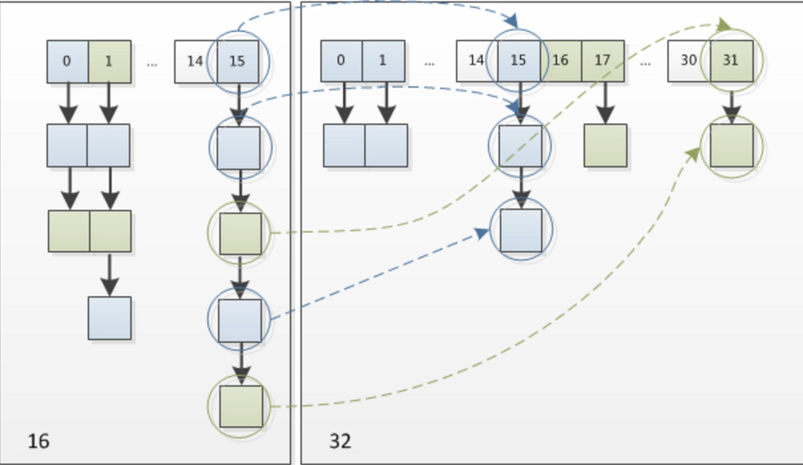

# 几个比较重要的属性

```java
// 因为hashmap是链表+数组，所以这个Node数组就是散列表的基本存储形式，每个Node后面要么跟链表，要么跟红黑树
transient Node<K,V>[] table;

// size就是hashmap当前有多少个键值对
transient int size;

// 阈值，如果size超过这个值就扩容，这个阈值的计算方式是threshold = capacity * load factor
int threshold;

// 负载因子 threshold = capacity * load factor，作用就是扩容用的阈值
// 比如负载因子是0.75，散列表容量是16，那么当存放的数据到达16 * 0.75 = 12个的时候就会扩容
final float loadFactor;

// 缺省的容量，即你不指定hashmap里面的数组长度，那么默认长度就是16
static final int DEFAULT_INITIAL_CAPACITY = 1 << 4; // aka 16

// 最大长度，散列表里面的数组最大长度就是1 << 30，注意 1 << x = 2^x
static final int MAXIMUM_CAPACITY = 1 << 30;

// 缺省的负载因子，即你不指定负载因子是多少，那么默认负载因子就是 0.75
static final float DEFAULT_LOAD_FACTOR = 0.75f;

// 树化阈值，当链表长度大于8并且当前散列表的size大于64的时候就需要变成红黑树
static final int TREEIFY_THRESHOLD = 8;

// 配合树化阈值使用的，当链表长度大于8并且当前散列表的size大于64的时候就需要变成红黑树
static final int MIN_TREEIFY_CAPACITY = 64;

// 链化阈值，当红黑树的节点小于6个时候，就会退化成链表
static final int UNTREEIFY_THRESHOLD = 6;

// 当前哈希表结构修改次数
transient int modCount;
```


# hashmap中的Node

```java
	static class Node<K,V> implements Map.Entry<K,V> {
    		// 每个节点都有一
        final int hash;
    		// 节点存储的键
        final K key;
    		// 节点存储的值
        V value;
    		// 指向下一个链表
        Node<K,V> next;

        Node(int hash, K key, V value, Node<K,V> next) {
            this.hash = hash;
            this.key = key;
            this.value = value;
            this.next = next;
        }

        public final K getKey()        { return key; }
        public final V getValue()      { return value; }
        public final String toString() { return key + "=" + value; }

        public final int hashCode() {
            return Objects.hashCode(key) ^ Objects.hashCode(value);
        }

        public final V setValue(V newValue) {
            V oldValue = value;
            value = newValue;
            return oldValue;
        }

        public final boolean equals(Object o) {
            if (o == this)
                return true;
            if (o instanceof Map.Entry) {
                Map.Entry<?,?> e = (Map.Entry<?,?>)o;
                if (Objects.equals(key, e.getKey()) &&
                        Objects.equals(value, e.getValue()))
                    return true;
            }
            return false;
        }
    }

```


# hash方法

```java
// 这个方法用来获得key的更为准确的hash值
// 作用：让key的hash值的高16位也参与路由运算
// 异或：相同则返回0，不同返回1
static final int hash(Object key) {
    int h;
  	// 如果key是null，哈希值就是0，否则返回的哈希值就是在jdk自带的hashcode上再异或hashcode的高16位
    return (key == null) ? 0 : (h = key.hashCode()) ^ (h >>> 16);
}
```

比如一个key的本来的hashcode是

 `h = 0b 0010 0101 1010 1100 0011 1111 0010 1110` ，**注意hashcode是int存储的，所以是32位**

然后h右移16位是

 `0b 0000 0000 0000 0000 0010 0101 1010 1100` ，

那么计算方式其实就是

 `h` ^  `h >>> 16` =  `0b 0010 0101 1010 1100 0011 1111 0010 1110`  ^  `0b 0000 0000 0000 0000 0010 0101 1010 1100` 

=  `0010 0101 1010 1100 0001 1010 1000 0010` 


可以发现hashmap里面的 `hash()` 方法就是让 `key` 的 `哈希值`  与 `哈希值的高16位` 去异或，**得到的 `hash` 更包括了高16位的特征**，在hashmap里面更能让这个哈希值精确

为什么要异或 `哈希值` 自己的高16位呢？hashmap直接用 `key` 的 `哈希值` 不就好了吗，为什么非要多此一举？

原因是：我们在插入的时候肯定要进行数组索引的寻址，而这个寻址，**即路由的算法是  `i = (n - 1) & hash`** ，这个索引 `i` 就是在散列表里面的数组的索引， `n` 就是数组长度，可以发现是 `数组长度` 去 `与` 这个 `hash()返回的hash` 。

假如你只用 `key` 的哈希值，假如数组长度是16，那么根据路由算法， `16 & key的哈希值` ，只有那么你 `key的哈希值` 的高位其实没法参加位运算，但是如果你用 `hash()` 的返回值，得到的结果就是高位参与之后了的寻址，可以说更为精确。


## 一句话总结hash

就是原来 `key` 的 `哈希值` 的高16位的特征也能得到体现，使得当散列表长度不够长的时候，也能让 `key` 的 `哈希值` 的高16位也参与路由寻址


# hashmap的构造方法

## 指定初始容量和负载因子的构造方法

```java
// 指定初始容量和负载因子的构造方法
public HashMap(int initialCapacity, float loadFactor) {

    //其实就是做了一些校验
    //capacity必须是大于0 ，最大值也就是 MAX_CAP
    if (initialCapacity < 0)
        throw new IllegalArgumentException("Illegal initial capacity: " +
                initialCapacity);
    if (initialCapacity > MAXIMUM_CAPACITY)
        initialCapacity = MAXIMUM_CAPACITY;

    //loadFactor必须大于0
    if (loadFactor <= 0 || Float.isNaN(loadFactor))
        throw new IllegalArgumentException("Illegal load factor: " +
                loadFactor);

  	// 设置你设置的负载因子
    this.loadFactor = loadFactor;
  	// 根据你设置的初始容量来获得对应的阈值，然后设置到哈希表里
    this.threshold = tableSizeFor(initialCapacity);
}

		/**
     * Returns a power of two size for the given target capacity.
     * 作用：返回一个大于等于当前值cap的一个数字，并且这个数字一定是2的次方数
     * 比如你传进来一个7，那么返回值就是8，如果传进来是9，返回值就是16
     *
     * cap = 10
     * n = 10 - 1 => 9
     * 0b1001 | 0b0100 => 0b1101
     * 0b1101 | 0b0011 => 0b1111
     * 0b1111 | 0b0000 => 0b1111
     *
     * 0b1111 => 15
     *
     * return 15 + 1;
     *
     * cap = 16
     * n = 16;
     * 0b10000 | 0b01000 =>0b11000
     * 0b11000 | 0b00110 =>0b11110
     * 0b11110 | 0b00001 =>0b11111
     * =>0b11111 => 31
     * return 31 + 1;
     *
     * 0001 1101 1100 => 0001 1111 1111 + 1 => 0010 0000 0000 一定是2的次方数
     *
     */
    static final int tableSizeFor(int cap) {
        int n = cap;
        n |= n >>> 1;
        n |= n >>> 2;
        n |= n >>> 4;
        n |= n >>> 8;
        n |= n >>> 16;
        return (n < 0) ? 1 : (n >= MAXIMUM_CAPACITY) ? MAXIMUM_CAPACITY : n + 1;
    }
```

其实初始容量不太重要，重要的是 `threshold` ，构造方法最主要的是根据你设置的初始容量设置一个合适的 `threshold` ，用来扩容散列表数组


## 设置初始容量的构造方法

```java
public HashMap(int initialCapacity) {
  	// 可以发现就是调用了上面的那个构造方法，只不过不指定负载因子的话就是用默认的负载因子
    this(initialCapacity, DEFAULT_LOAD_FACTOR);
}
```


## 什么都不指定的构造方法

```java
public HashMap() {
  	// 仅设置一个负载因子
    this.loadFactor = DEFAULT_LOAD_FACTOR; // all other fields defaulted
}
```


# hashmap的put方法

```java
public V put(K key, V value) {
  	// 可以发现put方法调用了putVal方法，并且传入了之前学习的hash()的返回值，即key的再哈希
    return putVal(hash(key), key, value, false, true);
}
```


## putVal方法

```java
// 如果onlyIfAbsent为true，那么hashmap里面的值不可以做更新，默认是false，即hashmap的值可以做更新
final V putVal(int hash, K key, V value, boolean onlyIfAbsent,
               boolean evict) {
    //tab：引用当前hashMap的散列表
    //p：表示当前散列表的元素
    //n：表示散列表数组的长度
    //i：表示路由寻址 结果
    Node<K,V>[] tab; Node<K,V> p; int n, i;

    //延迟初始化逻辑，第一次调用putVal时会初始化hashMap对象中的最耗费内存的散列表
    if ((tab = table) == null || (n = tab.length) == 0)
        n = (tab = resize()).length;

    //最简单的一种情况：寻址找到的桶位 刚好是 null，这个时候，直接将当前k-v=>node 扔进去就可以了
    if ((p = tab[i = (n - 1) & hash]) == null)
        tab[i] = newNode(hash, key, value, null);

    else {
      	/*
        * 不为null有3种情况，
      	*		要么tab[i]就是你的key
      	*		要么tab[i]是链表的头结点
      	*   要么tab[i]是红黑树的根节点
      	*/
      
        //e：不为null的话，找到了一个与当前要插入的key-value一致的key的元素
        //k：表示临时的一个key
        Node<K,V> e; K k;

        //表示桶位中的该元素，与你当前插入的元素的key完全一致，表示后续需要进行替换操作
        if (p.hash == hash &&
                ((k = p.key) == key || (key != null && key.equals(k))))
            e = p;

        else if (p instanceof TreeNode)//表明当前节点已经树化了
            e = ((TreeNode<K,V>)p).putTreeVal(this, tab, hash, key, value);
        else {
            //链表的情况，而且链表的头元素与我们要插入的key不一致。
            for (int binCount = 0; ; ++binCount) {
                //条件成立的话，说明迭代到最后一个元素了，也没找到一个与你要插入的key一致的node
                //说明需要加入到当前链表的末尾
                if ((e = p.next) == null) {
                    p.next = newNode(hash, key, value, null);
                    // 条件成立的话，说明当前链表的长度，达到树化标准了，需要进行树化
                  	// binCount这个变量记录了从链表头走到链表尾走过的次数，如果到了树化阈值，那就说明应该链表树化
                    if (binCount >= TREEIFY_THRESHOLD - 1) // -1 for 1st
                        //树化操作
                        treeifyBin(tab, hash);
                    break;
                }
                //条件成立的话，说明找到了相同key的node元素，需要进行替换操作
              	// 即在从链表往后找的时候找到了同样的key
                if (e.hash == hash &&
                        ((k = e.key) == key || (key != null && key.equals(k))))
                    break;
                p = e;
            }
        }

        //e不等于null，条件成立说明，找到了一个与你插入元素key完全一致的数据，需要进行替换
        if (e != null) { // existing mapping for key
            V oldValue = e.value;
          	// 如果hashmap可以做修改（即onlyIfAbsent为false）或者原来的值是null
            if (!onlyIfAbsent || oldValue == null)
                e.value = value;
            afterNodeAccess(e);
            return oldValue;
        }
    }

    //modCount：表示散列表结构被修改的次数，替换Node元素的value不计数
    ++modCount;
  
    //插入新元素，size自增，如果自增后的值大于扩容阈值，则触发扩容。
    if (++size > threshold)
        resize();
    afterNodeInsertion(evict);
    return null;
}
```


# hashmap的resize方法

```java
final Node<K,V>[] resize() {
    //oldTab：引用扩容前的哈希表
    Node<K,V>[] oldTab = table;
    //oldCap：表示扩容之前table数组的长度
    int oldCap = (oldTab == null) ? 0 : oldTab.length;
    //oldThr：表示扩容之前的扩容阈值，触发本次扩容的阈值
    int oldThr = threshold;
    //newCap：扩容之后table数组的大小
    //newThr：扩容之后，下次再次触发扩容的条件
    int newCap, newThr = 0;

  
    //条件如果成立说明 hashMap中的散列表已经初始化过了，这是一次正常扩容
    if (oldCap > 0) {
        //扩容之前的table数组大小已经达到 最大阈值后，则不扩容，且设置扩容条件为 int 最大值。
        if (oldCap >= MAXIMUM_CAPACITY) {
            threshold = Integer.MAX_VALUE;
            return oldTab;
        }

        //oldCap左移一位实现数值翻倍，并且赋值给newCap， newCap 小于数组最大值限制 且 扩容之前的阈值 >= 16
        //这种情况下，则 下一次扩容的阈值 等于当前阈值翻倍
      	// 简而言之就是新容量就是旧容量的两倍，新阈值也是旧阈值的两倍
        else if ((newCap = oldCap << 1) < MAXIMUM_CAPACITY &&
                oldCap >= DEFAULT_INITIAL_CAPACITY)
            newThr = oldThr << 1; 
    }

    // oldCap == 0,说明hashMap中的散列表是null，这种就是调用了下面3种的构造方法，有一个根据你设置的初始长度得到的阈值
    // 1.new HashMap(initCap, loadFactor);
    // 2.new HashMap(initCap);
    // 3.new HashMap(map); 并且这个map有数据
    else if (oldThr > 0) 
      	// 这种情况新容量就是就阈值
        newCap = oldThr;

    // 这种情况就是oldCap == 0，oldThr == 0，也就是调用了无参的构造方法
    // new HashMap();
    else {               
      	// 设置新容量就是默认容量
        newCap = DEFAULT_INITIAL_CAPACITY;//16
      	// 新阈值还是之前的计算公式，threshold = 负载因子 * 容量
        newThr = (int)(DEFAULT_LOAD_FACTOR * DEFAULT_INITIAL_CAPACITY);//12
    }

    //newThr为零时，通过newCap和loadFactor计算出一个newThr
    if (newThr == 0) {
        float ft = (float)newCap * loadFactor;
        newThr = (newCap < MAXIMUM_CAPACITY && ft < (float)MAXIMUM_CAPACITY ?
                (int)ft : Integer.MAX_VALUE);
    }

  	// 更新新阈值
    threshold = newThr;

    //创建出一个更长 更大的数组
    @SuppressWarnings({"rawtypes","unchecked"})
    Node<K,V>[] newTab = (Node<K,V>[])new Node[newCap];
    table = newTab;

    //说明，hashMap本次扩容之前，table不为null
    if (oldTab != null) {

        for (int j = 0; j < oldCap; ++j) {
            //当前node节点
            Node<K,V> e;
            //说明当前桶位中有数据，但是数据具体是 单个数据，还是链表 还是 红黑树 并不知道
            if ((e = oldTab[j]) != null) {
                //方便JVM GC时回收内存
                oldTab[j] = null;

                //第一种情况：当前桶位只有一个元素，从未发生过碰撞，这情况 直接计算出当前元素应存放在 新数组中的位置，然后
                //扔进去就可以了
                if (e.next == null)
                  	// 路由肯定是直接用新容量去计算路由了
                    newTab[e.hash & (newCap - 1)] = e;

                //第二种情况：当前节点已经树化，本期先不讲，下一期讲，红黑树。QQ群：865-373-238
                else if (e instanceof TreeNode)
                    ((TreeNode<K,V>)e).split(this, newTab, j, oldCap);
                else { // preserve order
                    //第三种情况：桶位已经形成链表

                    //低位链表：存放在扩容之后的数组的下标位置，与当前数组的下标位置一致。
                    Node<K,V> loHead = null, loTail = null;
                    //高位链表：存放在扩容之后的数组的下表位置为 当前数组下标位置 + 扩容之前数组的长度
                    Node<K,V> hiHead = null, hiTail = null;

                    Node<K,V> next;
                    do {
                        next = e.next;
                      	// 用15这个桶位来举例子，假如桶位是table[15]这个位置有很多个节点，即有很多个节点发生了哈希冲突都放到了15这个位置，按照之前的路由算法，hash & 15 = hash & 0b 1111，显然hash的后四位都是1，但是不知道hash的倒数第5位是几，所以现在又需要把这条链表上的东西分散到高位上，所以去hash & oldCap = hash & 16 = hash & 0b 10000，用这个方式去分，结果得到0的还是放到原来的链表上，得到1的放到高位的链表上，相当于做了一个对原来链表的划分

                      	//hash-> .... 1 1111
                        //hash-> .... 0 1111 可以发现在table[15]发生哈希冲突的末尾都是1111，但是倒数第五位可以是0也可以是1，所以与16去进行 & 操作
                        // 0b 10000
                      	
                      	// 结果得到0的就放到低位的桶位里面
                        if ((e.hash & oldCap) == 0) {
                          	// 一个正常的低位尾插法
                            if (loTail == null)
                                loHead = e;
                            else
                                loTail.next = e;
                            loTail = e;
                        }
                        else {
                          	// 一个正常的高位尾插法
                            if (hiTail == null)
                                hiHead = e;
                            else
                                hiTail.next = e;
                            hiTail = e;
                        }

                    } while ((e = next) != null);

										// 到这里高位链表和低位链表都构造完成了
                  	// 所以把低位链表后面全断了
                    if (loTail != null) {
                        loTail.next = null;
                      	// 把低位链表放到原来的桶位
                        newTab[j] = loHead;
                    }

                  	// 把高位链表后面全断了
                    if (hiTail != null) {
                        hiTail.next = null;
                      	// 高位链表放到新的桶位，注意新的桶位就是
                        newTab[j + oldCap] = hiHead;
                    }
										// 而且把原来的一条链表拆成了低桶位链表和高桶位链表之后的两条链表对于新的寻址来说仍是不会出错的，这就是设计者的高明之处
                }
            }
        }
    }
    return newTab;
}
```


## 模拟一下链表拆分的形式

假如现在数组长度是16，即索引范围是[0...15]，然后假设桶位15这个位置的链表长度是4，那么可以确定的是，这4个节点的哈希码的末尾4位都是1，为什么？

我们知道路由算法是  `i = hash & n-1` ，如果 `15 == i = hash & n-1` ， 即`15 = 0b 1111 = hash & 1111` ，只有当hash的末尾4位都是1，此时才能得到15，所以我们可以假设，x1，x2，x3，x4这四个节点的哈希码为 `0b ...(27个) [0|1] 1111` ，即前面27位我们不知道，倒数第5位是 `0或者1` ，末尾4位都是1。

现在对于链表拆分的策略是， `hash & n == 0` 分到低位链表， `hash & n == 1` 分到高位链表，实际上很简单，此时 `n` 为16，16的二进制为 `0b 1 0000` ，此时如果计算 `hash & 16` ，仅需要考虑倒数第5位是 `0或者1` 就可以了，所以对于x1，x2，x3，x4这4个节点，哈希码倒数第5位是 `0`的分到了低桶位，是 `1` 的分到了高桶位，即 `table[31]` 上，注意31的二进制为 `0b 1 1111` ,哈希码倒数第5位为1的节点对于计算  `hash & 31` 这个新的路由仍是符合的，因为这些节点后5位都是1，此时与31去 `与运算` 结果肯定是31，这就保证了分到高位的链表的路由是不会出错的





这是一次模拟，当然你如果写其他的数字都是可以成立的，比如你对桶位是 `table[14]` ，长度是16，扩容到长度是32，一样符合的，可以说hashmap的设计者真的很厉害了。链表拆分成高位链表和低位链表是真的很巧妙了。


如果是我来做链表的拆分，我可能直接就遍历所有桶位的所有链表，然后重新计算路由添加对应的桶位了，我后来一想这种方法是有很大弊端，因为这样不免要创建新的节点了，只要创建新的节点这种方法就输了，因为resize可能很频繁，hashmap的拆分方式真的做到了节点的 `移动` ，如果是创建节点频繁的resize可能导致速度下降。