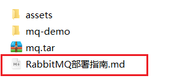
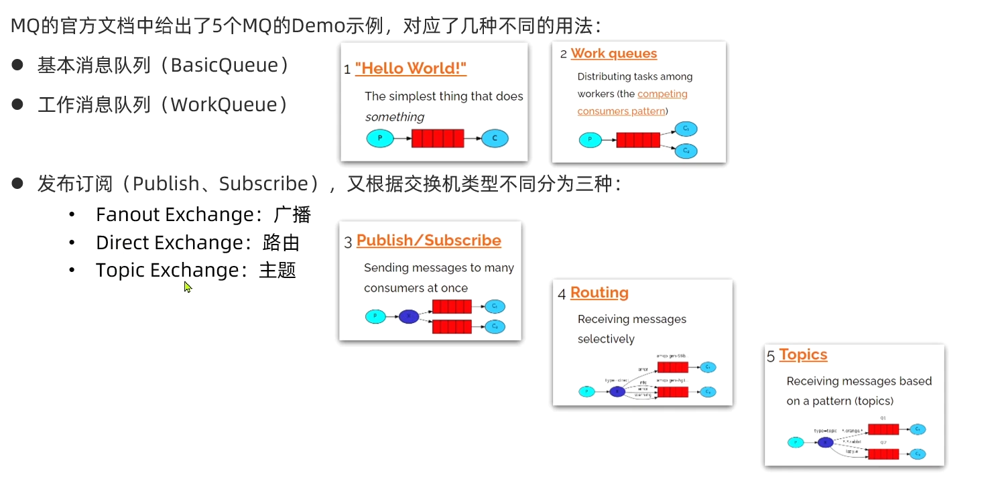
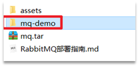
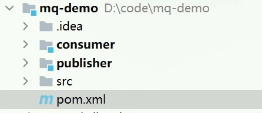
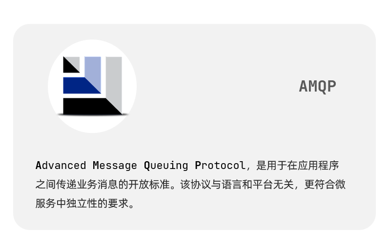

# RabbitMQ


# 1.初识MQ

## 1.1.同步和异步通讯

微服务间通讯有同步和异步两种方式：

同步通讯：就像打电话，需要实时响应。

异步通讯：就像发邮件，不需要马上回复。


两种方式各有优劣，打电话可以立即得到响应，但是你却不能跟多个人同时通话。发送邮件可以同时与多个人收发邮件，但是往往响应会有延迟。


### 1.1.1.同步通讯

我们之前学习的Feign调用就属于同步方式，虽然调用可以实时得到结果，但存在下面的问题：


总结：

同步调用的优点：

- 时效性较强，可以立即得到结果

同步调用的问题：

- 耦合度高
- 性能和吞吐能力下降
- 有额外的资源消耗
- 有级联失败问题


### 1.1.2.异步通讯

异步调用则可以避免上述问题：


我们以购买商品为例，用户支付后需要调用订单服务完成订单状态修改，调用物流服务，从仓库分配响应的库存并准备发货。

在事件模式中，支付服务是事件发布者（publisher），在支付完成后只需要发布一个支付成功的事件（event），事件中带上订单id。

订单服务和物流服务是事件订阅者（Consumer），订阅支付成功的事件，监听到事件后完成自己业务即可。


<font color='red'>为了解除事件发布者与订阅者之间的耦合，两者并不是直接通信，而是有一个中间人（Broker）。</font>发布者发布事件到Broker，不关心谁来订阅事件。订阅者从Broker订阅事件，不关心谁发来的消息。

<font color='cornflowerblue'>也就是说，假如说原来的业务需求是服务A调用服务B，然后服务A调用服务C，那以后加了个需求说让服务A调用服务D，那么就需要更改服务A的代码，以后需求再变化，那还要改A的代码，为什么要一直修改A的代码？因为A调用B、C、D，都是同步调用，都是在服务A的代码里调用的B、C、D，你业务发生变化了，修改A的代码不是理所当然的吗？</font>

<font color='cornflowerblue'>现在采用时间驱动模式，由A去发布事件给 `broker` ，接收方去找 `broker` 订阅事件，那么A发布事件之后，A就不需要操心事情了，因为事件交给了 `broker` ，B、C、D服务都是去订阅 `broker` 的事件的，只有B、C、D各自订阅的事件发生了，B、C、D才会干事情，再也不需要A去调用B、C、D了</font>


<font color='cornflowerblue'>简而言之，就是从 `调用与被调用` 转换为 `发布实践与订阅事件` ，前者有很强的耦合，后者耦合程度很低</font>


Broker 是一个像数据总线一样的东西，所有的服务要接收数据和发送数据都发到这个总线上，这个总线就像协议一样，让服务间的通讯变得标准和可控。


好处：

- 吞吐量提升：无需等待订阅者处理完成，响应更快速

- 故障隔离：服务没有直接调用，不存在级联失败问题
- 调用间没有阻塞，不会造成无效的资源占用
- 耦合度极低，每个服务都可以灵活插拔，可替换
- 流量削峰：不管发布事件的流量波动多大，都由Broker接收，订阅者可以按照自己的速度去处理事件  <font color='red'>注意这里有异步调用的那个流水线的感觉，每个人都负责各自负责的那一部分，就会增大系统的吞吐量</font>

<font color='red'>所以异步调用就解决了同步调用发生的很多问题</font>

缺点：

- 架构复杂了，业务没有明显的流程线，不好管理
- 需要依赖于Broker的可靠、安全、性能


好在现在开源软件或云平台上 Broker 的软件是非常成熟的，比较常见的一种就是我们今天要学习的MQ技术。


## 1.2.技术对比：

MQ，中文是消息队列（MessageQueue），字面来看就是存放消息的队列。也就是事件驱动架构中的Broker。

<font color='red'>即要学习的 `消息队列` 就是 `broker` </font>

比较常见的MQ实现：

- ActiveMQ 
- RabbitMQ
- RocketMQ
- Kafka


几种常见MQ的对比：

|            | **RabbitMQ**            | **ActiveMQ**                   | **RocketMQ** | **Kafka**  |
| ---------- | ----------------------- | ------------------------------ | ------------ | ---------- |
| 公司/社区  | Rabbit                  | Apache                         | 阿里         | Apache     |
| 开发语言   | Erlang                  | Java                           | Java         | Scala&Java |
| 协议支持   | AMQP，XMPP，SMTP，STOMP | OpenWire,STOMP，REST,XMPP,AMQP | 自定义协议   | 自定义协议 |
| 可用性     | 高                      | 一般                           | 高           | 高         |
| 单机吞吐量 | 一般                    | 差                             | 高           | 非常高     |
| 消息延迟   | 微秒级                  | 毫秒级                         | 毫秒级       | 毫秒以内   |
| 消息可靠性 | 高                      | 一般                           | 高           | 一般       |

追求可用性：Kafka、 RocketMQ 、RabbitMQ

追求可靠性：RabbitMQ、RocketMQ

追求吞吐能力：RocketMQ、Kafka

追求消息低延迟：RabbitMQ、Kafka


# 2.快速入门

## 2.1.安装RabbitMQ

安装RabbitMQ，参考课前资料：



MQ的基本结构：


RabbitMQ中的一些角色：

- publisher：生产者

- consumer：消费者

  <font color='red'>生产者、消费者不必多说</font>

- exchange：交换机，负责消息路由

  <font color='red'>exchange负责路由</font>

- queue：队列，存储消息

  <font color='red'>存储的消息都在队列里</font>

- virtualHost：虚拟主机，隔离不同租户的exchange、queue、消息的隔离

- channel：通道，通过channel发送数据啥的估计是，估计和 `netty` 里面的 `channel` 差不多作用，可以通过 `channel` 发送数据和传输数据


## 2.2.RabbitMQ消息模型

RabbitMQ官方提供了5个不同的Demo示例，对应了不同的消息模型：




## 2.3.导入Demo工程

课前资料提供了一个Demo工程，mq-demo:



导入后可以看到结构如下：



包括三部分：

- mq-demo：父工程，管理项目依赖
- publisher：消息的发送者
- consumer：消息的消费者


## 2.4.入门案例

简单队列模式的模型图：

 

官方的HelloWorld是基于最基础的消息队列模型来实现的，只包括三个角色：

- publisher：消息发布者，将消息发送到队列queue
- queue：消息队列，负责接受并缓存消息
- consumer：订阅队列，处理队列中的消息


<font color='red'>入门案例的代码貌似不重要，可以不看</font>

### 2.4.1.publisher实现

思路：

- 建立连接
- 创建Channel
- 声明队列
- 发送消息
- 关闭连接和channel


代码实现：

```java
package cn.itcast.mq.helloworld;

import com.rabbitmq.client.Channel;
import com.rabbitmq.client.Connection;
import com.rabbitmq.client.ConnectionFactory;
import org.junit.Test;

import java.io.IOException;
import java.util.concurrent.TimeoutException;

public class PublisherTest {
    @Test
    public void testSendMessage() throws IOException, TimeoutException {
        // 1.建立连接
        ConnectionFactory factory = new ConnectionFactory();
        // 1.1.设置连接参数，分别是：主机名、端口号、vhost、用户名、密码
        factory.setHost("192.168.150.101");
        factory.setPort(5672);
        factory.setVirtualHost("/");
        factory.setUsername("itcast");
        factory.setPassword("123321");
        // 1.2.建立连接
        Connection connection = factory.newConnection();

        // 2.创建通道Channel
        Channel channel = connection.createChannel();

        // 3.创建队列
        String queueName = "simple.queue";
        channel.queueDeclare(queueName, false, false, false, null);

        // 4.发送消息
        String message = "hello, rabbitmq!";
        channel.basicPublish("", queueName, null, message.getBytes());
        System.out.println("发送消息成功：【" + message + "】");

        // 5.关闭通道和连接
        channel.close();
        connection.close();

    }
}
```


### 2.4.2.consumer实现

代码思路：

- 建立连接
- 创建Channel
- 声明队列
- 订阅消息


代码实现：

```java
package cn.itcast.mq.helloworld;

import com.rabbitmq.client.*;

import java.io.IOException;
import java.util.concurrent.TimeoutException;

public class ConsumerTest {

    public static void main(String[] args) throws IOException, TimeoutException {
        // 1.建立连接
        ConnectionFactory factory = new ConnectionFactory();
        // 1.1.设置连接参数，分别是：主机名、端口号、vhost、用户名、密码
        factory.setHost("192.168.150.101");
        factory.setPort(5672);
        factory.setVirtualHost("/");
        factory.setUsername("itcast");
        factory.setPassword("123321");
        // 1.2.建立连接
        Connection connection = factory.newConnection();

        // 2.创建通道Channel
        Channel channel = connection.createChannel();

        // 3.创建队列
        String queueName = "simple.queue";
        channel.queueDeclare(queueName, false, false, false, null);

        // 4.订阅消息
        channel.basicConsume(queueName, true, new DefaultConsumer(channel){
            @Override
            public void handleDelivery(String consumerTag, Envelope envelope,
                                       AMQP.BasicProperties properties, byte[] body) throws IOException {
                // 5.处理消息
                String message = new String(body);
                System.out.println("接收到消息：【" + message + "】");
            }
        });
        System.out.println("等待接收消息。。。。");
    }
}
```


## 2.5.总结

基本消息队列的消息发送流程：

1. 建立connection

2. 创建channel

3. 利用channel声明队列

4. 利用channel向队列发送消息

基本消息队列的消息接收流程：

1. 建立connection

2. 创建channel

3. 利用channel声明队列

4. 定义consumer的消费行为handleDelivery()

5. 利用channel将消费者与队列绑定


# 3.SpringAMQP

SpringAMQP是基于RabbitMQ封装的一套模板，并且还利用SpringBoot对其实现了自动装配，使用起来非常方便。

<font color='red'>AMQP是业务之间传递消息（发送消息、接收消息）的标准，本质就是一种协议，即消息队列的标准</font>

SpringAmqp的官方地址：https://spring.io/projects/spring-amqp




SpringAMQP提供了三个功能：

- 自动声明队列、交换机及其绑定关系
- 基于注解的监听器模式，异步接收消息
- 封装了RabbitTemplate工具，用于发送消息 


## 3.1.Basic Queue 简单队列模型

<font color='red'>注意是简单的队列模型，只需要做到消息的发送和接收就ok了</font>

在父工程mq-demo中引入依赖

```xml
<!--AMQP依赖，包含RabbitMQ-->
<dependency>
    <groupId>org.springframework.boot</groupId>
    <artifactId>spring-boot-starter-amqp</artifactId>
</dependency>
```


### 3.1.1.消息发送

首先配置MQ地址，在publisher服务的application.yml中添加配置：

```yaml
spring:
  rabbitmq:
    host: 192.168.150.101 # 主机名
    port: 5672 # 端口
    virtual-host: / # 虚拟主机
    username: itcast # 用户名
    password: 123321 # 密码
```


然后在publisher服务中编写测试类SpringAmqpTest，并利用RabbitTemplate实现消息发送：

```java
package cn.itcast.mq.spring;

import org.junit.Test;
import org.junit.runner.RunWith;
import org.springframework.amqp.rabbit.core.RabbitTemplate;
import org.springframework.beans.factory.annotation.Autowired;
import org.springframework.boot.test.context.SpringBootTest;
import org.springframework.test.context.junit4.SpringRunner;

@RunWith(SpringRunner.class)
@SpringBootTest
public class SpringAmqpTest {
	
    // 通过RabbitTemplate发送消息
    @Autowired
    private RabbitTemplate rabbitTemplate;

    @Test
    public void testSimpleQueue() {
        // 队列名称
        String queueName = "simple.queue";
        // 消息
        String message = "hello, spring amqp!";
        // 发送消息
        rabbitTemplate.convertAndSend(queueName, message);
    }
}
```

<font color='red'>注意这里发完之后就什么都不管了</font>


### 3.1.2.消息接收

首先配置MQ地址，在consumer服务的application.yml中添加配置：

```yaml
spring:
  rabbitmq:
    host: 192.168.150.101 # 主机名
    port: 5672 # 端口
    virtual-host: / # 虚拟主机
    username: itcast # 用户名
    password: 123321 # 密码
```


然后在consumer服务的`cn.itcast.mq.listener`包中新建一个类SpringRabbitListener，代码如下：

```java
package cn.itcast.mq.listener;

import org.springframework.amqp.rabbit.annotation.RabbitListener;
import org.springframework.stereotype.Component;

@Component
public class SpringRabbitListener {

    // 设置一个监听方法，并且配置队列
    @RabbitListener(queues = "simple.queue")
    public void listenSimpleQueueMessage(String msg) throws InterruptedException {
        System.out.println("spring 消费者接收到消息：【" + msg + "】");
    }
}
```


### 3.1.3.测试

启动consumer服务，然后在publisher服务中运行测试代码，发送MQ消息


## 3.2.WorkQueue

Work queues，也被称为（Task queues），任务模型。简单来说就是**让多个消费者绑定到一个队列，共同消费队列中的消息**。


当消息处理比较耗时的时候，可能生产消息的速度会远远大于消息的消费速度。长此以往，消息就会堆积越来越多，无法及时处理。

此时就可以使用work 模型，**多个消费者**共同处理消息处理，速度就能大大提高了。


### 3.2.1.消息发送

这次我们循环发送，模拟大量消息堆积现象。

在publisher服务中的SpringAmqpTest类中添加一个测试方法：

```java
/**
     * workQueue
     * 向队列中不停发送消息，模拟消息堆积。
     */
@Test
public void testWorkQueue() throws InterruptedException {
    // 队列名称
    String queueName = "simple.queue";
    // 消息
    String message = "hello, message_";
    for (int i = 0; i < 50; i++) {
        // 发送消息
        rabbitTemplate.convertAndSend(queueName, message + i);
        Thread.sleep(20);
    }
}
```


### 3.2.2.消息接收

要模拟多个消费者绑定同一个队列，我们在consumer服务的SpringRabbitListener中添加2个新的方法：

```java
@RabbitListener(queues = "simple.queue")
public void listenWorkQueue1(String msg) throws InterruptedException {
    System.out.println("消费者1接收到消息：【" + msg + "】" + LocalTime.now());
    Thread.sleep(20);
}

@RabbitListener(queues = "simple.queue")
public void listenWorkQueue2(String msg) throws InterruptedException {
    System.err.println("消费者2........接收到消息：【" + msg + "】" + LocalTime.now());
    Thread.sleep(200);
}
```

注意到这个消费者sleep了1000秒，模拟任务耗时。


### 3.2.3.测试

启动ConsumerApplication后，在执行publisher服务中刚刚编写的发送测试方法testWorkQueue。

可以看到消费者1很快完成了自己的25条消息。消费者2却在缓慢的处理自己的25条消息。


也就是说消息是平均分配给每个消费者，并没有考虑到消费者的处理能力。这样显然是有问题的。


### 3.2.4.能者多劳

在spring中有一个简单的配置，可以解决这个问题。我们修改consumer服务的application.yml文件，添加配置：

```yaml
spring:
  rabbitmq:
    listener:
      simple:
        prefetch: 1 # 每次只能获取一条消息，处理完成才能获取下一个消息，即方法执行完才能获取下一个消息，那么设置一次获取一条消息，那就是谁先执行完谁就拿下一条消息
```


### 3.2.5.总结

Work模型的使用：

- 多个消费者绑定到一个队列，同一条消息只会被一个消费者处理 <font color='red'>workqueue队列和basic队列一样，由publisher发送的消息只会被一个消费者拿走，而且只会被消费一次，不同于发布/订阅模型</font>
- **通过设置prefetch来控制消费者预取的消息数量**


## 3.3.发布/订阅

发布订阅的模型如图：


可以看到，在订阅模型中，多了一个exchange角色，而且过程略有变化：

- Publisher：生产者，也就是要发送消息的程序，但是不再发送到队列中，而是发给X（交换机）
- Exchange：交换机，图中的X。一方面，接收生产者发送的消息。另一方面，知道如何处理消息，例如递交给某个特别队列、递交给所有队列、或是将消息丢弃。到底如何操作，取决于Exchange的类型。Exchange有以下3种类型：
  - Fanout：广播，将消息交给所有绑定到交换机的队列
  - Direct：定向，把消息交给符合指定routing key 的队列
  - Topic：通配符，把消息交给符合routing pattern（路由模式） 的队列
- Consumer：消费者，与以前一样，订阅队列，没有变化
- Queue：消息队列也与以前一样，接收消息、缓存消息。


**Exchange（交换机）只负责转发消息，不具备存储消息的能力**，因此如果没有任何队列与Exchange绑定，或者没有符合路由规则的队列，那么消息会丢失！


## 3.4.Fanout

Fanout，英文翻译是扇出，我觉得在MQ中叫广播更合适。


在广播模式下，消息发送流程是这样的：

- 1）  可以有多个队列
- 2）  <font color='red'>每个队列都要绑定到Exchange（交换机）</font>
- 3）  <font color='red'>生产者发送的消息，只能发送到交换机，交换机来决定要发给哪个队列，生产者无法决定</font>
- 4）  <font color='red'>交换机把消息发送给绑定过的所有队列</font>
- 5）  <font color='red'>订阅队列的消费者都能拿到消息</font>


我们的计划是这样的：

- 创建一个交换机 itcast.fanout，类型是Fanout
- 创建两个队列fanout.queue1和fanout.queue2，绑定到交换机itcast.fanout


### 3.4.1.声明队列和交换机

Spring提供了一个接口Exchange，来表示所有不同类型的交换机：


在consumer中创建一个类，声明队列和交换机：

<font color='red'>这个方式是基于bean的创建队列和交换机</font>

```java
package cn.itcast.mq.config;

import org.springframework.amqp.core.Binding;
import org.springframework.amqp.core.BindingBuilder;
import org.springframework.amqp.core.FanoutExchange;
import org.springframework.amqp.core.Queue;
import org.springframework.context.annotation.Bean;
import org.springframework.context.annotation.Configuration;

@Configuration
public class FanoutConfig {
    /**
     * 声明交换机
     * @return Fanout类型交换机
     */
    @Bean
    public FanoutExchange fanoutExchange(){
        return new FanoutExchange("itcast.fanout");
    }

    /**
     * 第1个队列
     */
    @Bean
    public Queue fanoutQueue1(){
        return new Queue("fanout.queue1");
    }

    /**
     * 绑定队列和交换机
     */
    @Bean
    public Binding bindingQueue1(Queue fanoutQueue1, FanoutExchange fanoutExchange){
        // 进行一个绑定关系，把队列1绑定到交换机上
        return BindingBuilder.bind(fanoutQueue1).to(fanoutExchange);
    }

    /**
     * 第2个队列
     */
    @Bean
    public Queue fanoutQueue2(){
        return new Queue("fanout.queue2");
    }

    /**
     * 绑定队列和交换机
     */
    @Bean
    public Binding bindingQueue2(Queue fanoutQueue2, FanoutExchange fanoutExchange){
        // 进行一个绑定关系，把队列2绑定到交换机上
        return BindingBuilder.bind(fanoutQueue2).to(fanoutExchange);
    }
}
```


### 3.4.2.消息发送

在publisher服务的SpringAmqpTest类中添加测试方法：

```java
@Test
public void testFanoutExchange() {
    // 交换机名称
    String exchangeName = "itcast.fanout";
    // 消息
    String message = "hello, everyone!";
    
    // 生产者通过rabbitTemplate把消息发送到交换机上
    rabbitTemplate.convertAndSend(exchangeName, "", message);
}
```


### 3.4.3.消息接收

在consumer服务的SpringRabbitListener中添加两个方法，作为消费者：

```java
@RabbitListener(queues = "fanout.queue1")
// 通过绑定对应的队列，从队列里获得数据
public void listenFanoutQueue1(String msg) {
    System.out.println("消费者1接收到Fanout消息：【" + msg + "】");
}

@RabbitListener(queues = "fanout.queue2")
public void listenFanoutQueue2(String msg) {
    System.out.println("消费者2接收到Fanout消息：【" + msg + "】");
}
```


### 3.4.4.总结


交换机的作用是什么？

- 接收publisher发送的消息
- 将消息按照规则路由到与之绑定的队列<font color='red'>（注意是把消息发送到与交换机绑定的所有的队列上，达到一个广播的效果）</font>
- 不能缓存消息，路由失败，消息丢失
- FanoutExchange的会将消息路由到每个绑定的队列

声明队列、交换机、绑定关系的Bean是什么？

- Queue
- FanoutExchange
- Binding


## 3.5.Direct

在Fanout模式中，一条消息，会被所有订阅的队列都消费。但是，在某些场景下，我们希望不同的消息被不同的队列消费。这时就要用到Direct类型的Exchange。


<font color='red'> 在Direct模型下：</font>

- 队列与交换机的绑定，不能是任意绑定了，而是要指定一个`RoutingKey`（路由key）
- 消息的发送方在 向 Exchange发送消息时，也必须指定消息的 `RoutingKey`。
- Exchange不再把消息交给每一个绑定的队列，而是根据消息的`Routing Key`进行判断，只有队列的`Routingkey`与消息的 `Routing key`完全一致，才会接收到消息


**案例需求如下**：

1. 利用@RabbitListener声明Exchange、Queue、RoutingKey

2. 在consumer服务中，编写两个消费者方法，分别监听direct.queue1和direct.queue2

3. 在publisher中编写测试方法，向itcast. direct发送消息


### 3.5.1.基于注解声明队列和交换机

基于@Bean的方式声明队列和交换机比较麻烦，<font color='red'>（个人感觉这里是因为要配置绑定关键词，所以用bean的方式配肯定没有用注解的方式配简单）</font>Spring还提供了基于注解方式来声明。

在consumer的SpringRabbitListener中添加两个消费者，同时基于注解来声明队列和交换机：

```java
// 监听方法
@RabbitListener(bindings = @QueueBinding(
    // 绑定队列
    value = @Queue(name = "direct.queue1"),
    // 绑定交换机
    exchange = @Exchange(name = "itcast.direct", type = ExchangeTypes.DIRECT),
    // 给队列绑定关键词，即交换机会把对应关键词的消息发送到队列上，注意关键词绑定的是在队列上而不是消费者上
    key = {"red", "blue"}
))
public void listenDirectQueue1(String msg){
    System.out.println("消费者接收到direct.queue1的消息：【" + msg + "】");
}

@RabbitListener(bindings = @QueueBinding(
    value = @Queue(name = "direct.queue2"),
    exchange = @Exchange(name = "itcast.direct", type = ExchangeTypes.DIRECT),
    key = {"red", "yellow"}
))
public void listenDirectQueue2(String msg){
    System.out.println("消费者接收到direct.queue2的消息：【" + msg + "】");
}
```

<font color='red'>注意关键词绑定的是在队列上而不是消费者上，交换机是发送对应的消息到队列上，然后消费者从队列拿</font>

<font color='cornflowerblue'>注解里 @某个注解可以作为返回值，比如上面的 `@RabbitListener` 注解的 `bingdings` 属性接收的是 `QueueBinding` 类型的数据</font>


<font color='cornflowerblue'>但是我们上面的写法是 `@RabbitListener(bindings = @QueueBinding(配置东西)` ，即在注解中，我们可以用注解作为返回值作为类型的返回，但是因为注解本身就是用来配置的，所以和new对象有点像，但又不完全一样，总之，知道在注解中有一种新的写法就ok，在大注解的配置中，可以用小注解作为大注解的属性的值，前提是属性要求的类型和小注解是同一个类型</font>


<font color='red'>注解中的配置只能接收注解</font>

```java
@Target({ElementType.FIELD, ElementType.PARAMETER, ElementType.TYPE})
@Retention(RetentionPolicy.RUNTIME)
@Documented
public @interface QueueBinding {

    /**
     * The queue.
     * @return the queue.
     */
    Queue value() default @Queue;

    /**
     * The exchange.
     * @return the exchange.
     */
    Exchange exchange() default @Exchange;

    /**
     * The routing key(s).
     * @return the routing key(s).
     */
    String[] key() default {};
}
```

<font color='red'>可以看到 `QueueBinding` 这个注解里面的参数value是Queue类型的，但是因为注解中的大部分外在的类型，比如第10行的Queue、第16行的Exchange，所以其value、exchange属性接收的都是注解类型，但是第22行的String数组，很明显可以直接赋值，所以复杂一点的类型必须以注解的形式返回</font>


### 3.5.2.消息发送

在publisher服务的SpringAmqpTest类中添加测试方法：

```java
@Test
public void testSendDirectExchange() {
    // 交换机名称
    String exchangeName = "itcast.direct";
    // 消息
    String message = "红色警报！日本乱排核废水，导致海洋生物变异，惊现哥斯拉！";
    // 发送消息
    rabbitTemplate.convertAndSend(exchangeName, "red", message);
}
```


### 3.5.3.总结

描述下Direct交换机与Fanout交换机的差异？

- <font color='red'>Fanout交换机将消息路由给每一个与之绑定的队列</font>
- <font color='red'>Direct交换机根据RoutingKey判断路由给哪个队列（队列上由RountingKey）</font>
- <font color='red'>如果多个队列具有相同的RoutingKey，则与Fanout功能类似</font>

基于@RabbitListener注解声明队列和交换机有哪些常见注解？

- @Queue
- @Exchange


## 3.6.Topic


### 3.6.1.说明

`Topic`类型的`Exchange`与`Direct`相比，都是可以根据`RoutingKey`把消息路由到不同的队列。只不过`Topic`类型`Exchange`可以让队列在绑定`Routing key` 的时候使用通配符！


`Routingkey` 一般都是有一个或多个单词组成，多个单词之间以”.”分割，例如： `item.insert`

 通配符规则：

`#`：匹配一个或多个词

`*`：匹配不多不少恰好1个词


举例：

`item.#`：能够匹配`item.spu.insert` 或者 `item.spu`

`item.*`：只能匹配`item.spu`

​     <font color='red'>这里的通配符和往常学习的通配符不太一样</font>

图示：

 


案例需求：

实现思路如下：

1. 并利用@RabbitListener声明Exchange、Queue、RoutingKey

2. 在consumer服务中，编写两个消费者方法，分别监听topic.queue1和topic.queue2

3. 在publisher中编写测试方法，向itcast. topic发送消息


解释：

- Queue1：绑定的是`china.#` ，因此凡是以 `china.`开头的`routing key` 都会被匹配到。包括china.news和china.weather
- Queue2：绑定的是`#.news` ，因此凡是以 `.news`结尾的 `routing key` 都会被匹配。包括china.news和japan.news


### 3.6.2.消息发送

在publisher服务的SpringAmqpTest类中添加测试方法：

```java
/**
     * topicExchange
     */
@Test
public void testSendTopicExchange() {
    // 交换机名称
    String exchangeName = "itcast.topic";
    // 消息
    String message = "喜报！孙悟空大战哥斯拉，胜!";
    // 发送消息
    rabbitTemplate.convertAndSend(exchangeName, "china.news", message);
}
```


### 3.6.3.消息接收

<font color='red'>别忘了大注解的属性可以被小注解赋值，然后去配置小注解就好了</font>

在consumer服务的SpringRabbitListener中添加方法：

```java
@RabbitListener(bindings = @QueueBinding(
    value = @Queue(name = "topic.queue1"),
    exchange = @Exchange(name = "itcast.topic", type = ExchangeTypes.TOPIC),
    key = "china.#"
))
public void listenTopicQueue1(String msg){
    System.out.println("消费者接收到topic.queue1的消息：【" + msg + "】");
}

@RabbitListener(bindings = @QueueBinding(
    value = @Queue(name = "topic.queue2"),
    exchange = @Exchange(name = "itcast.topic", type = ExchangeTypes.TOPIC),
    key = "#.news"
))
public void listenTopicQueue2(String msg){
    System.out.println("消费者接收到topic.queue2的消息：【" + msg + "】");
}
```


### 3.6.4.总结

描述下Direct交换机与Topic交换机的差异？

- Topic交换机接收的消息RoutingKey必须是多个单词，以 `**.**` 分割
- Topic交换机与队列绑定时的bindingKey可以指定通配符
- `#`：代表0个或多个词
- `*`：代表1个词


## 3.7.消息转换器

之前说过，Spring会把你发送的消息序列化为字节发送给MQ，接收消息的时候，还会把字节反序列化为Java对象。


只不过，默认情况下Spring采用的序列化方式是JDK序列化。众所周知，JDK序列化存在下列问题：

- 数据体积过大
- 有安全漏洞
- 可读性差

我们来测试一下。


### 3.7.1.测试默认转换器


我们修改消息发送的代码，发送一个Map对象：

```java
@Test
public void testSendMap() throws InterruptedException {
    // 准备消息
    Map<String,Object> msg = new HashMap<>();
    msg.put("name", "Jack");
    msg.put("age", 21);
    // 发送消息
    rabbitTemplate.convertAndSend("simple.queue","", msg);
}
```


停止consumer服务


发送消息后查看控制台：


### 3.7.2.配置JSON转换器

显然，JDK序列化方式并不合适。我们希望消息体的体积更小、可读性更高，因此可以使用JSON方式来做序列化和反序列化。

在publisher和consumer两个服务中都引入依赖：

```xml
<dependency>
    <groupId>com.fasterxml.jackson.dataformat</groupId>
    <artifactId>jackson-dataformat-xml</artifactId>
    <version>2.9.10</version>
</dependency>
```

配置消息转换器。

在启动类中添加一个Bean即可：

```java
@Bean
public MessageConverter jsonMessageConverter(){
    return new Jackson2JsonMessageConverter();
}
```


